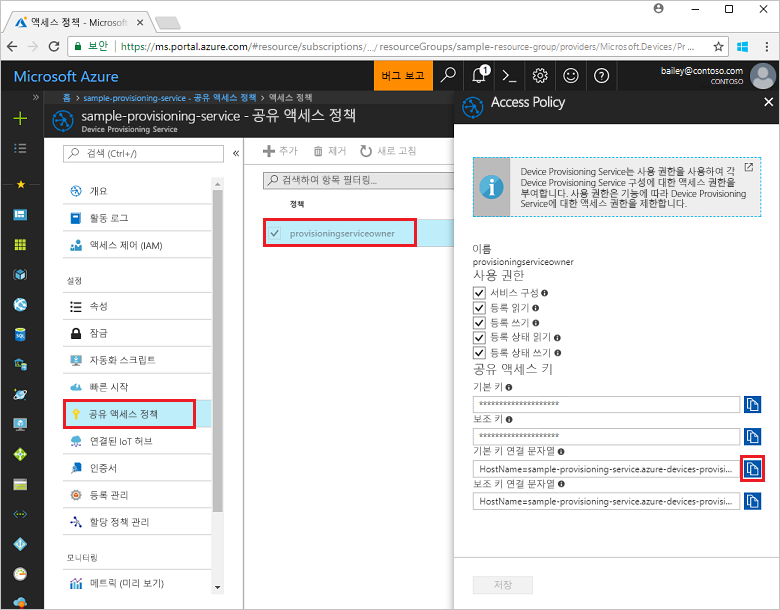
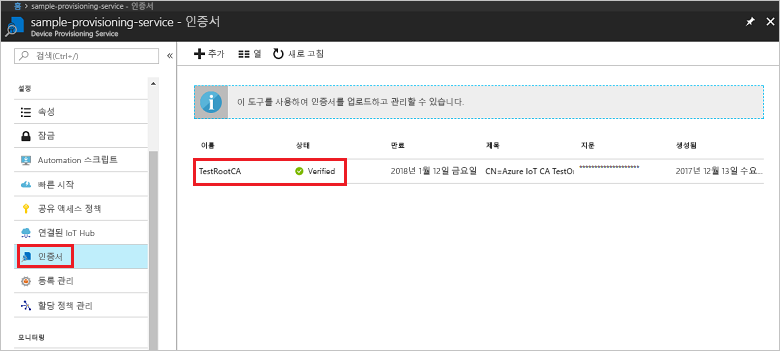
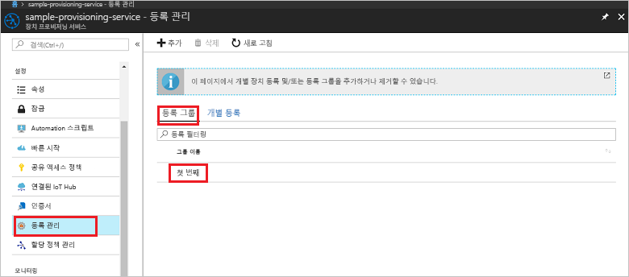

# <a name="enroll-x509-devices-to-iot-hub-device-provisioning-service-using-nodejs-service-sdk"></a>Node.js 서비스 SDK를 사용하여 IoT Hub Device Provisioning Service에 X.509 장치 등록

[!INCLUDE [iot-dps-selector-quick-enroll-device-x509](../../includes/iot-dps-selector-quick-enroll-device-x509.md)]


다음 단계에서는 [Node.js 서비스 SDK](https://github.com/Azure/azure-iot-sdk-node) 및 Node.js 샘플을 사용하여 중간 또는 루트 CA X.509 인증서에 대한 등록 그룹을 프로그래밍 방식으로 만드는 방법을 보여 줍니다. 이러한 단계는 Windows 및 Linux 컴퓨터 모두에서 작동하지만, 이 문서에서는 Windows 개발 컴퓨터를 사용합니다.
 

## <a name="prerequisites"></a>필수 조건

- [Azure Portal에서 IoT Hub Device Provisioning Service 설정](./quick-setup-auto-provision.md)의 단계를 완료해야 합니다. 

 
- 컴퓨터에 [Node.js v4.0 이상](https://nodejs.org)이 설치되어 있는지 확인합니다.


- 프로비전 서비스를 통해 업로드되고 확인된 중간 또는 루트 CA X.509 인증서가 포함된 .pem 파일이 필요합니다. **Azure IoT c SDK**에는 X.509 인증서 체인을 만들고, 해당 체인에서 루트 또는 중간 인증서를 업로드하고, 인증서를 확인하기 위해 서비스를 통해 소유 증명을 수행하는 데 도움이 되는 도구가 포함되어 있습니다. 이 도구를 사용하려면 [Azure IoT c SDK](https://github.com/Azure/azure-iot-sdk-c)를 복제하고, 컴퓨터에서 [azure-iot-sdk-c\tools\CACertificates\CACertificateOverview.md](https://github.com/Azure/azure-iot-sdk-c/blob/master/tools/CACertificates/CACertificateOverview.md)의 단계를 수행합니다.

## <a name="create-the-enrollment-group-sample"></a>등록 그룹 샘플 만들기 

 
1. 작업 폴더의 명령 창에서 다음을 실행합니다.
  
     ```cmd\sh
     npm install azure-iot-provisioning-service
     ```  

2. 텍스트 편집기를 사용하여 작업 폴더에 **create_enrollment_group.js** 파일을 만듭니다. 다음 코드를 파일에 추가하고 저장합니다.

    ```
    'use strict';
    var fs = require('fs');

    var provisioningServiceClient = require('azure-iot-provisioning-service').ProvisioningServiceClient;

    var serviceClient = provisioningServiceClient.fromConnectionString(process.argv[2]);

    var enrollment = {
      enrollmentGroupId: 'first',
      attestation: {
        type: 'x509',
        x509: {
          signingCertificates: {
            primary: {
              certificate: fs.readFileSync(process.argv[3], 'utf-8').toString()
            }
          }
        }
      },
      provisioningStatus: 'disabled'
    };

    serviceClient.createOrUpdateEnrollmentGroup(enrollment, function(err, enrollmentResponse) {
      if (err) {
        console.log('error creating the group enrollment: ' + err);
      } else {
        console.log("enrollment record returned: " + JSON.stringify(enrollmentResponse, null, 2));
        enrollmentResponse.provisioningStatus = 'enabled';
        serviceClient.createOrUpdateEnrollmentGroup(enrollmentResponse, function(err, enrollmentResponse) {
          if (err) {
            console.log('error updating the group enrollment: ' + err);
          } else {
            console.log("updated enrollment record returned: " + JSON.stringify(enrollmentResponse, null, 2));
          }
        });
      }
    });
    ````

## <a name="run-the-enrollment-group-sample"></a>등록 그룹 샘플 실행
 
1. 샘플을 실행하려면 프로비전 서비스에 대한 연결 문자열이 필요합니다. 
    1. Azure Portal에 로그인하고, 왼쪽 메뉴에서 **모든 리소스** 단추를 클릭하고, Device Provisioning Service를 엽니다. 
    2. **공유 액세스 정책**을 클릭한 다음, 해당 속성을 열기 위해 사용하려는 액세스 정책을 클릭합니다. **액세스 정책** 창에서 기본 키 연결 문자열을 복사하고 적어 둡니다. 

     


3. [필수 구성 요소](#prerequisites)에서 설명한 대로 프로비전 서비스를 사용하여 이전에 업로드되고 확인된 X.509 중간 또는 루트 CA 인증서가 포함된 .pem 파일도 필요합니다. 인증서가 업로드되고 확인되었는지 확인하려면 Azure Portal의 Device Provisioning Service 요약 페이지에서 **인증서**를 클릭합니다. 그룹 등록에 사용하려는 인증서를 찾아 해당 상태 값이 *확인됨*인지 확인합니다.

     

1. 인증서에 대한 등록 그룹을 만들려면 다음 명령을 실행합니다(명령 인수를 따옴표로 묶음).
 
     ```cmd\sh
     node create_enrollment_group.js "<the connection string for your provisioning service>" "<your certificate's .pem file>"
     ```
 
3. 성공적으로 만들어지면 명령 창에 새 등록 그룹에 대한 속성이 표시됩니다.

     

4. 등록 그룹이 만들어졌는지 확인합니다. Azure Portal의 Device Provisioning Service 요약 블레이드에서 **등록 관리**를 선택합니다. **등록 그룹** 탭을 선택하고 새 등록 항목(*첫 번째*)이 있는지 확인합니다.

     
 
## <a name="clean-up-resources"></a>리소스 정리
Node.js 서비스 샘플을 탐색하려면 이 빠른 시작에서 만든 리소스를 정리하지 마세요. 계속하지 않으려면 다음 단계를 사용하여 이 빠른 시작에서 만든 모든 Azure 리소스를 삭제합니다.
 
1. 컴퓨터에서 Node.js 샘플 출력 창을 닫습니다.
2. Azure Portal에서 Device Provisioning Service로 이동하고, **등록 관리**를 클릭한 다음, **등록 그룹** 탭을 선택합니다. 이 빠른 시작을 사용하여 만든 등록 항목에 대한 *등록 ID*를 선택하고, 블레이드 위쪽의 **삭제** 단추를 클릭합니다.  
3. Azure Portal의 Device Provisioning Service에서 **인증서**를 클릭하고, 이 빠른 시작을 위해 업로드한 인증서를 클릭한 다음, **인증서 세부 정보** 창 위쪽의 **삭제** 단추를 클릭합니다.  
 
## <a name="next-steps"></a>다음 단계
이 빠른 시작에서는 Azure IoT Hub Device Provisioning Service를 사용하여 X.509 중간 또는 루트 CA 인증서에 대한 그룹 등록을 만들었습니다. 장치 프로비전에 대해 자세히 알아보려면 Azure Portal에서 Device Provisioning Service 설치에 대한 자습서를 살펴보세요. 
 
> [!div class="nextstepaction"]
> [Azure IoT Hub Device Provisioning 서비스 자습서](./tutorial-set-up-cloud.md)