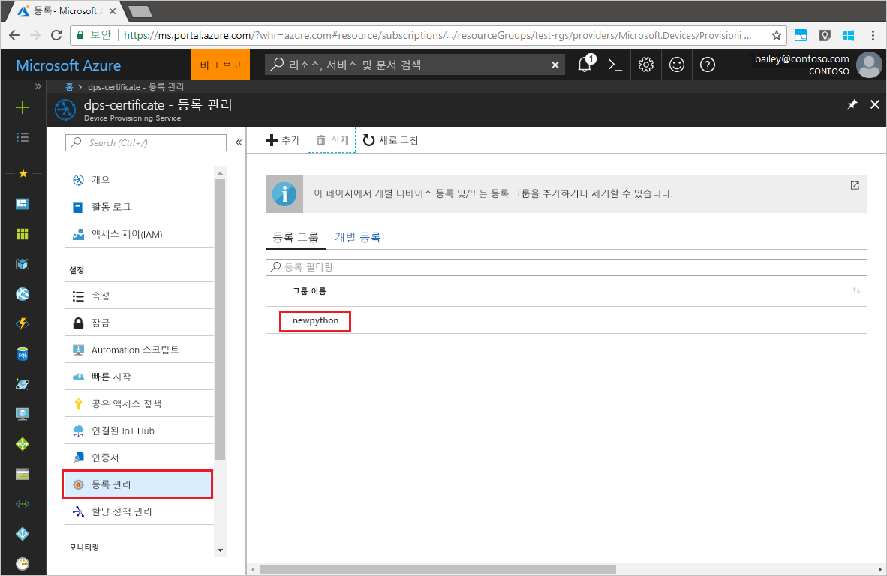

# <a name="enroll-x509-devices-to-iot-hub-device-provisioning-service-using-python-provisioning-service-sdk"></a>Python 프로비전 서비스 SDK를 사용하여 IoT Hub Device Provisioning Service에 X.509 장치 등록
[!INCLUDE [iot-dps-selector-quick-enroll-device-x509](../../includes/iot-dps-selector-quick-enroll-device-x509.md)]

다음 단계에서는 샘플 Python 응용 프로그램을 통해 [Python 프로비전 서비스 SDK](https://github.com/Azure/azure-iot-sdk-python/tree/master/provisioning_service_client)를 사용하여 시뮬레이션된 X.509 장치 그룹을 Azure IoT Hub Device Provisioning Service에 프로그래밍 방식으로 등록하는 방법을 보여 줍니다. Java 서비스 SDK는 Windows 및 Linux 컴퓨터 모두에서 작동하지만, 이 문서에서는 Windows 개발 컴퓨터를 사용하여 등록 프로세스를 안내합니다.

계속 진행하기 전에 [Azure Portal에서 IoT Hub Device Provisioning Service를 설정](./quick-setup-auto-provision.md)해야 합니다.

> [!NOTE]
> 이 빠른 시작에서는 **등록 그룹**만 지원합니다. _Python Provisioning Service SDK_를 통한 **개별 등록**은 현재 진행 중입니다.
> 

<a id="prepareenvironment"></a>

## <a name="prepare-the-environment"></a>환경 준비 

1. [Python 2.x 또는 3.x](https://www.python.org/downloads/)를 다운로드하고 설치합니다. 설치 프로그램의 요구 사항에 따라 32비트 또는 64비트 설치를 사용해야 합니다. 설치하는 동안 메시지가 표시되면 플랫폼 특정 환경 변수에 Python을 추가해야 합니다. 

1. 다음 옵션 중 하나를 선택합니다.

    - **Azure IoT Python SDK**를 빌드하고 컴파일합니다. [이러한 지침](https://github.com/Azure/azure-iot-sdk-python/blob/master/doc/python-devbox-setup.md)에 따라 Python 패키지를 빌드합니다. Windows OS를 사용하는 경우 [Visual C++ 재배포 가능 패키지](http://www.microsoft.com/download/confirmation.aspx?id=48145)를 설치하여 Python의 네이티브 DLL을 사용할 수 있게 합니다.

    - [*pip* Python 패키지 관리 시스템을 설치 또는 업그레이드](https://pip.pypa.io/en/stable/installing/)하고 다음 명령을 통해 패키지를 설치합니다.

        ```cmd/sh
        pip install azure-iothub-provisioningserviceclient
        ```

1. 프로비전 서비스를 통해 업로드되고 확인된 중간 또는 루트 CA X.509 인증서가 포함된 .pem 파일이 필요합니다. **Azure IoT C SDK**에는 X.509 인증서 체인을 만들고, 해당 체인에서 루트 또는 중간 인증서를 업로드하고, 인증서를 확인하기 위해 서비스를 통해 소유 증명을 수행하는 데 도움이 되는 도구가 포함되어 있습니다. 이 도구를 사용하려면 [Azure IoT C SDK](https://github.com/Azure/azure-iot-sdk-c)를 복제하고, 컴퓨터에서 [azure-iot-sdk-c\tools\CACertificates\CACertificateOverview.md](https://github.com/Azure/azure-iot-sdk-c/blob/master/tools/CACertificates/CACertificateOverview.md)의 단계를 수행합니다.


## <a name="modify-the-python-sample-code"></a>Python 샘플 코드 수정

이 섹션에서는 X.509 장치에 대한 프로비전 세부 정보를 샘플 코드에 추가하는 방법을 보여 줍니다. 

1. 텍스트 편집기를 사용하여 새 **EnrollmentGroup.py** 파일을 만듭니다.

1. **EnrollmentGroup.py** 파일의 시작 부분에 다음 `import` 문 및 변수를 추가합니다. 그런 다음, `dpsConnectionString`을 **Azure Portal**의 **Device Provisioning Service**에서 **공유 액세스 정책** 아래에 있는 연결 문자열로 바꿉니다. 인증서 자리 표시자를 이전에 [환경 준비](quick-enroll-device-x509-python.md#prepareenvironment)에서 만든 인증서로 바꿉니다. 마지막으로 고유한 `registrationid`를 만들고, 소문자 영숫자와 하이픈으로만 구성되어야 합니다.  
   
    ```python
    from provisioningserviceclient import ProvisioningServiceClient
    from provisioningserviceclient.models import EnrollmentGroup, AttestationMechanism

    CONNECTION_STRING = "{dpsConnectionString}"

    SIGNING_CERT = """-----BEGIN CERTIFICATE-----
    XXXXXXXXXXXXXXXXXXXXXXXXXXXXXXXXXXXXXXXXXXXXXXXXXXXXXXXXXXXXXXXX
    XXXXXXXXXXXXXXXXXXXXXXXXXXXXXXXXXXXXXXXXXXXXXXXXXXXXXXXXXXXXXXXX
    XXXXXXXXXXXXXXXXXXXXXXXXXXXXXXXXXXXXXXXXXXXXXXXXXXXXXXXXXXXXXXXX
    XXXXXXXXXXXXXXXXXXXXXXXXXXXXXXXXXXXXXXXXXXXXXXXXXXXXXXXXXXXXXXXX
    XXXXXXXXXXXXXXXXXXXXXXXXXXXXXXXXXXXXXXXXXXXXXXXXXXXXXXXXXXXXXXXX
    XXXXXXXXXXXXXXXXXXXXXXXXXXXXXXXXXXXXXXXXXXXXXXXXXXXXXXXXXXXXXXXX
    XXXXXXXXXXXXXXXXXXXXXXXXXXXXXXXXXXXXXXXXXXXXXXXXXXXXXXXXXXXXXXXX
    XXXXXXXXXXXXXXXXXXXXXXXXXXXXXXXXXXXXXXXXXXXXXXXXXXXXXXXXXXXXXXXX
    XXXXXXXXXXXXXXXXXXXXXXXXXXXXXXXXXXXXXXXXXXXXXXXXXXXXXXXXXXXXXXXX
    XXXXXXXXXXXXXXXXXXXXXXXXXXXXXXXXXXXXXXXXXXXXXXXXXXXXXXXXXXXXXXXX
    XXXXXXXXXXXXXXXXXXXXXXXXXXXXXXXXXXXXXXXXXXXXXXXXXXXXXXXXXXXXXXXX
    XXXXXXXXXXXXXXXXXXXXXXXXXXXXXXXXXXXXXXXXXXXXXXXXXXXXXXXXXXXXXXXX
    XXXXXXXXXXXXXXXXXXXXXXXXXXXXXXXXXXXXXXXXXXXXXXXXXXXXXXXXXXXXXXXX
    XXXXXXXXXXXXXXXXXXXXXXXXXXXXXXXXXXXXXXXXXXXXXXXXXXXXXXXXXXXXXXXX
    XXXXXXXXXXXXXXXXXXXXXXXXXXXXXXXXXXXXXXXXXXXXXXXXXXXXXXXX
    -----END CERTIFICATE-----"""

    GROUP_ID = "{registrationid}"
    ```

1. 다음 함수 및 함수 호출을 추가하여 그룹 등록 만들기를 구현합니다.
   
    ```python
    def main():
        print ( "Initiating enrollment group creation..." )

        psc = ProvisioningServiceClient.create_from_connection_string(CONNECTION_STRING)
        att = AttestationMechanism.create_with_x509_signing_certs(SIGNING_CERT)
        eg = EnrollmentGroup.create(GROUP_ID, att)

        eg = psc.create_or_update(eg)
    
        print ( "Enrollment group created." )

    if __name__ == '__main__':
        main()
    ```

1. **EnrollmentGroup.py** 파일을 저장하고 닫습니다.
 

## <a name="run-the-sample-group-enrollment"></a>샘플 그룹 등록 실행

1. 명령 프롬프트를 열고 스크립트를 실행합니다.

    ```cmd/sh
    python EnrollmentGroup.py
    ```

1. 성공적으로 등록되는지 확인하기 위해 결과를 관찰합니다.

1. Azure Portal에서 프로비전 서비스로 이동합니다. **등록 관리**를 클릭합니다. 앞에서 만든 이름(`registrationid`)이 있는 X.509 장치 그룹이 **등록 그룹** 탭 아래에 표시됩니다. 

      


## <a name="clean-up-resources"></a>리소스 정리
Java 서비스 샘플을 탐색하려면 이 빠른 시작에서 만든 리소스를 정리하지 마세요. 계속하지 않으려는 경우 다음 단계를 사용하여 이 빠른 시작에서 만든 모든 리소스를 삭제합니다.

1. 컴퓨터에서 Java 샘플 출력 창을 닫습니다.
1. 컴퓨터에서 _X509 인증서 생성기_ 창을 닫습니다.
1. Azure Portal에서 Device Provisioning Service로 이동하고, **등록 관리**를 클릭한 다음, **등록 그룹** 탭을 선택합니다. 이 빠른 시작을 사용하여 등록한 X.509 장치에 대한 *그룹 이름*을 선택하고, 블레이드 위쪽의 **삭제** 단추를 클릭합니다.  


## <a name="next-steps"></a>다음 단계
이 빠른 시작에서는 시뮬레이션된 X.509 장치 그룹을 Device Provisioning Service에 등록했습니다. 장치 프로비전에 대해 자세히 알아보려면 Azure Portal에서 Device Provisioning Service 설치에 대한 자습서를 살펴보세요. 

> [!div class="nextstepaction"]
> [Azure IoT Hub Device Provisioning 서비스 자습서](./tutorial-set-up-cloud.md)
