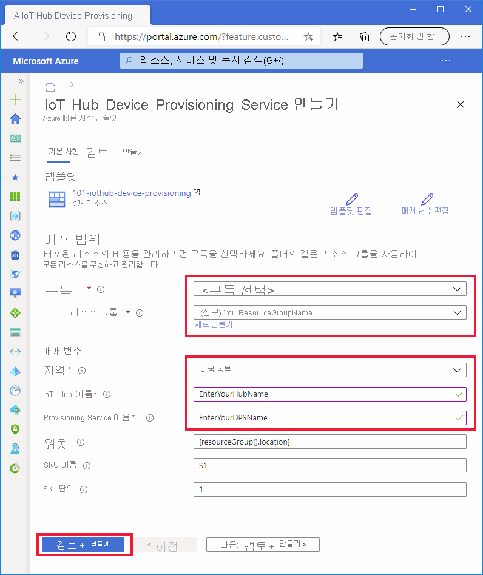

# <a name="quickstart-set-up-the-iot-hub-device-provisioning-service-dps-with-an-arm-template"></a>빠른 시작: ARM 템플릿을 사용하여 Azure IoT Hub DPS(Device Provisioning Service) 설정

[ARM 템플릿(Azure Resource Manager 템플릿)](../azure-resource-manager/management/overview.md)을 사용하여 디바이스를 프로비저닝하는 데 필요한 Azure 클라우드 리소스를 프로그래밍 방식으로 설정할 수 있습니다. 다음 단계에서는 ARM 템플릿을 사용하여 IoT 허브 및 새 IoT Hub Device Provisioning Service를 만드는 방법을 보여 줍니다. 또한 IoT Hub도 템플릿을 사용하여 DPS 리소스에 연결됩니다. 이 연결을 통해 구성한 할당 정책에 따라 DPS 리소스에서 디바이스를 허브에 할당할 수 있습니다.

[!INCLUDE [About Azure Resource Manager](../../includes/resource-manager-quickstart-introduction.md)]

이 빠른 시작에서는 [Azure Portal](../azure-resource-manager/templates/deploy-portal.md) 및 [Azure CLI](../azure-resource-manager/templates/deploy-cli.md)를 사용하여 리소스 그룹을 만들고 템플릿을 배포하는 데 필요한 프로그래밍 단계를 수행하지만, [PowerShell](../azure-resource-manager/templates/deploy-powershell.md), .NET, Ruby 또는 다른 프로그래밍 언어를 쉽게 사용하여 이러한 단계를 수행하고 템플릿을 배포할 수 있습니다. 

환경에서 사전 요구 사항을 충족하고 이미 ARM 템플릿 사용에 대해 잘 알고 있는 경우 아래의 **Azure에 배포** 단추를 선택하면 Azure Portal에서 배포할 템플릿이 열립니다.

[](https://portal.azure.com/#create/Microsoft.Template/uri/https%3a%2f%2fraw.githubusercontent.com%2fAzure%2fazure-quickstart-templates%2fmaster%2f101-iothub-device-provisioning%2fazuredeploy.json)

[!INCLUDE [quickstarts-free-trial-note](../../includes/quickstarts-free-trial-note.md)]

[!INCLUDE [azure-cli-prepare-your-environment.md](../../includes/azure-cli-prepare-your-environment.md)]


## <a name="review-the-template"></a>템플릿 검토

이 빠른 시작에서 사용되는 템플릿은 [Azure 빠른 시작 템플릿](https://azure.microsoft.com/resources/templates/101-iothub-device-provisioning/)에서 나온 것입니다.

> [!NOTE]
> 현재 새 DPS 리소스로 등록을 만들 수 있는 ARM 템플릿이 지원되지 않습니다. 이는 구현을 위해 고려되는 일반적이고 이해된 요청입니다.

:::code language="json" source="~/quickstart-templates/101-iothub-device-provisioning/azuredeploy.json":::

위의 템플릿에는 두 개의 Azure 리소스가 정의되어 있습니다.

* [**Microsoft.Devices/iothubs**](/azure/templates/microsoft.devices/iothubs): 새 Azure IoT Hub를 만듭니다.
* [**Microsoft.Devices/provisioningservices**](/azure/templates/microsoft.devices/provisioningservices): 새 IoT Hub가 이미 연결된 새 Azure IoT Hub Device Provisioning Service를 만듭니다.


## <a name="deploy-the-template"></a>템플릿 배포

#### <a name="deploy-with-the-portal"></a>포털을 사용하여 배포

1. 다음 이미지를 선택하여 Azure에 로그인하고 배포할 템플릿을 엽니다. 템플릿은 새 IoT Hub 및 DPS 리소스를 만듭니다. 허브가 DPS 리소스에 연결됩니다.

    [](https://portal.azure.com/#create/Microsoft.Template/uri/https%3a%2f%2fraw.githubusercontent.com%2fAzure%2fazure-quickstart-templates%2fmaster%2f101-iothub-device-provisioning%2fazuredeploy.json)

2. 다음 값을 선택하거나 입력하고, **검토 + 만들기** 를 클릭합니다.

        

    아래와 같이 지정되지 않으면 기본값을 사용하여 IoT Hub 및 DPS 리소스를 만듭니다.

    | 필드 | 설명 |
    | :---- | :---------- |
    | **구독** | Azure 구독을 선택합니다. |
    | **리소스 그룹** | **새로 만들기** 를 클릭하고, 고유한 리소스 그룹 이름을 입력한 다음, **확인** 을 클릭합니다. |
    | **지역** | 리소스에 대한 지역을 선택합니다. 예: **미국 동부** |
    | **IoT Hub 이름**: | *.azure-devices.net* 네임스페이스 내에서 전역적으로 고유해야 하는 IoT Hub 이름을 입력합니다. 이 허브 이름은 다음 섹션에서 배포의 유효성을 검사할 때 필요합니다. |
    | **Provisioning Service 이름** | 새 DPS(Device Provisioning Service) 리소스에 대한 이름을 입력합니다. 이름은 *.azure-devices-provisioning.net* 네임스페이스 내에서 전역적으로 고유해야 합니다. 이 DPS 이름은 다음 섹션에서 배포의 유효성을 검사할 때 필요합니다. |
    
3. 다음 화면에서 사용 약관을 읽습니다. 모든 사용 약관에 동의하면 **만들기** 를 클릭합니다. 

    배포를 완료하는 데 몇 분 정도 걸립니다. 

    Azure Portal 외에도 Azure PowerShell, Azure CLI 및 REST API를 사용할 수 있습니다. 다른 배포 방법을 알아보려면 [템플릿 배포](../azure-resource-manager/templates/deploy-powershell.md)를 참조하세요.


#### <a name="deploy-with-the-azure-cli"></a>Azure CLI를 사용하여 배포

Azure CLI를 사용하려면 버전 2.6 이상이 필요합니다. Azure CLI를 로컬로 실행하는 경우 `az --version`을 실행하여 버전을 확인합니다.

Azure 계정에 로그인하고 구독을 선택합니다.

1. Azure CLI를 포털에서 실행하는 대신 로컬로 실행하는 경우 로그인해야 합니다. 명령 프롬프트에서 로그인하려면 [login 명령](/cli/azure/get-started-with-az-cli2)을 실행합니다.
    
    ```azurecli
    az login
    ```

    지침에 따라 코드를 사용하여 인증하고 웹 브라우저를 통해 Azure 계정에 로그인합니다.

2. 여러 Azure 구독이 있는 경우 Azure에 로그인하면 자격 증명과 연결된 모든 Azure 계정에 대한 액세스를 허용합니다. 다음 [Azure 계정을 나열하는 명령](/cli/azure/account)을 사용합니다.
    
    ```azurecli
    az account list -o table
    ```

    다음 명령을 사용하여 IoT 허브 및 DPS 리소스를 만드는 명령을 실행하는 데 사용하려는 구독을 선택합니다. 이전 명령의 출력에서 구독 이름 또는 ID를 사용할 수 있습니다.

    ```azurecli
    az account set --subscription {your subscription name or id}
    ```

3. 다음 명령을 복사하여 CLI 프롬프트에 붙여넣습니다. 그런 다음, **ENTER** 키를 눌러 명령을 실행합니다.
   
    > [!TIP]
    > 명령에서 리소스 그룹 위치를 요구하는 메시지를 표시합니다. 먼저 다음 명령을 실행하여 사용할 수 있는 위치의 목록을 확인할 수 있습니다.
    >
    > `az account list-locations -o table`
    >
    >
    
    ```azurecli-interactive
    read -p "Enter a project name that is used for generating resource names:" projectName &&
    read -p "Enter the location (i.e. centralus):" location &&
    templateUri="https://raw.githubusercontent.com/Azure/azure-quickstart-templates/master/101-iothub-device-provisioning/azuredeploy.json" &&
    resourceGroupName="${projectName}rg" &&
    az group create --name $resourceGroupName --location "$location" &&
    az deployment group create --resource-group $resourceGroupName --template-uri  $templateUri &&
    echo "Press [ENTER] to continue ..." &&
    read
    ```

4. 명령에서 다음 정보를 입력하라는 메시지를 표시합니다. 각 값을 입력하고, **ENTER** 키를 누릅니다.

    | 매개 변수 | Description |
    | :-------- | :---------- |
    | **프로젝트 이름** | 이 매개 변수의 값은 모든 리소스를 저장할 리소스 그룹을 만드는 데 사용됩니다. `rg` 문자열이 리소스 그룹 이름의 값 끝에 추가됩니다. |
    | **location** | 이 값은 모든 리소스가 상주하는 지역입니다. |
    | **iotHubName** | *.azure-devices.net* 네임스페이스 내에서 전역적으로 고유해야 하는 IoT Hub 이름을 입력합니다. 이 허브 이름은 다음 섹션에서 배포의 유효성을 검사할 때 필요합니다. |
    | **provisioningServiceName** | 새 DPS(Device Provisioning Service) 리소스에 대한 이름을 입력합니다. 이름은 *.azure-devices-provisioning.net* 네임스페이스 내에서 전역적으로 고유해야 합니다. 이 DPS 이름은 다음 섹션에서 배포의 유효성을 검사할 때 필요합니다. |

    Azure CLI는 템플릿을 배포하는데 사용됩니다. Azure CLI 외에도 Azure PowerShell, Azure Portal 및 REST API를 사용할 수 있습니다. 다른 배포 방법을 알아보려면 [템플릿 배포](../azure-resource-manager/templates/deploy-powershell.md)를 참조하세요.


## <a name="review-deployed-resources"></a>배포된 리소스 검토

1. 배포를 확인하려면 다음 [명령을 실행하여 리소스를 나열](/cli/azure/resource?view=azure-cli-latest#az-resource-list&preserve-view=true)하고, 출력에서 새 프로비저닝 서비스 및 IoT 허브를 찾습니다.

    ```azurecli
     az resource list -g "${projectName}rg"
    ```

2. 허브가 이미 DPS 리소스에 연결되어 있는지 확인하려면 다음 [DPS 확장 표시 명령](/cli/azure/iot/dps?view=azure-cli-latest#az_iot_dps_show&preserve-view=true)을 실행합니다.

    ```azurecli
     az iot dps show --name <Your provisioningServiceName>
    ```

    `iotHubs` 멤버에 연결된 허브를 확인합니다.


## <a name="clean-up-resources"></a>리소스 정리

이 컬렉션의 다른 빠른 시작은 이 빠른 시작을 기반으로 구성됩니다. 다음 빠른 시작 또는 자습서를 사용하여 계속하려는 경우 이 빠른 시작에서 만든 리소스를 정리하지 않습니다. 계속하지 않으려는 경우 Azure Portal 또는 Azure CLI를 사용하여 리소스 그룹 및 모든 해당 리소스를 삭제할 수 있습니다.

Azure Portal에서 리소스 그룹 및 모든 해당 리소스를 삭제하려면 리소스 그룹을 열고 **리소스 그룹 삭제** 및 위쪽을 클릭하면 됩니다.

Azure CLI를 사용하여 배포된 리소스 그룹을 삭제하려면 다음을 수행합니다.

```azurecli
az group delete --name "${projectName}rg"
```

Azure Portal, PowerShell, REST API 또는 Azure Resource Manager나 IoT Hub Device Provisioning Service에 게시된 지원되는 플랫폼 SDK를 사용하여 리소스 그룹 및 개별 리소스를 삭제할 수도 있습니다.

## <a name="next-steps"></a>다음 단계

이 빠른 시작에서는 IoT 허브 및 Device Provisioning Service 인스턴스를 배포하고, 두 리소스를 연결했습니다. 이 설정을 사용하여 디바이스를 프로비저닝하는 방법을 알아보려면 디바이스를 만들기 위한 빠른 시작으로 계속 진행하세요.

> [!div class="nextstepaction"]
> [디바이스 프로비저닝을 위한 빠른 시작](./quick-create-simulated-device-symm-key.md)

