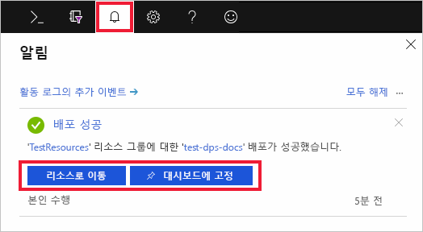

# Azure Portal에서 IoT Hub Device Provisioning 서비스 설정

이러한 단계는 장치를 프로비전하기 위해 포털에서 Azure 클라우드 리소스를 설정하는 방법을 보여 줍니다. 이 문서는 IoT Hub를 만들고 새 IoT Hub Device Provisioning Service를 만들어 두 서비스를 함께 연결하는 단계를 포함합니다. 

Azure 구독이 아직 없는 경우 시작하기 전에 [체험 계정](https://azure.microsoft.com/free/?WT.mc_id=A261C142F)을 만듭니다.

## IoT Hub 만들기

[!INCLUDE [iot-hub-quickstarts-create-hub](../../includes/iot-hub-quickstarts-create-hub.md)]

## IoT Hub Device Provisioning Service에 대한 새 인스턴스 만들기

1. Azure Portal의 왼쪽 위에 있는 **리소스 만들기** 단추를 클릭합니다.

2. **Device Provisioning Service**에 대한 *Marketplace를 검색*합니다. **IoT Hub Device Provisioning 서비스**를 선택하고 **만들기** 단추를 클릭합니다. 

3. 새 Device Provisioning Service 인스턴스에 대해 다음 정보를 제공하고, **만들기**를 클릭합니다.

    * **이름:** 새 Device Provisioning Service 인스턴스에 대해 고유한 이름을 입력합니다. 입력한 이름을 사용할 수 있으면 녹색 확인 표시가 나타납니다.
    * **구독**: 이 Device Provisioning Service 인스턴스를 만드는 데 사용할 구독을 선택합니다.
    * **리소스 그룹:** 이 필드를 통해 새 리소스 그룹을 만들거나 새 인스턴스를 포함하도록 기존 항목을 선택할 수 있습니다. 위에서 만든 Iot 허브를 포함하는 동일한 리소스 그룹을 선택합니다(예: **TestResources**). 모든 관련 리소스를 한 그룹에 배치하여 다 함께 관리할 수 있습니다. 예를 들어 리소스 그룹을 삭제하면 해당 그룹에 들어 있는 모든 리소스가 삭제됩니다. 자세한 내용은 [리소스 그룹을 사용하여 Azure 리소스 관리](../azure-resource-manager/resource-group-portal.md)를 참조하세요.
    * **위치**: 장치에 가장 가까운 위치를 선택합니다.

      

4. 리소스 인스턴스 만들기를 모니터링하려면 알림 단추를 클릭합니다. 서비스가 성공적으로 배포되면 **대시보드에 고정**, **리소스로 이동**을 차례로 클릭합니다.

    

## IoT Hub 및 Device Provisioning Service 연결

이 섹션에서는 Device Provisioning service 인스턴스에 구성을 추가합니다. 이 구성은 장치가 프로비전될 IoT 허브를 설정합니다.

1. Azure Portal의 왼쪽 메뉴에서 **모든 리소스** 단추를 클릭합니다. 이전 섹션에서 만든 Device Provisioning Service 인스턴스를 선택합니다.  

2. Device Provisioning Service 요약 블레이드에서 **연결된 IoT Hub**를 선택합니다. 맨 위에 표시된 **+ 추가** 단추를 클릭합니다. 

3. **IoT Hub에 링크 추가** 페이지에서 다음 정보를 입력하여 IoT Hub에 새 Device Provisioning Service 인스턴스를 연결합니다. 그런 다음, **저장**을 클릭합니다. 

    * **구독:** 새 Device Provisioning Service 인스턴스와 연결하려는 IoT Hub를 포함하는 구독을 선택합니다.
    * **Iot Hub:** 새 Device Provisioning Service 인스턴스에 연결할 IoT Hub를 선택합니다.
    * **액세스 정책:** IoT 허브로 연결을 설정하기 위한 자격 증명으로 **iothubowner**를 선택합니다.  

      

3. 이제 선택한 허브가 **연결된 IoT Hub** 블레이드 아래에 표시됩니다. **연결된 IoT 허브**를 표시하려면 **새로 고침**을 클릭해야 할 수도 있습니다.

## 리소스 정리

이 컬렉션의 다른 빠른 시작은 이 빠른 시작을 기반으로 구성됩니다. 다음 빠른 시작 또는 자습서를 사용하여 계속하려는 경우 이 빠른 시작에서 만든 리소스를 정리하지 않습니다. 계속하지 않으려는 경우 다음 단계에 따라 이 빠른 시작에서 만든 모든 리소스를 Azure Portal에서 삭제합니다.

1. Azure Portal의 왼쪽 메뉴에서 **모든 리소스**를 클릭한 다음 사용자의 Device Provisioning Service를 선택합니다. **모든 리소스** 블레이드 위쪽에서 **삭제**를 클릭합니다.  
2. Azure Portal의 왼쪽 메뉴에서 **모든 리소스**를 클릭한 다음 사용자의 IoT Hub를 선택합니다. **모든 리소스** 블레이드 위쪽에서 **삭제**를 클릭합니다.  

## 다음 단계

이 빠른 시작에서는 IoT Hub 및 Device Provisioning Service 인스턴스를 배포하고, 두 리소스를 연결했습니다. 시뮬레이션된 장치를 프로비전하도록 설정하는 방법에 대해 알아보려면 시뮬레이션된 장치 만들기를 위한 빠른 시작을 진행하세요.

> [!div class="nextstepaction"]
> [시뮬레이션된 장치를 만들기 위한 빠른 시작](./quick-create-simulated-device.md)
