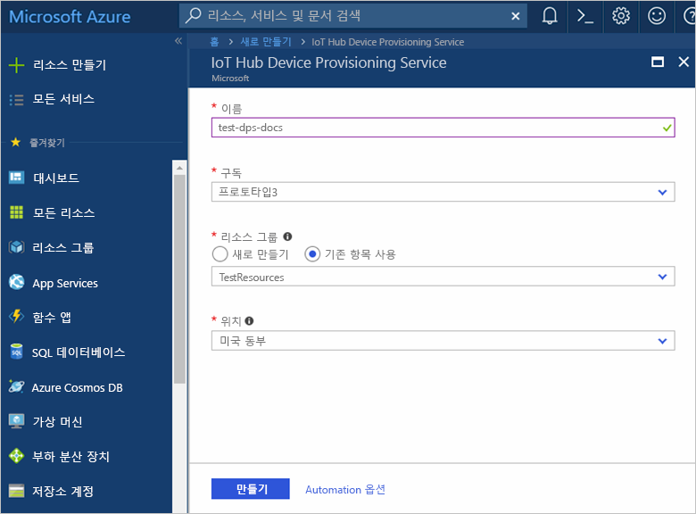
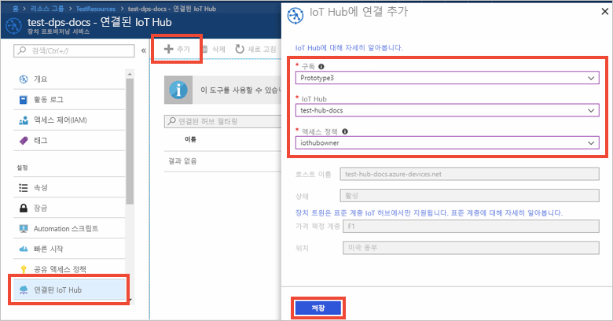

# Azure Portal에서 IoT Hub Device Provisioning 서비스 설정

이러한 단계는 장치를 프로비전하기 위해 포털에서 Azure 클라우드 리소스를 설정하는 방법을 보여 줍니다. 여기에는 IoT Hub를 만들고 새 IoT Hub Device Provisioning Service를 만들어 두 서비스를 함께 연결하는 방법이 포함됩니다. 

Azure 구독이 아직 없는 경우 시작하기 전에 [무료 계정](https://azure.microsoft.com/free/?WT.mc_id=A261C142F)을 만듭니다.

## Azure Portal에 로그인

[Azure Portal](https://portal.azure.com/)에 로그인합니다.

## IoT Hub 만들기

1. Azure Portal의 왼쪽 위에 있는 **리소스 만들기** 단추를 클릭합니다.

2. **사물 인터넷**, **IoT Hub**를 선택하고 **만들기** 단추를 클릭합니다. 

3. IoT Hub의 **이름을 지정**합니다. 가격 책정에 사용 가능한 옵션을 선택하고 [IoT Hub 단위](https://azure.microsoft.com/pricing/details/iot-hub/)를 입력하며 장치-클라우드 메시지에 대한 파티션 수와 이 리소스에 사용되는 구독을 선택합니다. 새 또는 기존 리소스 그룹 이름을 입력하고 위치를 선택합니다. 완료되면 **만들기**를 클릭합니다.

      

4. IoT Hub가 성공적으로 배포되면 허브 요약 블레이드가 자동으로 열립니다.

## IoT Hub Device Provisioning Service에 대한 새 인스턴스 만들기

1. Azure Portal의 왼쪽 위에 있는 **리소스 만들기** 단추를 클릭합니다.

2. **Device Provisioning Service**에 대한 *Marketplace를 검색*합니다. **IoT Hub Device Provisioning 서비스**를 선택하고 **만들기** 단추를 클릭합니다. 

3. Device Provisioning Service 인스턴스의 **이름을 지정**합니다. 이 인스턴스에 사용할 구독을 선택하고 새로운 또는 기존 리소스 그룹의 이름을 지정합니다. 위치를 선택합니다. 완료되면 **만들기**를 클릭합니다.

      

4. 서비스가 성공적으로 배포되면 요약 블레이드가 자동으로 열립니다.

## IoT Hub 및 Device Provisioning Service 연결

1. Azure Portal의 왼쪽 메뉴에서 **모든 리소스** 단추를 클릭합니다. 이전 섹션에서 만든 Device Provisioning Service 인스턴스를 선택합니다.  

2. Device Provisioning Service 요약 블레이드에서 **연결된 IoT Hub**를 선택합니다. 맨 위에 표시된 **+ 추가** 단추를 클릭합니다. 

3. **IoT Hub에 링크 추가** 포털 블레이드에서 현재 구독을 선택하거나 다른 구독에 대한 이름과 연결 문자열을 입력합니다. 드롭다운 목록에서 허브 이름을 선택합니다. 완료되면 **저장**을 클릭합니다. 

      

3. 이제 선택한 허브가 **연결된 IoT Hub** 블레이드 아래에 표시됩니다. **연결된 IoT 허브**를 표시하려면 **새로 고침**을 클릭해야 할 수도 있습니다.

## 리소스 정리

이 컬렉션의 다른 빠른 시작은 이 빠른 시작을 기반으로 구성됩니다. 다음 빠른 시작 또는 자습서를 사용하여 계속하려는 경우 이 빠른 시작에서 만든 리소스를 정리하지 않습니다. 계속하지 않으려는 경우 다음 단계에 따라 이 빠른 시작에서 만든 모든 리소스를 Azure Portal에서 삭제합니다.

1. Azure Portal의 왼쪽 메뉴에서 **모든 리소스**를 클릭한 다음 사용자의 Device Provisioning Service를 선택합니다. **모든 리소스** 블레이드 위쪽에서 **삭제**를 클릭합니다.  
2. Azure Portal의 왼쪽 메뉴에서 **모든 리소스**를 클릭한 다음 사용자의 IoT Hub를 선택합니다. **모든 리소스** 블레이드 위쪽에서 **삭제**를 클릭합니다.  

## 다음 단계

이 빠른 시작에서는 IoT Hub 및 Device Provisioning Service 인스턴스를 배포한 후 두 리소스를 연결했습니다. 시뮬레이션된 장치를 프로비전하도록 설정하는 방법에 대해 알아보려면 시뮬레이션된 장치 만들기를 위한 빠른 시작을 진행하세요.

> [!div class="nextstepaction"]
> [시뮬레이션된 장치를 만들기 위한 빠른 시작](./quick-create-simulated-device.md)
