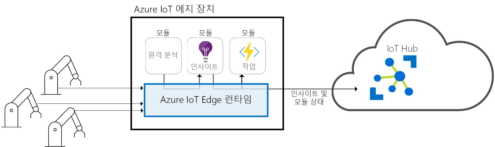
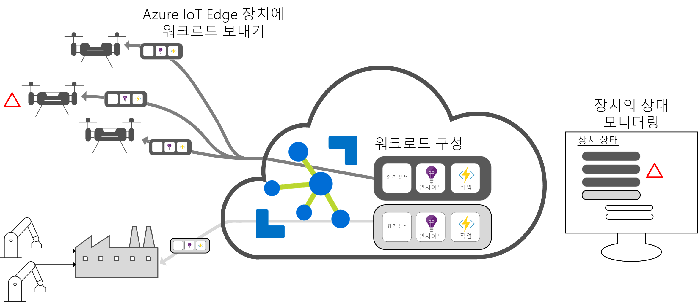

# Azure IoT Edge란?

Azure IoT Edge는 조직에서 데이터 관리 대신 비즈니스 통찰력에 집중할 수 있도록 클라우드 분석 및 사용자 지정 비즈니스 논리를 디바이스로 이동합니다. 비즈니스 논리를 표준 컨테이너에 패키징하여 IoT 솔루션을 확장하면 모든 디바이스에 해당 컨테이너를 배포하고 클라우드에서 모든 컨테이너를 모니터링할 수 있습니다. 

분석은 IoT 솔루션의 비즈니스 가치를 높이지만 모든 분석이 클라우드에 있을 필요는 없습니다. 응급 상황에 최대한 신속하게 대응하려면 에지에서 변칙 검색 워크로드를 실행하면 됩니다. 대역폭 비용을 줄이고 수테라바이트의 원시 데이터를 전송하는 일이 없도록 하려면 로컬로 데이터를 정리하고 집계한 다음, 인사이트만 클라우드로 보내서 분석하면 됩니다. 

Azure IoT Edge는 다음과 같은 세 가지 구성 요소로 구성됩니다.
* **IoT Edge 모듈**은 Azure 서비스, 타사 서비스 또는 개발자 고유의 코드를 실행하는 컨테이너입니다. 모듈은 IoT Edge 디바이스에 배포되어 해당 디바이스에서 로컬로 실행됩니다. 
* **IoT Edge 런타임**은 각 IoT Edge 디바이스에서 실행되며 각 디바이스에 배포된 모듈을 관리합니다. 
* **클라우드 기반 인터페이스**를 사용하여 IoT Edge 디바이스를 원격으로 모니터링 및 관리할 수 있습니다.

>[!NOTE]
>Azure IoT Edge는 IoT Hub의 무료 및 표준 계층에서 사용할 수 있습니다. 무료 계층은 테스트 및 평가에만 사용할 수 있습니다. 기본 및 표준 계층에 대한 자세한 내용은 [적합한 IoT Hub 계층 선택 방법](../iot-hub/iot-hub-scaling.md)을 참조하세요.

## IoT Edge 모듈

IoT Edge 모듈은 실행 단위로, Docker 호환 컨테이너로 구현되어 에지에서 비즈니스 논리를 실행합니다. 여러 모듈이 서로 통신하도록 구성하여 데이터 처리 파이프라인을 만들 수 있습니다. 사용자 지정 모듈을 개발하거나 오프라인 및 에지에서 통찰력을 제공하는 모듈에 특정 Azure 서비스를 패키지화할 수 있습니다. 

### 에지의 AI

Azure IoT Edge를 사용하면 사내에서 작성하지 않아도 복합 이벤트 처리, Machine Learning, 이미지 인식 및 기타 중요 AI를 배포할 수 있습니다. Azure Functions, Azure Stream Analytics, Azure Machine Learning 등의 모든 Azure 서비스는 Azure IoT Edge를 통해 온-프레미스에서 실행할 수 있으며, Azure 서비스로 제한되지 않습니다. 누구든지 AI 모듈을 만들어서 Azure Marketplace를 통해 커뮤니티에서 사용할 수 있습니다. 

### 개발자 고유의 코드 사용

Azure IoT Edge는 디바이스에 개발자 고유의 코드를 배포하는 것도 지원합니다. Azure IoT Edge는 다른 Azure IoT 서비스와 동일한 프로그래밍 모델을 유지합니다. 디바이스 또는 클라우드에서 동일한 코드를 실행할 수 있습니다. Azure IoT Edge는 Linux와 Windows를 모두 지원하므로 사용자가 원하는 플랫폼으로 코드를 작성할 수 있습니다. Java, .NET Core 2.0, Node.js, C 및 Python이 지원되므로 개발자는 이미 알고 있는 언어로 코드를 작성할 수 있으며 기존의 비즈니스 논리를 사용할 수 있습니다.

## IoT Edge 런타임

Azure IoT Edge 런타임은 IoT Edge 디바이스에서 사용자 지정 논리 및 클라우드 논리를 지원합니다. IoT Edge 디바이스에 상주하며, 관리 및 통신 작업을 수행합니다. 런타임은 다음과 같은 여러 기능을 수행합니다.

* 디바이스에 워크로드를 설치하고 업데이트합니다.
* 디바이스에서 Azure IoT Edge 보안 표준을 유지합니다.
* IoT Edge 모듈이 항상 실행되도록 합니다.
* 원격 모니터링을 위해 모듈 상태를 클라우드에 보고합니다.
* 다운스트림 리프 디바이스와 IoT Edge 디바이스 간, IoT Edge 디바이스의 모듈 간, IoT Edge 디바이스와 클라우드 간의 통신을 관리합니다.

Azure IoT Edge 디바이스 사용 방법은 전적으로 사용자에게 달렸습니다. 런타임은 다른 온-프레미스 디바이스의 데이터를 집계하고 처리하는 게이트웨이 디바이스에 AI를 배포하는 데 종종 사용되지만, 그 외에도 여러 배포 모델이 있습니다. 

Azure IoT Edge 런타임은 방대한 IoT 디바이스 집합에서 실행되어 다양한 방법으로 런타임을 사용할 수 있게 해줍니다. Linux 및 Windows 운영 체제를 모두 지원할 뿐 아니라 하드웨어 세부 정보를 추상화합니다. 데이터 처리량이 많지 않거나 리소스 집약적인 워크로드를 실행하기 위해 산업용 서버를 사용하려는 경우 Raspberry Pi 3보다 작은 디바이스를 사용하세요.

## IoT Edge 클라우드 인터페이스

제조사와 모델이 다르거나 지리적으로 분산된 IoT 디바이스 수백만 대의 소프트웨어 수명 주기를 관리하기란 힘든 일입니다. 특정 유형의 디바이스에 대한 워크로드를 만들어서 구성하고, 모든 디바이스에 배포하고, 모니터링하면서 오작동하는 디바이스를 찾아내야 합니다. 이러한 작업은 디바이스 단위로 수행할 수 없고 대규모로 수행해야 합니다.

Azure IoT Edge는 Azure IoT 솔루션 가속기와 원활하게 통합되어 솔루션의 요구 사항에 따라 하나의 제어 평면을 제공합니다. 사용자는 Cloud Services를 통해 다음 작업을 수행할 수 있습니다.

* 특정 유형의 디바이스에서 실행되는 워크로드를 만들고 구성합니다.
* 디바이스 집합에 워크로드를 보냅니다.
* 현장의 디바이스에서 실행되는 워크로드를 모니터링합니다.

## 다음 단계

[시뮬레이션된 디바이스에 IoT Edge를 배포](quickstart.md)하여 다음 개념을 시도해 봅니다.