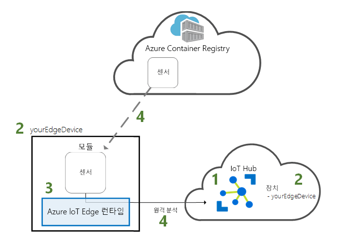
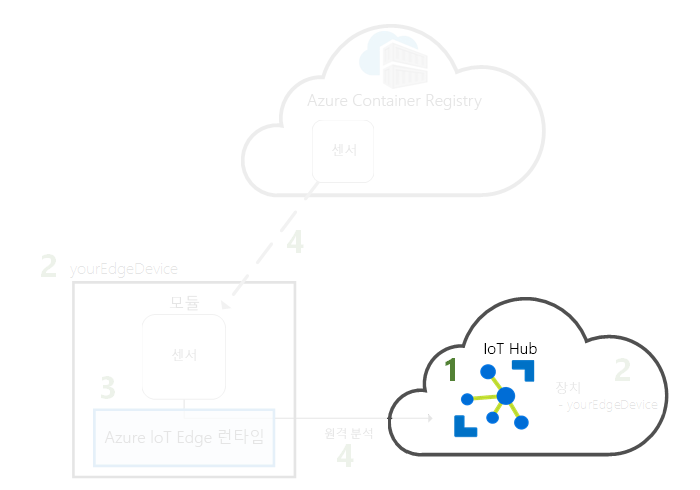
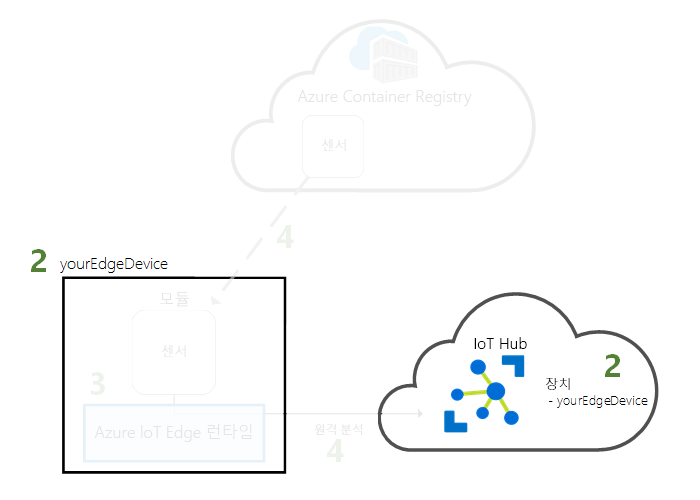
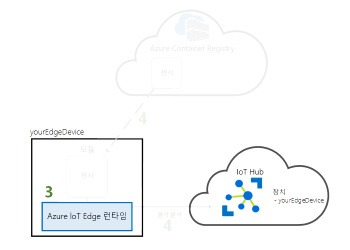
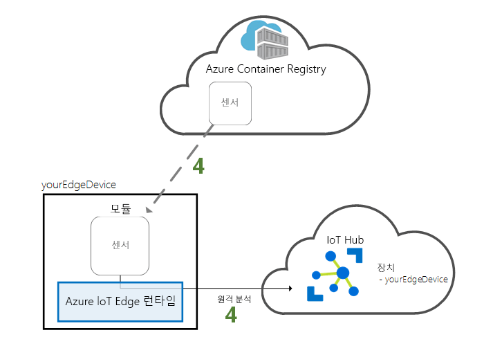

# <a name="quickstart-deploy-your-first-iot-edge-module-to-a-linux-x64-device"></a>빠른 시작: Linux x64 디바이스에 첫 번째 IoT Edge 모듈 배포

Azure IoT Edge는 클라우드의 강력한 기능을 사물 인터넷 디바이스로 옮겨놓습니다. 이 빠른 시작에서는 클라우드 인터페이스를 사용하여 미리 작성된 코드를 IoT Edge 장치에 원격으로 배포하는 방법에 대해 알아봅니다.

이 빠른 시작에서 다음을 수행하는 방법을 알아봅니다.

1. IoT Hub를 만듭니다.
2. IoT Edge 장치를 IoT Hub에 등록합니다.
3. 디바이스에 IoT Edge 런타임을 설치하고 시작합니다.
4. 모듈을 IoT Edge 디바이스에 원격으로 배포합니다.



이 빠른 시작에서는 Linux 컴퓨터 또는 가상 머신을 IoT Edge 디바이스로 전환합니다. 그런 다음, Azure Portal에서 모듈을 디바이스에 배포할 수 있습니다. 이 빠른 시작에서 배포하는 모듈은 온도, 습도 및 압력 데이터를 생성하는 시뮬레이션된 센서입니다. 다른 Azure IoT Edge 자습서에서는 비즈니스 정보를 위해 시뮬레이션된 데이터를 분석하는 모듈을 배포하는 과정을 설명하므로 여기에서 수행하는 작업을 토대로 진행됩니다.

활성 Azure 구독이 아직 없는 경우 시작하기 전에 [체험 계정](https://azure.microsoft.com/free)을 만드세요.

[!INCLUDE [cloud-shell-try-it.md](../../includes/cloud-shell-try-it.md)]

이 빠른 시작에서는 Azure CLI를 사용하여 많은 단계를 수행하고, Azure IoT에는 추가 기능을 사용할 수 있게 하는 확장이 있습니다. 

Azure IoT 확장을 Cloud Shell 인스턴스에 추가합니다.

   ```azurecli-interactive
   az extension add --name azure-cli-iot-ext
   ```

## <a name="prerequisites"></a>필수 조건

클라우드 리소스: 

* 이 빠른 시작에서 사용하는 모든 리소스를 관리하는 리소스 그룹입니다. 

   ```azurecli-interactive
   az group create --name IoTEdgeResources --location westus2
   ```

IoT Edge 장치:

* IoT Edge 디바이스 역할을 하는 Linux 디바이스 또는 가상 머신입니다. Microsoft에서 제공하는 [Ubuntu의 Azure IoT Edge](https://azuremarketplace.microsoft.com/en-us/marketplace/apps/microsoft_iot_edge.iot_edge_vm_ubuntu) 가상 머신을 사용하는 것이 좋습니다. 여기에는 디바이스에서 IoT Edge를 실행하는 데 필요한 모든 것이 미리 설치되어 있습니다. 다음 명령을 사용하여 이 가상 머신을 만듭니다.

   ```azurecli-interactive
   az vm create --resource-group IoTEdgeResources --name EdgeVM --image microsoft_iot_edge:iot_edge_vm_ubuntu:ubuntu_1604_edgeruntimeonly:latest --admin-username azureuser --generate-ssh-keys --size Standard_DS1_v2
   ```

   새 가상 머신을 만들고 시작하는 데 몇 분 정도 걸릴 수 있습니다. 

   새 가상 머신을 만들 때 create 명령 출력의 일부로 제공되는 **publicIpAddress**를 기록해 둡니다. 빠른 시작의 뒷부분에서 이 공용 IP 주소를 사용하여 가상 머신에 연결할 것입니다.

* 로컬 시스템에서 Azure IoT Edge 런타임을 실행하려면 [Linux(x64)에서 Azure IoT Edge 런타임 설치](how-to-install-iot-edge-linux.md)의 지침을 따르세요.

* Raspberry Pi와 같은 ARM32 기반 디바이스를 사용하려면 [Linux(ARM32v7/armhf)에 Azure IoT Edge 런타임 설치](how-to-install-iot-edge-linux-arm.md)의 지침을 따르세요.

## <a name="create-an-iot-hub"></a>IoT Hub 만들기

Azure CLI를 사용하여 IoT Hub를 만들어서 빠른 시작을 시작합니다.



이 빠른 시작에는 무료 수준의 IoT Hub가 작동합니다. 이전에 IoT Hub를 사용했고 이미 만든 체험 허브가 있으면 해당 IoT 허브를 사용할 수 있습니다. 구독마다 하나의 무료 IoT Hub만 가질 수 있습니다. 

다음 코드는 **IoTEdgeResources** 리소스 그룹에서 무료 **F1** 허브를 만듭니다. *{hub_name}* 을 IoT 허브의 고유한 이름으로 바꿉니다.

   ```azurecli-interactive
   az iot hub create --resource-group IoTEdgeResources --name {hub_name} --sku F1 
   ```

   구독에 이미 한 개의 무료 허브가 있기 때문에 오류가 발생하는 경우 SKU를 **S1**으로 변경합니다. IoT Hub 이름을 사용할 수 없다는 오류가 발생할 경우 다른 사용자에게 해당 이름의 허브가 이미 있는 것입니다. 새 이름을 사용해 보세요. 

## <a name="register-an-iot-edge-device"></a>IoT Edge 장치 등록

새로 만든 IoT Hub에 IoT Edge 디바이스를 등록합니다.



IoT 허브와 통신할 수 있도록 IoT Edge 디바이스에 대한 디바이스 ID를 만듭니다. 디바이스 ID는 클라우드에 있으며, 사용자는 고유한 디바이스 연결 문자열을 사용하여 물리적 디바이스를 디바이스 ID에 연결합니다. 

IoT Edge 디바이스는 일반적인 IoT 디바이스와 다르게 작동하며 다른 방식으로 관리될 수 있으므로, `--edge-enabled` 플래그를 사용하여 이 ID를 IoT Edge 디바이스로 선언합니다. 

1. Azure Cloud Shell에서 다음 명령을 입력하여 **myEdgeDevice**라는 장치를 허브에 만듭니다.

   ```azurecli-interactive
   az iot hub device-identity create --hub-name {hub_name} --device-id myEdgeDevice --edge-enabled
   ```

   iothubowner 정책 키에 대한 오류가 표시될 경우 Cloud Shell에서 최신 버전의 azure-cli-iot-ext 확장이 실행 중인지 확인합니다. 

2. IoT Hub에서 물리적 디바이스를 해당 ID에 연결하는 디바이스에 대한 연결 문자열을 검색합니다. 

   ```azurecli-interactive
   az iot hub device-identity show-connection-string --device-id myEdgeDevice --hub-name {hub_name}
   ```

3. JSON 출력에서 연결 문자열을 복사하여 저장합니다. 다음 섹션에서 이 값을 사용하여 IoT Edge 런타임을 구성할 것입니다.

   

## <a name="configure-your-iot-edge-device"></a>IoT Edge 디바이스 구성

IoT Edge 디바이스에서 Azure IoT Edge 런타임을 시작합니다. 



IoT Edge 런타임은 모든 IoT Edge 디바이스에 배포되며, 세 가지 구성 요소가 있습니다. **IoT Edge 보안 디먼**은 Edge 장치가 부팅되고 IoT Edge 에이전트를 시작하여 장치를 부트스트랩할 때마다 시작됩니다. **IoT Edge 에이전트**는 IoT Edge 허브를 포함하여 IoT Edge 장치에서 모듈을 쉽게 배포하고 모니터링할 수 있습니다. **IoT Edge 허브**는 IoT Edge 장치의 모듈 간 통신과 장치와 IoT Hub 간의 통신을 관리합니다. 

런타임을 구성하는 동안 장치 연결 문자열을 입력합니다. Azure CLI에서 검색한 문자열을 사용합니다. 이 문자열은 물리적 장치를 Azure의 IoT Edge 장치 ID에 연결합니다. 

### <a name="set-the-connection-string-on-the-iot-edge-device"></a>IoT Edge 디바이스에서 연결 문자열 설정

필수 구성 요소에서 권장된 Ubuntu 가상 머신에서 Azure IoT Edge를 사용하는 경우에는 디바이스에 IoT Edge 런타임이 이미 설치되어 있습니다. 이전 섹션에서 검색한 디바이스 연결 문자열로 디바이스를 구성하기만 하면 됩니다. 이 작업은 가상 머신에 연결하지 않고 원격으로 수행할 수 있습니다. 다음 명령에서 **{device_connection_string}** 을 자체 문자열로 바꿔서 실행합니다. 

   ```azurecli-interactive
   az vm run-command invoke -g IoTEdgeResources -n EdgeVM --command-id RunShellScript --script '/etc/iotedge/configedge.sh "{device_connection_string}"'
   ```

로컬 머신이나 ARM32 디바이스에서 IoT Edge를 실행하는 경우에는 디바이스에 IoT Edge 런타임과 필수 구성 요소를 설치해야 합니다. [Linux(x64)에서 Azure IoT Edge 런타임 설치](how-to-install-iot-edge-linux.md)나 [Linux(ARM32v7/armhf)에 Azure IoT Edge 런타임 설치](how-to-install-iot-edge-linux-arm.md)의 지침을 수행한 후에 이 빠른 시작으로 돌아오십시오. 

### <a name="view-the-iot-edge-runtime-status"></a>IoT Edge 런타임 상태 보기

이 빠른 시작의 나머지 명령은 IoT Edge 디바이스 자체에서 발생하기 때문에 디바이스에서 발생하는 상황을 볼 수 있습니다. 가상 머신을 사용하는 경우에는 만들기 명령에 의해 출력된 공용 IP 주소를 사용하여 해당 머신에 연결하십시오. Azure Portal의 가상 머신 개요 페이지에서 공용 IP 주소를 찾을 수 있습니다. 다음 명령을 사용하여 가상 머신에 연결합니다. 필수 구성 요소에 제안된 이름과 다른 이름을 사용하는 경우에는 **{azureuser}** 를 바꿉니다. **{publicIpAddress}** 를 컴퓨터의 주소로 바꿉니다. 

   ```azurecli-interactive
   ssh azureuser@{publicIpAddress}
   ```

IoT Edge 디바이스에서 런타임이 성공적으로 설치 및 구성되었는지 확인합니다. 

>[!TIP]
>`iotedge` 명령을 실행하려면 상승된 권한이 필요합니다. IoT Edge 런타임을 설치한 후 처음으로 머신에서 로그아웃했다가 다시 로그인하면 권한이 자동으로 업데이트됩니다. 그 전까지는 명령 앞에 **sudo**를 사용합니다. 

1. Edge 보안 디먼이 시스템 서비스로 실행되고 있는지 확인합니다.

   ```bash
   sudo systemctl status iotedge
   ```

   

2. 서비스 문제를 해결해야 할 경우 서비스 로그를 검색합니다. 

   ```bash
   journalctl -u iotedge
   ```

3. 장치에서 실행 중인 모듈을 확인합니다. 

   ```bash
   sudo iotedge list
   ```

   

IoT Edge 장치가 구성되었습니다. 클라우드 배포 모듈을 실행할 준비가 완료된 것입니다. 

## <a name="deploy-a-module"></a>모듈 배포

클라우드에서 Azure IoT Edge 디바이스를 관리하여 원격 분석 데이터를 IoT Hub로 보낼 모듈을 배포합니다.


[!INCLUDE [iot-edge-deploy-module](../../includes/iot-edge-deploy-module.md)]

## <a name="view-generated-data"></a>생성된 데이터 보기

이 빠른 시작에서는 새 IoT Edge 디바이스를 만들고 여기에 IoT Edge 런타임을 설치했습니다. 그런 다음, 디바이스 자체를 변경하지 않고도 디바이스에서 실행할 IoT Edge 모듈을 푸시할 수 있도록 Azure Portal을 사용했습니다. 이 경우 푸시한 모듈에서는 자습서에 대해 사용할 수 있는 환경 데이터를 만듭니다.

IoT Edge 디바이스에서 명령 프롬프트를 다시 열거나 Azure CLI에서 SSH 연결을 사용합니다. 클라우드에서 배포된 모듈을 IoT Edge 장치에서 실행 중인지 확인합니다.

   ```bash
   sudo iotedge list
   ```

   

온도 센서 모듈에서 전송되는 메시지를 봅니다.

   ```bash
   sudo iotedge logs SimulatedTemperatureSensor -f
   ```

   >[!TIP]
   >IoT Edge 명령은 모듈 이름을 참조하는 경우 대/소문자를 구분합니다.

   

로그에 표시된 마지막 줄이 **Using transport Mqtt_Tcp_Only**인 경우 온도 센서 모듈이 Edge Hub에 연결하기 위해 대기 중일 수 있습니다. 모듈을 중지하고 Edge 에이전트가 다시 시작되도록 합니다. 모듈은 `sudo docker stop SimulatedTemperatureSensor` 명령으로 중지할 수 있습니다.

[Visual Studio Code용 Azure IoT Hub Toolkit 확장](https://marketplace.visualstudio.com/items?itemName=vsciot-vscode.azure-iot-toolkit)(이전의 Azure IoT Toolkit 확장)을 사용하여 IoT 허브에 메시지가 도착하는 것을 확인할 수도 있습니다. 

## <a name="clean-up-resources"></a>리소스 정리

IoT Edge 자습서로 계속 진행하려면 이 빠른 시작에서 등록하고 설정한 장치를 사용할 수 있습니다. 그렇지 않으면 만든 Azure 리소스를 삭제하고 장치에서 IoT Edge 런타임을 제거할 수 있습니다.

### <a name="delete-azure-resources"></a>Azure 리소스 삭제

새 리소스 그룹에서 가상 머신 및 IoT 허브를 만든 경우 해당 그룹 및 모든 관련 리소스를 삭제할 수 있습니다. 리소스 그룹의 콘텐츠를 한 번 더 확인하여 유지할 내용이 없는지 검토합니다. 전체 그룹을 삭제하지는 않으려는 경우 대신, 개별 리소스를 삭제할 수 있습니다.

**IoTEdgeResources** 그룹을 제거합니다.

   ```azurecli-interactive
   az group delete --name IoTEdgeResources 
   ```

### <a name="remove-the-iot-edge-runtime"></a>IoT Edge 런타임 제거

장치에서 설치를 제거하려면 다음 명령을 사용합니다.  

IoT Edge 런타임을 제거합니다.

   ```bash
   sudo apt-get remove --purge iotedge
   ```

IoT Edge 런타임을 제거하면 만든 컨테이너는 중지되지만 장치에는 계속 남아 있습니다. 모든 컨테이너를 봅니다.

   ```bash
   sudo docker ps -a
   ```

IoT Edge 런타임에 의해 디바이스에서 만들어진 컨테이너를 삭제합니다. 

   ```bash
   sudo docker rm -f SimulatedTemperatureSensor
   sudo docker rm -f edgeHub
   sudo docker rm -f edgeAgent
   ```

컨테이너 런타임을 제거합니다.

   ```bash
   sudo apt-get remove --purge moby-cli
   sudo apt-get remove --purge moby-engine
   ```

## <a name="next-steps"></a>다음 단계

이 빠른 시작은 모든 IoT Edge 자습서에 대한 필수 구성 요소입니다. 다른 자습서를 계속 진행하면서 Azure IoT Edge가 이러한 데이터를 통해 비즈니스 통찰력을 얻는 데 어떻게 도움을 줄 수 있는지 알아볼 수 있습니다.

> [!div class="nextstepaction"]
> [Azure Function을 사용하여 센서 데이터 필터링](tutorial-deploy-function.md)
