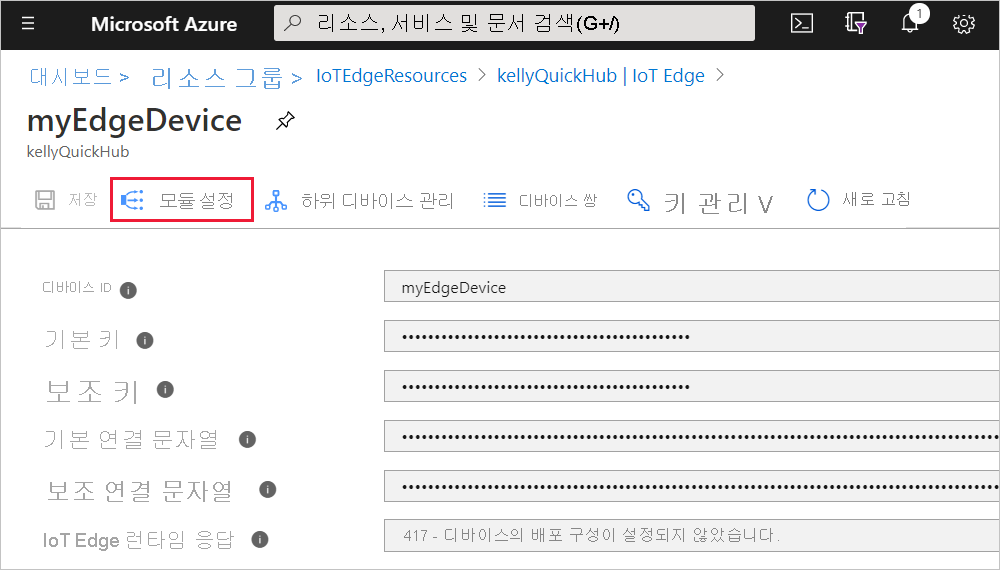
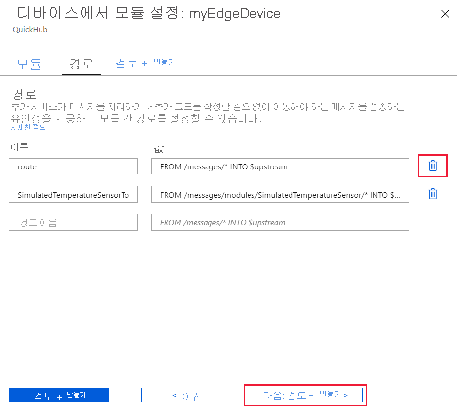
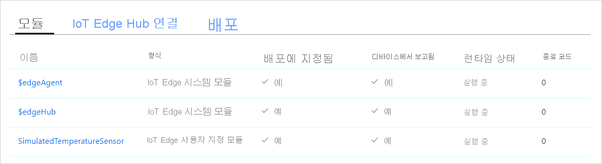

# <a name="quickstart-deploy-your-first-iot-edge-module-to-a-virtual-linux-device"></a>빠른 시작: 가상 Linux 디바이스에 첫 번째 IoT Edge 모듈 배포

[!INCLUDE [iot-edge-version-201806-or-202011](../../includes/iot-edge-version-201806-or-202011.md)]

이 빠른 시작에서는 컨테이너화된 코드를 가상 Linux IoT Edge 디바이스에 배포하여 Azure IoT Edge를 테스트합니다. IoT Edge를 사용하면 디바이스에서 코드를 원격으로 관리하여 더 많은 워크로드를 에지로 전송할 수 있습니다. 이 빠른 시작에서는 IoT Edge 디바이스에 Azure 가상 머신을 사용하는 것이 좋습니다. 이를 통해 테스트 머신을 빠르게 만든 다음, 완료되면 삭제할 수 있습니다.

이 빠른 시작에서 다음을 수행하는 방법을 알아봅니다.

* IoT Hub를 만듭니다.
* IoT Edge 디바이스를 IoT Hub에 등록합니다.
* 가상 디바이스에 IoT Edge 런타임을 설치하고 시작합니다.
* 모듈을 IoT Edge 디바이스에 원격으로 배포합니다.


이 빠른 시작에서는 IoT Edge 디바이스로 구성되는 Linux 가상 머신을 만드는 과정을 안내합니다. 그런 다음, Azure Portal에서 디바이스로 모듈을 배포합니다. 이 빠른 시작에 사용되는 모듈은 온도, 습도 및 압력 데이터를 생성하는 시뮬레이션된 센서입니다. 다른 Azure IoT Edge 자습서에서는 비즈니스 인사이트를 위해 시뮬레이션된 데이터를 분석하는 추가 모듈을 배포하는 과정을 설명하므로 여기서 수행하는 작업을 토대로 진행됩니다.

활성 Azure 구독이 아직 없는 경우 시작하기 전에 [체험 계정](https://azure.microsoft.com/free)을 만드세요.

## <a name="prerequisites"></a>사전 요구 사항

Azure CLI에 대한 환경을 준비합니다.

[!INCLUDE [azure-cli-prepare-your-environment-no-header.md](../../includes/azure-cli-prepare-your-environment-no-header.md)]

클라우드 리소스:

* 이 빠른 시작에서 사용하는 모든 리소스를 관리하는 리소스 그룹입니다. 이 빠른 시작과 다음 자습서에서는 **IoTEdgeResources** 라는 예제 리소스 그룹을 사용합니다.

   ```azurecli-interactive
   az group create --name IoTEdgeResources --location westus2
   ```

## <a name="create-an-iot-hub"></a>IoT Hub 만들기

Azure CLI를 사용하여 IoT Hub를 만들어서 빠른 시작을 시작합니다.


이 빠른 시작에는 무료 수준의 IoT Hub가 작동합니다. 이전에 IoT Hub를 사용했고 이미 만든 허브가 있으면 해당 IoT 허브를 사용할 수 있습니다.

다음 코드는 **IoTEdgeResources** 리소스 그룹에서 무료 **F1** 허브를 만듭니다. `{hub_name}`을 IoT 허브의 고유한 이름으로 바꿉니다. IoT Hub를 만드는 데 몇 분 정도 걸릴 수 있습니다.

   ```azurecli-interactive
   az iot hub create --resource-group IoTEdgeResources --name {hub_name} --sku F1 --partition-count 2
   ```

   구독에 이미 한 개의 무료 허브가 있기 때문에 오류가 발생하는 경우 SKU를 **S1** 으로 변경합니다. 구독마다 하나의 무료 IoT Hub만 가질 수 있습니다. IoT Hub 이름을 사용할 수 없다는 오류가 발생할 경우 다른 사용자에게 해당 이름의 허브가 이미 있는 것입니다. 새 이름을 사용해 보세요.

## <a name="register-an-iot-edge-device"></a>IoT Edge 디바이스 등록

새로 만든 IoT Hub에 IoT Edge 디바이스를 등록합니다.


IoT 허브와 통신할 수 있도록 IoT Edge 디바이스에 대한 디바이스 ID를 만듭니다. 디바이스 ID는 클라우드에 있으며, 사용자는 고유한 디바이스 연결 문자열을 사용하여 물리적 디바이스를 디바이스 ID에 연결합니다.

IoT Edge 디바이스는 일반적인 IoT 디바이스와 다르게 작동하며 다른 방식으로 관리될 수 있으므로, `--edge-enabled` 플래그를 사용하여 이 ID를 IoT Edge 디바이스로 선언합니다.

1. Azure Cloud Shell에서 다음 명령을 입력하여 **myEdgeDevice** 라는 디바이스를 허브에 만듭니다.

   ```azurecli-interactive
   az iot hub device-identity create --device-id myEdgeDevice --edge-enabled --hub-name {hub_name}
   ```

   iothubowner 정책 키에 대한 오류가 표시될 경우 Cloud Shell에서 최신 버전의 azure-iot 확장이 실행 중인지 확인합니다.

2. IoT Hub에서 물리적 디바이스를 해당 ID에 연결하는 디바이스의 연결 문자열을 확인합니다. 연결 문자열에는 IoT 허브 이름, 디바이스 이름 및 둘 간의 연결을 인증하는 공유 키가 포함됩니다. 다음 섹션에서 IoT Edge 디바이스를 설정할 때 이 연결 문자열을 다시 살펴보겠습니다.

   ```azurecli-interactive
   az iot hub device-identity connection-string show --device-id myEdgeDevice --hub-name {hub_name}
   ```

   

## <a name="configure-your-iot-edge-device"></a>IoT Edge 디바이스 구성

Azure IoT Edge 런타임이 있는 가상 머신을 만듭니다.


IoT Edge 런타임은 모든 IoT Edge 디바이스에 배포되며, 세 가지 구성 요소가 있습니다. *IoT Edge 보안 디먼* 은 IoT Edge 디바이스가 부팅되고 IoT Edge 에이전트를 시작하여 디바이스를 부트스트랩할 때마다 시작됩니다. *IoT Edge 에이전트* 는 IoT Edge 허브를 포함하여 IoT Edge 디바이스에서 모듈을 쉽게 배포하고 모니터링할 수 있습니다. *IoT Edge 허브* 는 IoT Edge 디바이스의 모듈 간 통신과 디바이스와 IoT Hub 간의 통신을 관리합니다.

런타임을 구성하는 동안 디바이스 연결 문자열을 입력합니다. Azure CLI에서 검색한 문자열입니다. 이 문자열은 물리적 디바이스를 Azure의 IoT Edge 디바이스 ID에 연결합니다.

### <a name="deploy-the-iot-edge-device"></a>IoT Edge 디바이스 배포

이 섹션에서는 Azure Resource Manager 템플릿을 사용하여 새 가상 머신을 만들고 IoT Edge 런타임을 설치합니다. 사용자 고유의 Linux 디바이스를 대신 사용하려면 [Azure IoT Edge 런타임 설치](how-to-install-iot-edge.md)의 설치 단계를 수행한 다음, 이 빠른 시작으로 돌아오면 됩니다.

<!-- 1.1 -->
:::moniker range="iotedge-2018-06"

다음 CLI 명령을 사용하여 미리 빌드된 [iotedge-vm-deploy](https://github.com/Azure/iotedge-vm-deploy) 템플릿을 기반으로 IoT Edge 디바이스를 만듭니다.

* bash 또는 Cloud Shell 사용자의 경우 다음 명령을 텍스트 편집기에 복사하고, 자리 표시자 텍스트를 해당 정보로 바꾸고, bash 또는 Cloud Shell 창에 복사합니다.

   ```azurecli-interactive
   az deployment group create \
   --resource-group IoTEdgeResources \
   --template-uri "https://aka.ms/iotedge-vm-deploy" \
   --parameters dnsLabelPrefix='<REPLACE_WITH_VM_NAME>' \
   --parameters adminUsername='azureUser' \
   --parameters deviceConnectionString=$(az iot hub device-identity connection-string show --device-id myEdgeDevice --hub-name <REPLACE_WITH_HUB_NAME> -o tsv) \
   --parameters authenticationType='password' \
   --parameters adminPasswordOrKey="<REPLACE_WITH_PASSWORD>"
   ```

* PowerShell 사용자의 경우 PowerShell 창에 다음 명령을 복사한 다음, 자리 표시자 텍스트를 해당 정보로 바꿉니다.

   ```azurecli
   az deployment group create `
   --resource-group IoTEdgeResources `
   --template-uri "https://aka.ms/iotedge-vm-deploy" `
   --parameters dnsLabelPrefix='<REPLACE_WITH_VM_NAME>' `
   --parameters adminUsername='azureUser' `
   --parameters deviceConnectionString=$(az iot hub device-identity connection-string show --device-id myEdgeDevice --hub-name <REPLACE_WITH_HUB_NAME> -o tsv) `
   --parameters authenticationType='password' `
   --parameters adminPasswordOrKey="<REPLACE_WITH_PASSWORD>"
   ```

:::moniker-end
<!-- end 1.1 -->

<!-- 1.2 -->
:::moniker range=">=iotedge-2020-11"

다음 CLI 명령을 사용하여 미리 빌드된 [iotedge-vm-deploy](https://github.com/Azure/iotedge-vm-deploy/tree/1.2.0-rc4) 템플릿을 기반으로 IoT Edge 디바이스를 만듭니다.

* bash 또는 Cloud Shell 사용자의 경우 다음 명령을 텍스트 편집기에 복사하고, 자리 표시자 텍스트를 해당 정보로 바꾸고, bash 또는 Cloud Shell 창에 복사합니다.

   ```azurecli-interactive
   az deployment group create \
   --resource-group IoTEdgeResources \
   --template-uri "https://raw.githubusercontent.com/Azure/iotedge-vm-deploy/1.2.0-rc4/edgeDeploy.json" \
   --parameters dnsLabelPrefix='<REPLACE_WITH_VM_NAME>' \
   --parameters adminUsername='azureUser' \
   --parameters deviceConnectionString=$(az iot hub device-identity connection-string show --device-id myEdgeDevice --hub-name <REPLACE_WITH_HUB_NAME> -o tsv) \
   --parameters authenticationType='password' \
   --parameters adminPasswordOrKey="<REPLACE_WITH_PASSWORD>"
   ```

* PowerShell 사용자의 경우 PowerShell 창에 다음 명령을 복사한 다음, 자리 표시자 텍스트를 해당 정보로 바꿉니다.

   ```azurecli
   az deployment group create `
   --resource-group IoTEdgeResources `
   --template-uri "https://raw.githubusercontent.com/Azure/iotedge-vm-deploy/1.2.0-rc4/edgeDeploy.json" `
   --parameters dnsLabelPrefix='<REPLACE_WITH_VM_NAME>' `
   --parameters adminUsername='azureUser' `
   --parameters deviceConnectionString=$(az iot hub device-identity connection-string show --device-id myEdgeDevice --hub-name <REPLACE_WITH_HUB_NAME> -o tsv) `
   --parameters authenticationType='password' `
   --parameters adminPasswordOrKey="<REPLACE_WITH_PASSWORD>"
   ```
:::moniker-end
<!-- end 1.2 -->

이 템플릿은 다음 매개 변수를 사용합니다.

| 매개 변수 | Description |
| --------- | ----------- |
| **resource-group** | 네트워크를 만들 리소스 그룹입니다. 지금까지 이 문서 전체에서 사용한 기본 **IoTEdgeResources** 를 사용하거나, 구독의 기존 리소스 그룹 이름을 입력합니다. |
| **template-uri** | 사용 중인 Resource Manager 템플릿을 가리키는 포인터입니다. |
| **dnsLabelPrefix** | 가상 머신의 호스트 이름을 만드는 데 사용되는 문자열입니다. 자리 표시자 텍스트를 가상 머신의 이름으로 바꿉니다. |
| **adminUsername** | 가상 머신의 관리자 계정 사용자 이름입니다. **azureUser** 예제를 사용하거나 새 사용자 이름을 입력합니다. |
| **deviceConnectionString** | IoT Hub에서 디바이스 ID의 연결 문자열입니다. 가상 머신의 IoT Edge 디바이스의 런타임을 구성하는 데 사용됩니다. 이 매개 변수 내의 CLI 명령은 사용자 대신 연결 문자열을 가져옵니다. 자리 표시자 텍스트를 IoT 허브 이름으로 바꿉니다. |
| **authenticationType** | 관리자 계정의 인증 방법입니다. 이 빠른 시작에서는 **암호** 인증을 사용하지만, 이 매개 변수를 **sshPublicKey** 로 설정할 수도 있습니다. |
| **adminPasswordOrKey** | 관리 계정의 암호 또는 SSH 키 값입니다. 자리 표시자 텍스트를 안전한 암호로 바꿉니다. 암호의 길이는 12자 이상이어야 하며 소문자, 대문자, 숫자 및 특수 문자 중 세 가지를 포함해야 합니다. |

배포가 완료되면 가상 머신에 연결하기 위한 SSH 정보를 포함하고 있는 JSON 형식의 출력이 CLI에 표시됩니다. **출력** 섹션의 **공용 SSH** 항목 값을 복사합니다.

   

### <a name="view-the-iot-edge-runtime-status"></a>IoT Edge 런타임 상태 보기

이 빠른 시작의 나머지 명령은 IoT Edge 디바이스 자체에서 발생하기 때문에 디바이스에서 발생하는 상황을 볼 수 있습니다. 가상 머신을 사용하는 경우 설정하는 관리 사용자 이름과 배포 명령에서 출력한 DNS 이름을 사용하여 해당 컴퓨터에 지금 연결합니다. Azure Portal의 가상 머신 개요 페이지에서 DNS 이름을 확인할 수도 있습니다. 다음 명령을 사용하여 가상 머신에 연결합니다. `{admin username}` 및 `{DNS name}`를 사용자 고유의 값으로 바꿉니다.

   ```console
   ssh {admin username}@{DNS name}
   ```

가상 머신에 연결되면 IoT Edge 디바이스에 런타임이 성공적으로 설치 및 구성되었는지 확인합니다.

<!--1.1 -->
:::moniker range="iotedge-2018-06"

1. IoT Edge 보안 디먼이 시스템 서비스로 실행되고 있는지 확인합니다.

   ```bash
   sudo systemctl status iotedge
   ```

   

   >[!TIP]
   >`iotedge` 명령을 실행하려면 상승된 권한이 필요합니다. IoT Edge 런타임을 설치한 후 처음으로 머신에서 로그아웃했다가 다시 로그인하면 권한이 자동으로 업데이트됩니다. 그 전까지는 명령 앞에 `sudo`를 사용합니다.

2. 서비스 문제를 해결해야 할 경우 서비스 로그를 검색합니다.

   ```bash
   journalctl -u iotedge
   ```

3. IoT Edge 디바이스에서 실행되는 모든 모듈을 봅니다. 서비스를 처음 시작했으므로 **edgeAgent** 모듈이 실행되는 것을 확인해야 합니다. edgeAgent 모듈은 기본적으로 실행되며, 디바이스에 배포하는 추가 모듈을 설치하고 시작하는 데 도움이 됩니다.

   ```bash
   sudo iotedge list
   ```

   
:::moniker-end
<!-- end 1.1 -->

<!-- 1.2 -->
:::moniker range=">=iotedge-2020-11"

1. IoT Edge가 실행 중인지 확인합니다. 다음 명령은 IoT Edge가 실행 중인 경우 **확인** 상태를 반환하거나 서비스 오류를 제공해야 합니다.

   ```bash
   sudo iotedge system status
   ```

   >[!TIP]
   >`iotedge` 명령을 실행하려면 상승된 권한이 필요합니다. IoT Edge 런타임을 설치한 후 처음으로 머신에서 로그아웃했다가 다시 로그인하면 권한이 자동으로 업데이트됩니다. 그 전까지는 명령 앞에 `sudo`를 사용합니다.

2. 서비스 문제를 해결해야 할 경우 서비스 로그를 검색합니다.

   ```bash
   sudo iotedge system logs
   ```

3. IoT Edge 디바이스에서 실행되는 모든 모듈을 봅니다. 서비스를 처음 시작했으므로 **edgeAgent** 모듈이 실행되는 것을 확인해야 합니다. edgeAgent 모듈은 기본적으로 실행되며, 디바이스에 배포하는 추가 모듈을 설치하고 시작하는 데 도움이 됩니다.

   ```bash
   sudo iotedge list
   ```

:::moniker-end
<!-- end 1.2 -->

IoT Edge 디바이스가 구성되었습니다. 클라우드 배포 모듈을 실행할 준비가 완료된 것입니다.

## <a name="deploy-a-module"></a>모듈 배포

클라우드에서 Azure IoT Edge 디바이스를 관리하여 원격 분석 데이터를 IoT Hub로 보낼 모듈을 배포합니다.


<!-- [!INCLUDE [iot-edge-deploy-module](../../includes/iot-edge-deploy-module.md)]

Include content included below to support versioned steps in Linux quickstart. Can update include file once Windows quickstart supports v1.2 -->

Azure IoT Edge의 주요 기능 중 하나는 클라우드의 IoT Edge 디바이스에 코드를 배포하는 것입니다. *IoT Edge 모듈* 은 컨테이너로 구현된 실행 패키지입니다. 이 섹션에서는 Azure IoT Hub에서 직접 [Azure Marketplace의 IoT Edge 모듈 섹션](https://azuremarketplace.microsoft.com/marketplace/apps/category/internet-of-things?page=1&subcategories=iot-edge-modules)에서 미리 빌드된 모듈을 배포합니다.

이 섹션에서 배포하는 모듈은 센서를 시뮬레이션하고 생성된 데이터를 보냅니다. 이 모듈은 시뮬레이션된 데이터를 개발 및 테스트에 사용할 수 있으므로 IoT Edge를 시작할 때 유용한 코드 조각입니다. [시뮬레이션된 온도 센서 소스 코드](https://github.com/Azure/iotedge/blob/027a509549a248647ed41ca7fe1dc508771c8123/edge-modules/SimulatedTemperatureSensor/src/Program.cs)를 보면 이 모듈이 하는 일을 정확하게 이해할 수 있습니다.

다음 단계에 따라 **모듈 설정** 마법사를 시작하여 Azure Marketplace에서 첫 번째 모듈을 배포합니다.

1. [Azure Portal](https://portal.azure.com)에 로그인하고 IoT 허브로 이동합니다.

1. 왼쪽에 있는 메뉴의 **자동 디바이스 관리** 에서 **IoT Edge** 를 선택합니다.

1. 디바이스 목록에서 대상 디바이스의 디바이스 ID를 선택합니다.

1. 위쪽 막대에서 **모듈 설정** 을 선택합니다.

   

### <a name="modules"></a>모듈

마법사의 첫 번째 단계는 디바이스에서 실행하려는 모듈을 선택하는 것입니다.

**IoT Edge 모듈** 에서 **추가** 드롭다운 메뉴를 연 다음, **Marketplace 모듈** 을 선택합니다.

   

**IoT Edge Module Marketplace** 에서 `Simulated Temperature Sensor` 모듈을 검색하여 선택합니다. 모듈이 원하는 **실행 중** 상태인 IoT Edge 모듈 섹션에 추가됩니다.

<!-- 1.2 -->
:::moniker range=">=iotedge-2020-11"

**런타임 설정** 을 선택하여 edgeHub 및 edgeAgent 모듈에 대한 설정을 엽니다. 이 설정 섹션에서는 환경 변수를 추가하거나 만들기 옵션을 변경하여 런타임 모듈을 관리할 수 있습니다.

버전 태그 1.2를 사용하도록 edgeHub 및 edgeAgent 모듈 모두에 대한 **이미지** 필드를 업데이트합니다. 예를 들면 다음과 같습니다.

* `mcr.microsoft.com/azureiotedge-hub:1.2`
* `mcr.microsoft.com/azureiotedge-agent:1.2`

**저장** 을 선택하여 변경 내용을 런타임 모듈에 적용합니다.

:::moniker-end
<!--end 1.2-->

완료되면 **다음: 경로** 를 선택하여 마법사의 다음 단계를 계속 진행합니다.

   

### <a name="routes"></a>경로

**경로** 탭에서 **route** 라는 기본 경로를 제거한 다음, **다음: 검토 + 만들기** 를 선택하여 마법사의 다음 단계를 계속 진행합니다.

   >[!Note]
   >경로는 이름 및 값 쌍을 사용하여 생성됩니다. 이 페이지에는 두 개의 경로가 표시되어야 합니다. **route** 라는 기본 경로는 모든 메시지를 IoT Hub(`$upstream`이라고 함)로 보냅니다. Azure Marketplace에서 모듈을 추가하면 **SimulatedTemperatureSensorToIoTHub** 라는 두 번째 경로가 자동으로 만들어집니다. 이 경로는 시뮬레이션된 온도 모듈의 모든 메시지를 IoT Hub로 보냅니다. 이 경우 중복되기 때문에 기본 경로를 삭제할 수 있습니다.

   

### <a name="review-and-create"></a>검토 후 만들기

JSON 파일을 검토한 다음, **만들기** 를 선택합니다. JSON 파일은 IoT Edge 디바이스에 배포하는 모든 모듈을 정의합니다. **SimulatedTemperatureSensor** 모듈은 물론 **edgeAgent** 와 **edgeHub** 라는 런타임 모듈 두 개가 표시됩니다.

   >[!Note]
   >IoT Edge 디바이스에 새 배포를 제출할 때는 디바이스에 아무것도 푸시되지 않습니다. 대신 디바이스가 IoT Hub에 새로운 지침이 있는지를 정기적으로 쿼리합니다. 디바이스는 업데이트된 배포 매니페스트를 찾으면 새 배포에 대한 정보를 사용하여 클라우드에서 모듈 이미지를 끌어온 다음, 모듈을 로컬로 실행하기 시작합니다. 이 프로세스는 몇 분 정도 걸릴 수 있습니다.

모듈 배포 세부 정보를 만들면 마법사는 디바이스 세부 정보 페이지로 돌아갑니다. **모듈** 탭에서 배포 상태를 확인합니다.

세 가지 모듈 즉, **$edgeAgent**, **$edgeHub** 및 **SimulatedTemperatureSensor** 가 나열됩니다. 하나 이상의 모듈에서 **디바이스에서 보고됨** 이 아닌 **배포에 지정됨** 이 **예** 인 경우, 사용자의 IoT Edge 디바이스는 계속 시작되고 있습니다. 몇 분 기다렸다가 페이지를 새로 고칩니다.

   

## <a name="view-generated-data"></a>생성된 데이터 보기

이 빠른 시작에서는 새 IoT Edge 디바이스를 만들고 여기에 IoT Edge 런타임을 설치했습니다. 그런 다음, 디바이스 자체를 변경하지 않고도 디바이스에서 실행할 수 있도록 Azure Portal을 사용하여 IoT Edge 모듈을 배포했습니다.

여기서 푸시한 모듈은 나중에 테스트에 사용할 수 있는 샘플 환경 데이터를 생성합니다. 시뮬레이션된 센서는 머신과 머신 주변의 환경을 모니터링합니다. 예를 들어 이 센서가 서버실, 공장 또는 풍력 터빈에 장착될 수 있습니다. 메시지에는 주변 온도 및 습도, 머신 온도 및 압력, 타임스탬프가 포함됩니다. IoT Edge 자습서는 이 모듈에서 만든 데이터를 분석용 테스트 데이터로 사용합니다.

IoT Edge 디바이스에서 명령 프롬프트를 다시 열거나 Azure CLI에서 SSH 연결을 사용합니다. 클라우드에서 배포된 모듈을 IoT Edge 디바이스에서 실행 중인지 확인합니다.

   ```bash
   sudo iotedge list
   ```

<!-- 1.1 -->
:::moniker range="iotedge-2018-06"
   
:::moniker-end

<!-- 1.2 -->
:::moniker range=">=iotedge-2020-11"
   
:::moniker-end

온도 센서 모듈에서 전송되는 메시지를 봅니다.

   ```bash
   sudo iotedge logs SimulatedTemperatureSensor -f
   ```

   >[!TIP]
   >IoT Edge 명령은 모듈 이름을 참조하는 경우 대/소문자를 구분합니다.

   

[Visual Studio Code용 Azure IoT Hub 확장](https://marketplace.visualstudio.com/items?itemName=vsciot-vscode.azure-iot-toolkit)을 사용하여 IoT 허브에 메시지가 들어오는 것을 확인할 수도 있습니다.

## <a name="clean-up-resources"></a>리소스 정리

IoT Edge 자습서로 계속 진행하려면 이 빠른 시작에서 등록하고 설정한 디바이스를 사용할 수 있습니다. 그렇지 않으면 요금이 발생하지 않도록 Azure 리소스를 삭제할 수 있습니다.

새 리소스 그룹에서 가상 머신 및 IoT 허브를 만든 경우 해당 그룹 및 모든 관련 리소스를 삭제할 수 있습니다. 리소스 그룹의 콘텐츠를 한 번 더 확인하여 유지할 내용이 없는지 검토합니다. 전체 그룹을 삭제하지는 않으려는 경우 대신, 개별 리소스를 삭제할 수 있습니다.

> [!IMPORTANT]
> 리소스 그룹을 삭제하면 다시 되돌릴 수 없습니다.

**IoTEdgeResources** 그룹을 제거합니다. 리소스 그룹을 삭제하는 데 몇 분 정도 소요될 수 있습니다.

```azurecli-interactive
az group delete --name IoTEdgeResources --yes
```

리소스 그룹 목록을 확인하여 리소스 그룹이 제거되었는지 확인할 수 있습니다.

```azurecli-interactive
az group list
```

## <a name="next-steps"></a>다음 단계

이 빠른 시작에서는 새 IoT Edge 디바이스를 만들고 Azure IoT Edge 클라우드 인터페이스를 사용하여 디바이스에 코드를 배포했습니다. 이제 해당 환경에 대한 원시 데이터를 생성하는 테스트 디바이스가 준비되었습니다.

다음 단계는 비즈니스 논리를 실행하는 IoT Edge를 만들기 시작할 수 있도록 로컬 개발 환경을 설정하는 것입니다.

> [!div class="nextstepaction"]
> [Linux 디바이스를 위한 IoT Edge 모듈 개발 시작](tutorial-develop-for-linux.md)
