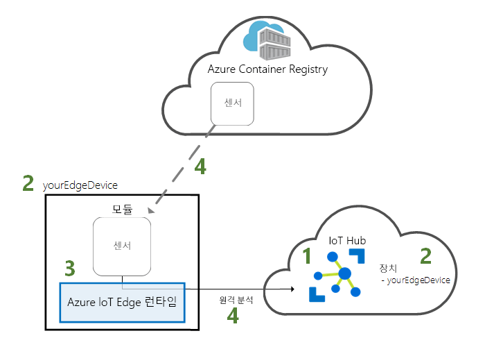
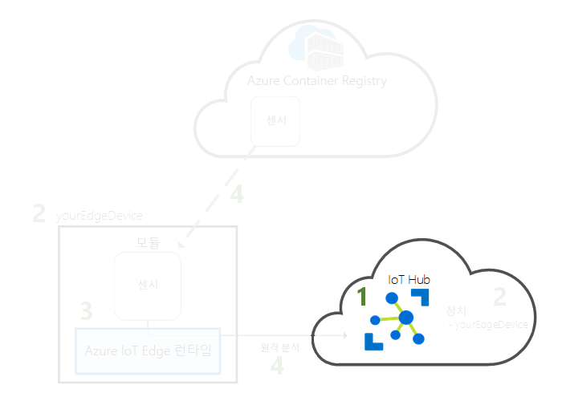
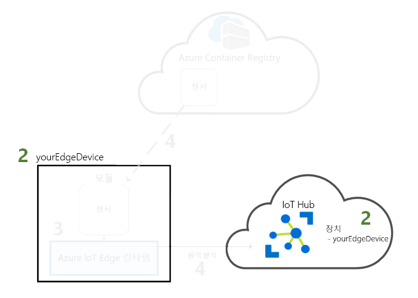
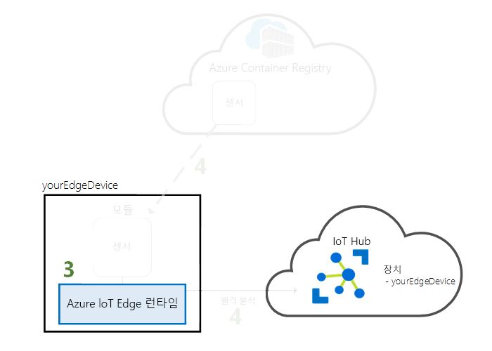
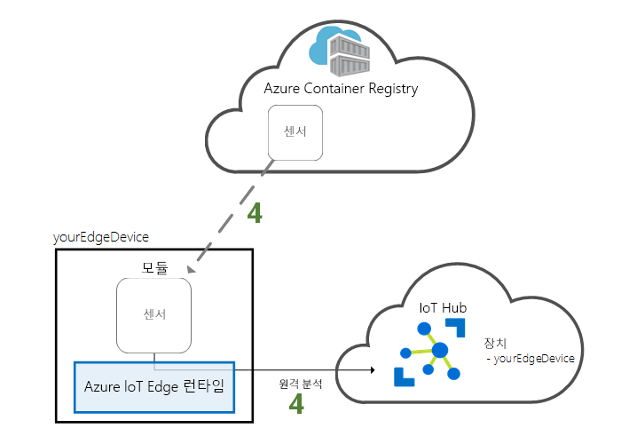

# <a name="quickstart-deploy-your-first-iot-edge-module-from-the-azure-portal-to-a-windows-device"></a>빠른 시작: Azure Portal에서 Windows 디바이스로 첫 번째 IoT Edge 모듈 배포

이 빠른 시작에서는 Azure IoT Edge 클라우드 인터페이스를 사용하여 사전 빌드된 코드를 IoT Edge 디바이스에 원격으로 배포합니다. 이 작업을 수행하려면 먼저 IoT Edge 디바이스로 작동할 Windows 가상 머신을 만들고 구성한 다음, 이 머신에 모듈을 배포할 수 있습니다.

이 빠른 시작에서 다음을 수행하는 방법을 알아봅니다.

1. IoT Hub를 만듭니다.
2. IoT Edge 장치를 IoT Hub에 등록합니다.
3. 디바이스에 IoT Edge 런타임을 설치하고 시작합니다.
4. 원격으로 모듈을 IoT Edge 디바이스에 배포하고 IoT Hub에 원격 분석을 전송합니다.



이 빠른 시작에서 배포하는 모듈은 온도, 습도 및 압력 데이터를 생성하는 시뮬레이션된 센서입니다. 다른 Azure IoT Edge 자습서에서는 비즈니스 정보를 위해 시뮬레이션된 데이터를 분석하는 모듈을 배포하는 과정을 설명하므로 여기에서 수행하는 작업을 토대로 진행됩니다.

활성 Azure 구독이 아직 없는 경우 시작하기 전에 [체험 계정](https://azure.microsoft.com/free)을 만드세요.

[!INCLUDE [cloud-shell-try-it.md](../../includes/cloud-shell-try-it.md)]

이 빠른 시작에서는 Azure CLI를 사용하여 많은 단계를 수행하고, Azure IoT에는 추가 기능을 사용할 수 있게 하는 확장이 있습니다.

Azure IoT 확장을 Cloud Shell 인스턴스에 추가합니다.

   ```azurecli-interactive
   az extension add --name azure-cli-iot-ext
   ```

## <a name="prerequisites"></a>필수 조건

클라우드 리소스:

* 이 빠른 시작에서 사용하는 모든 리소스를 관리하는 리소스 그룹입니다.

   ```azurecli-interactive
   az group create --name IoTEdgeResources --location westus2
   ```

IoT Edge 디바이스:

* IoT Edge 디바이스로 작동하는 Windows 가상 머신입니다. 다음 명령을 사용하여 이 가상 머신을 만들 수 있습니다. 여기서 *{password}* 를 보안 암호로 바꿉니다.

  ```azurecli-interactive
  az vm create --resource-group IoTEdgeResources --name EdgeVM --image MicrosoftWindowsDesktop:Windows-10:rs5-pro:latest --admin-username azureuser --admin-password {password} --size Standard_DS1_v2
  ```

  새 가상 머신을 만들고 시작하는 데 몇 분 정도 걸릴 수 있습니다. 그런 다음, 가상 머신에 연결할 때 사용할 RDP 파일을 다운로드할 수 있습니다.

  1. Azure Portal에서 새 Windows 가상 머신으로 이동합니다.
  1. **연결**을 선택합니다.
  1. **RDP** 탭에서 **RDP 파일 다운로드**를 선택합니다.

  원격 데스크톱 연결을 통해 이 파일을 열어 `az vm create` 명령으로 지정한 관리자 이름과 암호를 사용하여 Windows 가상 머신에 연결합니다.


> [!NOTE]
> 이 빠른 시작에서는 간단하게 하기 위해 Windows 데스크톱 가상 머신을 사용합니다. 일반적으로 프로덕션 시나리오에 사용할 수 있는 Windows 운영 체제에 대한 정보는 [Azure IoT Edge 지원 시스템](support.md)을 참조하세요.

## <a name="create-an-iot-hub"></a>IoT Hub 만들기

Azure CLI를 사용하여 IoT Hub를 만들어서 빠른 시작을 시작합니다.



이 빠른 시작에는 무료 수준의 IoT Hub가 작동합니다. 이전에 IoT Hub를 사용했고 이미 만든 체험 허브가 있으면 해당 IoT 허브를 사용할 수 있습니다. 구독마다 하나의 무료 IoT Hub만 가질 수 있습니다.

다음 코드는 **IoTEdgeResources** 리소스 그룹에서 무료 **F1** 허브를 만듭니다. *{hub_name}* 을 IoT 허브의 고유한 이름으로 바꿉니다.

   ```azurecli-interactive
   az iot hub create --resource-group IoTEdgeResources --name {hub_name} --sku F1
   ```

   구독에 이미 한 개의 무료 허브가 있기 때문에 오류가 발생하는 경우 SKU를 **S1**으로 변경합니다. IoT Hub 이름을 사용할 수 없다는 오류가 발생할 경우 다른 사용자에게 해당 이름의 허브가 이미 있는 것입니다. 새 이름을 사용해 보세요.

## <a name="register-an-iot-edge-device"></a>IoT Edge 디바이스 등록

새로 만든 IoT Hub에 IoT Edge 디바이스를 등록합니다.


IoT Hub와 통신할 수 있도록, 시뮬레이션된 디바이스의 디바이스 ID를 만듭니다. 장치 ID는 클라우드에 있으며, 사용자는 고유한 장치 연결 문자열을 사용하여 물리적 장치를 장치 ID에 연결합니다.

IoT Edge 디바이스는 일반적인 IoT 디바이스와 다르게 작동하며 다른 방식으로 관리될 수 있으므로, `--edge-enabled` 플래그를 사용하여 이 ID를 IoT Edge 디바이스로 선언합니다.

1. Azure Cloud Shell에서 다음 명령을 입력하여 **myEdgeDevice**라는 장치를 허브에 만듭니다.

   ```azurecli-interactive
   az iot hub device-identity create --device-id myEdgeDevice --hub-name {hub_name} --edge-enabled
   ```

   iothubowner 정책 키에 대한 오류가 표시될 경우 Cloud Shell에서 최신 버전의 azure-cli-iot-ext 확장이 실행 중인지 확인합니다.

2. IoT Hub에서 물리적 디바이스를 해당 ID에 연결하는 디바이스에 대한 연결 문자열을 검색합니다.

   ```azurecli-interactive
   az iot hub device-identity show-connection-string --device-id myEdgeDevice --hub-name {hub_name}
   ```

3. JSON 출력에서 `connectionString` 키를 복사하여 저장합니다. 이 값은 디바이스 연결 문자열입니다. 다음 섹션에서 이 연결 문자열을 사용하여 IoT Edge 런타임을 구성할 것입니다.

   

## <a name="install-and-start-the-iot-edge-runtime"></a>IoT Edge 런타임 설치 및 시작

IoT Edge 디바이스에 Azure IoT Edge 런타임을 설치하고 디바이스 연결 문자열을 사용하여 구성합니다.


IoT Edge 런타임은 모든 IoT Edge 디바이스에 배포되며, 세 가지 구성 요소가 있습니다. **IoT Edge 보안 디먼**은 IoT Edge 디바이스가 부팅되고 IoT Edge 에이전트를 시작하여 디바이스를 부트스트랩할 때마다 시작됩니다. **IoT Edge 에이전트**는 IoT Edge 허브를 포함하여 IoT Edge 디바이스에 모듈을 배포하고 모니터링하는 작업을 관리합니다. **IoT Edge 허브**는 IoT Edge 디바이스의 모듈 간 통신, 그리고 디바이스와 IoT Hub 간의 통신을 처리합니다.

설치 스크립트에는 IoT Edge 디바이스의 컨테이너 이미지를 관리하는 Moby라는 컨테이너 엔진도 포함됩니다.

런타임을 설치하는 동안 디바이스 연결 문자열을 요청하라는 메시지가 나타납니다. Azure CLI에서 검색한 문자열을 사용합니다. 이 문자열은 물리적 디바이스를 Azure의 IoT Edge 디바이스 ID에 연결합니다.

### <a name="connect-to-your-iot-edge-device"></a>IoT Edge 디바이스에 연결

이 섹션의 모든 단계는 IoT Edge 디바이스에서 수행되므로 이제 원격 데스크톱을 통해 해당 가상 머신에 연결하려고 합니다.

### <a name="install-and-configure-the-iot-edge-service"></a>IoT Edge 서비스 설치 및 구성

PowerShell을 사용하여 IoT Edge 런타임을 다운로드하여 설치합니다. IoT Hub에서 검색한 디바이스 연결 문자열을 사용하여 디바이스를 구성합니다.

1. 아직 없는 경우 [새 Azure IoT Edge 디바이스 등록](how-to-register-device-portal.md)의 단계를 따라 디바이스를 등록하고 디바이스 연결 문자열을 검색합니다. 

2. PowerShell을 관리자 권한으로 실행합니다.

   >[!NOTE]
   >PowerShell(x86)이 아닌 IoT Edge를 설치하려면 PowerShell의 AMD64 세션을 사용합니다. 사용 중인 세션 형식을 잘 모르는 경우 다음 명령을 실행합니다.
   >
   >```powershell
   >(Get-Process -Id $PID).StartInfo.EnvironmentVariables["PROCESSOR_ARCHITECTURE"]
   >```

3. **Deploy-IoTEdge** 명령은 사용자의 Windows 머신이 지원되는 버전인지 확인하고, 컨테이너 기능을 작동하도록 켜고, moby 런타임을 다운로드한 다음, IoT Edge 런타임을 다운로드합니다.

   ```powershell
   . {Invoke-WebRequest -useb aka.ms/iotedge-win} | Invoke-Expression; `
   Deploy-IoTEdge -ContainerOs Windows
   ```

4. 사용자의 머신은 자동으로 다시 시작될 수도 있습니다. Deploy-IoTEdge 명령에서 다시 부팅한다는 메시지가 표시되면 바로 수행합니다. 

5. PowerShell을 관리자 권한으로 다시 실행합니다.

6. **Initialize IoTEdge** 명령은 사용자의 머신에서 IoT Edge 런타임을 구성합니다. 이 명령은 Windows 컨테이너를 통한 수동 프로비저닝으로 기본 설정됩니다. 

   ```powershell
   . {Invoke-WebRequest -useb aka.ms/iotedge-win} | Invoke-Expression; `
   Initialize-IoTEdge -ContainerOs Windows
   ```

7. **DeviceConnectionString**을 요청하는 메시지가 표시되면 이전 섹션에서 복사한 문자열을 입력합니다. 연결 문자열 옆에 따옴표를 포함하지 마세요.

### <a name="view-the-iot-edge-runtime-status"></a>IoT Edge 런타임 상태 보기

런타임이 성공적으로 설치 및 구성되었는지 확인합니다.

1. IoT Edge 서비스의 상태를 확인합니다.

   ```powershell
   Get-Service iotedge
   ```

2. 서비스 문제를 해결해야 할 경우 서비스 로그를 검색합니다.

   ```powershell
   . {Invoke-WebRequest -useb aka.ms/iotedge-win} | Invoke-Expression; Get-IoTEdgeLog
   ```

3. IoT Edge 디바이스에서 실행되는 모든 모듈을 봅니다. 서비스를 처음 시작했으므로 **edgeAgent** 모듈이 실행되는 것을 확인해야 합니다. edgeAgent 모듈은 기본적으로 실행되며, 디바이스에 배포하는 추가 모듈을 설치하고 시작하는 데 도움이 됩니다.

   ```powershell
   iotedge list
   ```

   

설치가 완료되고 IoT Edge 에이전트 모듈이 시작될 때까지 몇 분이 걸릴 수 있습니다.

IoT Edge 디바이스가 구성되었습니다. 클라우드 배포 모듈을 실행할 준비가 완료된 것입니다.

## <a name="deploy-a-module"></a>모듈 배포

클라우드에서 Azure IoT Edge 디바이스를 관리하여 원격 분석 데이터를 IoT Hub로 보내는 모듈을 배포합니다.


[!INCLUDE [iot-edge-deploy-module](../../includes/iot-edge-deploy-module.md)]

## <a name="view-generated-data"></a>생성된 데이터 보기

이 빠른 시작에서는 새 IoT Edge 디바이스를 등록하고 IoT Edge 런타임을 설치했습니다. 그런 다음, 디바이스 자체를 변경하지 않고도 디바이스에서 실행할 수 있도록 Azure Portal을 사용하여 IoT Edge 모듈을 배포했습니다.

이 예에서 푸시한 모듈은 테스트에 사용할 수 있는 샘플 데이터를 만듭니다. 시뮬레이션된 온도 센서 모듈은 나중에 테스트에 사용할 수 있는 환경 데이터를 생성합니다. 시뮬레이션된 센서는 머신과 머신 주변의 환경을 모니터링합니다. 예를 들어 이 센서가 서버실, 공장 또는 풍력 터빈에 장착될 수 있습니다. 메시지에는 주변 온도 및 습도, 머신 온도 및 압력, 타임스탬프가 포함됩니다. IoT Edge 자습서는 이 모듈에서 만든 데이터를 분석용 테스트 데이터로 사용합니다.

클라우드에서 배포된 모듈을 IoT Edge 디바이스에서 실행 중인지 확인합니다.

```powershell
iotedge list
```

   

온도 센서 모듈에서 클라우드로 전송되는 메시지를 봅니다.

```powershell
iotedge logs SimulatedTemperatureSensor -f
```

   >[!TIP]
   >IoT Edge 명령은 모듈 이름을 참조하는 경우 대/소문자를 구분합니다.

   

[Visual Studio Code용 Azure IoT Hub Toolkit 확장](https://marketplace.visualstudio.com/items?itemName=vsciot-vscode.azure-iot-toolkit)(이전의 Azure IoT Toolkit 확장)을 사용하여 IoT 허브에 메시지가 도착하는 것을 확인할 수도 있습니다.

## <a name="clean-up-resources"></a>리소스 정리

IoT Edge 자습서로 계속 진행하려면 이 빠른 시작에서 등록하고 설정한 디바이스를 사용할 수 있습니다. 그렇지 않으면 요금이 발생하지 않도록 Azure 리소스를 삭제할 수 있습니다.

새 리소스 그룹에서 가상 머신 및 IoT 허브를 만든 경우 해당 그룹 및 모든 관련 리소스를 삭제할 수 있습니다. 리소스 그룹의 콘텐츠를 한 번 더 확인하여 유지할 내용이 없는지 검토합니다. 전체 그룹을 삭제하지는 않으려는 경우 대신, 개별 리소스를 삭제할 수 있습니다.

**IoTEdgeResources** 그룹을 제거합니다.

```azurecli-interactive
az group delete --name IoTEdgeResources
```

## <a name="next-steps"></a>다음 단계

이 빠른 시작에서는 새 IoT Edge 디바이스를 만들고 Azure IoT Edge 클라우드 인터페이스를 사용하여 디바이스에 코드를 배포했습니다. 이제 해당 환경에 대한 원시 데이터를 생성하는 테스트 디바이스가 준비되었습니다.

다음 단계는 비즈니스 논리를 실행하는 IoT Edge를 만들기 시작할 수 있도록 로컬 개발 환경을 설정하는 것입니다. 

> [!div class="nextstepaction"]
> [Windows 디바이스를 위한 IoT Edge 모듈 개발 시작](tutorial-develop-for-windows.md)
