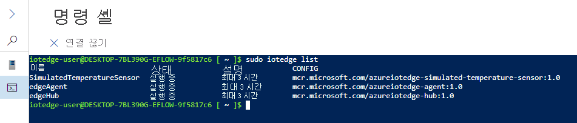

# <a name="quickstart-deploy-your-first-iot-edge-module-to-a-windows-device"></a>빠른 시작: Windows 디바이스에 첫 번째 IoT Edge 모듈 배포

[!INCLUDE [iot-edge-version-201806](../../includes/iot-edge-version-201806.md)]

컨테이너화된 코드를 Windows IoT Edge 디바이스의 Linux에 배포하여 이 빠른 시작에서 Azure IoT Edge를 사용해보세요. IoT Edge를 사용하면 디바이스에서 코드를 원격으로 관리하여 더 많은 워크로드를 에지로 전송할 수 있습니다. 이 빠른 시작에서는 자체 디바이스를 사용하여 Windows의 Linux용 Azure IoT Edge를 사용하는 것이 얼마나 쉬운지 확인할 것을 권장합니다.

이 빠른 시작에서 다음을 수행하는 방법을 알아봅니다.

* IoT Hub를 만듭니다.
* IoT Edge 디바이스를 IoT Hub에 등록합니다.
* 디바이스에 Windows의 Linux용 IoT Edge 런타임을 설치하고 시작합니다.
* 원격으로 모듈을 IoT Edge 디바이스에 배포하고 원격 분석을 전송합니다.


이 빠른 시작에서는 Windows 디바이스에서 Linux용 Azure IoT Edge를 설정하는 방법에 대해 설명합니다. 그런 다음, Azure Portal에서 디바이스로 모듈을 배포합니다. 여기서 사용하는 모듈은 온도, 습도 및 압력 데이터를 생성하는 시뮬레이션된 센서입니다. 다른 Azure IoT Edge 자습서는 비즈니스 인사이트를 획득하기 위해 시뮬레이션된 데이터를 분석하는 모듈을 배포하는 과정을 설명하므로 여기서 수행하는 작업을 토대로 진행됩니다.

활성 Azure 구독이 아직 없는 경우 시작하기 전에 [체험 계정](https://azure.microsoft.com/free)을 만드세요.

## <a name="prerequisites"></a>사전 요구 사항

Azure CLI에 대한 환경을 준비합니다.

[!INCLUDE [azure-cli-prepare-your-environment-no-header.md](../../includes/azure-cli-prepare-your-environment-no-header.md)]

이 빠른 시작에서 사용할 모든 리소스를 관리하는 클라우드 리소스 그룹을 만듭니다.

   ```azurecli-interactive
   az group create --name IoTEdgeResources --location westus2
   ```

IoT Edge 디바이스가 다음 요구 사항을 충족하는지 확인합니다.

* 버전
  * Windows 10 버전 1809 이상; 17763 이상 빌드
    * Professional, Enterprise, IoT Enterprise
  * Windows Server 2019 빌드 17763 이상

* 하드웨어 요구 사항
  * 사용 가능한 최소 메모리: 1GB
  * 사용 가능한 최소 디스크 공간: 10GB

>[!NOTE]
>이 빠른 시작에서는 PowerShell을 사용하여 Windows에서 Linux용 IoT Edge 배포판을 만듭니다. Windows Admin Center를 사용할 수도 있습니다. Windows Admin Center를 사용하여 배포판을 만들려면 [Windows 디바이스에 Linux용 Azure IoT Edge 설치 및 프로비저닝](how-to-install-iot-edge-on-windows.md?tabs=windowsadmincenter)하는 방법 가이드의 단계를 따르세요.

## <a name="create-an-iot-hub"></a>IoT Hub 만들기

먼저 Azure CLI를 사용하여 IoT 허브를 만듭니다.


이 빠른 시작에서는 무료 Azure IoT Hub가 작동합니다. 이전에 IoT Hub를 사용했고 이미 만든 허브가 있으면 해당 IoT 허브를 사용할 수 있습니다.

다음 코드는 리소스 그룹 `IoTEdgeResources`에 체험 **F1** 허브를 만듭니다. `{hub_name}`을 IoT 허브의 고유한 이름으로 바꿉니다. IoT Hub를 만드는 데 몇 분 정도 걸릴 수 있습니다.

```azurecli-interactive
az iot hub create --resource-group IoTEdgeResources --name {hub_name} --sku F1 --partition-count 2
```

구독에 이미 한 개의 무료 허브가 있기 때문에 오류가 발생하는 경우 SKU를 `S1`으로 변경합니다. IoT 허브 이름을 사용할 수 없다는 오류가 발생할 경우 다른 사용자에게 해당 이름의 허브가 이미 있는 것입니다. 새 이름을 사용해 보세요.

## <a name="register-an-iot-edge-device"></a>IoT Edge 디바이스 등록

새로 만든 IoT Hub에 IoT Edge 디바이스를 등록합니다.


IoT Hub와 통신할 수 있도록, 시뮬레이트된 디바이스의 디바이스 ID를 만듭니다. 디바이스 ID는 클라우드에 있으며, 사용자는 고유한 디바이스 연결 문자열을 사용하여 물리적 디바이스를 디바이스 ID에 연결합니다.

IoT Edge 디바이스는 일반적인 IoT 디바이스와 다르게 작동하며 다른 방법으로 관리할 수 있습니다. `--edge-enabled` 플래그를 사용하여 이 ID를 IoT Edge 디바이스용으로 선언합니다.

1. Azure Cloud Shell에서 다음 명령을 입력하여 **myEdgeDevice** 라는 디바이스를 허브에 만듭니다.

     ```azurecli-interactive
     az iot hub device-identity create --device-id myEdgeDevice --edge-enabled --hub-name {hub_name}
     ```

     `iothubowner` 정책 키에 대한 오류가 발생할 경우 Cloud Shell에서 최신 버전의 Azure IoT 확장이 실행 중인지 확인합니다.

1. IoT Hub에서 물리적 디바이스를 해당 ID에 연결하는 디바이스의 연결 문자열을 확인합니다. 연결 문자열에는 IoT 허브 이름, 디바이스 이름 및 둘 간의 연결을 인증하는 공유 키가 포함됩니다.

     ```azurecli-interactive
     az iot hub device-identity connection-string show --device-id myEdgeDevice --hub-name {hub_name}
     ```

1. JSON 출력에서 `connectionString` 키를 복사하여 저장합니다. 이 값은 디바이스 연결 문자열입니다. 다음 섹션에서 이 값을 사용하여 IoT Edge 런타임을 구성할 것입니다.

     

## <a name="install-and-start-the-iot-edge-runtime"></a>IoT Edge 런타임 설치 및 시작

디바이스에 Windows의 Linux용 IoT Edge를 설치하고 디바이스 연결 문자열로 디바이스를 구성합니다.


Windows에서 Linux용 Azure IoT Edge를 배포하려는 대상 디바이스에서 다음 PowerShell 명령을 실행합니다. PowerShell을 사용하여 원격 대상 디바이스에 배포하려면 [Remote PowerShell](/powershell/module/microsoft.powershell.core/about/about_remote)을 사용하여 원격 디바이스에 대한 연결을 설정하고 해당 디바이스에서 이러한 명령을 원격으로 실행합니다.

1. 관리자 권한 PowerShell 세션에서 다음 명령을 각각 실행하여 IoT Edge for Linux on Windows를 다운로드합니다.

   ```powershell
   $msiPath = $([io.Path]::Combine($env:TEMP, 'AzureIoTEdge.msi'))
   $ProgressPreference = 'SilentlyContinue'
   Invoke-WebRequest "https://aka.ms/AzEflowMSI" -OutFile $msiPath
   ```

1. IoT Edge for Linux on Windows를 디바이스에 설치합니다.

   ```powershell
   Start-Process -Wait msiexec -ArgumentList "/i","$([io.Path]::Combine($env:TEMP, 'AzureIoTEdge.msi'))","/qn"
   ```

1. 대상 디바이스의 실행 정책이 아직 설정되지 않은 경우 `AllSigned`로 설정합니다. 다음을 사용하여 관리자 권한 PowerShell 프롬프트에서 현재 실행 정책을 확인할 수 있습니다.

   ```powershell
   Get-ExecutionPolicy -List
   ```

   `local machine`의 실행 정책이 `AllSigned`가 아닌 경우 다음을 사용하여 실행 정책을 설정할 수 있습니다.

   ```powershell
   Set-ExecutionPolicy -ExecutionPolicy AllSigned -Force
   ```

1. IoT Edge for Linux on Windows 배포를 만듭니다.

   ```powershell
   Deploy-Eflow
   ```

1. 'Y'를 입력하여 사용 조건에 동의합니다.

1. 기본 설정에 따라 'O' 또는 'R'을 입력하여 **선택적 진단 데이터** 를 설정하거나 해제합니다. 성공적인 배포는 다음과 같습니다.

   

1. 이전 섹션에서 검색한 디바이스 연결 문자열을 사용하여 디바이스를 프로비전합니다. 자리 표시자 텍스트를 고유한 값으로 바꿉니다.

   ```powershell
   Provision-EflowVm -provisioningType ManualConnectionString -devConnString "<CONNECTION_STRING_HERE>"
   ```

IoT Edge 디바이스가 구성되었습니다. 클라우드 배포 모듈을 실행할 준비가 완료된 것입니다.

## <a name="deploy-a-module"></a>모듈 배포

클라우드에서 Azure IoT Edge 디바이스를 관리하여 원격 분석 데이터를 IoT Hub로 보내는 모듈을 배포합니다.


<!--
[!INCLUDE [iot-edge-deploy-module](../../includes/iot-edge-deploy-module.md)]

Include content included below to support versioned steps in Linux quickstart. Can update include file once Windows quickstart supports v1.2
-->

Azure IoT Edge의 주요 기능 중 하나는 클라우드의 IoT Edge 디바이스에 코드를 배포하는 것입니다. *IoT Edge 모듈* 은 컨테이너로 구현된 실행 패키지입니다. 이 섹션에서는 Azure IoT Hub에서 직접 [Azure Marketplace의 IoT Edge 모듈 섹션](https://azuremarketplace.microsoft.com/marketplace/apps/category/internet-of-things?page=1&subcategories=iot-edge-modules)에서 미리 빌드된 모듈을 배포합니다.

이 섹션에서 배포하는 모듈은 센서를 시뮬레이션하고 생성된 데이터를 보냅니다. 이 모듈은 시뮬레이션된 데이터를 개발 및 테스트에 사용할 수 있으므로 IoT Edge를 시작할 때 유용한 코드 조각입니다. [시뮬레이션된 온도 센서 소스 코드](https://github.com/Azure/iotedge/blob/027a509549a248647ed41ca7fe1dc508771c8123/edge-modules/SimulatedTemperatureSensor/src/Program.cs)를 보면 이 모듈이 하는 일을 정확하게 이해할 수 있습니다.

Azure Marketplace에서 첫 번째 모듈을 배포하려면 다음 단계를 수행합니다.

1. [Azure Portal](https://portal.azure.com)에 로그인하고 IoT 허브로 이동합니다.

1. 왼쪽에 있는 메뉴의 **자동 디바이스 관리** 에서 **IoT Edge** 를 선택합니다.

1. 디바이스 목록에서 대상 디바이스의 디바이스 ID를 선택합니다.

1. 위쪽 막대에서 **모듈 설정** 을 선택합니다.

   

1. **IoT Edge 모듈** 에서 **추가** 드롭다운 메뉴를 연 다음, **Marketplace 모듈** 을 선택합니다.

   

1. **IoT Edge Module Marketplace** 에서 `Simulated Temperature Sensor` 모듈을 검색하여 선택합니다.

   모듈이 원하는 **실행 중** 상태인 IoT Edge 모듈 섹션에 추가됩니다.

1. 완료되면 **다음: 경로** 를 선택하여 마법사의 다음 단계를 계속 진행합니다.

   

1. **경로** 탭에서 **route** 라는 기본 경로를 제거한 다음, **다음: 검토 + 만들기** 를 선택하여 마법사의 다음 단계를 계속 진행합니다.

   >[!Note]
   >경로는 이름 및 값 쌍을 사용하여 생성됩니다. 이 페이지에는 두 개의 경로가 표시되어야 합니다. **route** 라는 기본 경로는 모든 메시지를 IoT Hub(`$upstream`이라고 함)로 보냅니다. Azure Marketplace에서 모듈을 추가하면 **SimulatedTemperatureSensorToIoTHub** 라는 두 번째 경로가 자동으로 만들어집니다. 이 경로는 시뮬레이션된 온도 모듈의 모든 메시지를 IoT Hub로 보냅니다. 이 경우 중복되기 때문에 기본 경로를 삭제할 수 있습니다.

   

1. JSON 파일을 검토한 다음, **만들기** 를 선택합니다. JSON 파일은 IoT Edge 디바이스에 배포하는 모든 모듈을 정의합니다. **SimulatedTemperatureSensor** 모듈은 물론 **edgeAgent** 와 **edgeHub** 라는 런타임 모듈 두 개가 표시됩니다.

   >[!Note]
   >IoT Edge 디바이스에 새 배포를 제출할 때는 디바이스에 아무것도 푸시되지 않습니다. 대신 디바이스가 IoT Hub에 새로운 지침이 있는지를 정기적으로 쿼리합니다. 디바이스는 업데이트된 배포 매니페스트를 찾으면 새 배포에 대한 정보를 사용하여 클라우드에서 모듈 이미지를 끌어온 다음, 모듈을 로컬로 실행하기 시작합니다. 이 프로세스는 몇 분 정도 걸릴 수 있습니다.

1. 모듈 배포 세부 정보를 만들면 마법사는 디바이스 세부 정보 페이지로 돌아갑니다. **모듈** 탭에서 배포 상태를 확인합니다.

   세 가지 모듈 즉, **$edgeAgent**, **$edgeHub** 및 **SimulatedTemperatureSensor** 가 나열됩니다. 하나 이상의 모듈에서 **디바이스에서 보고됨** 이 아닌 **배포에 지정됨** 이 **예** 인 경우, 사용자의 IoT Edge 디바이스는 계속 시작되고 있습니다. 몇 분 기다렸다가 페이지를 새로 고칩니다.

   

## <a name="view-the-generated-data"></a>생성된 데이터 보기

이 빠른 시작에서는 새 IoT Edge 디바이스를 만들고 여기에 IoT Edge 런타임을 설치했습니다. 그런 다음, 디바이스 자체를 변경하지 않고도 디바이스에서 실행할 수 있도록 Azure Portal을 사용하여 IoT Edge 모듈을 배포했습니다.

여기서 푸시한 모듈은 나중에 테스트에 사용할 수 있는 샘플 환경 데이터를 생성합니다. 시뮬레이션된 센서는 머신과 머신 주변의 환경을 모니터링합니다. 예를 들어 이 센서가 서버실, 공장 또는 풍력 터빈에 장착될 수 있습니다. 센서에서 보내는 메시지에는 주변 온도 및 습도, 머신 온도 및 압력, 타임스탬프가 포함됩니다. IoT Edge 자습서는 이 모듈에서 만든 데이터를 분석용 테스트 데이터로 사용합니다.

1. PowerShell 세션에서 다음 명령을 사용하여 IoT Edge for Linux on Windows 가상 머신에 로그인합니다.

   ```powershell
   Connect-EflowVm
   ```

   >[!NOTE]
   >SSH를 가상 머신에 허용하는 유일한 계정은 가상 머신을 만든 사용자입니다.

1. 로그인하면 다음 Linux 명령을 사용하여 실행되는 IoT Edge 모듈의 목록을 확인할 수 있습니다.

   ```bash
   sudo iotedge list
   ```

   

1. 다음 Linux 명령을 사용하여 온도 센서 모듈에서 클라우드로 전송되는 메시지를 봅니다.

   ```bash
   sudo iotedge logs SimulatedTemperatureSensor -f
   ```

   >[!IMPORTANT]
   >IoT Edge 명령은 모듈 이름을 참조할 때 대/소문자를 구분합니다.

   

[Visual Studio Code용 Azure IoT Hub 확장](https://marketplace.visualstudio.com/items?itemName=vsciot-vscode.azure-iot-toolkit)을 사용하여 메시지가 IoT 허브에 도착하는 것을 확인할 수도 있습니다.

## <a name="clean-up-resources"></a>리소스 정리

IoT Edge 자습서를 계속 진행하려는 경우에는 이 단계를 건너뜁니다. 이 빠른 시작에서 등록하고 설정한 디바이스를 계속 사용할 수 있습니다. 그렇지 않으면 요금이 발생하지 않도록 Azure 리소스를 삭제할 수 있습니다.

새 리소스 그룹에서 가상 머신 및 IoT 허브를 만든 경우 해당 그룹 및 모든 관련 리소스를 삭제할 수 있습니다. 전체 그룹을 삭제하지는 않으려는 경우 대신, 개별 리소스를 삭제할 수 있습니다.

> [!IMPORTANT]
> 리소스 그룹의 콘텐츠를 확인하여 유지할 내용이 없는지 검토합니다. 리소스 그룹을 삭제하면 다시 되돌릴 수 없습니다.

다음 명령을 사용하여 **IoTEdgeResources** 그룹을 제거합니다. 삭제하는 데 몇 분 정도 걸릴 수 있습니다.

```azurecli-interactive
az group delete --name IoTEdgeResources
```

이 명령으로 리소스 그룹 목록을 보면 리소스 그룹이 제거되었는지 확인할 수 있습니다.

```azurecli-interactive
az group list
```

### <a name="remove-azure-iot-edge-for-linux-on-windows"></a>Windows의 Linux용 Azure IoT Edge 제거

Windows Admin Center의 대시보드 확장을 사용하여 Windows의 Linux용 Azure IoT Edge를 제거할 수 있습니다.

1. Windows Admin Center에서 IoT Edge 디바이스에 연결합니다. Azure 대시보드 도구 확장이 로드됩니다.

1. **제거** 를 선택합니다. Azure IoT Edge가 제거되면 Windows Admin Center는 **시작** 페이지에서 Azure IoT Edge 디바이스 연결 항목을 제거합니다.

>[!Note]
>Windows 시스템에서 Azure IoT Edge를 제거하는 또 다른 방법은 IoT Edge 디바이스에서 **시작** > **설정** > **앱** > **Azure IoT Edge LTS** > **제거** 를 선택하는 것입니다. 이 방법은 IoT Edge 디바이스에서 Azure IoT Edge를 제거하지만, Windows Admin Center에서는 연결이 유지됩니다. 제거를 완료하려면 **설정** 메뉴에서도 Windows Admin Center를 제거합니다.

## <a name="next-steps"></a>다음 단계

이 빠른 시작에서는 새 IoT Edge 디바이스를 만들고 Azure IoT Edge 클라우드 인터페이스를 사용하여 디바이스에 코드를 배포했습니다. 이제 해당 환경에 대한 원시 데이터를 생성하는 테스트 디바이스가 준비되었습니다.

다음으로 비즈니스 논리를 실행하는 IoT Edge를 만들기 시작할 수 있도록 로컬 개발 환경을 설정하세요.

> [!div class="nextstepaction"]
> [IoT Edge 모듈 개발 시작](tutorial-develop-for-linux.md)
