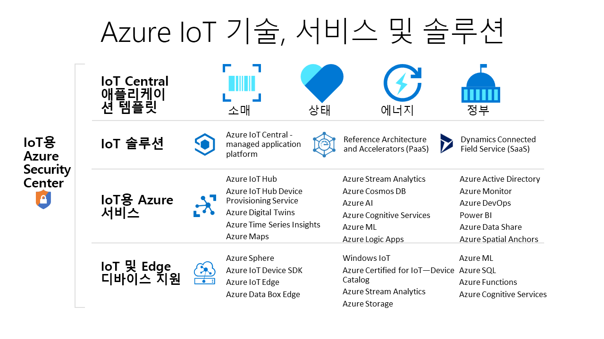

# IoT 솔루션을 만드는 데 사용할 수 있는 Azure 기술 및 서비스는 무엇인가요?

Azure IoT 기술 및 서비스는 조직의 디지털 변환을 가능하게 하는 다양한 IoT 솔루션을 만들 수 있는 옵션을 제공합니다. 예를 들어, 다음을 수행할 수 있습니다.

- 관리형 IoT 애플리케이션 플랫폼인 [Azure IoT Central](https://apps.azureiotcentral.com)을 사용하여 안전한 엔터프라이즈급 IoT 솔루션을 빌드하여 배포합니다. IoT Central은 솔루션 개발 프로세스를 가속화하기 위한 소매, 의료 등의 산업별 애플리케이션 템플릿 컬렉션을 갖추고 있습니다.
- Azure IoT [솔루션 가속기](https://www.azureiotsolutions.com)의 오픈 소스 코드 베이스를 확장하여 원격 모니터링 또는 예측 유지 관리 같은 일반적인 IoT 시나리오를 구현합니다.
- [Azure IoT Hub](../iot-hub/about-iot-hub.md) 및 [Azure IoT 디바이스 SDK](../iot-hub/iot-hub-devguide-sdks.md) 같은 Azure IoT 플랫폼 서비스를 사용하여 사용자 지정 IoT 솔루션을 처음부터 빌드합니다.

## Azure IoT Central

[IoT Central 애플리케이션 플랫폼](https://apps.azureiotcentral.com)은 엔터프라이즈급 IoT 솔루션의 개발, 관리 및 유지 관리 부담과 비용을 줄입니다. IoT Central의 사용자 지정 가능한 웹 UI를 통해 디바이스 상태를 모니터링하고, 규칙을 만들고, 전체 수명 주기 동안 수백만 대의 디바이스와 해당 데이터를 관리할 수 있습니다. IoT Central 내의 API 화면은 IoT 솔루션을 구성하고 상호 작용할 수 있는 프로그래밍 방식 액세스를 제공합니다.

Azure IoT Central은 사용자 지정 IoT 솔루션을 만드는 데 사용할 수 있는 완전 관리형 애플리케이션 플랫폼입니다. IoT Central은 애플리케이션 템플릿을 사용하여 솔루션을 만듭니다. 일반 솔루션용 템플릿과 에너지, 의료, 정부, 소매 등의 특정 산업용 템플릿이 있습니다. IoT Central 애플리케이션 템플릿을 사용하면 몇 분 내에 IoT Central 애플리케이션을 배포한 다음, 테마, 대시보드 및 보기를 사용자 지정할 수 있습니다.

[IoT용 Azure Certified 디바이스 카탈로그](https://catalog.azureiotsolutions.com)에서 디바이스를 선택하여 솔루션에 신속하게 연결할 수 있습니다. IoT Central 웹 UI를 사용하여 디바이스를 모니터링하고 관리하여 정상적이고 연결된 상태로 유지할 수 있습니다. 커넥터 및 API를 사용하여 IoT Central 애플리케이션을 다른 비즈니스 애플리케이션과 통합할 수 있습니다.

완전 관리형 애플리케이션 플랫폼인 IoT Central의 가격 책정 모델은 간단하고 예측 가능합니다.

## Azure IoT 솔루션 가속기

[Azure IoT 솔루션 가속기](https://www.azureiotsolutions.com)는 사용자 지정 가능한 엔터프라이즈급 솔루션의 컬렉션입니다. 이러한 솔루션은 있는 그대로 배포해도 되고, 오픈 소스 Java 또는 .NET 소스 코드를 사용하여 사용자 지정 IoT 솔루션을 개발할 수도 있습니다.

Azure IoT 솔루션 가속기는 IoT 솔루션을 보다 철저하게 제어할 수 있습니다. 솔루션 가속기에는 몇 분 내에 Azure 구독에 배포할 수 있는 일반적인 IoT 시나리오에 대한 미리 작성된 솔루션이 포함되어 있습니다. 이 시나리오에는 다음이 포함됩니다.

  - 원격 모니터링
  - 연결된 공장
  - 예측 유지 관리
  - 디바이스 시뮬레이션

모든 솔루션 가속기의 오픈 소스 코드 베이스는 GitHub에서 얻을 수 있습니다. 코드를 다운로드하여 특정 IoT 요구 사항에 맞게 솔루션 가속기를 사용자 지정할 수 있습니다.

솔루션 가속기는 Azure 구독에서 관리해야 하는 Azure IoT Hub 및 Azure Storage 같은 Azure 서비스를 사용합니다.

## 사용자 지정 솔루션

IoT 솔루션을 처음부터 새로 빌드하거나 IoT Central 또는 솔루션 가속기를 사용하여 기존에 만든 솔루션을 확장하려면 다음 Azure IoT 기술 및 서비스 중 하나 이상을 사용합니다.

### 디바이스

[Azure IoT 시작 키트](https://catalog.azureiotsolutions.com/kits) 중 하나를 사용하여 IoT 디바이스를 개발하거나 [IoT용 Azure Certified 디바이스 카탈로그](https://catalog.azureiotsolutions.com)에서 사용할 디바이스를 선택합니다. 오픈 소스 [디바이스 SDK](../iot-hub/iot-hub-devguide-sdks.md)를 사용하여 포함된 코드를 구현합니다. 디바이스 SDK는 Linux, Windows, 실시간 운영 체제와 같은 여러 운영 체제를 지원합니다. [C](https://github.com/Azure/azure-iot-sdk-c), [Node.js](https://github.com/Azure/azure-iot-sdk-node), [Java](https://github.com/Azure/azure-iot-sdk-java), [.NET](https://github.com/Azure/azure-iot-sdk-csharp), [Python](https://github.com/Azure/azure-iot-sdk-python) 등의 여러 프로그래밍 언어를 위한 SDK가 있습니다.

[IoT 플러그 앤 플레이](../iot-pnp/overview-iot-plug-and-play.md) 서비스를 사용하여 디바이스에 포함된 코드를 만드는 방법을 더 간소화할 수 있습니다. IoT 플러그 앤 플레이를 사용하면 솔루션 개발자는 포함된 코드를 작성하지 않고도 디바이스를 솔루션과 통합할 수 있습니다. IoT 플러그 앤 플레이의 핵심은 디바이스 기능을 설명하는 _디바이스 기능 모델_ 스키마입니다. 디바이스 기능 모델을 사용하여 포함된 디바이스 코드를 생성하고 IoT Central 애플리케이션 같은 클라우드 기반 솔루션을 구성합니다.

[Azure IoT Edge](../iot-edge/about-iot-edge.md)를 사용하여 IoT 워크로드 일부를 Azure 클라우드 서비스에서 디바이스로 오프로드할 수 있습니다. IoT Edge는 솔루션의 대기 시간을 줄이고, 디바이스가 클라우드와 교환하는 데이터 양을 줄이고, 오프라인 시나리오를 사용할 수 있습니다. IoT Central 및 일부 솔루션 가속기에서 IoT Edge 디바이스를 관리할 수 있습니다.

[Azure Sphere](https://docs.microsoft.com/azure-sphere/product-overview/what-is-azure-sphere)는 인터넷에 연결된 디바이스를 위한 기본 제공 통신 및 보안 기능을 갖춘 안전한 고급 애플리케이션 플랫폼입니다. 안전한 마이크로 컨트롤러 장치, 사용자 지정 Linux 기반 운영 체제, 지속적이고 갱신 가능한 보안을 제공하는 클라우드 기반 보안 서비스를 포함하고 있습니다.

### 클라우드 연결

[Azure IoT Hub](../iot-hub/about-iot-hub.md) 서비스를 사용하면 수백만 개의 IoT 디바이스와 클라우드 기반 솔루션 간에 안정적이고 안전한 양방향 통신이 가능합니다. [Azure IoT Hub Device Provisioning Service](../iot-dps/about-iot-dps.md)는 IoT Hub를 위한 도우미 서비스입니다. 이 서비스는 사용자 개입 없이 적합한 IoT 허브에 디바이스를 적시에 자동으로 프로비저닝할 수 있습니다. 이러한 기능을 통해 고객은 안전하고 확장 가능한 방식으로 수백만 대의 디바이스를 프로비저닝할 수 있습니다.

IoT Hub는 솔루션 가속기의 핵심 구성 요소이며, 다음과 같은 IoT 구현 과제를 해결하는 데 사용할 수 있습니다.

* 대용량 디바이스 연결 및 관리
* 대용량 원격 분석 수집
* 디바이스 명령 및 제어
* 디바이스 보안 강화

### 실제 세계와 디지털 세계 사이의 격차 해소

[Azure Digital Twins](../digital-twins/about-digital-twins.md)는 물리적 환경을 모델링할 수 있는 IoT 서비스입니다. 공간 인텔리전스 그래프를 사용하여 사람, 공간, 디바이스 간의 관계를 모델링합니다. 디지털 세계와 실제 세계의 데이터 간에 상관 관계를 지정하여 컨텍스트 인식 솔루션을 만들 수 있습니다.

Iot Central은 디지털 쌍을 사용하여 실제 세계의 디바이스와 데이터를 사용자가 연결된 디바이스를 모니터링하고 관리할 수 있는 디지털 모델과 동기화합니다.

### 데이터 및 분석

IoT 디바이스는 일반적으로 센서의 온도 판독값 같은 대량의 시계열 데이터를 생성합니다. [Azure Time Series Insights](../time-series-insights/time-series-insights-overview.md)는 IoT 허브에 연결하고, 디바이스에서 원격 분석 스트림을 읽고, 해당 데이터를 저장하고, 데이터를 쿼리하고 시각화할 수 있습니다.

[Azure Maps](/azure/azure-maps)는 웹 및 모바일 애플리케이션에 정확한 지리적 컨텍스트를 제공하기 위해 최신 매핑 데이터를 사용하는 지리 공간적 서비스의 컬렉션입니다. REST API, 웹 기반 JavaScript 컨트롤 또는 Android SDK를 사용하여 애플리케이션을 빌드할 수 있습니다.

## 다음 단계

다음 빠른 시작 중 하나를 통해 실습해 보세요.

- [Azure IoT Central 애플리케이션](../iot-central/core/quick-deploy-iot-central.md)
- [디바이스에서 IoT Hub로 원격 분석 데이터 보내기](../iot-hub/quickstart-send-telemetry-cli.md)
- [클라우드 기반 원격 모니터링 솔루션 사용](../iot-accelerators/quickstart-remote-monitoring-deploy.md)
