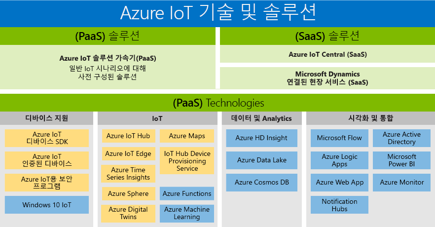

# IoT(사물 인터넷) 기술 및 솔루션: PaaS 및 SaaS

Microsoft는 모든 사람이 디지털 변환의 혜택을 누릴 수 있도록 모든 고객의 요구 사항을 지원하는 포트폴리오를 만들었습니다. Azure IoT 제품 포트폴리오는 사용 가능한 PaaS/SaaS 기술 및 솔루션의 개요를 보여줍니다. 고객이 고유의 솔루션을 구축하는 데 사용할 수 있는 두 가지 경로를 제공합니다.

- PaaS(Platform as a Service): 다음 서비스 중 하나를 사용하여 애플리케이션을 빌드합니다.
    - [Azure IoT 솔루션 가속기](https://www.azureiotsolutions.com/) - 사용자 지정 IoT 솔루션 개발 속도를 높일 수 있도록 미리 구성된 엔터프라이즈급 솔루션 컬렉션. 
    - [Azure Digital Twins](https://azure.microsoft.com/services/digital-twins/) - 물리적 환경을 모델링하여 공간 인텔리전스 그래프 및 도메인 관련 개체 모델을 사용하여 컨텍스트 인식 IoT 솔루션을 만들 수 있습니다.

- SaaS(Software as a Service): IoT 솔루션의 복잡성에 노출되지 않고 IoT 애플리케이션을 개발할 수 있는 새로운 SaaS 솔루션인 [Azure IoT Central](https://azure.microsoft.com/services/iot-central/)로 빠르게 시작하세요. 조직에 고유의 IoT 솔루션을 빌드하는 데 필요한 리소스가 없는 경우 Azure IoT Central은 몇 분 안에 디바이스 모델, 대시보드 및 규칙을 만들 수 있는 코드 없는 IoT 솔루션입니다.

## 솔루션

솔루션 가속기 및 SaaS 제품을 사용하여 빠르게 시작합니다. 원격 모니터링, 예측 유지 관리, 연결된 팩터리 등의 일반적인 IoT 시나리오를 지원하는 미리 구성된 솔루션 중에서 선택하여 완전히 사용자 지정 가능한 솔루션을 만들어 보세요. 또는 클라우드 솔루션에 대한 전문 지식이 없어도 강력한 IoT 시나리오를 지원할 수 있는 완전히 관리되는 엔드투엔드 솔루션인 Azure IoT Central을 사용하세요.

### Azure IoT 솔루션 가속기(PaaS)

Azure IoT 솔루션 가속기는 사용자 지정이 가능한 PaaS 솔루션으로 IoT 솔루션을 보다 철저하게 제어할 수 있습니다. 연결된 작업을 위한 IoT를 구현하려는 기업 또는 연결된 제품에 대한 구체적인 사용자 지정 요구 사항을 갖고 있는 기업을 위해 Azure IoT 솔루션 가속기는 고객에게 필요한 제어 기능을 제공합니다. 

디바이스 또는 디바이스 모델의 수가 많은 조직, 그리고 연결된 팩터리 솔루션을 찾는 제조업체는 IoT 솔루션 가속기의 혜택을 볼 수 있는 대표적인 예입니다. 복잡한 요구 사항에 적합하도록 고도로 사용자 지정 가능한 솔루션을 만드는 IoT 솔루션 가속기는 다음 기능을 제공합니다. 

- 미리 작성된 솔루션
    - 원격 모니터링
    - 연결된 공장
    - 예측 유지 관리
    - 디바이스 시뮬레이션
- 몇 분 안에 배포하는 기능
- 가치 창출 시간 단축
- 궁극의 제어 기능을 제공하는 솔루션 
 
### Azure IoT Central(SaaS)

Azure IoT Central은 최소의 IoT 경험만 있으면 빠르게 시작할 수 있는 완전히 관리되는 SaaS 솔루션입니다. 회사에서 사용자 지정보다 속도를 더 추구하는 경우 SaaS 모델이 IoT 구현 요구 사항에 대한 완벽한 솔루션이 될 수 있습니다. 

디바이스 모델이 몇 개 되지 않고, 시나리오의 예측 가능성이 높고, IoT/IT 기능이 제한된 조직은 이제 SaaS 접근 방식을 통해 IoT의 장점을 활용할 수 있습니다. 이전에 연결된 제품을 개발하기 위한 시간, 비용, 전문 지식이 부족했던 기업은 이제 Azure IoT Central로 빠르게 시작할 수 있습니다. Microsoft는 일반적인 IoT 구현 요구 사항을 해결하는 완성도 높은 SaaS 솔루션을 제공한다는 측면에서 업계를 주도하고 있습니다. 

- 완전하게 관리되는 IoT SaaS
- 클라우드 솔루션 개발 전문 지식이 필요 없음
- 요구 사항에 맞게 구성 가능
- 간단한 IoT 요구 사항에 적합

### Azure IoT 솔루션 가속기와 Azure IoT Central 비교

일반적인 [IoT 솔루션 아키텍처](/azure/iot-fundamentals/iot-introduction)를 구현하기 위해 Azure IoT는 [Azure IoT 솔루션 가속기](/azure/iot-suite) 및 [Azure IoT Central](https://www.microsoft.com/internet-of-things/iot-central-saas-solutions)을 제공하며, 각각은 서로 다른 고객 요구 사항 집합에 적합합니다.

[Azure IoT Hub](https://azure.microsoft.com/services/iot-hub/)는 Azure IoT Central 및 Azure IoT 솔루션 가속기 모두에서 사용하는 Azure PaaS의 핵심입니다. IoT Hub를 사용하면 수백만 개의 IoT 디바이스와 클라우드 솔루션 간의 안정적이고 안전한 양방향 통신을 지원할 수 있습니다. IoT Hub는 다음과 같은 IoT 구현 과제를 충족하는 데 도움을 줍니다.

* 대용량 디바이스 연결 및 관리
* 대용량 원격 분석 수집
* 디바이스 명령 및 제어
* 디바이스 보안 강화

Azure IoT 제품을 선택하는 것은 IoT 솔루션 계획의 중요한 부분입니다. IoT Hub는 엔드투엔드 IoT 솔루션을 자체적으로 제공하지 않는 개별 Azure 서비스입니다. IoT Hub는 모든 IoT 솔루션의 시작점으로 사용할 수 있으며, Azure IoT 솔루션 가속기 또는 Azure IoT Central을 사용할 필요가 없습니다. Azure IoT 솔루션 가속기와 Azure IoT Central 모두 다른 Azure 서비스와 함께 IoT Hub를 사용합니다. 다음 표에는 요구 사항에 맞게 적절히 선택할 수 있도록 Azure IoT 솔루션 가속기와 Azure IoT Central의 주요 차이점이 요약되어 있습니다.

|                        | Azure IoT 솔루션 가속기 | Azure IoT Central |
| ---------------------- | --------- | ----------- |
| 기본 사용 | 최대한의 유연성이 필요한 사용자 지정 IoT 솔루션의 개발을 가속화합니다. | 자세한 서비스 사용자 지정이 필요하지 않은 간단한 IoT 솔루션의 출시 시간을 가속화합니다. |
| 기본 PaaS 서비스에 대한 액세스          | 기본 Azure 서비스에 액세스하여 이를 관리하거나 필요에 따라 바꿀 수 있습니다. | SaaS - 완벽하게 관리되는 솔루션이며, 기본 서비스가 노출되지 않습니다. |
| 유연성            | 높음. 마이크로 서비스에 대한 코드는 오픈 소스이며, 원하는 대로 적절히 수정할 수 있습니다. 또한 배포 인프라를 사용자 지정할 수 있습니다.| 중간. 기본 제공 브라우저 기반 사용자 환경을 사용하여 솔루션 모델 및 UI 측면을 사용자 지정할 수 있습니다. 다른 구성 요소가 노출되지 않기 때문에 인프라는 사용자 지정할 수 없습니다.|
| 기술 수준                 | 약간 높음 - 솔루션 백 엔드를 사용자 지정하려면 Java 또는 .NET 기술이 필요합니다. 시각화를 사용자 지정하려면 JavaScript 기술이 필요합니다. | 낮음. 솔루션을 사용자 지정하려면 모델링 기술이 필요합니다. 코딩 기술은 필요하지 않습니다. |
| 시작 환경 | 솔루션 가속기에서 일반적인 IoT 시나리오를 구현합니다. 몇 분 안에 배포할 수 있습니다. | 애플리케이션 템플릿 및 장치 템플릿은 미리 빌드된 모델을 제공합니다. 몇 분 안에 배포할 수 있습니다. |
| 가격                | 비용을 제어하기 위해 서비스를 자세히 튜닝할 수 있습니다. | 간단하고 예측 가능한 가격 책정 구조입니다. |

궁극적으로 IoT 솔루션을 빌드하는 데 사용할 제품은 다음 조건에 따라 결정할 수 있습니다.

* 비즈니스 요구 사항
* 빌드하려는 솔루션 유형
* 장기적으로 솔루션을 빌드하고 유지 관리할 수 있는 조직의 기술

## 기술(PaaS)

가장 포괄적인 IoT 플랫폼 서비스 포트폴리오를 제공하고 Azure 플랫폼을 아우르는 PaaS(Platform-as-a-Service) 기술을 사용하면 IoT 솔루션의 모든 측면을 간편하게 만들고, 사용자 지정하고, 제어할 수 있습니다. 수십 억 대의 IoT 디바이스로 양방향 통신을 설정하고 IoT 디바이스를 대규모로 관리할 수 있습니다. 그리고 IoT 디바이스 데이터를 Azure Cosmos DB 및 Azure Time Series Insights 같은 다른 플랫폼 서비스와 통합하여 솔루션에 대한 인사이트를 강화할 수 있습니다. 

### 디바이스 지원

[Azure IoT 시작 키트](https://catalog.azureiotsolutions.com/kits)를 활용하거나 [디바이스 카탈로그](https://catalog.azureiotsolutions.com/)에 있는 수백 대의 IoT용 Certified 디바이스 중에서 선택하여 자신 있게 IoT 프로젝트를 시작하세요. 모든 디바이스는 플랫폼의 제약을 받지 않으며 IoT Hub에 원활하게 연결되도록 테스트를 마쳤습니다.
오픈 소스 [디바이스 SDK](/azure/iot-hub/iot-hub-devguide-sdks)를 사용하여 모든 디바이스를 Azure IoT에 연결하세요. SDK는 [C](https://github.com/Azure/azure-iot-sdk-c), [Node.js](https://github.com/Azure/azure-iot-sdk-node), [Java](https://github.com/Azure/azure-iot-sdk-java), [.NET](https://github.com/Azure/azure-iot-sdk-csharp) 및 [Python](https://github.com/Azure/azure-iot-sdk-python) 같은 여러 프로그래밍 언어뿐 아니라 Linux, Windows 및 실시간 운영 체제 같은 여러 운영 체제도 지원합니다.

### IoT 
[Azure IoT Hub](https://azure.microsoft.com/services/iot-hub/)는 수백만 대의 IoT 디바이스와 솔루션 백 엔드 간에서 안정적이고 안전한 양방향 통신을 가능하게 해주는 완전히 관리되는 서비스입니다. Azure IoT Hub Device Provisioning Service는 IoT Hub를 위한 도우미 서비스로, 사람이 개입할 필요 없이 적시에 올바른 IoT Hub에 무인 프로비전이 가능하므로 고객은 안전하고 확장성이 뛰어난 방식으로 수백만 대의 디바이스를 프로비전할 수 있습니다.

### Microsoft Edge
[Azure IoT Edge](https://azure.microsoft.com/services/iot-edge/)는 IoT 서비스입니다. 이 서비스는 클라우드가 아닌 디바이스에서 즉, "에지"의 데이터를 관리하려는 고객을 대상으로 합니다. 워크로드의 일부를 에지로 이동하면 대기 시간이 단축되고 오프라인 시나리오에 대한 옵션이 제공됩니다.

### 공간 인텔리전스
[Azure Digital Twins](https://azure.microsoft.com/services/digital-twins/)는 물리적 환경의 모델을 만들 수 있는 IoT 서비스입니다. 사람, 공간, 디바이스 간의 관계를 모델링하는 공간 인텔리전스 그래프를 제공합니다. 디지털 세계와 실제 세계의 데이터 간에 상관 관계를 지정하여 컨텍스트 인식 솔루션을 만들 수 있습니다.  

### 데이터 및 분석
Azure Machine Learning을 사용하여 클라우드 인텔리전스를 에지로 가져오고, Azure Data Lake를 사용하여 IoT 디바이스 데이터를 비용 효율적인 방법으로 저장하고, [Azure Time Series Insights](https://azure.microsoft.com/services/time-series-insights/)를 사용하여 IoT 디바이스의 데이터를 대량으로 시각화하는 등 IoT 솔루션에서 제공하는 다양한 Azure 데이터 및 분석 PaaS 서비스를 활용해 보세요.

### 시각화 및 통합
Microsoft Azure는 지속적으로 증가하는 통합 클라우드 서비스 컬렉션을 업계 최고의 데이터 보호 및 개인 정보 보호 노력과 결합하는 완전한 클라우드 솔루션을 제공합니다. [Microsoft Azure](https://azure.microsoft.com/)에 대해 자세히 알아보세요.

## 다음 단계

IoT 기능을 쉽고 빠르게 경험해보려면 [IoT Hub 설명서의 시작 섹션](/azure/iot-hub/iot-hub-get-started)을 참조하세요. 심층적인 실습 경험을 얻으려면 [IoT Edge 자습서](/azure/iot-edge/tutorial-simulate-device-windows) 중 하나를 시도해 보세요.
