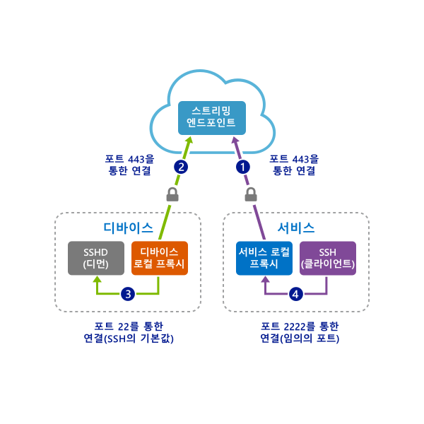

# <a name="quickstart-sshrdp-over-an-iot-hub-device-stream-using-a-c-proxy-application-preview"></a>빠른 시작: C# 프록시 애플리케이션을 사용하여 IoT Hub 디바이스 스트림을 통한 SSH/RDP(미리 보기)

[!INCLUDE [iot-hub-quickstarts-4-selector](../../includes/iot-hub-quickstarts-4-selector.md)]

Microsoft Azure IoT Hub는 현재 디바이스 스트림을 [미리 보기 기능](https://azure.microsoft.com/support/legal/preview-supplemental-terms/)으로 지원합니다.

[IoT Hub 디바이스 스트림](iot-hub-device-streams-overview.md)은 서비스 및 디바이스 애플리케이션이 안전하고 방화벽 친화적인 방식으로 통신할 수 있도록 합니다. 이 빠른 시작에서는 IoT Hub를 통해 설정된 디바이스 스트림을 통해 클라이언트/서버 애플리케이션 트래픽(예: SSH 및 RDP)을 보낼 수 있게 해주는 두 개의 C# 프로그램이 사용됩니다. 설정 개요는 [SSH 또는 RDP용 로컬 프록시 샘플](iot-hub-device-streams-overview.md#local-proxy-sample-for-ssh-or-rdp)을 참조하세요.

먼저 SSH에 대한 설정을 설명합니다(포트 22 사용). 그런 다음, RDP에 대한 설정의 포트를 수정하는 방법을 설명합니다. 디바이스 스트림은 애플리케이션이며 프로토콜에 구속 받지 않으므로 다른 종류의 애플리케이션 트래픽에 맞춰 동일한 샘플을 수정할 수 있습니다. 일반적으로 의도한 애플리케이션에서 사용하는 통신 포트로 변경하기만 하면 됩니다.

## <a name="how-it-works"></a>작동 방법

아래 그림에서는 이 샘플에서 디바이스- 및 서비스-로컬 프록시 프로그램에서 SSH 클라이언트와 SSH 디먼 간 엔드투엔드 연결을 활성화하는 방법의 설정을 보여줍니다. 여기에서는 디먼이 디바이스-로컬 프록시로 동일한 디바이스에서 실행되고 있다고 가정합니다.



1. 서비스-로컬 프록시는 디바이스 ID를 사용하여 IoT Hub에 연결하고 대상 디바이스에 대한 디바이스 스트림을 시작합니다.

2. 디바이스-로컬 프록시는 스트림 시작 핸드셰이크를 완료하고 IoT Hub의 스트리밍 엔드포인트를 통해 서비스 측에 엔드투엔드 스트리밍 터널을 설정합니다.

3. 디바이스-로컬 프록시는 디바이스의 포트 22에서 수신 대기하는 SSHD(SSH 디먼)에 연결합니다(이 포트는 [디바이스 로컬 프록시 실행 섹션](#run-the-device-local-proxy)에 설명된 대로 구성 가능).

4. 서비스-로컬 프록시는 이 경우 포트 2222인 지정된 포트에서 수신 대기하여 사용자의 새 SSH 연결을 기다립니다([서비스 로컬 프록시 실행 섹션](#run-the-service-local-proxy)에 설명된 대로 역시 구성 가능함). 사용자가 SSH 클라이언트를 통해 연결하면 터널은 SSH 클라이언트와 서비스 프로그램 간에 애플리케이션 트래픽이 교환되도록 활성화합니다.

> [!NOTE]
> 스트림을 통해 전송되는 SSH 트래픽은 서비스와 디바이스 간에 직접 전송되는 것이 아니라 IoT Hub의 스트리밍 엔드포인트를 통해 터널링됩니다. 자세한 내용은 [디바이스 스트림 이점](./iot-hub-device-streams-overview.md#benefits) 섹션을 참조하세요.

[!INCLUDE [cloud-shell-try-it.md](../../includes/cloud-shell-try-it.md)]

Azure 구독이 아직 없는 경우 시작하기 전에 [무료 계정](https://azure.microsoft.com/free/?WT.mc_id=A261C142F) 을 만듭니다.

## <a name="prerequisites"></a>필수 조건

디바이스 스트림의 미리 보기는 현재 다음 지역에서 만든 IoT Hub에 대해서만 지원됩니다.

*  **미국 중부**

*  **미국 중부 EUAP**

이 빠른 시작에서 실행하는 두 개의 샘플 애플리케이션은 C#을 사용하여 작성되었습니다. 개발 컴퓨터에서 .NET Core SDK 2.1.0 이상이 필요합니다.

[.NET](https://www.microsoft.com/net/download/all)에서 여러 플랫폼에 대한 .NET Core SDK를 다운로드할 수 있습니다.

다음 명령을 사용하여 개발 컴퓨터에서 C#의 현재 버전을 확인할 수 있습니다.

```
dotnet --version
```

다음 명령을 실행하여 Cloud Shell 인스턴스에 Azure CLI용 Microsoft Azure IoT 확장을 추가합니다. IOT 확장은 Azure CLI에 IoT Hub, IoT Edge 및 IoT DPS(Device Provisioning Service)별 명령을 추가합니다.

```azurecli-interactive
az extension add --name azure-cli-iot-ext
```

https://github.com/Azure-Samples/azure-iot-samples-csharp/archive/master.zip에서 샘플 C# 다운로드하고 ZIP 보관 파일을 추출합니다.

## <a name="create-an-iot-hub"></a>IoT Hub 만들기

[!INCLUDE [iot-hub-include-create-hub-device-streams](../../includes/iot-hub-include-create-hub-device-streams.md)]

## <a name="register-a-device"></a>디바이스 등록

연결을 위해 디바이스를 IoT Hub에 등록해야 합니다. 이 빠른 시작에서는 Azure Cloud Shell을 사용하여 시뮬레이션된 디바이스를 등록합니다.

1. Azure Cloud Shell에서 다음 명령을 실행하여 디바이스 ID를 만듭니다.

   **YourIoTHubName**: 이 자리 표시자를 IoT 허브용으로 선택한 이름으로 바꿉니다.

   **MyDevice**: 등록된 디바이스에 지정된 이름입니다. 표시된 것처럼 MyDevice를 사용합니다. 다른 장치 이름을 선택하는 경우 이 문서 전체에서 해당 이름을 사용해야 하고, 샘플 애플리케이션에서 장치 이름을 업데이트한 후 실행해야 합니다.

    ```azurecli-interactive
    az iot hub device-identity create --hub-name YourIoTHubName --device-id MyDevice
    ```

2. Azure Cloud Shell에서 다음 명령을 실행하여 방금 등록한 디바이스의 _디바이스 연결 문자열_을 가져옵니다.

   **YourIoTHubName**: 이 자리 표시자를 IoT 허브용으로 선택한 이름으로 바꿉니다.

    ```azurecli-interactive
    az iot hub device-identity show-connection-string --hub-name YourIoTHubName --device-id MyDevice --output table
    ```

    다음 예제와 같은 디바이스 연결 문자열을 기록해 둡니다.

   `HostName={YourIoTHubName}.azure-devices.net;DeviceId=MyDevice;SharedAccessKey={YourSharedAccessKey}`

    이 값은 빠른 시작의 뒷부분에서 사용합니다.

3. 또한 서비스 쪽 애플리케이션을 IoT Hub에 연결하고 디바이스 스트림을 설정하기 위해 IoT Hub에서 *서비스 연결 문자열*이 필요합니다. 다음 명령은 IoT Hub에 대한 이 값을 검색합니다.

   **YourIoTHubName**: 이 자리 표시자를 IoT 허브용으로 선택한 이름으로 바꿉니다.

    ```azurecli-interactive
    az iot hub show-connection-string --policy-name service --name YourIoTHubName
    ```

    다음과 같이 표시되는 반환 값을 기록해 둡니다.

   `"HostName={YourIoTHubName}.azure-devices.net;SharedAccessKeyName=service;SharedAccessKey={YourSharedAccessKey}"`

## <a name="ssh-to-a-device-via-device-streams"></a>디바이스 스트림을 통해 디바이스에 대한 SSH

이 섹션에서는 SSH 트래픽을 터널링하는 엔드투엔드 스트림을 설정합니다.

### <a name="run-the-device-local-proxy"></a>디바이스-로컬 프록시 실행

압축을 푼 프로젝트 폴더에서 `device-streams-proxy/device`로 이동합니다. 다음 정보가 필요합니다.

| 인수 이름 | 인수 값 |
|----------------|-----------------|
| `deviceConnectionString` | 이전에 만든 디바이스의 연결 문자열입니다. |
| `targetServiceHostName` | SSH 서버가 수신 대기하는 IP 주소입니다(디바이스-로컬 프록시가 실행되는 IP와 동일한 경우 `localhost`). |
| `targetServicePort` | 애플리케이션 프로토콜에서 사용하는 포트입니다(기본적으로 SSH에 대해 포트 22).  |

다음과 같이 코드를 컴파일하고 실행합니다.

```
cd ./iot-hub/Quickstarts/device-streams-proxy/device/

# Build the application
dotnet build

# Run the application
# In Linux/MacOS
dotnet run $deviceConnectionString localhost 22

# In Windows
dotnet run %deviceConnectionString% localhost 22
```

### <a name="run-the-service-local-proxy"></a>서비스-로컬 프록시 실행

압축을 푼 프로젝트 폴더에서 `device-streams-proxy/service`로 이동합니다. 다음 정보가 필요합니다.

| 매개 변수 이름 | 매개 변수 값 |
|----------------|-----------------|
| `iotHubConnectionString` | IoT Hub의 서비스 연결 문자열입니다. |
| `deviceId` | 이전에 만든 디바이스의 식별자입니다. |
| `localPortNumber` | SSH 클라이언트에서 연결하는 로컬 포트입니다. 이 샘플에서는 2222 포트를 사용하지만 다른 임의의 숫자로 수정할 수 있습니다. |

다음과 같이 코드를 컴파일하고 실행합니다.

```
cd ./iot-hub/Quickstarts/device-streams-proxy/service/

# Build the application
dotnet build

# Run the application
# In Linux/MacOS
dotnet run $serviceConnectionString MyDevice 2222

# In Windows
dotnet run %serviceConnectionString% MyDevice 2222
```

### <a name="run-ssh-client"></a>SSH 클라이언트 실행

이제 SSH 클라이언트 프로그램을 사용하고 포트 2222에서 서비스-로컬 프록시에 연결합니다(SSH 디먼에서 직접 하는 대신).

```
ssh <username>@localhost -p 2222
```

이 시점에서 자격 증명을 입력하라는 SSH 로그인 프롬프트가 표시됩니다.

서비스 쪽의 콘솔 출력(서비스-로컬 프록시는 포트 2222에서 수신 대기함):


`IP_address:22`에서 SSH 디먼에 연결하는 디바이스-로컬 프록시의 콘솔 출력:


SSH 클라이언트 프로그램의 콘솔 출력(SSH 클라이언트는 서비스-로컬 프록시가 수신 대기하는 포트 22에 연결하여 SSH 디먼에 통신함):


## <a name="rdp-to-a-device-via-device-streams"></a>디바이스 스트림을 통해 디바이스에 대한 RDP

RDP에 대한 설정은 SSH와 매우 유사합니다(위에 설명됨). 기본적으로 RDP 대상 IP 및 포트 3389를 대신 사용하고 RDP 클라이언트를 사용해야 합니다(SSH 클라이언트 대신).

### <a name="run-the-device-local-proxy-rdp"></a>디바이스-로컬 프록시 실행(RDP)

압축을 푼 프로젝트 폴더에서 `device-streams-proxy/device`로 이동합니다. 다음 정보가 필요합니다.

| 인수 이름 | 인수 값 |
|----------------|-----------------|
| `DeviceConnectionString` | 이전에 만든 디바이스의 연결 문자열입니다. |
| `targetServiceHostName` | RDP 서버가 실행되는 호스트 이름 또는 IP 주소입니다(디바이스-로컬 프록시가 실행되는 IP와 동일한 경우 `localhost`). |
| `targetServicePort` | 애플리케이션 프로토콜에서 사용하는 포트입니다(기본적으로 RDP에 대해 포트 3389).  |

다음과 같이 코드를 컴파일하고 실행합니다.

```
cd ./iot-hub/Quickstarts/device-streams-proxy/device

# Run the application
# In Linux/MacOS
dotnet run $DeviceConnectionString localhost 3389

# In Windows
dotnet run %DeviceConnectionString% localhost 3389
```

### <a name="run-the-service-local-proxy-rdp"></a>서비스-로컬 프록시 실행(RDP)

압축을 푼 프로젝트 폴더에서 `device-streams-proxy/service`로 이동합니다. 다음 정보가 필요합니다.

| 매개 변수 이름 | 매개 변수 값 |
|----------------|-----------------|
| `iotHubConnectionString` | IoT Hub의 서비스 연결 문자열입니다. |
| `deviceId` | 이전에 만든 디바이스의 식별자입니다. |
| `localPortNumber` | SSH 클라이언트에서 연결하는 로컬 포트입니다. 이 샘플에서는 2222 포트를 사용하지만 다른 임의의 숫자로 수정할 수 있습니다. |

다음과 같이 코드를 컴파일하고 실행합니다.

```
cd ./iot-hub/Quickstarts/device-streams-proxy/service/

# Build the application
dotnet build

# Run the application
# In Linux/MacOS
dotnet run $serviceConnectionString MyDevice 2222

# In Windows
dotnet run %serviceConnectionString% MyDevice 2222
```

### <a name="run-rdp-client"></a>RDP 클라이언트 실행

이제 RDP 클라이언트 프로그램을 사용하고 포트 2222(이전에 선택한 사용 가능한 임의의 포트)에서 서비스-로컬 프록시에 연결합니다.


## <a name="clean-up-resources"></a>리소스 정리

[!INCLUDE [iot-hub-quickstarts-clean-up-resources](../../includes/iot-hub-quickstarts-clean-up-resources-device-streams.md)]

## <a name="next-steps"></a>다음 단계

이 빠른 시작에서는 IoT Hub를 설정했고, 디바이스를 등록했으며, IoT Hub를 통해 디바이스 스트림을 설정하는 디바이스- 및 서비스-로컬 프록시 프로그램을 배포했고, SSH 또는 RDP 트래픽을 터널링하는 데 프록시를 사용했습니다. 동일한 패러다임은 다른 클라이언트/서버 프로토콜을 수용할 수 있습니다(서버가 디바이스에서 실행됨, 예를 들어 SSH 디먼).

디바이스 스트림에 대해 자세히 알아보려면 아래 링크를 사용합니다.

> [!div class="nextstepaction"]
> [디바이스 스트림 개요](./iot-hub-device-streams-overview.md)