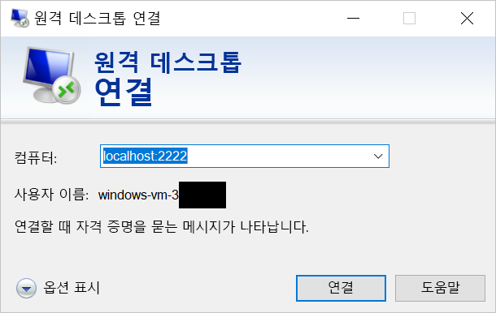

# <a name="quickstart-sshrdp-over-an-iot-hub-device-stream-using-a-nodejs-proxy-application-preview"></a>빠른 시작: Node.js 프록시 애플리케이션을 사용하여 IoT Hub 디바이스 스트림을 통한 SSH/RDP(미리 보기)

[!INCLUDE [iot-hub-quickstarts-4-selector](../../includes/iot-hub-quickstarts-4-selector.md)]

Microsoft Azure IoT Hub는 현재 디바이스 스트림을 [미리 보기 기능](https://azure.microsoft.com/support/legal/preview-supplemental-terms/)으로 지원합니다.

[IoT Hub 디바이스 스트림](./iot-hub-device-streams-overview.md)은 서비스 및 디바이스 애플리케이션이 안전하고 방화벽 친화적인 방식으로 통신할 수 있도록 합니다. 이 빠른 시작 가이드에서는 디바이스 스트림을 통해 SSH 및 RDP 트래픽을 디바이스에 전송되도록 하는 서비스 쪽에서 실행되는 Node.js 프록시 애플리케이션의 실행을 설명합니다. 설정 개요는 [SSH 또는 RDP용 로컬 프록시 샘플](./iot-hub-device-streams-overview.md#local-proxy-sample-for-ssh-or-rdp)을 참조하세요. 공개 미리 보기 동안 Node.js SDK는 서비스 쪽에서 디바이스 스트림을 지원합니다. 결과적으로 이 빠른 시작 가이드에서는 서비스 로컬 프록시를 실행하는 지침만 설명합니다. 다음 디바이스-로컬 프록시 빠른 시작 중 하나를 실행해야 합니다.  

   * [C 프록시 앱을 사용하여 IoT Hub 디바이스 스트림을 통한 SSH/RDP](./quickstart-device-streams-proxy-c.md)

   * [C# 프록시 앱을 사용하여 IoT Hub 디바이스 스트림을 통한 SSH/RDP](./quickstart-device-streams-proxy-csharp.md)

먼저 SSH에 대한 설정을 설명합니다(포트 22 사용). 그런 다음, RDP에 대한 설정을 수정하는 방법을 설명합니다(포트 3389 사용). 디바이스 스트림은 애플리케이션이며 프로토콜에 구속 받지 않으므로 다른 종류의 클라이언트/서버 애플리케이션 트래픽을 수용하도록 동일한 샘플을 수정할 수 있습니다(일반적으로 통신 포트를 변경하여).

[!INCLUDE [cloud-shell-try-it.md](../../includes/cloud-shell-try-it.md)]

Azure 구독이 아직 없는 경우 시작하기 전에 [무료 계정](https://azure.microsoft.com/free/?WT.mc_id=A261C142F) 을 만듭니다.

## <a name="prerequisites"></a>필수 조건

* 디바이스 스트림의 미리 보기는 현재 다음 지역에서 만든 IoT Hub에 대해서만 지원됩니다.

   * **미국 중부**

   * **미국 중부 EUAP**

이 빠른 시작의 서비스 로컬 애플리케이션을 실행하려면 개발 머신에 Node.js v10.x.x 이상이 필요합니다.

* [nodejs.org](https://nodejs.org)에서 여러 플랫폼에 대한 Node.js를 다운로드합니다.

다음 명령을 사용하여 개발 컴퓨터에서 Node.js의 현재 버전을 확인할 수 있습니다.

```
node --version
```

* 다음 명령을 실행하여 Cloud Shell 인스턴스에 Azure CLI용 Microsoft Azure IoT 확장을 추가합니다. IOT 확장은 Azure CLI에 IoT Hub, IoT Edge 및 IoT DPS(Device Provisioning Service)별 명령을 추가합니다.

```azurecli-interactive
az extension add --name azure-cli-iot-ext
```

* 아직 그렇게 하지 않았다면 https://github.com/Azure-Samples/azure-iot-samples-node/archive/streams-preview.zip에서 샘플 Node.js 프로젝트를 다운로드하고 ZIP 보관 파일을 추출합니다.

## <a name="create-an-iot-hub"></a>IoT Hub 만들기

이전 [빠른 시작: 디바이스에서 IoT 허브로 원격 분석 보내기](quickstart-send-telemetry-node.md)를 완료한 경우 이 단계를 건너뛸 수 있습니다.

[!INCLUDE [iot-hub-include-create-hub-device-streams](../../includes/iot-hub-include-create-hub-device-streams.md)]

## <a name="register-a-device"></a>디바이스 등록

이전 [빠른 시작: 디바이스에서 IoT 허브로 원격 분석 보내기](quickstart-send-telemetry-node.md)를 완료한 경우 이 단계를 건너뛸 수 있습니다.

연결을 위해 디바이스를 IoT Hub에 등록해야 합니다. 이 빠른 시작에서는 Azure Cloud Shell을 사용하여 시뮬레이션된 디바이스를 등록합니다.

1. Azure Cloud Shell에서 다음 명령을 실행하여 디바이스 ID를 만듭니다.

   **YourIoTHubName**: 이 자리 표시자를 IoT 허브용으로 선택한 이름으로 바꿉니다.

   **MyDevice**: 등록된 디바이스에 지정된 이름입니다. 표시된 것처럼 MyDevice를 사용합니다. 다른 장치 이름을 선택하는 경우 이 문서 전체에서 해당 이름을 사용해야 하고, 샘플 애플리케이션에서 장치 이름을 업데이트한 후 실행해야 합니다.

    ```azurecli-interactive
    az iot hub device-identity create --hub-name YourIoTHubName --device-id MyDevice
    ```

2. 또한 백 엔드 애플리케이션을 IoT 허브에 연결하여 메시지를 검색할 수 있게 하려면 *서비스 연결 문자열*이 필요합니다. 다음 명령은 IoT Hub에 대한 서비스 연결 문자열을 검색합니다.

    **YourIoTHubName**: 이 자리 표시자를 IoT 허브용으로 선택한 이름으로 바꿉니다.

    ```azurecli-interactive
    az iot hub show-connection-string --policy-name service --name YourIoTHubName
    ```

    다음과 같이 표시되는 반환 값을 기록해 둡니다.

   `"HostName={YourIoTHubName}.azure-devices.net;SharedAccessKeyName=service;SharedAccessKey={YourSharedAccessKey}"`

## <a name="ssh-to-a-device-via-device-streams"></a>디바이스 스트림을 통해 디바이스에 대한 SSH

이 섹션에서는 SSH 트래픽을 터널링하는 엔드투엔드 스트림을 설정합니다.

### <a name="run-the-device-local-proxy"></a>디바이스-로컬 프록시 실행

앞에서 설명한 대로 IoT Hub Node.js SDK는 서비스 쪽에서 디바이스 스트림을 지원합니다. 디바이스-로컬 애플리케이션에서 다음과 같은 빠른 시작 중 하나에 제공되는 디바이스 프록시 프로그램 중 하나를 사용합니다.

   * [C 프록시 앱을 사용하여 IoT Hub 디바이스 스트림을 통한 SSH/RDP](./quickstart-device-streams-proxy-c.md)

   * [C# 프록시 앱을 사용하여 IoT Hub 디바이스 스트림을 통한 SSH/RDP](./quickstart-device-streams-proxy-csharp.md) 

다음 단계로 진행하기 전에 디바이스 로컬 프록시가 실행 중인지 확인합니다.

### <a name="run-the-service-local-proxy"></a>서비스-로컬 프록시 실행

[디바이스 로컬 프록시](#run-the-device-local-proxy)가 실행되고 있다고 가정하고, 아래 단계를 따라 Node.js에서 작성된 서비스 로컬 프록시를 실행합니다.

* 서비스 자격 증명, SSH 디먼이 실행되는 대상 디바이스 ID 및 환경 변수로 디바이스에서 실행되는 프록시에 대한 포트 번호를 제공합니다.

```
# In Linux
export IOTHUB_CONNECTION_STRING="<provide_your_service_connection_string>"
export STREAMING_TARGET_DEVICE="MyDevice"
export PROXY_PORT=2222

# In Windows
SET IOTHUB_CONNECTION_STRING=<provide_your_service_connection_string>
SET STREAMING_TARGET_DEVICE=MyDevice
SET PROXY_PORT=2222
```

  디바이스 ID와 연결 문자열이 일치하도록 위의 값을 변경합니다.

* 압축을 푼 프로젝트 폴더의 `Quickstarts/device-streams-service`로 이동하고 서비스-로컬 프록시를 실행합니다.

```
cd azure-iot-samples-node-streams-preview/iot-hub/Quickstarts/device-streams-service

# Install the preview service SDK, and other dependencies
npm install azure-iothub@streams-preview
npm install

# Run the service-local proxy application
node proxy.js
```

### <a name="ssh-to-your-device-via-device-streams"></a>디바이스 스트림을 통해 디바이스에 대한 SSH

Linux에서 터미널의 `ssh $USER@localhost -p 2222`를 사용하여 SSH를 실행합니다. Windows에서 즐겨찾는 SSH 클라이언트를 사용합니다(예: PuTTY).

SSH 세션이 설정된 후 서비스 로컬의 콘솔 출력(서비스-로컬 프록시는 포트 2222에서 수신 대기함):


SSH 클라이언트 프로그램의 콘솔 출력(SSH 클라이언트는 서비스-로컬 프록시가 수신 대기하는 포트 22에 연결하여 SSH 디먼에 통신함):


### <a name="rdp-to-your-device-via-device-streams"></a>디바이스 스트림을 통해 디바이스에 대한 RDP

이제 RDP 클라이언트 프로그램을 사용하고 포트 2222에서 서비스 프록시에 연결합니다(이전에 선택한 사용 가능한 임의의 포트임).

> [!NOTE]
> 디바이스 프록시가 RDP에 대해 올바르게 구성되고 RDP 포트 3389로 구성되었는지 확인합니다.



## <a name="clean-up-resources"></a>리소스 정리

[!INCLUDE [iot-hub-quickstarts-clean-up-resources](../../includes/iot-hub-quickstarts-clean-up-resources-device-streams.md)]

## <a name="next-steps"></a>다음 단계

이 빠른 시작에서는 IoT 허브를 설정했고, 디바이스를 등록했으며, IoT 디바이스에 대한 RDP 및 SSH를 활성화하는 서비스 프록시 프로그램을 배포했습니다. RDP 및 SSH 트래픽은 IoT Hub를 통한 디바이스 스트림을 통해 터널링됩니다. 디바이스에 직접 연결하지 않아도 됩니다.

디바이스 스트림에 대해 자세히 알아보려면 아래 링크를 사용합니다.

> [!div class="nextstepaction"]
> [디바이스 스트림 개요](./iot-hub-device-streams-overview.md)
