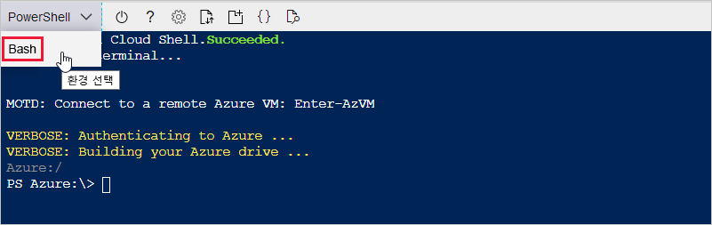
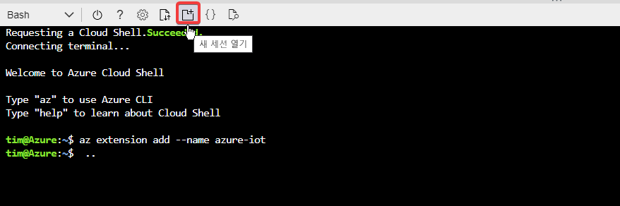
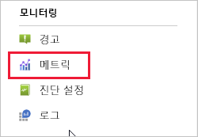
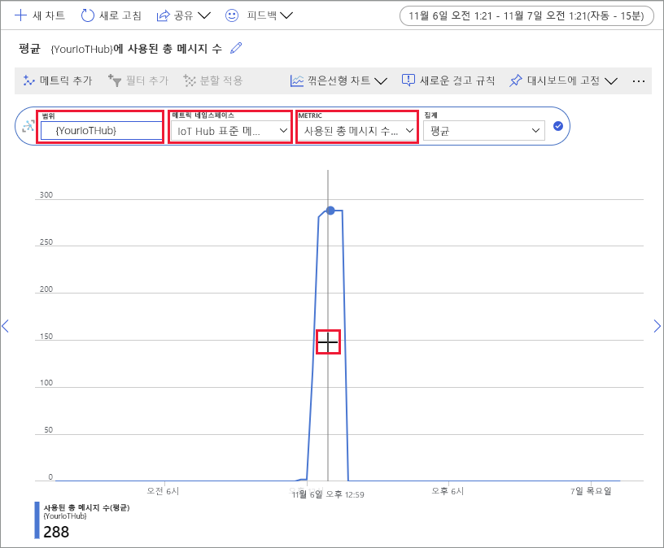

# <a name="quickstart-send-telemetry-from-a-device-to-an-iot-hub-and-monitor-it-with-the-azure-cli"></a>빠른 시작: 디바이스에서 IoT hub로 원격 분석을 전송하고 Azure CLI를 사용하여 모니터링

[!INCLUDE [iot-hub-quickstarts-1-selector](../../includes/iot-hub-quickstarts-1-selector.md)]

IoT Hub는 스토리지 또는 처리를 위해 IoT 디바이스에서 클라우드로 다량의 원격 분석 데이터를 수집할 수 있게 해주는 Azure 서비스입니다. 이 빠른 시작에서는 Azure CLI를 사용하여 IoT Hub 및 시뮬레이트된 디바이스를 만들고, 허브에 디바이스 원격 분석을 전송하고, 클라우드-디바이스 메시지를 보냅니다. 또한 Azure Portal를 사용하여 디바이스 메트릭을 시각화할 수 있습니다. 이것은 CLI를 사용하여 IoT Hub 애플리케이션과 상호 작용하는 개발자를 위한 기본 워크플로입니다.

## <a name="prerequisites"></a>사전 요구 사항
- Azure 구독이 아직 없는 경우 시작하기 전에 [무료 구독을 만듭니다](https://azure.microsoft.com/free/?WT.mc_id=A261C142F).
- Azure CLI. 브라우저에서 실행되는 대화형 CLI 셸인 Azure Cloud Shell을 사용하여 이 빠른 시작의 모든 명령을 실행할 수 있습니다. Cloud Shell을 사용하는 경우에는 아무 것도 설치할 필요가 없습니다. CLI를 로컬로 사용하려면 이 빠른 시작에 Azure CLI 버전 2.0.76 이상이 필요합니다. 버전을 찾으려면 az --version을 실행합니다. 설치하거나 업그레이드하려면 [Azure CLI 설치]( /cli/azure/install-azure-cli)를 참조하세요.

## <a name="sign-in-to-the-azure-portal"></a>Azure Portal에 로그인
[https://portal.azure.com](https://portal.azure.com ) 에서 Azure Portal에 로그인합니다.

CLI를 로컬로 실행하든, Cloud Shell에서 실행하든 관계없이, 브라우저에서 포털을 열어 둡니다.  나중에 빠른 시작에서 사용할 예정입니다.

## <a name="launch-the-cloud-shell"></a>Cloud Shell 시작
이 섹션에서는 Azure Cloud Shell의 인스턴스를 시작합니다. CLI를 로컬로 사용하는 경우 [두 CLI 세션 준비](#prepare-two-cli-sessions) 섹션으로 건너뜁니다.

Cloud Shell을 시작하려면 다음을 수행합니다.

1. Azure Portal 오른쪽 위에 있는 메뉴 모음에서 **Cloud Shell** 단추를 선택합니다. 

    

    > [!NOTE]
    > Cloud Shell을 처음 사용하는 경우 Cloud Shell을 사용하는 데 필요한 스토리지를 만들라는 메시지가 표시됩니다.  구독을 선택하여 스토리지 계정 및 Microsoft Azure Files 공유를 만듭니다. 

2. **환경 선택** 드롭다운에서 원하는 CLI 환경을 선택합니다. 이 빠른 시작에서는 **Bash** 환경을 사용합니다. 다음 CLI 명령은 모두 Powershell 환경에서도 작동합니다. 

    

## <a name="prepare-two-cli-sessions"></a>두 CLI 세션 준비

이 섹션에서는 두 개의 Azure CLI 세션을 준비합니다. Cloud Shell을 사용하는 경우 별도의 브라우저 탭에서 두 세션을 실행합니다. 로컬 CLI 클라이언트를 사용하는 경우 두 개의 개별 CLI 인스턴스를 실행합니다. 첫 번째 세션을 시뮬레이트된 디바이스로 사용하고 두 번째 세션을 사용하여 메시지를 모니터링하고 보냅니다. 명령을 실행하려면 **복사**를 선택하여 이 빠른 시작의 코드 블록을 복사한 후 셸 세션에 붙여 넣고 실행합니다.

Azure CLI를 사용하려면 Azure 계정에 로그인해야 합니다. Azure CLI 셸 세션과 IoT Hub 간의 모든 통신을 인증하고 암호화합니다. 따라서 이 빠른 시작에는 연결 문자열과 같은 실제 디바이스에서 사용하는 추가 인증이 필요하지 않습니다.

*  [az extension add](https://docs.microsoft.com/cli/azure/extension?view=azure-cli-latest#az-extension-add) 명령을 실행하여 CLI 셸에 Azure CLI용 Microsoft Azure IoT 확장을 추가합니다. IOT 확장은 Azure CLI에 IoT Hub, IoT Edge 및 IoT DPS(Device Provisioning Service) 고유의 명령을 추가합니다.

   ```azurecli
   az extension add --name azure-iot
   ```
   
   Azure IOT 확장을 설치한 후에는 Cloud Shell 세션에서 다시 설치할 필요가 없습니다. 

   [!INCLUDE [iot-hub-cli-version-info](../../includes/iot-hub-cli-version-info.md)]

*  두 번째 CLI 세션을 엽니다.  Cloud Shell을 사용하는 경우 **새 세션 열기**를 선택합니다. CLI를 로컬로 사용하는 경우 두 번째 인스턴스를 엽니다. 

    >[!div class="mx-imgBorder"]
    >

## <a name="create-an-iot-hub"></a>IoT Hub 만들기
이 섹션에서는 Azure CLI를 사용하여 리소스 그룹 및 IoT Hub를 만듭니다.  Azure 리소스 그룹은 Azure 리소스가 배포 및 관리되는 논리적 컨테이너입니다. IoT Hub는 IoT 애플리케이션과 디바이스 간의 양방향 통신을 위한 중앙 메시지 허브 역할을 합니다. 

> [!TIP]
> 필요에 따라 [Azure Portal](iot-hub-create-through-portal.md), [Visual Studio Code](iot-hub-create-use-iot-toolkit.md) 또는 기타 프로그래밍 방법을 사용하여 Azure 리소스 그룹, IoT Hub 및 기타 리소스를 만들 수 있습니다.  

1. [az group create](https://docs.microsoft.com/cli/azure/group?view=azure-cli-latest#az-group-create)를 실행하여 리소스 그룹을 만듭니다. 다음 명령은 *eastus* 위치에 *MyResourceGroup*이라는 리소스 그룹을 만듭니다. 

    ```azurecli
    az group create --name MyResourceGroup --location eastus
    ```

1. [az iot hub create](https://docs.microsoft.com/cli/azure/iot/hub?view=azure-cli-latest#az-iot-hub-create) 명령을 사용하여 IoT Hub를 만듭니다. IoT Hub를 만드는 데 몇 분 정도 걸릴 수 있습니다. 

    *YourIotHubName*. 이 자리 표시자를 IoT 허브용으로 선택한 이름으로 바꿉니다. IoT Hub 이름은 Azure에서 전역적으로 고유해야 합니다. 이 자리 표시자는 이 빠른 시작의 나머지 부분에서 IoT hub 이름을 표시하는 데 사용됩니다.

    ```azurecli
    az iot hub create --resource-group MyResourceGroup --name {YourIoTHubName}
    ```

## <a name="create-and-monitor-a-device"></a>디바이스 만들기 및 모니터링
이 섹션에서는 첫 번째 CLI 세션에서 시뮬레이트된 디바이스를 만듭니다. 시뮬레이트된 디바이스는 IoT Hub에 디바이스 원격 분석을 보냅니다. 두 번째 CLI 세션에서 이벤트 및 원격 분석을 모니터링하고 클라우드-디바이스 메시지를 시뮬레이트된 디바이스로 보냅니다.

시뮬레이트된 디바이스를 만들고 시작 하려면 다음을 실행합니다.
1. 첫 번째 CLI 세션에서 [az iot hub device-identity create](https://docs.microsoft.com/cli/azure/ext/azure-iot/iot/hub/device-identity?view=azure-cli-latest#ext-azure-iot-az-iot-hub-device-identity-create) 명령을 실행합니다. 시뮬레이트된 디바이스 ID가 만들어집니다. 

    *YourIotHubName*. 이 자리 표시자를 IoT 허브용으로 선택한 이름으로 바꿉니다. 

    *simDevice*. 이 빠른 시작의 나머지 부분에서 시뮬레이트된 디바이스에 대해 이 이름을 직접 사용할 수 있습니다. 필요에 따라 다른 이름을 사용합니다. 

    ```azurecli
    az iot hub device-identity create --device-id simDevice --hub-name {YourIoTHubName} 
    ```

1. 첫 번째 CLI 세션에서 [az iot device simulate](https://docs.microsoft.com/cli/azure/ext/azure-iot/iot/device?view=azure-cli-latest#ext-azure-iot-az-iot-device-simulate) 명령을 실행합니다.  그러면 시뮬레이트된 디바이스가 시작됩니다. 이 디바이스는 IoT Hub에 원격 분석을 보내고 메시지를 수신합니다.  

    *YourIotHubName*. 이 자리 표시자를 IoT 허브용으로 선택한 이름으로 바꿉니다. 

    ```azurecli
    az iot device simulate -d simDevice -n {YourIoTHubName}
    ```

디바이스를 모니터링하려면 다음을 수행합니다.
1. 두 번째 CLI 세션에서 [az iot hub monitor-events](https://docs.microsoft.com/cli/azure/ext/azure-iot/iot/hub?view=azure-cli-latest#ext-azure-iot-az-iot-hub-monitor-events) 명령을 실행합니다. 그러면 시뮬레이트된 디바이스 모니터링이 시작됩니다. 출력은 시뮬레이트된 디바이스가 IoT Hub에 보내는 원격 분석을 보여 줍니다.

    *YourIotHubName*. 이 자리 표시자를 IoT 허브용으로 선택한 이름으로 바꿉니다. 

    ```azurecli
    az iot hub monitor-events --output table --hub-name {YourIoTHubName}
    ```

    

1. 두 번째 CLI 세션에서 시뮬레이트된 디바이스를 모니터링한 후 Ctrl+C를 눌러 모니터링을 중지합니다. 

## <a name="use-the-cli-to-send-a-message"></a>CLI를 사용하여 메시지 보내기
이 섹션에서는 두 번째 CLI 세션을 사용하여 시뮬레이트된 디바이스에 메시지를 보냅니다.

1. 첫 번째 CLI 세션에서 시뮬레이트된 디바이스가 실행 중인지 확인합니다. 디바이스를 중지한 경우 다음 명령을 실행하여 시작합니다.

    *YourIotHubName*. 이 자리 표시자를 IoT 허브용으로 선택한 이름으로 바꿉니다. 

    ```azurecli
    az iot device simulate -d simDevice -n {YourIoTHubName}
    ```

1. 두 번째 CLI 세션에서 [az iot device c2d-message send](https://docs.microsoft.com/cli/azure/ext/azure-iot/iot/device/c2d-message?view=azure-cli-latest#ext-azure-iot-az-iot-device-c2d-message-send) 명령을 실행합니다. 그러면 IoT Hub에서 시뮬레이트된 디바이스로 클라우드-디바이스 메시지를 보냅니다. 이 메시지에는 문자열 1개와 키-값 쌍 2개가 포함됩니다.  

    *YourIotHubName*. 이 자리 표시자를 IoT 허브용으로 선택한 이름으로 바꿉니다. 

    ```azurecli
    az iot device c2d-message send -d simDevice --data "Hello World" --props "key0=value0;key1=value1" -n {YourIoTHubName}
    ```
    필요에 따라 Azure Portal을 사용하여 클라우드-디바이스 메시지를 보낼 수 있습니다. 이렇게 하려면 IoT Hub에 대한 개요 페이지로 이동하고, **IoT 디바이스**를 선택하고, 시뮬레이트된 디바이스를 선택한 후 , **디바이스에 메시지 전송**을 선택합니다. 

1. 첫 번째 CLI 세션에서 시뮬레이트된 디바이스가 메시지를 받았는지 확인합니다. 

    

1. 메시지를 확인한 후 두 번째 CLI 세션을 닫습니다. 첫 번째 CLI 세션을 열어 둡니다. 나중에 이 세션에서 리소스를 정리합니다.

## <a name="view-messaging-metrics-in-the-portal"></a>포털에서 메시징 메트릭 보기
Azure Portal을 사용하여 IoT Hub 및 디바이스의 모든 측면을 관리할 수 있습니다. 디바이스에서 원격 분석을 수집하는 일반적인 IoT Hub 애플리케이션에서는 디바이스를 모니터링하거나 디바이스 원격 분석에서 메트릭을 볼 수 있습니다. 

Azure Portal에서 메시징 메트릭을 시각화하려면 다음을 수행합니다.
1. 포털의 왼쪽 탐색 메뉴에서 **모든 리소스**를 선택합니다. 그러면 만든 IoT hub를 비롯하여 구독의 모든 리소스가 나열됩니다. 

1. 만든 IoT hub에서 링크를 선택합니다. 포털에서 허브에 대한 개요 페이지가 표시됩니다.

1. IoT Hub의 왼쪽 창에서 **메트릭**을 선택합니다. 

    

1. **범위**에 IoT Hub 이름을 입력합니다.

2. **메트릭 네임스페이스**에서*Iot Hub 표준 메트릭*을 선택합니다.

3. *메트릭*에서 **사용된 전체 메시지 수**를 선택합니다. 

4. 디바이스가 메시지를 보낸 타임라인 영역 위로 마우스 포인터를 가져갑니다. 특정 시점의 총 메시지 수가 타임라인의 왼쪽 아래 모서리에 나타납니다.

    

5. 필요에 따라 **메트릭** 드롭다운을 사용하여 시뮬레이트된 디바이스에 대한 다른 메트릭을 표시합니다. *C2d 메시지 배달 완료됨* 또는 *전체 디바이스(미리 보기)* 를 예로 들 수 있습니다. 

## <a name="clean-up-resources"></a>리소스 정리
이 빠른 시작에서 만든 Azure 리소스가 더 이상 필요하지 않은 경우 Azure CLI를 사용하여 삭제할 수 있습니다.

그 다음 권장 문서를 계속 진행하려는 경우 이미 만든 리소스를 다시 사용할 수 있습니다. 

> [!IMPORTANT]
> 리소스 그룹을 삭제하면 다시 되돌릴 수 없습니다. 리소스 그룹 및 그 안에 포함된 모든 리소스가 영구적으로 삭제됩니다. 잘못된 리소스 그룹 또는 리소스를 자동으로 삭제하지 않도록 해야 합니다. 

리소스 그룹을 이름으로 삭제하려면:
1. [az group delete](https://docs.microsoft.com/cli/azure/group?view=azure-cli-latest#az-group-delete) 명령을 실행합니다. 그러면 만든 리소스 그룹, IoT Hub 및 디바이스 등록이 제거됩니다.

    ```azurecli
    az group delete --name MyResourceGroup
    ```
1. [az group list](https://docs.microsoft.com/cli/azure/group?view=azure-cli-latest#az-group-list) 명령을 실행하여 리소스 그룹을 삭제했는지 확인합니다.  

    ```azurecli
    az group list
    ```

## <a name="next-steps"></a>다음 단계
이 빠른 시작에서는 Azure CLI를 사용하여 IoT Hub를 만들고, 시뮬레이트된 디바이스를 만들고, 원격 분석을 전송하고, 원격 분석을 모니터링하고, 클라우드-디바이스 메시지를 보내고, 리소스를 정리했습니다. Azure Portal를 사용하여 디바이스에서 메시징 메트릭을 시각화했습니다.

디바이스 개발자인 경우 권장되는 다음 단계는 C용 Azure IoT 디바이스 SDK를 사용하는 원격 분석 빠른 시작을 확인하는 것입니다. 필요에 따라 기본 설정 언어 또는 SDK에서 사용 가능한 Azure IoT Hub 원격 분석 빠른 시작 문서 중 하나를 참조하세요.

> [!div class="nextstepaction"]
> [빠른 시작: 디바이스에서 IoT Hub로 원격 분석 데이터 보내기(C)](quickstart-send-telemetry-c.md)
