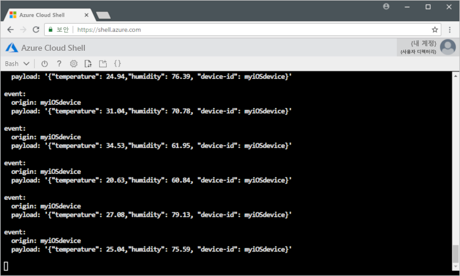

# <a name="quickstart-send-telemetry-from-a-device-to-an-iot-hub-ios"></a>빠른 시작: 원격 분석을 장치에서 IoT 허브로 전송(iOS)

[!INCLUDE [iot-hub-quickstarts-1-selector](../../includes/iot-hub-quickstarts-1-selector.md)]

IoT Hub는 저장 또는 처리를 위해 IoT 장치에서 클라우드로 다량의 원격 분석 데이터를 수집할 수 있게 해주는 Azure 서비스입니다. 이 아티클에서는 시뮬레이션된 장치 응용 프로그램에서 IoT Hub로 원격 분석을 보냅니다. 그런 다음, 백 엔드 응용 프로그램에서 데이터를 볼 수 있습니다. 

이 아티클에서는 미리 작성된 Swift 응용 프로그램을 사용하여 원격 분석을 보내고, CLI 유틸리티를 사용하여 IoT Hub에서 원격 분석을 읽습니다. 

[!INCLUDE [cloud-shell-try-it.md](../../includes/cloud-shell-try-it.md)]

Azure 구독이 아직 없는 경우 시작하기 전에 [무료 계정](https://azure.microsoft.com/free/?WT.mc_id=A261C142F) 을 만듭니다.

## <a name="prerequisites"></a>필수 조건

- [Azure 샘플](https://github.com/Azure-Samples/azure-iot-samples-ios/archive/master.zip)에서 코드 샘플 다운로드 
- 최신 버전의 iOS SDK를 실행 중인 최신 버전의 [XCode](https://developer.apple.com/xcode/). 이 빠른 시작은 XCode 9.3 및 iOS 11.3에서 테스트되었습니다.
- 최신 버전의 [CocoaPods](https://guides.cocoapods.org/using/getting-started.html).

## <a name="create-an-iot-hub"></a>IoT Hub 만들기

[!INCLUDE [iot-hub-quickstarts-create-hub](../../includes/iot-hub-quickstarts-create-hub.md)]

## <a name="register-a-device"></a>장치 등록

연결을 위해 장치를 IoT Hub에 등록해야 합니다. 이 빠른 시작에서는 Azure CLI를 사용하여 시뮬레이션된 장치를 등록합니다.

1. IoT Hub CLI 확장을 추가하고 장치 ID를 만듭니다. `{YourIoTHubName}`을 IoT Hub의 이름으로 바꿉니다.

   ```azurecli-interactive
   az extension add --name azure-cli-iot-ext
   az iot hub device-identity create --hub-name {YourIoTHubName} --device-id myiOSdevice
   ```

    장치에 다른 이름을 선택하는 경우 샘플 응용 프로그램에서 실행하기 전에 장치 이름을 업데이트합니다.

1. 방금 등록한 장치의 _장치 연결 문자열_을 가져오려면 다음 명령을 실행합니다.

   ```azurecli-interactive
   az iot hub device-identity show-connection-string --hub-name {YourIoTHubName} --device-id myiOSdevice --output table
   ```

   `Hostname=...=`과 같은 장치 연결 문자열을 기록해 둡니다. 이 값은 이 아티클의 뒷부분에서 사용합니다.

## <a name="send-simulated-telemetry"></a>시뮬레이션된 원격 분석 전송

샘플 응용 프로그램은 iOS 장치에서 실행되며, 이는 IoT Hub의 장치 관련 엔드포인트에 연결하고 시뮬레이션된 온도 및 습도 원격 분석을 전송합니다. 

### <a name="install-cocoapods"></a>CocoaPod 설치

CocoaPods는 타사 라이브러리를 사용하는 iOS 프로젝트의 종속성을 관리합니다.

터미널 창에서 필수 구성 요소에 다운로드한 Azure-IoT-Samples-iOS 폴더로 이동합니다. 그런 다음, 샘플 프로젝트로 이동합니다.

```sh
cd quickstart/sample-device
```

XCode가 닫혀 있는지 확인한 후, 다음 명령을 실행하여 **podfile** 파일에 선언된 CocoaPods를 설치합니다.

```sh
pod install
```

설치 명령은 프로젝트에 필요한 포드를 설치하고, 종속성에 Pod를 사용하도록 이미 구성된 XCode 작업 영역 파일도 만들었습니다. 

### <a name="run-the-sample-application"></a>샘플 응용 프로그램 실행 

1. XCode에서 샘플 작업 영역을 엽니다.

   ```sh
   open "MQTT Client Sample.xcworkspace"
   ```

2. **MQTT 클라이언트 샘플** 프로젝트를 확장한 다음, 같은 이름의 폴더를 확장합니다.  
3. XCode에서 편집을 위해 **ViewController.swift**를 엽니다. 
4. **connectionString** 변수를 검색하고 이전에 기록해 둔 장치 연결 문자열로 값을 업데이트합니다.
5. 변경 내용을 저장합니다. 
6. **빌드 및 실행** 단추 또는 **명령 + r** 키 콤보를 사용하여 장치 에뮬레이터에서 프로젝트를 실행합니다. 

   

7. 에뮬레이터가 열리면 샘플 앱에서 **시작**을 선택합니다.

다음 스크린샷은 응용 프로그램이 시뮬레이션된 원격 분석을 IoT Hub로 보낼 때의 몇 가지 출력 예를 보여 줍니다.

   

## <a name="read-the-telemetry-from-your-hub"></a>허브에서 원격 분석 읽기

XCode 에뮬레이터에서 실행된 샘플 앱은 장치에서 보낸 메시지에 대한 데이터를 보여 줍니다. IoT Hub를 통해 데이터를 받은 상태 그대로 볼 수도 있습니다. IoT Hub CLI 확장은 IoT Hub의 서비스 쪽 **이벤트** 엔드포인트에 연결합니다. 이 확장은 시뮬레이트된 장치에서 전송하는 장치-클라우드 메시지를 받습니다. IoT Hub 백 엔드 응용 프로그램은 일반적으로 클라우드에서 실행되며 장치-클라우드 메시지를 수신하고 처리합니다.

`{YourIoTHubName}`을 IoT Hub의 이름으로 바꾸어 다음 Azure CLI 명령을 실행합니다.

```azurecli-interactive
az iot hub monitor-events --device-id myiOSdevice --hub-name {YourIoTHubName}
```

다음 스크린샷은 확장이 시뮬레이트된 장치가 허브에 보낸 원격 분석을 수신할 때의 출력을 보여 줍니다.

다음 스크린샷에서는 터미널 창에 표시되는 원격 분석 유형을 보여 줍니다.



## <a name="clean-up-resources"></a>리소스 정리

[!INCLUDE [iot-hub-quickstarts-clean-up-resources](../../includes/iot-hub-quickstarts-clean-up-resources.md)]

## <a name="next-steps"></a>다음 단계

이 아티클에서는 IoT Hub를 설정하고, 장치를 등록하고, 시뮬레이션된 원격 분석을 iOS 장치에서 허브로 전송하고, 허브에서 원격 분석을 읽었습니다. 

백 엔드 응용 프로그램에서 시뮬레이션된 장치를 제어하는 방법을 알아보려면 다음 빠른 시작을 계속합니다.

> [!div class="nextstepaction"]
> [빠른 시작: IoT 허브에 연결된 장치 제어](quickstart-control-device-node.md)

<!-- Links -->
[lnk-process-d2c-tutorial]: tutorial-routing.md
[lnk-device-management]: iot-hub-node-node-device-management-get-started.md
[lnk-iot-edge]: ../iot-edge/tutorial-simulate-device-linux.md
[lnk-connect-device]: https://azure.microsoft.com/develop/iot/
