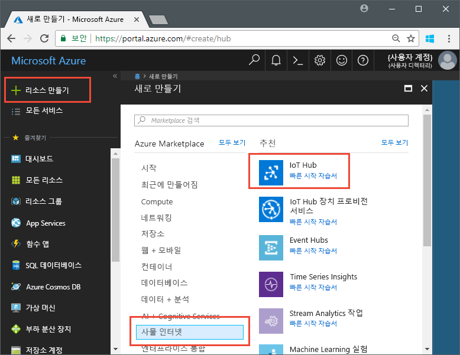
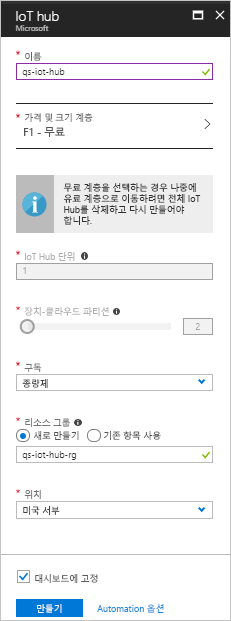

# <a name="send-telemetry-from-a-device-to-an-iot-hub-swift"></a>장치에서 IoT Hub(Swift)로 원격 분석 전송

IoT Hub는 저장 또는 처리를 위해 IoT 장치에서 클라우드로 다량의 원격 분석 데이터를 수집할 수 있게 해주는 Azure 서비스입니다. 이 아티클에서는 시뮬레이션된 장치 응용 프로그램에서 IoT Hub로 원격 분석을 보냅니다. 그런 다음, 백 엔드 응용 프로그램에서 데이터를 볼 수 있습니다. 

이 아티클에서는 미리 작성된 Swift 응용 프로그램을 사용하여 원격 분석을 보내고, CLI 유틸리티를 사용하여 IoT Hub에서 원격 분석을 읽습니다. 

[!INCLUDE [cloud-shell-try-it.md](../../includes/cloud-shell-try-it.md)]

Azure 구독이 아직 없는 경우 시작하기 전에 [무료 계정](https://azure.microsoft.com/free/?WT.mc_id=A261C142F) 을 만듭니다.

## <a name="prerequisites"></a>필수 조건

- [Azure 샘플](https://github.com/Azure-Samples/azure-iot-samples-ios/archive/master.zip)에서 코드 샘플 다운로드 
- 최신 버전의 iOS SDK를 실행 중인 최신 버전의 [XCode](https://developer.apple.com/xcode/). 이 빠른 시작은 XCode 9.3 및 iOS 11.3에서 테스트되었습니다.
- 최신 버전의 [CocoaPod](https://guides.cocoapods.org/using/getting-started.html).
- IoT Hub에서 원격 분석을 읽는 iothub-explorer CLI 유틸리티. 설치하려면 먼저 [Node.js](https://nodejs.org) v4.x.x 이상을 설치한 후, 다음 명령을 실행합니다. 

   ```sh
   sudo npm install -g iothub-explorer
   ```

## <a name="create-an-iot-hub"></a>IoT Hub 만들기

첫 번째 단계는 Azure Portal을 사용하여 구독에 IoT Hub를 만드는 것입니다. IoT Hub를 사용하면 다양한 장치에서 클라우드로 다량의 원격 분석을 수집할 수 있습니다. 그런 다음, 허브는 클라우드에서 실행 중인 하나 이상의 백 엔드 서비스가 원격 분석을 읽고 처리할 수 있게 합니다.

1. [Azure 포털](http://portal.azure.com)에 로그인합니다.

1. **리소스 만들기** > **사물 인터넷** > **IoT Hub**를 선택합니다. 

   

1. IoT Hub를 만들려면 다음 표의 값을 사용합니다.

    | 설정 | 값 |
    | ------- | ----- |
    | Name | 허브의 고유한 이름 |
    | 가격 책정 및 규모 계층 | F1 무료 |
    | IoT Hub 단위 | 1 |
    | 장치-클라우드 파티션 | 2개 파티션 |
    | 구독 | Azure 구독. |
    | 리소스 그룹 | 새로 만듭니다. 리소스 그룹의 이름을 입력합니다. |
    | 위치 | 가장 가까운 위치입니다. |
    | 대시보드에 고정 | 예 |

1. **만들기**를 클릭합니다.  

   

1. IoT Hub 및 리소스 그룹 이름을 기록해 둡니다. 이러한 값은 이 빠른 시작의 뒷부분에서 사용합니다.

## <a name="register-a-device"></a>장치 등록

연결을 위해 장치를 IoT Hub에 등록해야 합니다. 이 빠른 시작에서는 Azure CLI를 사용하여 시뮬레이션된 장치를 등록합니다.

1. IoT Hub CLI 확장을 추가하고 장치 ID를 만듭니다. `{YourIoTHubName}`을 IoT Hub의 이름으로 바꿉니다.

   ```azurecli-interactive
   az extension add --name azure-cli-iot-ext
   az iot hub device-identity create --hub-name {YourIoTHubName} --device-id myiOSdevice
   ```

    장치에 다른 이름을 선택하는 경우 샘플 응용 프로그램에서 실행하기 전에 장치 이름을 업데이트합니다.

1. 방금 등록한 장치의 _장치 연결 문자열_을 가져오려면 다음 명령을 실행합니다.

   ```azurecli-interactive
   az iot hub device-identity show-connection-string --hub-name {YourIoTHubName} --device-id myiOSdevice --output table
   ```

   `Hostname=...=`과 같은 장치 연결 문자열을 기록해 둡니다. 이 값은 이 아티클의 뒷부분에서 사용합니다.

1. 또한 백 엔드 응용 프로그램이 IoT Hub에 연결하고 장치-클라우드 메시지를 검색할 수 있게 하려면 _서비스 연결 문자열_이 필요합니다. 다음 명령은 IoT Hub에 대한 서비스 연결 문자열을 검색합니다.

   ```azurecli-interactive
   az iot hub show-connection-string --hub-name {YourIoTHubName} --output table
   ```

   `Hostname=...=`과 같은 서비스 연결 문자열을 기록해 둡니다. 이 값은 이 아티클의 뒷부분에서 사용합니다.

## <a name="send-simulated-telemetry"></a>시뮬레이션된 원격 분석 전송

샘플 응용 프로그램은 iOS 장치에서 실행되며, 이는 IoT Hub의 장치 관련 엔드포인트에 연결하고 시뮬레이션된 온도 및 습도 원격 분석을 전송합니다. 

### <a name="install-cocoapods"></a>CocoaPod 설치

CocoaPods는 타사 라이브러리를 사용하는 iOS 프로젝트의 종속성을 관리합니다.

터미널 창에서 필수 구성 요소에 다운로드한 Azure-IoT-Samples-iOS 폴더로 이동합니다. 그런 다음, 샘플 프로젝트로 이동합니다.

```sh
cd quickstart/sample-device
```

XCode가 닫혀 있는지 확인한 후, 다음 명령을 실행하여 **podfile** 파일에 선언된 CocoaPods를 설치합니다.

```sh
pod install
```

설치 명령은 프로젝트에 필요한 포드를 설치하고, 종속성에 Pod를 사용하도록 이미 구성된 XCode 작업 영역 파일도 만들었습니다. 

### <a name="run-the-sample-application"></a>샘플 응용 프로그램 실행 

1. XCode에서 샘플 작업 영역을 엽니다.

   ```sh
   open "MQTT Client Sample.xcworkspace"
   ```

2. **MQTT 클라이언트 샘플** 프로젝트를 확장한 다음, 같은 이름의 폴더를 확장합니다.  
3. XCode에서 편집을 위해 **ViewController.swift**를 엽니다. 
4. **connectionString** 변수를 검색하고 이전에 기록해 둔 장치 연결 문자열로 값을 업데이트합니다.
5. 변경 내용을 저장합니다. 
6. **빌드 및 실행** 단추 또는 **명령 + r** 키 콤보를 사용하여 장치 에뮬레이터에서 프로젝트를 실행합니다. 

   

7. 에뮬레이터가 열리면 샘플 앱에서 **시작**을 선택합니다.

다음 스크린샷은 응용 프로그램이 시뮬레이션된 원격 분석을 IoT Hub로 보낼 때의 몇 가지 출력 예를 보여 줍니다.

   

## <a name="read-the-telemetry-from-your-hub"></a>허브에서 원격 분석 읽기

XCode 에뮬레이터에서 실행된 샘플 앱은 장치에서 보낸 메시지에 대한 데이터를 보여 줍니다. IoT Hub를 통해 데이터를 받은 상태 그대로 볼 수도 있습니다. `iothub-explorer` CLI 유틸리티는 IoT Hub의 서비스 측 **이벤트** 엔드포인트에 연결합니다. 

새 터미널 창을 엽니다. {your hub service connection string}을 이 아티클의 시작 부분에서 검색한 서비스 연결 문자열로 바꾸는 다음 명령을 실행합니다.

```sh
iothub-explorer monitor-events myiOSdevice --login "{your hub service connection string}"
```

다음 스크린샷에서는 터미널 창에 표시되는 원격 분석 유형을 보여 줍니다.


Iothub-explorer 명령을 실행할 때 오류가 나타나면 IoT 장치의 *장치 연결 문자열* 대신 IoT Hub의 *서비스 연결 문자열*을 사용하고 있는지 다시 한 번 확인합니다. 두 연결 문자열은 모두 **Hostname={iothubname}** 으로 시작하지만, 장치 연결 문자열에는 **DeviceID**가 포함되어 있고, 서비스 연결 문자열에는 **SharedAccessKeyName** 속성이 포함되어 있습니다. 

## <a name="clean-up-resources"></a>리소스 정리

다른 아티클을 통해 IoT Hub를 계속 테스트하려는 경우 리소스 그룹과 IoT Hub를 그대로 두고 나중에 다시 사용합니다.

더 이상 IoT Hub가 필요하지 않으면 포털에서 IoT Hub와 리소스 그룹을 삭제합니다. 이렇게 하려면 IoT Hub가 포함된 리소스 그룹을 선택하고 **삭제**를 클릭합니다.

## <a name="next-steps"></a>다음 단계

이 아티클에서는 IoT Hub를 설정하고, 장치를 등록하고, 시뮬레이션된 원격 분석을 iOS 장치에서 허브로 전송하고, 허브에서 원격 분석을 읽었습니다. 

iOS 장치가 IoT Hub와 함께 작동하는 방법에 대해 계속 알아보려면 [iOS(Swift)로 클라우드-장치 메시지 보내기](iot-hub-ios-swift-c2d.md)를 참조하세요.

<!-- Links -->
[lnk-process-d2c-tutorial]: iot-hub-csharp-csharp-process-d2c.md
[lnk-device-management]: iot-hub-node-node-device-management-get-started.md
[lnk-iot-edge]: ../iot-edge/tutorial-simulate-device-linux.md
[lnk-connect-device]: https://azure.microsoft.com/develop/iot/
