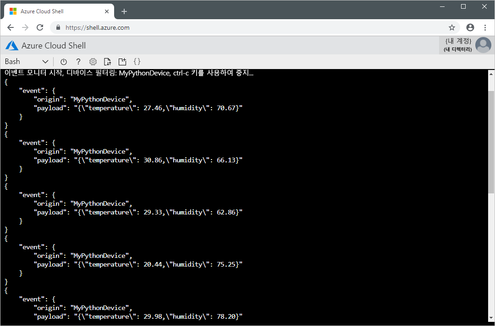

# <a name="quickstart-send-telemetry-from-a-device-to-an-iot-hub-and-read-it-with-a-back-end-application-python"></a>빠른 시작: 디바이스에서 IoT Hub로 원격 분석을 보내고 백 엔드 애플리케이션(Python)으로 읽습니다.

[!INCLUDE [iot-hub-quickstarts-1-selector](../../includes/iot-hub-quickstarts-1-selector.md)]

IoT Hub는 저장 또는 처리를 위해 IoT 디바이스에서 클라우드로 다량의 원격 분석 데이터를 수집할 수 있게 해주는 Azure 서비스입니다. 이 빠른 시작에서는 시뮬레이션된 장치 애플리케이션에서 IoT Hub를 통해 백 엔드 애플리케이션으로 원격 분석을 처리를 위해 보냅니다.

빠른 시작은 미리 작성된 Python 애플리케이션을 사용하여 원격 분석을 보내고 CLI 유틸리티를 사용하여 허브에서 원격 분석을 읽기 위한 것입니다. 이 두 애플리케이션을 실행하기 전에 IoT 허브를 만들고 허브에 장치를 등록합니다.

[!INCLUDE [cloud-shell-try-it.md](../../includes/cloud-shell-try-it.md)]

Azure 구독이 아직 없는 경우 시작하기 전에 [무료 계정](https://azure.microsoft.com/free/?WT.mc_id=A261C142F) 을 만듭니다.

## <a name="prerequisites"></a>필수 조건

이 빠른 시작에서 실행하는 샘플 애플리케이션은 Python을 사용하여 작성되었습니다. 현재, Python용 Microsoft Azure IoT SDK는 각 플랫폼에 대해 특정 버전의 Python만 지원합니다. 자세한 내용은 [Python SDK Readme](https://github.com/Azure/azure-iot-sdk-python#important-installation-notes---dealing-with-importerror-issues)를 참조하세요.

이 빠른 시작은 사용자가 Windows 개발 컴퓨터를 사용한다고 가정합니다. Windows 시스템의 경우 [Python 3.6.x](https://www.python.org/downloads/release/python-368/)만 지원됩니다. 선택한 Python 설치 관리자는 사용하는 시스템의 아키텍처를 기반으로 해야 합니다. 시스템 CPU 아키텍처가 32비트면 x86 설치 관리자를 다운로드하고, 64비트 아키텍처면 x86-64 설치 관리자를 다운로드합니다. 또한 아키텍처에 대해 [Visual Studio 2019용 Microsoft Visual C++ 재배포 가능 패키지](https://support.microsoft.com/en-us/help/2977003/the-latest-supported-visual-c-downloads)가 설치되어 있는지 확인합니다(x86 또는 x64).

[Python.org](https://www.python.org/downloads/)에서 다른 플랫폼용 Python을 다운로드할 수 있습니다.

다음 명령 중 하나를 사용하여 개발 컴퓨터에서 Python의 현재 버전을 확인할 수 있습니다.

```python
python --version
```

```python
python3 --version
```

다음 명령을 실행하여 Cloud Shell 인스턴스에 Azure CLI용 Microsoft Azure IoT 확장을 추가합니다. IOT 확장은 Azure CLI에 IoT Hub, IoT Edge 및 IoT DPS(Device Provisioning Service)별 명령을 추가합니다.

```azurecli-interactive
az extension add --name azure-cli-iot-ext
```

https://github.com/Azure-Samples/azure-iot-samples-python/archive/master.zip에서 샘플 Python 프로젝트를 다운로드하고 ZIP 보관 파일을 추출합니다.

## <a name="create-an-iot-hub"></a>IoT Hub 만들기

[!INCLUDE [iot-hub-include-create-hub](../../includes/iot-hub-include-create-hub.md)]

## <a name="register-a-device"></a>디바이스 등록

연결을 위해 디바이스를 IoT Hub에 등록해야 합니다. 이 빠른 시작에서는 Azure Cloud Shell을 사용하여 시뮬레이션된 디바이스를 등록합니다.

1. Azure Cloud Shell에서 다음 명령을 실행하여 디바이스 ID를 만듭니다.

    **YourIoTHubName**: 이 자리 표시자를 IoT 허브용으로 선택한 이름으로 바꿉니다.

    **MyPythonDevice**: 등록된 디바이스에 지정된 이름입니다. 표시된 것처럼 MyPythonDevice를 사용합니다. 다른 장치 이름을 선택하는 경우 이 문서 전체에서 해당 이름을 사용해야 하고, 샘플 애플리케이션에서 장치 이름을 업데이트한 후 실행해야 합니다.

    ```azurecli-interactive
    az iot hub device-identity create --hub-name YourIoTHubName --device-id MyPythonDevice
    ```

1. Azure Cloud Shell에서 다음 명령을 실행하여 등록한 디바이스의 _디바이스 연결 문자열_을 가져옵니다.

    **YourIoTHubName**: 이 자리 표시자를 IoT 허브용으로 선택한 이름으로 바꿉니다.

    ```azurecli-interactive
    az iot hub device-identity show-connection-string --hub-name YourIoTHubName --device-id MyPythonDevice --output table
    ```

    다음과 같은 디바이스 연결 문자열을 기록해 둡니다.

   `HostName={YourIoTHubName}.azure-devices.net;DeviceId=MyNodeDevice;SharedAccessKey={YourSharedAccessKey}`

    이 값은 빠른 시작의 뒷부분에서 사용합니다.

## <a name="send-simulated-telemetry"></a>시뮬레이션된 원격 분석 전송

시뮬레이션된 장치 애플리케이션은 IoT 허브의 장치 관련 엔드포인트에 연결하고 시뮬레이션된 온도 및 습도 원격 분석을 전송합니다.

1. 로컬 터미널 창에서 Python 프로젝트 샘플의 루트 폴더로 이동합니다. 그런 다음, **iot-hub\Quickstarts\simulated-device** 폴더로 이동합니다.

1. 원하는 텍스트 편집기에서 **SimulatedDevice.py** 파일을 엽니다.

    `CONNECTION_STRING` 변수의 값을 이전에 적어둔 디바이스 연결 문자열로 바꿉니다. 그런 다음 변경 사항을 **SimulatedDevice.py** 파일에 저장합니다.

1. 로컬 터미널 창에서 다음 명령을 실행하여 시뮬레이션된 장치 애플리케이션에 필요한 라이브러리를 설치합니다.

    ```cmd/sh
    pip install azure-iothub-device-client
    ```

1. 로컬 터미널 창에서 다음 명령을 실행하여 시뮬레이션된 장치 애플리케이션을 실행합니다.

    ```cmd/sh
    python SimulatedDevice.py
    ```

    다음 스크린샷에서는 시뮬레이션된 장치 애플리케이션에서 IoT 허브에 원격 분석을 보낼 때의 출력을 보여 줍니다.

    

## <a name="read-the-telemetry-from-your-hub"></a>허브에서 원격 분석 읽기

IoT Hub CLI 확장은 IoT Hub의 서비스 쪽 **이벤트** 엔드포인트에 연결할 수 있습니다. 이 확장은 시뮬레이트된 디바이스에서 보낸 디바이스-클라우드 메시지를 받습니다. IoT Hub 백 엔드 애플리케이션은 일반적으로 클라우드에서 실행되며 장치-클라우드 메시지를 수신하고 처리합니다.

Azure Cloud Shell에서 다음 명령을 실행하고, `YourIoTHubName`을 해당 IoT 허브 이름으로 바꿉니다.

```azurecli-interactive
az iot hub monitor-events --hub-name YourIoTHubName --device-id MyPythonDevice 
```

다음 스크린샷은 시뮬레이션된 디바이스가 허브에 보낸 원격 분석 데이터를 확장 프로그램이 수신하면서 출력한 내용을 보여 줍니다.



## <a name="clean-up-resources"></a>리소스 정리

[!INCLUDE [iot-hub-quickstarts-clean-up-resources](../../includes/iot-hub-quickstarts-clean-up-resources.md)]

## <a name="next-steps"></a>다음 단계

이 빠른 시작에서 IoT 허브를 설치하고, 장치를 등록하고 Python 애플리케이션을 사용하여 허브에 시뮬레이션된 원격 분석을 보내고, 간단한 백 엔드 애플리케이션을 사용하여 허브에서 원격 분석을 읽었습니다.

백 엔드 애플리케이션에서 시뮬레이션된 장치를 제어하는 방법을 알아보려면 다음 빠른 시작을 계속합니다.

> [!div class="nextstepaction"]
> [빠른 시작: IoT 허브에 연결된 디바이스 제어](quickstart-control-device-python.md)