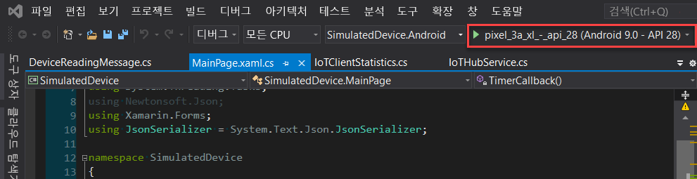
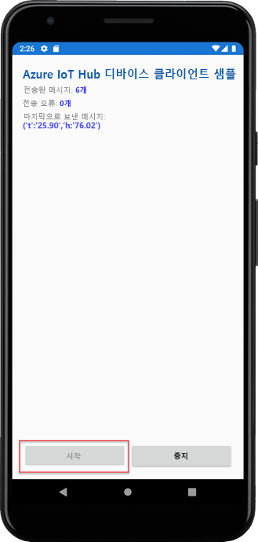

# <a name="quickstart-send-telemetry-from-a-device-to-an-iot-hub-xamarinforms"></a>빠른 시작: 디바이스에서 IoT 허브로 원격 분석 데이터 보내기(Xamarin.Forms)

[!INCLUDE [iot-hub-quickstarts-1-selector](../../includes/iot-hub-quickstarts-1-selector.md)]

IoT Hub는 스토리지 또는 처리를 위해 IoT 디바이스에서 클라우드로 다량의 원격 분석 데이터를 수집할 수 있게 해주는 Azure 서비스입니다. 이 아티클에서는 시뮬레이션된 디바이스 애플리케이션에서 IoT Hub로 원격 분석을 보냅니다. 그런 다음, 백 엔드 애플리케이션에서 데이터를 볼 수 있습니다.

이 문서에서는 미리 작성된 Xamarin.Forms 애플리케이션을 사용하여 원격 분석을 보내고, CLI 유틸리티를 사용하여 IoT Hub에서 원격 분석을 읽습니다.

[!INCLUDE [cloud-shell-try-it.md](../../includes/cloud-shell-try-it.md)]

Azure 구독이 아직 없는 경우 시작하기 전에 [체험 계정](https://azure.microsoft.com/free/?WT.mc_id=A261C142F)을 만듭니다.


## <a name="prerequisites"></a>필수 구성 요소

- [Azure 샘플](https://github.com/Azure-Samples/azure-iot-samples-xamarin/archive/master.zip)에서 코드 샘플 다운로드

- Xamarin.Forms 도구가 설치된 최신 버전의 [Visual Studio 2019](https://visualstudio.microsoft.com/) 또는 [Mac용 Visual Studio](https://visualstudio.microsoft.com/). 이 빠른 시작은 Visual Studio 16.6.0에서 테스트되었습니다.

- 방화벽에서 포트 8883이 열려 있는지 확인합니다. 이 빠른 시작의 디바이스 샘플은 포트 8883을 통해 통신하는 MQTT 프로토콜을 사용합니다. 이 포트는 일부 회사 및 교육용 네트워크 환경에서 차단될 수 있습니다. 이 문제를 해결하는 자세한 내용과 방법은 [IoT Hub에 연결(MQTT)](iot-hub-mqtt-support.md#connecting-to-iot-hub)을 참조하세요.

- 다음 명령을 실행하여 Cloud Shell 인스턴스에 Azure CLI용 Microsoft Azure IoT 확장을 추가합니다. IoT 확장은 Azure CLI에 IoT Hub, IoT Edge 및 IoT DPS(Device Provisioning Service) 고유의 명령을 추가합니다.

   ```azurecli-interactive
   az extension add --name azure-iot
   ```

   [!INCLUDE [iot-hub-cli-version-info](../../includes/iot-hub-cli-version-info.md)]

## <a name="create-an-iot-hub"></a>IoT Hub 만들기

[!INCLUDE [iot-hub-include-create-hub](../../includes/iot-hub-include-create-hub.md)]

## <a name="register-a-device"></a>디바이스 등록

연결을 위해 디바이스를 IoT Hub에 등록해야 합니다. 이 빠른 시작에서는 Azure Cloud Shell을 사용하여 시뮬레이션된 디바이스를 등록합니다.

1. Azure Cloud Shell에서 다음 명령을 실행하여 디바이스 ID를 만듭니다.

   **YourIoTHubName**: 이 자리 표시자를 IoT 허브용으로 선택한 이름으로 바꿉니다.

   **myXamarinDevice**: 등록 중인 디바이스의 이름입니다. 보여드리는 것처럼 **myXamarinDevice**를 사용하는 것이 좋습니다. 다른 디바이스 이름을 선택하는 경우 이 문서 전체에서도 해당 이름을 사용해야 하며, 샘플 애플리케이션에서 디바이스 이름을 업데이트한 후 실행해야 합니다.

   ```azurecli-interactive
   az iot hub device-identity create --hub-name {YourIoTHubName} --device-id myXamarinDevice
   ```

1. Azure Cloud Shell에서 다음 명령을 실행하여 방금 등록한 디바이스의 _디바이스 연결 문자열_을 가져옵니다.

   **YourIoTHubName**: 이 자리 표시자를 IoT 허브용으로 선택한 이름으로 바꿉니다.

   ```azurecli-interactive
   az iot hub device-identity show-connection-string --hub-name {YourIoTHubName} --device-id myXamarinDevice --output table
   ```

   다음과 같은 디바이스 연결 문자열을 기록해 둡니다.

   `HostName={YourIoTHubName}.azure-devices.net;DeviceId=myXamarinDevice;SharedAccessKey={YourSharedAccessKey}`

    이 값은 빠른 시작의 뒷부분에서 사용합니다.

## <a name="send-simulated-telemetry"></a>시뮬레이션된 원격 분석 전송

샘플 애플리케이션은 Windows(UWP 앱을 통해), iOS 디바이스 또는 시뮬레이터, Android 디바이스 또는 시뮬레이터에서 실행되며, IoT 허브의 디바이스 관련 엔드포인트에 연결하여 시뮬레이션된 온도 및 습도 원격 분석 데이터를 전송합니다. 

1. Visual Studio 또는 Mac용 Visual Studio에서 샘플 작업 영역을 엽니다.
2. **SimulatedDevice** 프로젝트를 확장합니다.  
3. 편집할 **IoTHubService.cs**를 Visual Studio에서 엽니다. 
4. **_iotHubConnectionString** 변수를 검색하고, 이전에 기록해 둔 디바이스 연결 문자열로 값을 업데이트합니다.
5. 변경 내용을 저장합니다. 
6. 디바이스 에뮬레이터 또는 실제 디바이스에서 **빌드 및 실행** 단추를 사용하거나 Windows에서 **F5**, 또는 Mac에서 **command + r** 바로 가기 키를 사용하여 프로젝트를 실행합니다. 

   

7. 에뮬레이터가 열리면 샘플 앱에서 **시작**을 선택합니다.

다음 스크린샷은 애플리케이션이 시뮬레이션된 원격 분석을 IoT Hub로 보낼 때의 몇 가지 출력 예를 보여 줍니다. 

## <a name="read-the-telemetry-from-your-hub"></a>허브에서 원격 분석 읽기

XCode 에뮬레이터에서 실행된 샘플 앱은 디바이스에서 보낸 메시지에 대한 데이터를 보여줍니다. IoT Hub를 통해 데이터를 받은 상태 그대로 볼 수도 있습니다. IoT Hub CLI 확장은 IoT Hub의 서비스 쪽 **이벤트** 엔드포인트에 연결할 수 있습니다. 이 확장은 시뮬레이트된 디바이스에서 보낸 디바이스-클라우드 메시지를 받습니다. IoT Hub 백 엔드 애플리케이션은 일반적으로 클라우드에서 실행되며 디바이스-클라우드 메시지를 수신하고 처리합니다.

Azure Cloud Shell에서 다음 명령을 실행하고, `YourIoTHubName`을 해당 IoT 허브 이름으로 바꿉니다.

```azurecli-interactive
az iot hub monitor-events --device-id myXamarinDevice --hub-name {YourIoTHubName}
```

다음 스크린샷은 시뮬레이션된 디바이스가 허브에 보낸 원격 분석 데이터를 확장 프로그램이 수신하면서 출력한 내용을 보여 줍니다.

다음 스크린샷에서는 로컬 터미널 창에 표시되는 원격 분석 유형을 보여줍니다. 

## <a name="clean-up-resources"></a>리소스 정리

[!INCLUDE [iot-hub-quickstarts-clean-up-resources](../../includes/iot-hub-quickstarts-clean-up-resources.md)]

## <a name="next-steps"></a>다음 단계

이 빠른 시작에서는 IoT 허브를 설정하고, 디바이스를 등록하고, 시뮬레이션된 원격 분석 데이터를 Xamarin.Forms 애플리케이션에서 허브로 전송하고, 허브에서 원격 분석 데이터를 읽었습니다. 

백 엔드 애플리케이션에서 시뮬레이션된 디바이스를 제어하는 방법을 알아보려면 다음 빠른 시작을 계속합니다.

> [!div class="nextstepaction"]
> [빠른 시작: IoT 허브에 연결된 디바이스 제어](quickstart-control-device-node.md)
