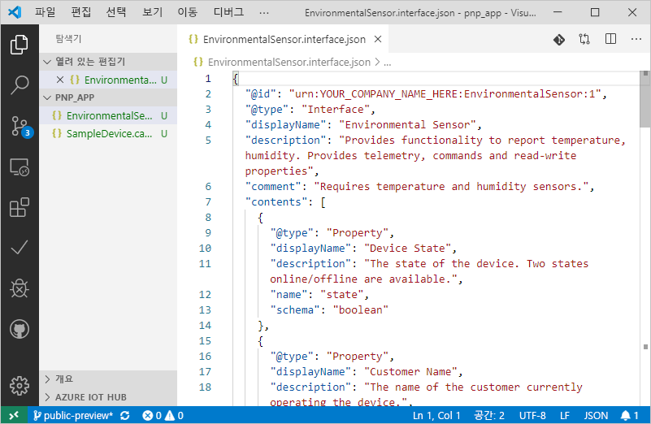
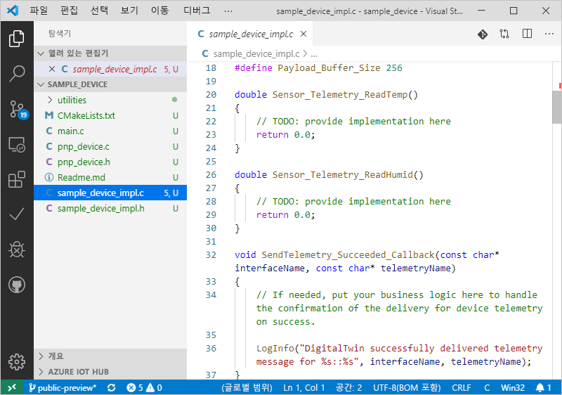

# <a name="quickstart-use-a-device-capability-model-to-create-an-iot-plug-and-play-preview-device-linux"></a>빠른 시작: 디바이스 기능 모델을 사용하여 IoT 플러그 앤 플레이 미리 보기 디바이스 만들기(Linux)

_DCM(디바이스 기능 모델)_ 은 IoT 플러그 앤 플레이 디바이스의 기능을 설명합니다. DCM은 종종 제품 SKU와 연결됩니다. DCM에 정의된 기능은 재사용 가능한 인터페이스로 구성됩니다. DCM에서 기본 디바이스 코드를 생성할 수 있습니다. 이 빠른 시작에서는 Ubuntu Linux에서 VS Code를 사용하여 DCM을 사용하는 IoT 플러그 앤 플레이 디바이스를 만드는 방법을 보여 줍니다.

## <a name="prerequisites"></a>필수 조건

이 빠른 시작에서는 데스크톱 환경에서 Ubuntu Linux를 사용하고 있다고 가정합니다. 이 자습서의 단계는 Ubuntu 18.04를 사용하여 테스트했습니다.

이 빠른 시작을 완료하려면 로컬 Linux 머신에 다음 소프트웨어를 설치해야 합니다.

* `apt-get` 명령을 사용하여 **GCC**, **Git**, **cmake** 및 모든 종속성을 설치합니다.

    ```sh
    sudo apt-get update
    sudo apt-get install -y git cmake build-essential curl libcurl4-openssl-dev libssl-dev uuid-dev
    ```

    `cmake` 버전이 **2.8.12**보다 크고, **GCC** 버전이 **4.4.7**보다 큰지 확인합니다.

    ```sh
    cmake --version
    gcc --version
    ```

* [Visual Studio Code](https://code.visualstudio.com/)

### <a name="install-azure-iot-tools"></a>Azure IoT Tools 설치

[VS Code용 Azure IoT Tools](https://marketplace.visualstudio.com/items?itemName=vsciot-vscode.azure-iot-tools) 확장을 설치하려면 다음 단계를 수행합니다.

1. VS Code에서 **확장** 탭을 선택합니다.
1. **Azure IoT Tools**를 검색합니다.
1. **설치**를 선택합니다.

### <a name="get-the-connection-string-for-your-company-model-repository"></a>회사 모델 리포지토리의 연결 문자열 가져오기

Microsoft 회사 또는 학교 계정으로 로그인하거나 Microsoft 파트너 ID로 로그인할 때(갖고 있는 경우) [IoT용 Azure Certified 포털](https://preview.catalog.azureiotsolutions.com)에서 _회사 모델 리포지토리 연결 문자열_을 찾을 수 있습니다. 로그인한 후에는 **회사 리포지토리**를 선택한 다음, **연결 문자열**을 선택합니다.

[!INCLUDE [cloud-shell-try-it.md](../../includes/cloud-shell-try-it.md)]

## <a name="prepare-an-iot-hub"></a>IoT Hub 준비

또한 이 빠른 시작을 완료하려면 Azure 구독의 Azure IoT Hub가 필요합니다. Azure 구독이 아직 없는 경우 시작하기 전에 [체험 계정](https://azure.microsoft.com/free/?WT.mc_id=A261C142F)을 만듭니다. IoT Hub가 없는 경우 아래에 만드는 단계가 나와 있습니다.

Azure CLI을 로컬로 사용하는 경우 `az` 버전은 **2.0.75** 이상이어야 합니다. Azure Cloud Shell은 최신 버전을 사용합니다. `az --version` 명령을 사용하여 컴퓨터에 설치된 버전을 확인합니다.

다음 명령을 실행하여 Cloud Shell 인스턴스에 Azure CLI용 Microsoft Azure IoT 확장을 추가합니다.

```azurecli-interactive
az extension add --name azure-cli-iot-ext
```

이 빠른 시작의 단계에는 버전 **0.8.5** 이상의 확장이 필요합니다. `az extension list` 명령을 사용하여 설치된 버전을 확인하고 필요한 경우 `az extension update` 명령을 사용하여 업데이트합니다.

IoT Hub가 없는 경우 다음 명령을 사용하여 하나를 만들고 `<YourIoTHubName>`을(를) 원하는 고유한 이름으로 바꿉니다. 이러한 명령을 로컬로 실행하는 경우 먼저 `az login`을 사용하여 Azure 구독에 로그인합니다. Azure Cloud Shell에서 이러한 명령을 실행하는 경우 자동으로 로그인됩니다.

  ```azurecli-interactive
  az group create --name pnpquickstarts_rg --location centralus
  az iot hub create --name <YourIoTHubName> \
    --resource-group pnpquickstarts_rg --sku S1
  ```

이전 명령은 미국 중부 지역에 `pnpquickstarts_rg`라는 리소스 그룹과 IoT Hub를 만듭니다.

> [!IMPORTANT]
> 공개 미리 보기 기간에는 **미국 중부**, **북유럽** 및 **일본 동부** 지역에서 만든 IoT 허브에서만 IoT 플러그 앤 플레이를 사용할 수 있습니다.

다음 명령을 실행하여 IoT Hub에 디바이스 ID를 만듭니다. **YourIoTHubName** 및 **YourDevice** 자리 표시자를 실제 이름으로 바꿉니다.

```azurecli-interactive
az iot hub device-identity create --hub-name <YourIoTHubName> --device-id <YourDevice>
```

다음 명령을 실행하여 방금 등록한 디바이스의 _디바이스 연결 문자열_을 가져옵니다.

```azurecli-interactive
az iot hub device-identity show-connection-string --hub-name <YourIoTHubName> --device-id <YourDevice> --output table
```

## <a name="author-your-model"></a>모델 작성

이 빠른 시작에서는 기존 샘플 디바이스 기능 모델 및 연결된 인터페이스를 사용합니다.

1. 로컬 드라이브에 `pnp_app` 디렉터리를 만듭니다. 이 폴더는 디바이스 모델 파일 및 디바이스 코드 스텁에 사용됩니다.

    ```bash
    cd ~
    mkdir pnp_app
    ```

1. 디바이스 기능 모델 및 인터페이스 샘플 파일을 `pnp_app` 폴더에 다운로드합니다.

    ```bash
    cd pnp_app
    curl -O -L https://raw.githubusercontent.com/Azure/IoTPlugandPlay/master/samples/SampleDevice.capabilitymodel.json
    curl -O -L https://raw.githubusercontent.com/Azure/IoTPlugandPlay/master/samples/EnvironmentalSensor.interface.json
    ```

1. VS Code에서 `pnp_app` 폴더를 엽니다. 다음과 같이 Intellisense를 사용하여 파일을 볼 수 있습니다.

    

1. 다운로드한 파일에서 `@id` 및 `schema` 필드의 `<YOUR_COMPANY_NAME_HERE>`를 고유한 값으로 바꿉니다. a-z, A-Z, 0-9 및 밑줄 문자만 사용합니다. 자세한 내용은 [디지털 쌍 식별자 형식](https://github.com/Azure/IoTPlugandPlay/tree/master/DTDL#digital-twin-identifier-format)을 참조하세요.

## <a name="generate-the-c-code-stub"></a>C 코드 스텁 생성

이제 DCM 및 관련 인터페이스가 있으므로, 모델을 구현하는 디바이스 코드를 생성할 수 있습니다. VS Code에서 C 코드 스텁을 생성하는 방법은 다음과 같습니다.

1. VS Code에서 `pnp_app` 폴더를 열고, **Ctrl+Shift+P**를 사용하여 명령 팔레트를 열고, **IoT 플러그 앤 플레이**를 입력하고, **디바이스 코드 스텁 생성**을 선택합니다.

    > [!NOTE]
    > IoT 플러그 앤 플레이 Code Generator 유틸리티를 처음 사용하는 경우 자동으로 다운로드하고 설치하는 데 몇 초 정도 걸립니다.

1. 디바이스 코드 스텁을 생성하는 데 사용할 **SampleDevice.capabilitymodel.json** 파일을 선택합니다.

1. 프로젝트 이름 **sample_device**를 입력합니다. 이것은 디바이스 애플리케이션의 이름입니다.

1. 언어로 **ANSI C**를 선택합니다.

1. 연결 방법으로 **IoT Hub 디바이스 연결 문자열을 통해**를 선택합니다.

1. 프로젝트 템플릿으로 **Linux의 CMake 프로젝트**를 선택합니다.

1. 디바이스 SDK를 포함하는 방법으로 **소스 코드를 통해**를 선택합니다.

1. **sample_device**라는 새 폴더가 DCM 파일이 있는 동일한 위치에 만들어지며, 그 안에는 생성된 디바이스 코드 스텁 파일이 있습니다. VS Code는 이 내용을 표시하기 위해 새 창을 엽니다.
    

## <a name="build-and-run-the-code"></a>코드 빌드 및 실행

디바이스 SDK 소스 코드를 사용하여 생성된 디바이스 코드 스텁을 빌드합니다. 빌드하는 애플리케이션은 IoT Hub에 연결하는 디바이스를 시뮬레이션합니다. 이 애플리케이션은 원격 분석 데이터 및 속성을 보내고 명령을 수신합니다.

1. 다음 명령을 실행하여 디바이스 SDK 소스 코드를 다운로드합니다.

    ```bash
    cd ~/pnp_app/sample_device
    git clone https://github.com/Azure/azure-iot-sdk-c --recursive -b public-preview
    ```

1. **sample_device** 애플리케이션에 대한 **CMake** 빌드 폴더를 만듭니다.

    ```bash
    cd ~/pnp_app/sample_device
    mkdir cmake
    cd cmake
    ```

1. CMake를 실행하여 SDK에서 앱을 빌드합니다.

    ```bash
    cmake .. -Duse_prov_client=ON -Dhsm_type_symm_key:BOOL=ON -Dskip_samples:BOOL=ON
    cmake --build .
    ```

1. 빌드가 성공적으로 완료되면 애플리케이션을 실행하고 IoT Hub 디바이스 연결 문자열을 매개 변수로 전달합니다.

    ```sh
    cd ~/pnp_app/sample_device/cmake
    ./sample_device "<device connection string>"
    ```

1. 디바이스 애플리케이션이 IoT Hub로 데이터를 보내기 시작합니다.

    

## <a name="validate-the-code"></a>코드 유효성 검사

### <a name="publish-device-model-files-to-model-repository"></a>디바이스 모델 파일을 모델 리포지토리에 게시

**az** CLI를 사용하여 디바이스 코드의 유효성을 검사하려면 파일을 모델 리포지토리에 게시해야 합니다.

1. VS Code에서 `pnp_app` 폴더를 열어 두고 **Ctrl+Shift+P**를 사용하여 명령 팔레트를 연 다음, **IoT 플러그 앤 플레이: 모델 리포지토리에 파일 제출**을 입력하고 선택합니다.

1. `SampleDevice.capabilitymodel.json` 및 `EnvironmentalSensor.interface.json` 파일을 선택합니다.

1. 회사 모델 리포지토리 연결 문자열을 입력합니다.

    > [!NOTE]
    > 연결 문자열은 리포지토리에 처음 연결할 때만 필요합니다.

1. VS Code 출력 창과 알림에서 파일이 성공적으로 게시되었는지 확인할 수 있습니다.

    > [!NOTE]
    > 디바이스 모델 파일을 게시할 때 오류가 발생하는 경우 **IoT 플러그 앤 플레이: 모델 리포지토리 로그아웃** 명령을 사용하여 로그아웃하고 단계를 다시 진행해볼 수 있습니다.

### <a name="use-the-azure-iot-cli-to-validate-the-code"></a>Azure IoT CLI를 사용하여 코드의 유효성을 검사합니다.

디바이스 클라이언트 샘플이 시작된 후에는 Azure CLI를 사용하여 작동하는지 확인할 수 있습니다.

다음 명령을 사용하여 샘플 디바이스가 보내는 원격 분석을 볼 수 있습니다. 출력에 원격 분석이 표시되기까지 1~ 2분 정도 기다려야 할 수 있습니다.

```azurecli-interactive
az iot dt monitor-events --hub-name <YourIoTHubNme> --device-id <YourDevice>
```

다음 명령을 사용하여 디바이스에서 보낸 모든 속성을 볼 수 있습니다.

```azurecli-interactive
az iot dt list-properties --device-id <YourDevice> --hub-name <YourIoTHubNme> --source private --repo-login "<Your company model repository connection string>"
```

## <a name="next-steps"></a>다음 단계

이 빠른 시작에서는 DCM을 사용하여 IoT 플러그 앤 플레이 디바이스를 만드는 방법을 알아보았습니다.

DCM에 대한 자세한 내용과 나만의 모델을 만드는 방법에 대한 자세한 내용을 보려면 자습서를 계속 진행하세요.

> [!div class="nextstepaction"]
> [자습서: Visual Studio Code를 사용하여 디바이스 기능 모델 만들기 및 테스트](tutorial-pnp-visual-studio-code.md)
