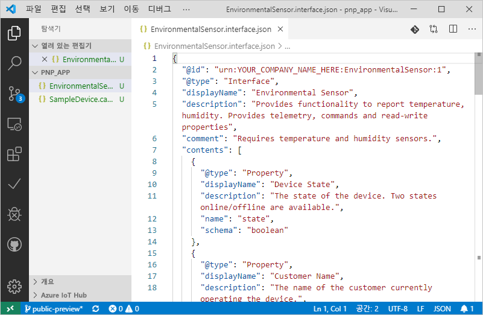
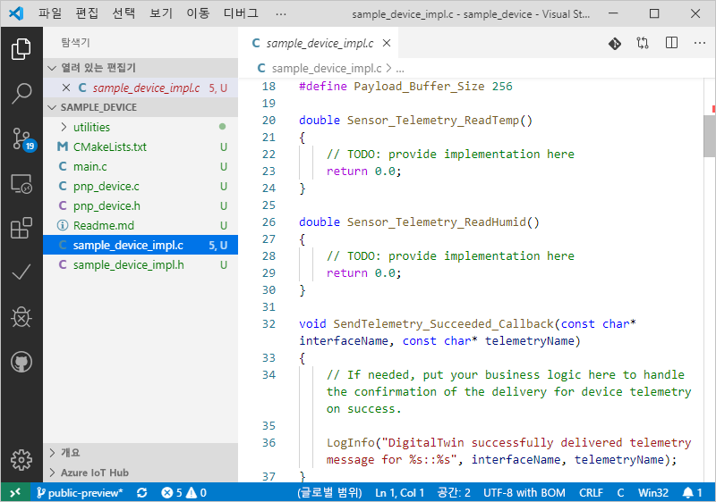

# <a name="quickstart-use-a-device-capability-model-to-create-an-iot-plug-and-play-preview-device-windows"></a>빠른 시작: 디바이스 기능 모델을 사용하여 IoT 플러그 앤 플레이 미리 보기 디바이스 만들기(Windows)

_DCM(디바이스 기능 모델)_ 은 IoT 플러그 앤 플레이 디바이스의 기능을 설명합니다. DCM은 종종 제품 SKU와 연결됩니다. DCM에 정의된 기능은 재사용 가능한 인터페이스로 구성됩니다. DCM에서 기본 디바이스 코드를 생성할 수 있습니다. 이 빠른 시작에서는 Windows에서 VS Code를 사용하여 DCM을 사용하는 IoT 플러그 앤 플레이 디바이스를 만드는 방법을 보여 줍니다.

## <a name="prerequisites"></a>필수 조건

이 빠른 시작을 완료하려면 로컬 머신에 다음 소프트웨어를 설치해야 합니다.

* **C++ 빌드 도구** 및 **NuGet 패키지 관리자 구성 요소** 워크로드를 사용하여 [Visual Studio용 도구를 빌드](https://visualstudio.microsoft.com/thank-you-downloading-visual-studio/?sku=BuildTools&rel=16)합니다. 또는 동일한 워크로드가 설치된 [Visual Studio(Community, Professional 또는 Enterprise)](https://visualstudio.microsoft.com/downloads/) 2019, 2017 또는 2015가 이미 있는 경우
* [Git](https://git-scm.com/download/)
* [CMake](https://cmake.org/download/)
* [Visual Studio Code](https://code.visualstudio.com/)

### <a name="install-azure-iot-tools"></a>Azure IoT Tools 설치

[VS Code용 Azure IoT Tools](https://marketplace.visualstudio.com/items?itemName=vsciot-vscode.azure-iot-tools) 확장을 설치하려면 다음 단계를 수행합니다.

1. VS Code에서 **확장** 탭을 선택합니다.
1. **Azure IoT Tools**를 검색합니다.
1. **설치**를 선택합니다.

### <a name="install-the-azure-iot-explorer"></a>Azure IoT 탐색기 설치

최신 업데이트에 대한 "자산"에서 .msi 파일을 선택하여 도구의 [리포지토리](https://github.com/Azure/azure-iot-explorer/releases) 페이지에서 최신 버전의 **Azure IoT 탐색기**를 다운로드하고 설치합니다.

### <a name="get-the-connection-string-for-your-company-model-repository"></a>회사 모델 리포지토리의 연결 문자열 가져오기

Microsoft 회사 또는 학교 계정으로 로그인하거나 Microsoft 파트너 ID로 로그인할 때(갖고 있는 경우) [IoT용 Azure Certified 포털](https://preview.catalog.azureiotsolutions.com)에서 _회사 모델 리포지토리 연결 문자열_을 찾을 수 있습니다. 로그인한 후에는 **회사 리포지토리**를 선택한 다음, **연결 문자열**을 선택합니다.

[!INCLUDE [cloud-shell-try-it.md](../../includes/cloud-shell-try-it.md)]

## <a name="prepare-an-iot-hub"></a>IoT Hub 준비

또한 이 빠른 시작을 완료하려면 Azure 구독의 Azure IoT Hub가 필요합니다. Azure 구독이 아직 없는 경우 시작하기 전에 [체험 계정](https://azure.microsoft.com/free/?WT.mc_id=A261C142F)을 만듭니다.

> [!NOTE]
> 공개 미리 보기 기간에는 **미국 중부**, **북유럽** 및 **일본 동부** 지역에서 만든 IoT 허브에서만 IoT 플러그 앤 플레이를 사용할 수 있습니다.

다음과 같이 Azure CLI용 Microsoft Azure IoT 확장을 추가합니다.

```azurecli-interactive
az extension add --name azure-cli-iot-ext
```

다음 명령을 실행하여 IoT Hub에 디바이스 ID를 만듭니다. **YourIoTHubName** 및 **YourDevice** 자리 표시자를 실제 이름으로 바꿉니다. IoT Hub가 없는 경우 [다음 지침에 따라 새로 만듭니다](../iot-hub/iot-hub-create-using-cli.md).

```azurecli-interactive
az iot hub device-identity create --hub-name [YourIoTHubName] --device-id [YourDevice]
```

다음 명령을 실행하여 방금 등록한 디바이스의 _디바이스 연결 문자열_을 가져옵니다.

```azurecli-interactive
az iot hub device-identity show-connection-string --hub-name [YourIoTHubName] --device-id [YourDevice] --output table
```

다음 명령을 실행하여 허브의 _IoT Hub 연결 문자열_을 가져옵니다.

```azurecli-interactive
az iot hub show-connection-string --hub-name [YourIoTHubName] --output table
```

다음과 같은 디바이스 연결 문자열을 기록해 둡니다.

```json
HostName={YourIoTHubName}.azure-devices.net;DeviceId=MyCDevice;SharedAccessKey={YourSharedAccessKey}
```

이 값은 빠른 시작의 뒷부분에서 사용합니다.

## <a name="prepare-the-development-environment"></a>개발 환경 준비

### <a name="get-azure-iot-device-sdk-for-c"></a>C용 Azure IoT 디바이스 SDK 받기

이 빠른 시작에서는 [Vcpkg](https://github.com/microsoft/vcpkg)를 통해 Azure IoT C 디바이스 SDK를 설치하여 개발 환경을 준비합니다.

1. 명령 프롬프트를 엽니다. 다음 명령을 실행하여 Vcpkg를 설치합니다.

    ```cmd/sh
    git clone https://github.com/Microsoft/vcpkg.git
    cd vcpkg

    .\bootstrap-vcpkg.bat
    ```

    그런 다음, 사용자 전체 [통합](https://github.com/microsoft/vcpkg/blob/master/docs/users/integration.md)을 연결하려면 다음을 실행합니다(참고: 처음 사용할 때 관리자가 필요함).

    ```cmd/sh
    .\vcpkg.exe integrate install
    ```

1. 다음과 같이 Azure IoT C 디바이스 SDK Vcpkg를 설치합니다.

    ```cmd/sh
    .\vcpkg.exe install azure-iot-sdk-c[public-preview,use_prov_client]
    ```

## <a name="author-your-model"></a>모델 작성

이 빠른 시작에서는 기존 샘플 디바이스 기능 모델 및 연결된 인터페이스를 사용합니다.

1. 로컬 드라이브에 `pnp_app` 디렉터리를 만듭니다.

1. [디바이스 기능 모델](https://github.com/Azure/IoTPlugandPlay/blob/master/samples/SampleDevice.capabilitymodel.json) 및 [인터페이스 샘플](https://github.com/Azure/IoTPlugandPlay/blob/master/samples/EnvironmentalSensor.interface.json)을 다운로드하고 파일을 `pnp_app` 폴더에 저장합니다.

    > [!TIP]
    > GitHub에서 파일을 다운로드하려면 파일을 탐색하고, **Raw**를 마우스 오른쪽 단추로 클릭한 다음, **다른 이름으로 링크 저장**을 선택합니다.

1. VS Code에서 `pnp_app` 폴더를 엽니다. 다음과 같이 Intellisense를 사용하여 파일을 볼 수 있습니다.

    

1. 다운로드한 파일에서 `@id` 및 `schema` 필드의 `<YOUR_COMPANY_NAME_HERE>`를 고유한 값으로 바꿉니다. a-z, A-Z, 0-9 및 밑줄 문자만 사용합니다. 자세한 내용은 [디지털 쌍 식별자 형식](https://github.com/Azure/IoTPlugandPlay/tree/master/DTDL#digital-twin-identifier-format)을 참조하세요.

## <a name="generate-the-c-code-stub"></a>C 코드 스텁 생성

이제 DCM 및 관련 인터페이스가 있으므로, 모델을 구현하는 디바이스 코드를 생성할 수 있습니다. VS Code에서 C 코드 스텁을 생성하는 방법은 다음과 같습니다.

1. DCM 파일이 들어 있는 폴더를 열어 놓은 상태에서, **Ctrl+Shift+P**를 사용하여 명령 팔레트를 열고, **IoT 플러그 앤 플레이**를 입력하고, **디바이스 코드 스텁 생성**을 선택합니다.

    > [!NOTE]
    > IoT 플러그 앤 플레이 CodeGen CLI를 처음 사용하는 경우 자동으로 다운로드하고 설치하는 데 몇 초 정도 걸립니다.

1. 디바이스 코드 스텁을 생성하는 데 사용할 DCM 파일을 선택합니다.

1. 프로젝트 이름으로 **sample_device**를 입력합니다. 이 이름이 디바이스 애플리케이션의 이름이 됩니다.

1. 언어로 **ANSI C**를 선택합니다.

1. 연결 방법으로 **IoT Hub 디바이스 연결 문자열을 통해**를 선택합니다.

1. 프로젝트 템플릿으로 **Windows의 CMake 프로젝트**를 선택합니다.

1. 디바이스 SDK를 포함하는 방법으로 **Via Vcpkg**를 선택합니다.

1. **sample_device**라는 새 폴더가 DCM 파일이 있는 동일한 위치에 만들어지며, 그 안에는 생성된 디바이스 코드 스텁 파일이 있습니다. VS Code는 이 내용을 표시하기 위해 새 창을 엽니다.
    

## <a name="build-the-code"></a>코드 빌드

디바이스 SDK를 사용하여 생성된 디바이스 코드 스텁을 함께 빌드합니다. 빌드하는 애플리케이션은 IoT Hub에 연결하는 디바이스를 시뮬레이션합니다. 이 애플리케이션은 원격 분석 데이터 및 속성을 보내고 명령을 수신합니다.

1. `sample_device` 폴더에 `cmake` 하위 디렉터리를 만들고 해당 폴더로 이동합니다.

    ```cmd\sh
    mkdir cmake
    cd cmake
    ```

1. 다음 명령을 실행하여 생성된 코드 스텁을 빌드합니다(자리 표시자를 Vcpkg 리포지토리의 디렉터리로 바꿈).

    ```cmd\sh
    cmake .. -G "Visual Studio 16 2019" -A Win32 -Duse_prov_client=ON -Dhsm_type_symm_key:BOOL=ON -DCMAKE_TOOLCHAIN_FILE="{directory of your Vcpkg repo}\scripts\buildsystems\vcpkg.cmake"

    cmake --build .
    ```
    
    > [!NOTE]
    > Visual Studio 2017 또는 2015를 사용하는 경우 사용 중인 빌드 도구에 따라 CMake 생성기를 지정해야 합니다.
    >```cmd\sh
    ># Either
    >cmake .. -G "Visual Studio 15 2017" -Duse_prov_client=ON -Dhsm_type_symm_key:BOOL=ON -DCMAKE_TOOLCHAIN_FILE="{directory of your Vcpkg repo}\scripts\buildsystems\vcpkg.cmake"
    ># or
    >cmake .. -G "Visual Studio 14 2015" -Duse_prov_client=ON -Dhsm_type_symm_key:BOOL=ON -DCMAKE_TOOLCHAIN_FILE="{directory of your Vcpkg repo}\scripts\buildsystems\vcpkg.cmake"
    >```

    > [!NOTE]
    > cmake에서 C++ 컴파일러를 찾을 수 없는 경우 이전 명령을 실행할 때 빌드 오류가 발생합니다. 이 경우에는 [Visual Studio 명령 프롬프트](https://docs.microsoft.com/dotnet/framework/tools/developer-command-prompt-for-vs)에서 이 명령을 실행합니다.

1. 빌드가 성공적으로 완료되면 애플리케이션을 실행하고 IoT Hub 디바이스 연결 문자열을 매개 변수로 전달합니다.

    ```cmd\sh
    .\Debug\sample_device.exe "[IoT Hub device connection string]"
    ```

1. 디바이스 애플리케이션이 IoT Hub로 데이터를 보내기 시작합니다.

    

## <a name="validate-the-code"></a>코드 유효성 검사

### <a name="publish-device-model-files-to-model-repository"></a>디바이스 모델 파일을 모델 리포지토리에 게시

**Azure IoT 탐색기**를 사용하여 디바이스 코드의 유효성을 검사하려면 파일을 모델 리포지토리에 게시해야 합니다.

1. VS Code에서 DCM 파일이 들어 있는 폴더를 열어 놓은 상태에서, **Ctrl+Shift+P**를 사용하여 명령 팔레트를 열고, **IoT 플러그 앤 플레이: 모델 리포지토리에 파일 제출**을 입력하고 선택합니다.

1. `SampleDevice.capabilitymodel.json` 및 `EnvironmentalSensor.interface.json` 파일을 선택합니다.

1. 회사 모델 리포지토리 연결 문자열을 입력합니다.

    > [!NOTE]
    > 연결 문자열은 리포지토리에 처음 연결할 때만 필요합니다.

1. VS Code 출력 창과 알림에서 파일이 성공적으로 게시되었는지 확인할 수 있습니다.

    > [!NOTE]
    > 디바이스 모델 파일을 게시할 때 오류가 발생하는 경우 **IoT 플러그 앤 플레이: 모델 리포지토리 로그아웃** 명령을 사용하여 로그아웃하고 단계를 다시 진행해볼 수 있습니다.

### <a name="use-the-azure-iot-explorer-to-validate-the-code"></a>Azure IoT 탐색기를 사용하여 코드의 유효성을 검사합니다.

1. Azure IoT 탐색기를 열면 **앱 구성** 페이지가 표시됩니다.

1. IoT Hub 연결 문자열을 입력하고 **연결**을 클릭합니다.

1. 연결되면 디바이스 개요 페이지가 표시됩니다.

1. 회사 리포지토리를 추가하려면 **설정**, **+ 모듈 정의 원본 새로 만들기**, **회사 리포지토리**를 차례로 선택합니다. 회사 모델 리포지토리 연결 문자열을 추가하고 **저장 수 연결**을 선택합니다.

1. 디바이스 개요 페이지에서 이전에 만든 디바이스 ID를 찾아 선택하고 세부 정보를 살펴봅니다.

1. ID가 **urn:<YOUR_INTERFACE_NAME>:EnvironmentalSensor:1**인 인터페이스를 확장하여 IoT 플러그 앤 플레이 기본 형식인 속성, 명령 및 원격 분석을 살펴봅니다. 표시되는 인터페이스 이름은 모델을 작성할 때 입력한 이름입니다.

1. **원격 분석** 페이지를 선택하고 _시작_을 눌러 디바이스에서 보내는 원격 분석 데이터를 살펴봅니다.

1. **속성(쓰기 불가능)** 페이지를 선택하여 디바이스에서 보고한 쓰기 불가능 속성을 살펴봅니다.

1. **속성(쓰기 가능)** 페이지를 선택하여 업데이트할 수 있는 쓰기 가능 속성을 살펴봅니다.

1. 속성 **이름**을 확장하고, 새 이름으로 업데이트하고, **쓰기 가능한 속성 업데이트**를 선택합니다.

1. 새 이름이 **보고된 속성** 열에 표시되는 것을 보려면 페이지 맨 위에 있는 **새로 고침** 단추를 클릭합니다.

1. **명령** 페이지를 선택하여 디바이스에서 지원하는 모든 명령을 살펴봅니다.

1. **blink** 명령을 확장하고 깜박임 시간 간격을 새로 설정합니다. **명령 보내기**를 선택하여 디바이스에서 명령을 호출합니다.

1. 시뮬레이션된 디바이스로 이동하여 명령이 예상대로 실행되었는지 확인합니다.

## <a name="next-steps"></a>다음 단계

이 빠른 시작에서는 DCM을 사용하여 IoT 플러그 앤 플레이 디바이스를 만드는 방법을 알아보았습니다.

IoT 플러그 앤 플레이에 대해 자세히 알아보려면 다음 자습서를 계속 진행하세요.

> [!div class="nextstepaction"]
> [Visual Studio Code를 사용하여 디바이스 기능 모델 만들기 및 테스트](tutorial-pnp-visual-studio-code.md)
