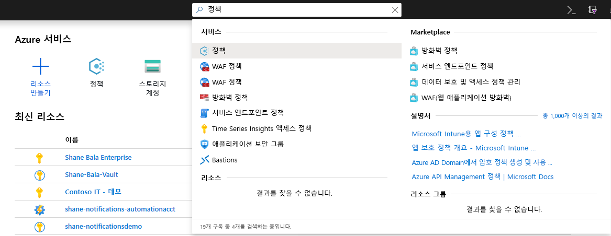
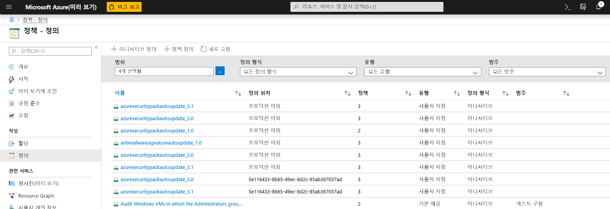
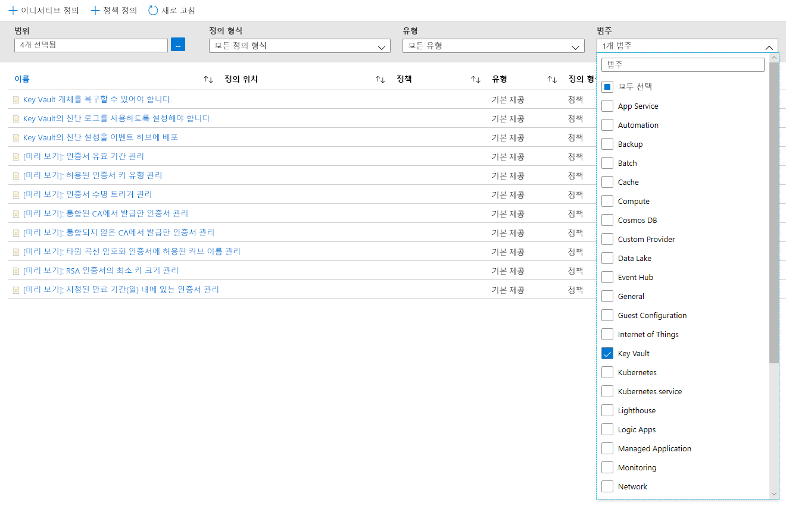
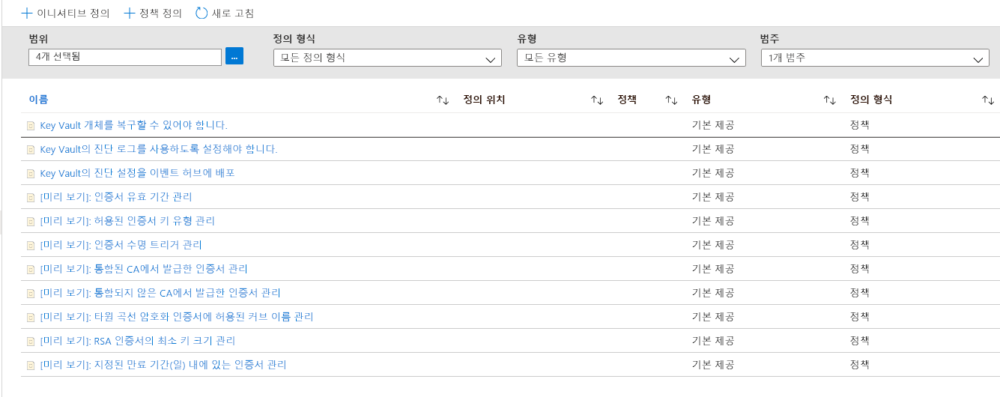
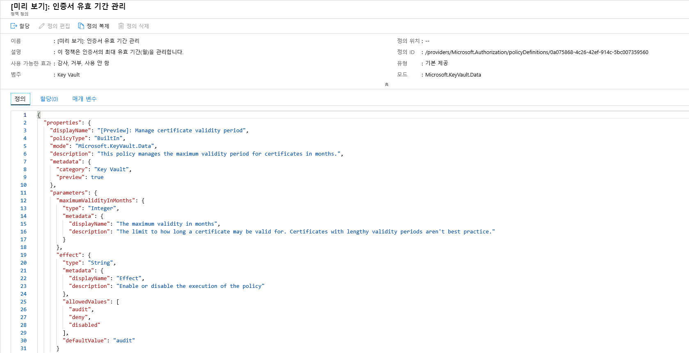
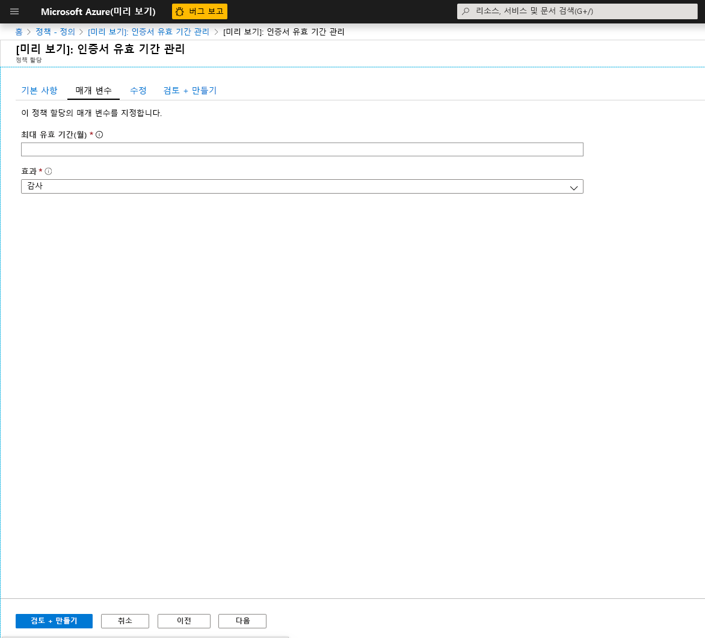
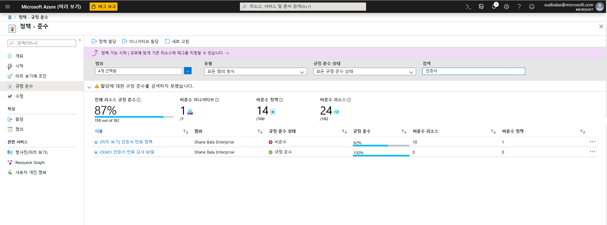
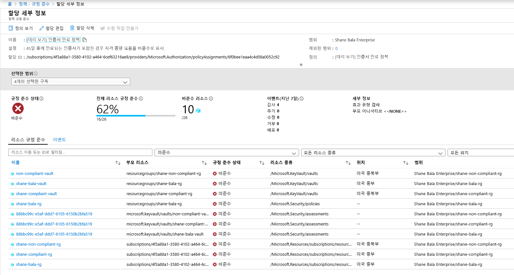
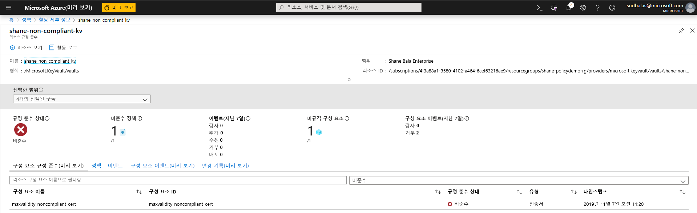
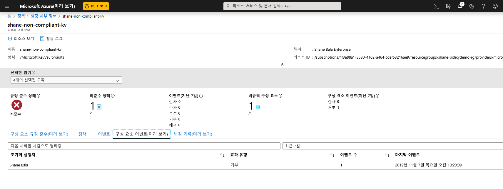

# Azure Policy과 Key Vault 통합

[Azure Policy](../governance/policy/index.yml)는 사용자에게 대규모로 Azure 환경을 감사 및 관리하는 기능을 제공하는 거버넌스 도구입니다. Azure Policy는 할당된 정책 규칙을 준수하도록 Azure 리소스에 가드 레일을 적용하는 기능을 제공합니다. 이를 통해 사용자는 Azure 환경의 감사, 실시간 적용 및 수정을 수행할 수 있습니다. 정책에 의해 수행되는 감사 결과는 준수 대시보드의 사용자가 사용할 수 있습니다. 이 대시보드에서 사용자는 규격인 리소스 및 구성 요소와 비규격인 리소스 및 구성 요소의 드릴다운을 확인할 수 있습니다.  자세한 내용은 [Azure Policy 서비스 개요](../governance/policy/overview.md)를 참조하세요.

예제 사용 시나리오:

- 회사의 Key Vault에 있는 인증서의 최소 키 크기와 최대 유효 기간에 대한 요구 사항을 구현하여 회사의 보안 상태를 개선하려고 하지만, 어떤 팀이 규정을 준수하고 어떤 팀이 준수하지 않는지 잘 모릅니다. 
- 현재 조직에서 감사를 수행하기 위한 솔루션이 없거나, 조직 내의 개별 팀에 규정 준수를 보고하도록 요청하여 환경에 대한 수동 감사를 수행하고 있습니다. 이 작업을 자동화하고, 실시간으로 감사를 수행하고, 감사의 정확성을 보장하는 방법을 찾고 있습니다.
- 회사 보안 정책을 적용하고 개인이 자체 서명된 인증서를 만들 수 없도록 하는 것이 좋습니다. 그러나 사용자의 인증서 만들기를 자동으로 차단하는 방법은 없습니다. 
- 테스트 팀에 대한 몇 가지 요구 사항을 완화하려고 하지만 프로덕션 환경을 엄격히 제어하려고 합니다. 리소스의 적용을 분리하는 간단한 자동화된 방법이 필요합니다. 
- 라이브 사이트 문제가 발생할 경우 새 정책의 적용을 롤백할 수 있는지 확인하려고 할 수 있습니다. 정책 적용을 해제하려면 원클릭 솔루션이 필요합니다. 
- 사용자 환경을 감사하는 타사 솔루션을 사용하고 내부 Microsoft 제품을 사용하려고 합니다. 

## 정책 효과 및 지침의 유형

**감사**: 정책의 영향을 감사로 설정하면, 정책은 환경을 파격적으로 변경하지 않습니다. 지정된 범위 내의 정책 정의를 따르지 않는 인증서와 같은 구성 요소만 정책 준수 대시보드에서 비규격으로 표시하여 경고가 발생하도록 합니다. 정책 효과를 선택하지 않은 경우 감사가 기본값입니다. 

**거부**: 정책의 영향을 거부로 설정하면 정책에서 인증서와 같은 새 구성 요소 생성을 차단하고 정책 정의를 따르지 않는 기존 구성 요소의 새 버전을 차단합니다. Key Vault 내의 기존 비규격 리소스는 영향을 받지 않습니다. '감사' 기능은 계속 작동합니다.

## 사용 가능한 “기본 제공” 정책 정의

Key Vault는 인증서를 관리하는 일반적인 시나리오에 대해 할당할 수 있는 정책 세트를 만들었습니다. 이러한 정책은 '기본 제공' 정책이므로 사용하도록 설정하기 위해 사용자 지정 JSON을 작성하지 않아도 되며, Azure Portal에서 할당할 수 있습니다. 조직의 요구에 맞게 특정 매개 변수를 사용자 지정할 수 있습니다. 

8가지 미리 보기 정책은 다음과 같습니다.

### 인증서 유효 기간 관리(미리 보기)

이 정책을 사용하여 Key Vault에 저장된 인증서의 최대 유효 기간을 관리할 수 있습니다. 인증서의 최대 유효 기간을 제한하는 것은 좋은 보안 방법입니다. 인증서의 프라이빗 키가 손상되었으나 감지되지 않을 경우, 수명이 짧은 인증서를 사용하여 지속적인 손상 시간 프레임을 최소화하고 공격자가 얻을 수 있는 인증서 가치를 낮춥니다. 

### 허용된 인증서 키 유형 관리(미리 보기)
이 정책을 사용하면 Key Vault에 있을 수 있는 인증서의 유형을 제한할 수 있습니다. 이 정책을 사용하여 인증서 프라이빗 키가 RSA, ECC 또는 HSM에서 지원되는지 확인할 수 있습니다. 다음 목록에서 허용되는 인증서 유형을 선택할 수 있습니다.
- RSA
- RSA - HSM
- ECC 
- ECC - HSM 

### 인증서 수명 작업 트리거 관리(미리 보기)

이 정책을 사용하면 특정 만료 기간(일) 이내 또는 사용 가능한 수명의 특정 비율에 도달한 인증서에 대해 지정된 수명 작업을 관리할 수 있습니다. 

### 통합 CA에서 발급한 인증서 관리(미리 보기)

Key Vault 통합 인증 기관(Digicert 또는 GlobalSign)을 사용하며 사용자가 이러한 공급자 중 하나를 사용하도록 하려면 이 정책을 사용하여 선택을 감사하거나 적용합니다. 이 정책은 Key Vault에서 자체 서명된 인증서의 생성을 감사하거나 거부하는 데도 사용할 수 있습니다. 

### 통합 CA에서 발급한 인증서 관리(미리 보기)

내부 인증 기관 또는 Key Vault와 연결되지 않은 인증 기관을 사용하며 사용자가 제공하는 목록의 인증 기관을 사용하도록 하려면 이 정책을 사용하여 발급자 이름별로 허용되는 인증 기관 목록을 만들 수 있습니다. 이 정책은 Key Vault에서 자체 서명된 인증서의 생성을 감사하거나 거부하는 데도 사용할 수 있습니다. 

### 타원 곡선 암호화 인증서에 허용된 커브 이름 관리(미리 보기)
타원 곡선 암호화 또는 ECC 인증서를 사용하는 경우 아래 목록에서 허용되는 곡선 이름 목록을 사용자 지정할 수 있습니다. 기본 옵션은 다음의 모든 곡선 이름을 허용합니다. 
- P-256
- P-256K
- P-384
- P-521

### RSA 인증서의 최소 키 크기 관리(미리 보기)
RSA 인증서를 사용하는 경우 인증서에 포함해야 하는 최소 키 크기를 선택할 수 있습니다. 아래 목록에서 옵션 하나를 선택할 수 있습니다. 
- 2048비트
- 3072비트
- 4096비트

### 지정된 만료 기간(일) 내에 있는 인증서 관리(미리 보기)
적절히 모니터링되고 있지 않은 인증서가 만료되기 전에 순환되지 않을 경우 서비스 중단이 발생할 수 있습니다. 이 정책은 Key Vault에 저장된 인증서가 모니터링되도록 하는 데 중요합니다. 다른 만료 임계값(예: 180, 90, 60 및 30일 임계값)을 사용해어 이 정책을 여러 번 적용하는 것이 좋습니다. 이 정책은 조직의 인증서 만료를 모니터링하고 심사하는 데 사용할 수 있습니다. 

## 예제 시나리오

100개 인증서를 포함하는 여러 팀에서 사용하는 Key Vault를 관리하며, Key Vault에 2년보다 오랫 동안 인증서가 없었는지 확인하려고 합니다.

1. [인증서 유효 기간 관리](#manage-certificate-validity-period-preview) 정책을 할당하고, 인증서의 최대 유효 기간을 24개월로 지정한 후 정책의 효과를 "감사"로 설정합니다. 
1. [Azure Portal에서 규정 준수 보고서](#view-compliance-results)를 보고 20개의 인증서가 비규격이며 2년 넘게 유효하고, 나머지 인증서는 규격인지 확인합니다. 
1. 이러한 인증서의 소유자에게 연락하여 2년 넘게 인증서가 유효할 수 없다는 새로운 보안 요구 사항을 전달합니다. 일부 팀은 최대 유효 기간인 2년 이내에 응답하고 15개의 인증서를 갱신했습니다. 다른 팀은 응답하지 않으며 여전히 Key Vault에 5개의 비규격 인증서가 있습니다.
1. 할당한 정책의 효과를 “거부"로 변경합니다. 비규격 인증서 5개는 해지되지 않으며 계속 작동합니다. 그러나 유효 기간이 2년보다 긴 인증서는 갱신할 수 없습니다. 

## Azure Portal을 통해 Key Vault 정책 사용 및 관리

### 정책 정의 선택

1. Azure 포털에 로그인합니다. 
1. 검색 창에서 "정책"을 검색하고 **정책**을 선택합니다.

    

1. 정책 창에서 **정의**를 선택합니다.

    

1. 범주 필터에서 **모두 선택**을 선택 취소하고 **Key Vault**를 선택합니다. 

    

1. 이제 Azure Key Vault에 대해 모든 정책을 퍼블릭 미리 보기로 사용할 수 있습니다. 위의 정책 지침 섹션을 읽고 이해했는지 확인하고 범위에 할당하려는 정책을 선택합니다.  

    

### 범위에 정책 할당 

1. 적용하려는 정책을 선택합니다. 이 예제에서는 **인증서 유효 기간 관리** 정책을 선택합니다. 왼쪽 위 모서리에 있는 할당 단추를 클릭합니다.

    
  
1. 정책을 적용할 구독을 선택합니다. 구독 내에서 단일 리소스 그룹으로만 범위를 제한하도록 선택할 수 있습니다. 전체 구독에 정책을 적용하고 일부 리소스 그룹을 제외하려는 경우 제외 목록을 구성할 수도 있습니다. 정책의 효과(감사 또는 거부)를 적용하려면 정책 적용 선택기를 **사용**으로 설정하고, 효과(감사 또는 거부)를 해제하려면 **사용 안 함**으로 설정합니다. 

    

1. 화면 맨 위에 있는 매개 변수 탭을 클릭하여 원하는 최대 유효 기간(월)을 지정합니다. 위 섹션의 지침에 따라 정책의 효과를 **감사** 또는 **거부** 중에서 선택합니다. 그런 후에 검토 + 만들기 단추를 선택합니다. 

    

### 규정 준수 결과 보기

1. 정책 블레이드로 돌아가서 규정 준수 탭을 선택합니다. 규정 준수 결과를 보려는 정책 할당을 클릭합니다.

    

1. 이 페이지에서 규격 또는 비호환 자격 증명 모음을 기준으로 결과를 필터링할 수 있습니다. 여기에서 정책 할당 범위 내의 비규격 Key Vault 목록을 볼 수 있습니다. 자격 증명 모음의 구성 요소(인증서)가 비규격인 경우 자격 증명 모음은 비규격으로 간주됩니다. 개별 자격 증명 모음을 선택하여 개별 비규격 구성 요소(인증서)를 볼 수 있습니다. 

    

1. 비규격 자격 증명 모음 내 구성 요소 이름 보기

    

1. 사용자가 Key Vault 내에서 리소스를 만들 수 있는 기능이 거부되는지 여부를 확인해야 하는 경우 **구성 요소 이벤트(미리 보기)** 탭을 클릭하여 요청자 및 요청의 타임스탬프를 포함하는 거부된 인증서 작업의 요약을 볼 수 있습니다. 

    

## 기능 제한 사항

"거부" 효과의 정책을 할당하면 비규격 리소스 생성을 거부하기 시작하는 데 최대 30분(평균적인 경우) 및 1시간(최악의 경우)이 소요될 수 있습니다. 자격 증명 모음의 기존 구성 요소에 대한 정책 평가는 포털 UI에서 규정 준수 결과를 볼 수 있을 때까지 최대 1시간(평균적인 경우) 및 2시간(최악의 경우)이 소요될 수 있습니다. 규정 준수 결과가 "시작되지 않음"으로 표시되는 경우 다음과 같은 이유 때문일 수 있습니다.
- 정책 평가를 아직 완료하지 않았습니다. 초기 평가 대기 시간이 최악의 시나리오에서 최대 2시간이 걸릴 수 있습니다. 
- 정책 할당 범위에 Key Vault가 없습니다.
- 인증서가 정책 할당 범위 내에 있는 Key Vault가 없습니다. 

## 다음 단계

- [Azure Policy 서비스](../governance/policy/overview.md)에 대해 자세히 알아보기
- 샘플: [가상 네트워크 엔드포인트가 없는 Key Vault 자격 증명 모음](../governance/policy/samples/keyvault-no-vnet-rules.md)을 참조하세요.

