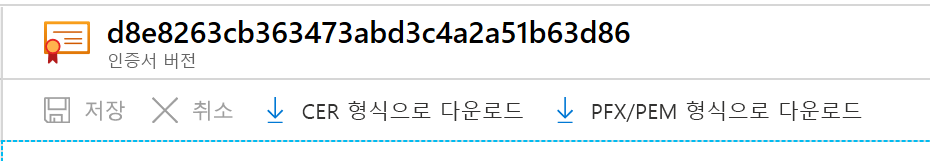

# <a name="export-certificates-from-azure-key-vault"></a>Azure Key Vault의 인증서 내보내기

Azure Key Vault의 인증서를 내보내는 방법 Azure CLI, Azure PowerShell 또는 Azure Portal을 사용하여 인증서를 내보낼 수 있습니다. Azure Portal을 사용하여 Azure App Service 인증서를 내보낼 수도 있습니다.

## <a name="about-azure-key-vault-certificates"></a>Azure Key Vault 인증서 정보

Azure Key Vault를 통해 네트워크에 대한 디지털 인증서를 쉽게 프로비저닝하고, 관리하고, 배포할 수 있습니다. 또한 애플리케이션에 대한 보안 통신을 가능하게 합니다. 자세한 내용은 [Azure Key Vault 인증서](https://docs.microsoft.com/azure/key-vault/certificates/about-certificates)를 참조하세요.

### <a name="composition-of-a-certificate"></a>인증서 컴퍼지션

Key Vault 인증서가 만들어지면 주소 지정 가능한 *키* 와 *비밀* 도 동일한 이름으로 만들어집니다. Key Vault 키는 키 작업을 허용합니다. Key Vault 비밀은 인증서 값을 비밀로 검색할 수 있게 합니다. Key Vault 인증서에는 공용 x509 인증서 메타데이터도 포함됩니다. 자세한 내용은 [인증서 컴퍼지션](https://docs.microsoft.com/azure/key-vault/certificates/about-certificates#composition-of-a-certificate)으로 이동하세요.

### <a name="exportable-and-non-exportable-keys"></a>내보내기 가능 키와 내보내기 불가능 키

Key Vault 인증서가 만들어지면 프라이빗 키를 사용하여 주소 지정 가능한 비밀에서 이를 검색할 수 있습니다. PFX 또는 PEM 형식의 인증서를 검색합니다.

- **내보내기 가능** : 인증서를 만드는 데 사용된 정책은 키를 내보낼 수 있다고 표시합니다.
- **내보내기 불가능** : 인증서를 만드는 데 사용된 정책은 키를 내보낼 수 없다고 표시합니다. 이 경우 프라이빗 키는 비밀로 검색될 때 값의 일부가 아닙니다.

지원되는 키 유형: RSA, RSA-HSM, EC, EC-HSM, oct([여기](https://docs.microsoft.com/rest/api/keyvault/createcertificate/createcertificate#jsonwebkeytype)에 나열됨) Exportable은 RSA, EC에서만 사용할 수 있습니다. HSM 키는 내보낼 수 없습니다.

자세한 내용은 [Azure Key Vault 인증서 정보](https://docs.microsoft.com/azure/key-vault/certificates/about-certificates#exportable-or-non-exportable-key)를 참조하세요.

## <a name="export-stored-certificates"></a>저장된 인증서 내보내기

Azure CLI, Azure PowerShell 또는 Azure Portal을 사용하여 Azure Key Vault에 저장된 인증서를 내보낼 수 있습니다.

> [!NOTE]
> 키 자격 증명 모음에서 인증서를 가져올 때에만 인증서 암호를 입력합니다. Key Vault는 연결된 암호를 저장하지 않습니다. 인증서를 내보낼 때 암호는 비어 있습니다.

# <a name="azure-cli"></a>[Azure CLI](#tab/azure-cli)

Azure CLI에서 다음 명령을 사용하여 Key Vault 인증서의 **공용 부분** 을 다운로드합니다.

```azurecli
az keyvault certificate download --file
                                 [--encoding {DER, PEM}]
                                 [--id]
                                 [--name]
                                 [--subscription]
                                 [--vault-name]
                                 [--version]
```

자세한 내용은 [예제 및 매개 변수 정의](https://docs.microsoft.com/cli/azure/keyvault/certificate?view=azure-cli-latest#az-keyvault-certificate-download)를 보세요.

인증서로 다운로드하는 것은 공개 부분을 가져오는 것을 의미합니다. 프라이빗 키와 퍼블릭 메타데이터가 모두 필요한 경우 이를 비밀로 다운로드할 수 있습니다.

```azurecli
az keyvault secret download -–file {nameofcert.pfx}
                            [--encoding {ascii, base64, hex, utf-16be, utf-16le, utf-8}]
                            [--id]
                            [--name]
                            [--subscription]
                            [--vault-name]
                            [--version]
```

자세한 내용은 [매개 변수 정의](https://docs.microsoft.com/cli/azure/keyvault/secret?view=azure-cli-latest#az-keyvault-secret-download)를 참조하세요.

# <a name="powershell"></a>[PowerShell](#tab/azure-powershell)

Azure PowerShell에서 이 명령을 사용하여 **ContosoKV01** 이라는 키 자격 증명 모음에서 **TestCert01** 이라는 인증서를 가져옵니다. 인증서를 PFX 파일로 다운로드하려면 다음 명령을 실행합니다. 이러한 명령은 **SecretId** 에 액세스한 다음, 콘텐츠를 PFX 파일로 저장합니다.

```azurepowershell
$cert = Get-AzKeyVaultCertificate -VaultName "ContosoKV01" -Name "TestCert01"
$secret = Get-AzKeyVaultSecret -VaultName $vaultName -Name $cert.Name
$secretValueText = '';
$ssPtr = [System.Runtime.InteropServices.Marshal]::SecureStringToBSTR($secret.SecretValue)
try {
    $secretValueText = [System.Runtime.InteropServices.Marshal]::PtrToStringBSTR($ssPtr)
} finally {
    [System.Runtime.InteropServices.Marshal]::ZeroFreeBSTR($ssPtr)
}
$secretByte = [Convert]::FromBase64String($secretValueText)
$x509Cert = new-object System.Security.Cryptography.X509Certificates.X509Certificate2
$x509Cert.Import($secretByte, "", "Exportable,PersistKeySet")
$type = [System.Security.Cryptography.X509Certificates.X509ContentType]::Pfx
$pfxFileByte = $x509Cert.Export($type, $password)

# Write to a file
[System.IO.File]::WriteAllBytes("KeyVault.pfx", $pfxFileByte)
```

이 명령은 프라이빗 키가 있는 전체 인증서 체인을 내보냅니다. 인증서가 암호로 보호됩니다.
**Get-AzKeyVaultCertificate** 명령 및 매개 변수에 대한 자세한 내용은 [Get-AzKeyVaultCertificate - Example 2](https://docs.microsoft.com/powershell/module/az.keyvault/Get-AzKeyVaultCertificate?view=azps-4.4.0)를 참조하세요.

# <a name="portal"></a>[포털](#tab/azure-portal)

Azure Portal의 **인증서** 블레이드에서 인증서를 만들거나 가져오면 인증서가 성공적으로 만들어졌다는 알림을 받게 됩니다. 다운로드 옵션을 보려면 인증서 및 현재 버전을 선택합니다.

인증서를 다운로드하려면 **CER 형식으로 다운로드** 또는 **PFX/PEM 형식으로 다운로드** 단추를 클릭합니다.



**Azure App Service 인증서 내보내기**

Azure App Service 인증서를 통해 SSL 인증서를 편리하게 구매할 수 있습니다. 포털 내에서 Azure 앱에 할당할 수 있습니다. 포털에서 이러한 인증서를 PFX 파일로 내보내면 다른 곳에서도 사용할 수 있습니다. 가져온 후 App Service 인증서는 **비밀** 아래에 있습니다.

자세한 내용은 [Azure App Service 인증서 내보내기](https://social.technet.microsoft.com/wiki/contents/articles/37431.exporting-azure-app-service-certificates.aspx) 단계를 참조하세요.

---

## <a name="read-more"></a>자세히 알아보기
* [다양한 인증서 파일 형식 및 정의](https://docs.microsoft.com/archive/blogs/kaushal/various-ssltls-certificate-file-typesextensions)
