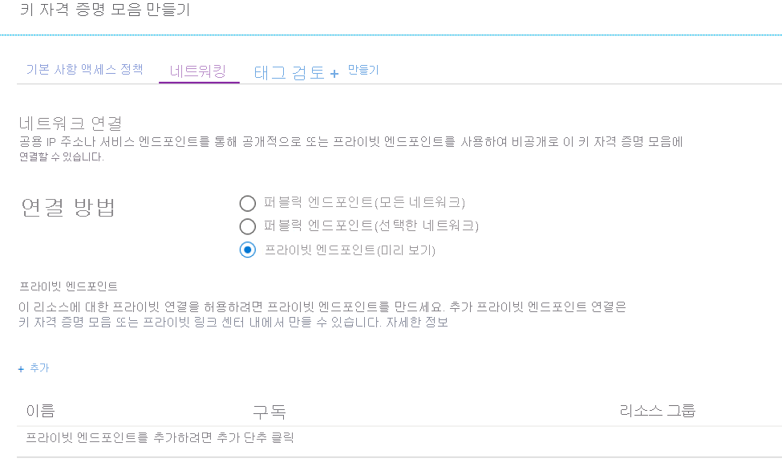
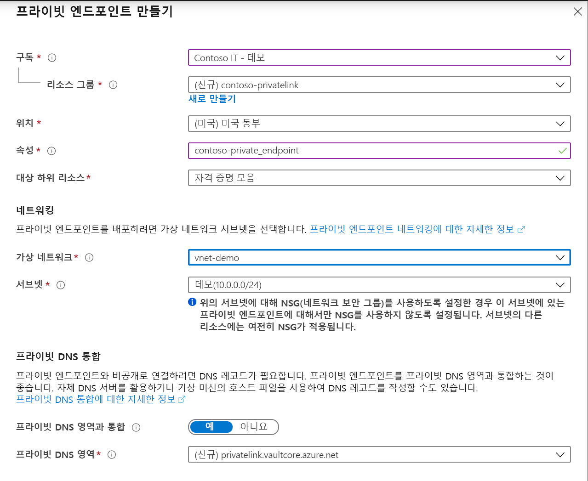
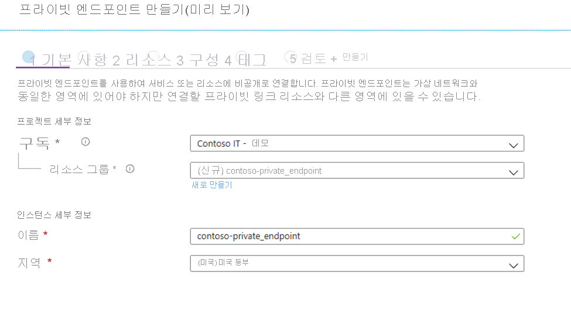
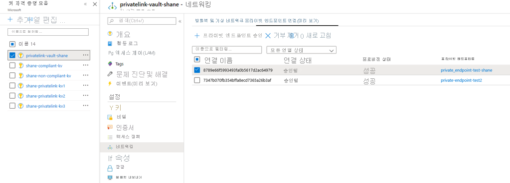

# <a name="integrate-key-vault-with-azure-private-link"></a>Azure Private Link와 Key Vault 통합

Azure Private Link Service를 사용하면 가상 네트워크의 프라이빗 엔드포인트를 통해 Azure 서비스(예: Azure Key Vault, Azure Storage 및 Azure Cosmos DB)와 Azure 호스팅 고객/파트너 서비스에 액세스할 수 있습니다.

Azure 프라이빗 엔드포인트는 Azure Private Link에서 제공하는 서비스에 비공개로 안전하게 연결하는 네트워크 인터페이스입니다. 프라이빗 엔드포인트는 VNet의 개인 IP 주소를 사용하여 서비스를 VNet으로 효과적으로 가져옵니다. 서비스에 대한 모든 트래픽은 프라이빗 엔드포인트를 통해 라우팅할 수 있으므로 게이트웨이, NAT 디바이스, ExpressRoute 또는 VPN 연결 또는 공용 IP 주소가 필요하지 않습니다. 가상 네트워크와 서비스 간의 트래픽은 Microsoft 백본 네트워크를 통해 이동하여 공용 인터넷에서 노출을 제거합니다. Azure 리소스의 인스턴스에 연결하여 액세스 제어에서 가장 높은 수준의 세분성을 제공할 수 있습니다.

자세한 내용은 [Azure Private Link란?](../../private-link/private-link-overview.md)을 참조하세요.

## <a name="prerequisites"></a>사전 요구 사항

키 자격 증명 모음을 Azure Private Link와 통합하려면 다음이 필요합니다.

- 키 자격 증명 모음.
- Azure 가상 네트워크
- 가상 네트워크의 서브넷
- 키 자격 증명 모음 및 가상 네트워크 모두에 대한 소유자 또는 기여자 권한

프라이빗 엔드포인트와 가상 네트워크는 동일한 지역에 있어야 합니다. 포털을 사용하여 프라이빗 엔드포인트에 대한 영역을 선택하면 해당 지역에 있는 가상 네트워크만 자동으로 필터링됩니다. 키 자격 증명 모음은 다른 지역에 있을 수 있습니다.

프라이빗 엔드포인트는 가상 네트워크에서 개인 IP 주소를 사용합니다.

## <a name="establish-a-private-link-connection-to-key-vault-using-the-azure-portal"></a>Azure Portal을 사용하여 Key Vault에 대한 프라이빗 링크 연결 설정 

먼저 [Azure Portal을 사용하여 가상 네트워크 만들기](../../virtual-network/quick-create-portal.md)의 단계를 따라 가상 네트워크를 만듭니다.

그런 다음, 새 키 자격 증명 모음을 만들거나 기존 키 자격 증명 모음에 대한 프라이빗 링크 연결을 설정할 수 있습니다.

### <a name="create-a-new-key-vault-and-establish-a-private-link-connection"></a>새 키 자격 증명 모음 만들기 및 프라이빗 링크 연결 설정

새 키 자격 증명 모음은 [Azure Portal을 사용하여 Azure Key Vault에서 비밀을 설정하고 검색](../secrets/quick-create-portal.md)의 단계에 따라 만들 수 있습니다.

키 자격 증명 모음 기본 사항이 구성되면 [네트워킹] 탭을 선택하고 다음 단계를 수행합니다.

1. 네트워킹 탭에서 프라이빗 엔드포인트 라디오 단추를 선택합니다.
1. "+ 추가" 단추를 클릭하여 프라이빗 엔드포인트를 추가합니다.

    
 
1. [프라이빗 엔드포인트 만들기] 블레이드의 "위치" 필드에서 가상 네트워크가 있는 지역을 선택합니다. 
1. "이름" 필드에서 이 프라이빗 엔드포인트를 식별할 수 있는 설명이 포함된 이름을 만듭니다. 
1. 드롭다운 메뉴에서 이 프라이빗 엔드포인트를 만들려는 가상 네트워크와 서브넷을 선택합니다. 
1. "개인 영역 DNS와 통합" 옵션은 변경하지 않고 그대로 둡니다.  
1. "확인"을 선택합니다.

    
 
이제 구성된 프라이빗 엔드포인트를 볼 수 있습니다. 이 프라이빗 엔드포인트를 삭제하고 편집할 수 있는 옵션이 있습니다. "검토 + 만들기" 단추를 선택하고 키 자격 증명 모음을 만듭니다. 배포가 완료되는 데 5-10분이 걸릴 수 있습니다. 

### <a name="establish-a-private-link-connection-to-an-existing-key-vault"></a>기존 키 자격 증명 모음에 대한 프라이빗 링크 연결 설정

키 자격 증명 모음이 이미 있는 경우 다음 단계에 따라 프라이빗 링크 연결을 만들 수 있습니다.

1. Azure Portal에 로그인합니다. 
1. 검색 창에서 "키 자격 증명 모음"을 입력합니다.
1. 프라이빗 엔드포인트를 추가하려는 목록에서 키 자격 증명 모음을 선택합니다.
1. [설정] 아래에서 "네트워킹" 탭을 선택합니다.
1. 페이지 위쪽에서 프라이빗 엔드포인트 연결 탭을 선택합니다.
1. 페이지 위쪽에서 "+ 프라이빗 엔드포인트" 단추를 선택합니다.

     

이 블레이드를 사용하여 모든 Azure 리소스에 대한 프라이빗 엔드포인트를 만들도록 선택할 수 있습니다. 드롭다운 메뉴를 사용하여 리소스 종류를 선택하고 디렉터리에서 리소스를 선택할 수 있거나, 리소스 ID를 사용하여 모든 Azure 리소스에 연결할 수 있습니다. "개인 영역 DNS와 통합" 옵션은 변경하지 않고 그대로 둡니다.  


## <a name="establish-a-private-link-connection-to-key-vault-using-cli"></a>CLI를 사용하여 Key Vault에 대한 프라이빗 링크 연결 설정

### <a name="login-to-azure-cli"></a>Azure CLI에 로그인
```console
az login 
```
### <a name="select-your-azure-subscription"></a>Azure 구독 선택 
```console
az account set --subscription {AZURE SUBSCRIPTION ID}
```
### <a name="create-a-new-resource-group"></a>새 리소스 그룹 만들기 
```console
az group create -n {RG} -l {AZURE REGION}
```
### <a name="register-microsoftkeyvault-as-a-provider"></a>공급자로 Microsoft.KeyVault 등록 
```console
az provider register -n Microsoft.KeyVault
```
### <a name="create-a-new-key-vault"></a>새 Key Vault 만들기
```console
az keyvault create --name {KEY VAULT NAME} --resource-group {RG} --location {AZURE REGION}
```
### <a name="turn-on-key-vault-firewall"></a>Key Vault Firewall 설정
```console
az keyvault update --name {KEY VAULT NAME} --resource-group {RG} --location {AZURE REGION} --default-action deny
```
### <a name="create-a-virtual-network"></a>Virtual Network 만들기
```console
az network vnet create --resource-group {RG} --name {vNet NAME} --location {AZURE REGION}
```
### <a name="add-a-subnet"></a>서브넷 추가
```console
az network vnet subnet create --resource-group {RG} --vnet-name {vNet NAME} --name {subnet NAME} --address-prefixes {addressPrefix}
```
### <a name="disable-virtual-network-policies"></a>Virtual Network 정책 사용 안 함 
```console
az network vnet subnet update --name {subnet NAME} --resource-group {RG} --vnet-name {vNet NAME} --disable-private-endpoint-network-policies true
```
### <a name="add-a-private-dns-zone"></a>프라이빗 DNS 영역 추가 
```console
az network private-dns zone create --resource-group {RG} --name privatelink.vaultcore.azure.net
```
### <a name="link-private-dns-zone-to-virtual-network"></a>Virtual Network에 프라이빗 DNS 영역 연결 
```console
az network private-dns link vnet create --resoruce-group {RG} --virtual-network {vNet NAME} --zone-name privatelink.vaultcore.azure.net --name {dnsZoneLinkName} --registration-enabled true
```
### <a name="create-a-private-endpoint-automatically-approve"></a>프라이빗 엔드포인트 만들기(자동으로 승인) 
```console
az network private-endpoint create --resource-group {RG} --vnet-name {vNet NAME} --subnet {subnet NAME} --name {Private Endpoint Name}  --private-connection-resource-id "/subscriptions/{AZURE SUBSCRIPTION ID}/resourceGroups/{RG}/providers/Microsoft.KeyVault/vaults/ {KEY VAULT NAME}" --group-ids vault --connection-name {Private Link Connection Name} --location {AZURE REGION}
```
### <a name="create-a-private-endpoint-manually-request-approval"></a>프라이빗 엔드포인트 만들기(수동으로 승인 요청) 
```console
az network private-endpoint create --resource-group {RG} --vnet-name {vNet NAME} --subnet {subnet NAME} --name {Private Endpoint Name}  --private-connection-resource-id "/subscriptions/{AZURE SUBSCRIPTION ID}/resourceGroups/{RG}/providers/Microsoft.KeyVault/vaults/ {KEY VAULT NAME}" --group-ids vault --connection-name {Private Link Connection Name} --location {AZURE REGION} --manual-request
```
### <a name="show-connection-status"></a>연결 상태 표시 
```console
az network private-endpoint show --resource-group {RG} --name {Private Endpoint Name}
```
## <a name="manage-private-link-connection"></a>프라이빗 링크 연결 관리

프라이빗 엔드포인트를 만들 때 연결이 승인되어야 합니다. 프라이빗 엔드포인트를 만드는 리소스가 디렉터리에 있으면 충분한 권한이 있는 경우 연결 요청을 승인할 수 있습니다. 다른 디렉터리의 Azure 리소스에 연결하는 경우 해당 리소스의 소유자가 연결 요청을 승인할 때까지 기다려야 합니다.

다음 네 가지 프로비저닝 상태가 있습니다.

| 서비스 제공 작업 | 서비스 소비자 프라이빗 엔드포인트 상태 | Description |
|--|--|--|
| None | Pending | 연결이 수동으로 만들어지고, Private Link 리소스 소유자의 승인이 보류 중입니다. |
| 승인 | 승인됨 | 연결이 자동 또는 수동으로 승인되었으며, 사용할 준비가 되었습니다. |
| 거부 | 거부됨 | Private Link 리소스 소유자가 연결을 거부했습니다. |
| 제거 | 연결 끊김 | Private Link 리소스 소유자가 연결을 제거했습니다. 프라이빗 엔드포인트는 정보를 제공하므로 정리를 위해 삭제해야 합니다. |
 
###  <a name="how-to-manage-a-private-endpoint-connection-to-key-vault-using-the-azure-portal"></a>Azure Portal을 사용하여 Key Vault에 대한 프라이빗 엔드포인트 연결을 관리하는 방법 

1. Azure 포털에 로그인합니다.
1. 검색 창에서 "키 자격 증명 모음"을 입력합니다.
1. 관리하려는 키 자격 증명 모음을 선택합니다.
1. "네트워킹" 탭을 선택합니다.
1. 보류 중인 연결이 있으면 프로비저닝 상태가 "보류 중"인 연결이 나열됩니다. 
1. 승인하려는 프라이빗 엔드포인트를 선택합니다.
1. 승인 단추를 선택합니다.
1. 보류 중인 요청 또는 기존 연결인지 여부에 관계없이 거부하려는 프라이빗 엔드포인트 연결이 있으면 연결을 선택하고 "거부" 단추를 클릭합니다.

    

##  <a name="how-to-manage-a-private-endpoint-connection-to-key-vault-using-azure-cli"></a>Azure CLI를 사용하여 Key Vault에 대한 프라이빗 엔드포인트 연결을 관리하는 방법

### <a name="approve-a-private-link-connection-request"></a>Private Link 연결 요청 승인
```console
az keyvault private-endpoint-connection approve --approval-description {"OPTIONAL DESCRIPTION"} --resource-group {RG} --vault-name {KEY VAULT NAME} –name {PRIVATE LINK CONNECTION NAME}
```

### <a name="deny-a-private-link-connection-request"></a>Private Link 연결 요청 거부
```console
az keyvault private-endpoint-connection reject --rejection-description {"OPTIONAL DESCRIPTION"} --resource-group {RG} --vault-name {KEY VAULT NAME} –name {PRIVATE LINK CONNECTION NAME}
```

### <a name="delete-a-private-link-connection-request"></a>Private Link 연결 요청 삭제
```console
az keyvault private-endpoint-connection delete --resource-group {RG} --vault-name {KEY VAULT NAME} --name {PRIVATE LINK CONNECTION NAME}
```

## <a name="validate-that-the-private-link-connection-works"></a>프라이빗 링크 연결이 작동하는지 확인

프라이빗 엔드포인트 리소스의 동일한 서브넷 내에 있는 리소스가 개인 IP 주소를 통해 키 자격 증명 모음에 연결되고 개인 DNS 영역 통합이 올바르게 통합되었는지 확인해야 합니다.

먼저 [Azure Portal에서 Windows 가상 머신 만들기](../../virtual-machines/windows/quick-create-portal.md)의 단계에 따라 가상 머신을 만듭니다.

"네트워킹" 탭에서 다음을 수행합니다.

1. 가상 네트워크와 서브넷을 지정합니다. 새 가상 네트워크를 만들거나 기존 가상 네트워크를 선택할 수 있습니다. 기존 가상 네트워크를 선택하는 경우 지역이 일치하는지 확인합니다.
1. 공용 IP 리소스를 만듭니다.
1. "NIC 네트워크 보안 그룹"에서 "없음"을 선택합니다.
1. "부하 분산"에서 "아니요"를 선택합니다.

명령줄을 열고 다음 명령을 실행합니다.

```console
nslookup <your-key-vault-name>.vault.azure.net
```

ns lookup 명령을 실행하여 퍼블릭 엔드포인트를 통해 키 자격 증명 모음의 IP 주소를 확인하는 경우 다음과 같은 결과가 표시됩니다.

```console
c:\ >nslookup <your-key-vault-name>.vault.azure.net

Non-authoritative answer:
Name:    
Address:  (public IP address)
Aliases:  <your-key-vault-name>.vault.azure.net
```

ns lookup 명령을 실행하여 프라이빗 엔드포인트를 통해 키 자격 증명 모음의 IP 주소를 확인하는 경우 다음과 같은 결과가 표시됩니다.

```console
c:\ >nslookup your_vault_name.vault.azure.net

Non-authoritative answer:
Name:    
Address:  10.1.0.5 (private IP address)
Aliases:  <your-key-vault-name>.vault.azure.net
          <your-key-vault-name>.privatelink.vaultcore.azure.net
```

## <a name="limitations-and-design-considerations"></a>제한 사항 및 디자인 고려 사항

**가격 책정**: 가격 책정 정보는 [Azure Private Link 가격 책정](https://azure.microsoft.com/pricing/details/private-link/)을 참조하세요.

**제한 사항**:  Azure Key Vault용 프라이빗 엔드포인트는 Azure 공용 지역에서만 사용할 수 있습니다.

**Key Vault당 최대 프라이빗 엔드포인트 수**: 64.

**구독당 프라이빗 엔드포인트가 포함된 최대 Key Vault 수**: 64.

자세한 내용은 [Azure Private Link 서비스: 제한 사항](../../private-link/private-link-service-overview.md#limitations)을 참조하세요.

## <a name="next-steps"></a>다음 단계

- [Azure Private Link](../../private-link/private-link-service-overview.md)에 대해 자세히 알아봅니다.
- [Azure Key Vault](overview.md)에 대해 자세히 알아봅니다.
