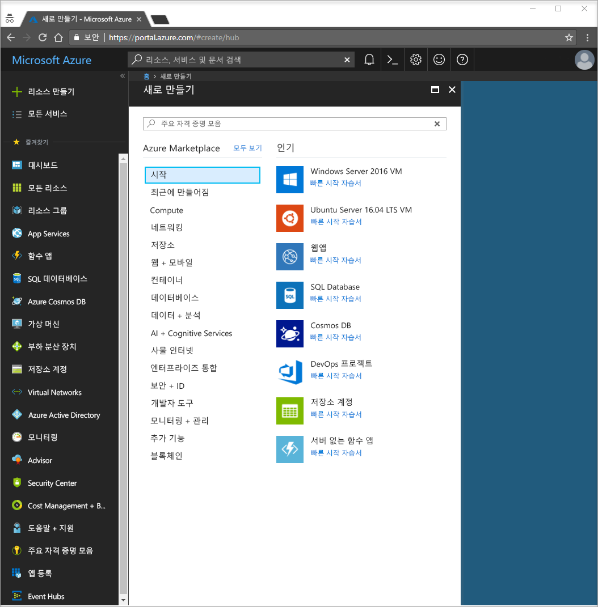
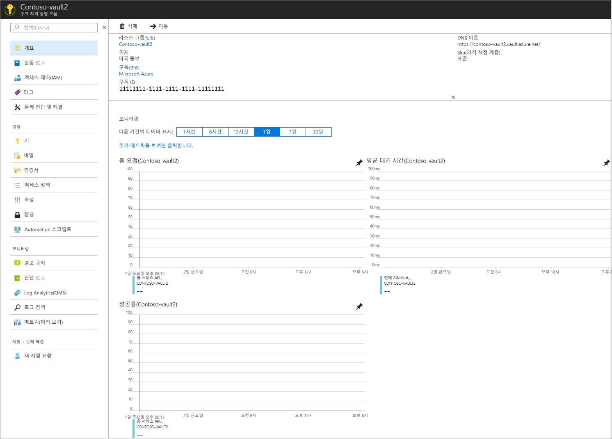
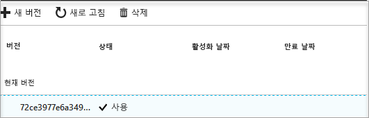

# 빠른 시작: Azure Portal을 사용하여 Key Vault 만들기

Azure Key Vault는 보안 비밀 저장소로 작동하는 클라우드 서비스입니다. 키, 암호, 인증서 및 기타 비밀을 안전하게 저장할 수 있습니다. Key Vault에 대한 자세한 내용을 보려면 [개요](key-vault-overview.md)를 살펴보세요. Azure Portal을 통해 Azure Key Vault를 만들고 관리할 수 있습니다. 이 빠른 시작에서는 Key Vault를 만듭니다. 이 작업을 완료하면 비밀을 저장할 수 있습니다.

Azure 구독이 아직 없는 경우 시작하기 전에 [체험 계정](https://azure.microsoft.com/free/?WT.mc_id=A261C142F)을 만듭니다.

## Azure에 로그인

Azure Portal ( http://portal.azure.com ) 에 로그인합니다.

## 자격 증명 모음 만들기

1. Azure Portal의 왼쪽 위 모서리에 있는 **리소스 만들기** 옵션을 선택합니다.

    
2. 검색 상자에 **Key Vault**를 입력합니다.
3. 결과 목록에서 **Key Vault**를 선택합니다.
4. Key Vault 섹션에서 **만들기**를 선택합니다.
5. **Key Vault 만들기** 섹션에서 다음 정보를 제공합니다.
    - **이름**: 이 빠른 시작의 경우 **Contoso-vault2**를 사용합니다. 테스트 시 고유한 이름을 제공해야 합니다.
    - **구독**: 이 빠른 시작에 사용할 구독을 선택합니다.
    - **리소스 그룹**에서 **새로 만들기**를 선택하고 리소스 그룹 이름을 입력합니다.
    - **위치** 풀 다운 메뉴에서 위치를 선택합니다.
    - **대시보드에 고정** 확인란을 선택합니다.
    - 다른 옵션은 기본값으로 그대로 둡니다.
6. 위의 정보를 제공한 후 **만들기**를 선택합니다.

아래에 나열된 두 개의 속성을 기록합니다.

* **자격 증명 모음 이름**: 이 예에서는 **Contoso-Vault2**입니다. 다른 단계에서 이 이름을 사용합니다.
* **자격 증명 모음 URI**: 이 예에서는 https://contoso-vault2.vault.azure.net/입니다. REST API를 통해 사용자 자격 증명 모음을 사용하는 응용 프로그램은 URI를 사용해야 합니다.

이때 사용자의 Azure 계정은 이 새 자격 증명 모음에서 모든 작업을 수행할 권한이 있는 유일한 계정입니다.

## Key Vault에 비밀 추가

자격 증명 모음에 비밀을 추가하려면 몇 가지 추가 단계만 수행하면 됩니다. 이 경우 응용 프로그램에서 사용할 수 있는 암호를 추가합니다. 암호를 **ExamplePassword**라고 명명하고 그 안에 **Pa$$w0rd** 값을 저장하겠습니다.

1. Key Vault 속성 페이지에서 **비밀**을 선택합니다.
2. **생성/가져오기**를 클릭합니다.
3. **비밀 만들기** 화면에서 다음을 선택합니다.
    - **업로드 옵션**: 수동.
    - **이름**: ExamplePassword.
    - **값**: Pa$$w0rd.
    - 다른 값은 기본값으로 그대로 둡니다. **만들기**를 클릭합니다.

비밀이 성공적으로 생성되었다는 메시지가 표시되면 목록에서 클릭할 수 있습니다. 그런 다음, 속성 중 일부를 볼 수 있습니다. 현재 버전을 클릭하면 이전 단계에서 지정한 값을 볼 수 있습니다.

## 리소스 정리

다른 Key Vault 빠른 시작과 자습서는 이 빠른 시작을 기반으로 빌드됩니다. 이후의 빠른 시작 및 자습서를 계속 진행하려는 경우 이러한 리소스를 유지하는 것이 좋습니다.
더 이상 필요 없으면 리소스 그룹을 삭제하고 Key Vault 및 관련 리소스를 삭제합니다. 포털을 통해 리소스 그룹을 삭제하려면:

1. 포털 맨 위에 있는 검색 상자에 리소스 그룹의 이름을 입력합니다. 검색 결과에 이 빠른 시작에서 사용된 리소스 그룹이 표시되면 선택합니다.
2. **리소스 그룹 삭제**를 선택합니다.
3. **TYPE THE RESOURCE GROUP NAME:** 상자에 리소스 그룹 이름을 입력하고 **삭제**를 선택합니다.

## 다음 단계

이 빠른 시작에서는 Key Vault를 만들고 비밀을 저장했습니다. Key Vault와 이 Key Vault를 응용 프로그램과 함께 사용하는 방법에 대해 자세히 알아보려면 Key Vault와 함께 작동하는 웹 응용 프로그램에 대한 자습서를 진행합니다.

> [!div class="nextstepaction"]
> 관리 서비스 ID를 사용하여 웹 응용 프로그램의 Key Vault에서 비밀을 읽는 방법을 알아보려면 [Key Vault에서 비밀을 읽도록 Azure 웹 응용 프로그램 구성](tutorial-web-application-keyvault.md) 자습서를 계속 진행하세요.
