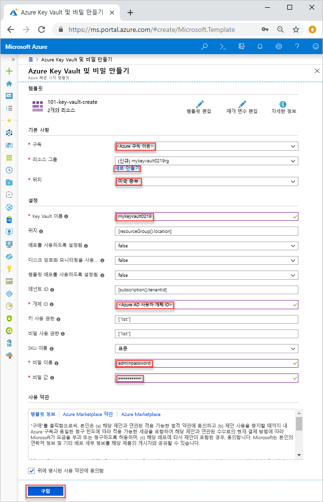

# <a name="quickstart-set-and-retrieve-a-secret-from-azure-key-vault-using-resource-manager-template"></a>빠른 시작: Resource Manager 템플릿을 사용하여 Azure Key Vault에서 비밀 설정 및 검색

[Azure Key Vault](./key-vault-overview.md)는 키, 암호, 인증서 및 기타 비밀 등, 비밀에 안전한 자격 증명을 제공하는 클라우드 서비스입니다. 이 빠른 시작에서는 키 자격 증명 및 비밀을 만들기 위해 Resource Manager 템플릿을 배포하는 과정을 다루고 있습니다. Resource Manager 탬플릿 개발에 대한 자세한 내용은 [Resource Manager 설명서](/azure/azure-resource-manager/) 및 [템플릿 참조](/azure/templates/microsoft.keyvault/allversions)를 참조하세요.

Azure 구독이 아직 없는 경우 시작하기 전에 [체험 계정](https://azure.microsoft.com/free/?WT.mc_id=A261C142F)을 만듭니다.

## <a name="prerequisites"></a>필수 조건

이 문서를 완료하려면 다음이 필요합니다.

* 권한을 구성하려면 템플릿에 Azure AD 사용자 개체 ID가 필요합니다. 다음 절차는 개체 ID(GUID)를 가져옵니다.

    1. **사용해 보세요**를 선택하여 다음 Azure PowerShell 또는 Azure CLI 명령을 수행한 다음, 스크립트를 셸 창에 붙여넣습니다. 스크립트를 넣으려면 셸을 마우스 오른쪽 단추로 클릭하고 **붙여넣기**를 선택합니다. 

        ```azurecli-interactive
        echo "Enter your email address that is used to sign in to Azure:" &&
        read upn &&
        az ad user show --upn-or-object-id $upn --query "objectId" 
        ```

        ```azurepowershell-interactive
        $upn = Read-Host -Prompt "Enter your email address used to sign in to Azure"
        (Get-AzADUser -UserPrincipalName $upn).Id
        ```

    2. 개체 ID를 기록해 둡니다. 이 빠른 시작의 다음 섹션에서 필요합니다.

## <a name="create-a-vault-and-a-secret"></a>자격 증명 모음 및 비밀 만들기

이 빠른 시작에 사용되는 템플릿은 [Azure 빠른 시작 템플릿](https://azure.microsoft.com/resources/templates/101-key-vault-create/)에서 나온 것입니다. Azure Key Vault 템플릿 샘플을 더 보려면 [여기](https://azure.microsoft.com/resources/templates/?resourceType=Microsoft.Keyvault)에서 확인할 수 있습니다.

1. 다음 이미지를 선택하고 Azure에 로그인하여 템플릿을 엽니다. 템플릿에서 키 자격 증명 모음 및 비밀이 생성됩니다.

    <a href="https://portal.azure.com/#create/Microsoft.Template/uri/https%3A%2F%2Fraw.githubusercontent.com%2FAzure%2Fazure-quickstart-templates%2Fmaster%2F101-key-vault-create%2Fazuredeploy.json"></a>

2. 다음 값을 선택하거나 입력합니다.  

    

    지정되지 않은 경우에는 기본 값을 사용하여 키 자격 증명 모음과 비밀을 만듭니다.

    * **구독**: Azure 구독을 선택합니다.
    * **리소스 그룹**: **새로 만들기**를 선택하고 리소스 그룹에 고유한 이름을 입력한 다음, **확인**을 클릭합니다. 
    * **위치**: 위치를 선택합니다.  예: **미국 중부**
    * **Key Vault 이름**: .vault.azure.net 네임스페이스 내에서 전역적으로 고유해야 하는 Key Vault의 이름을 입력합니다.  
    * **테넌트 ID**: 템플릿 함수가 자동으로 검색한 테넌트 ID입니다.  기본값을 변경하지 마세요.
    * **AD 사용자 ID**: [필수 조건](#prerequisites)에서 검색한 Azure AD 사용자 개체 ID를 입력합니다.
    * **비밀 이름**: 키 자격 증명 모음에 저장하는 비밀의 이름을 입력합니다.  예: **adminpassword**.
    * **비밀 값**: 비밀 값을 입력합니다.  암호를 저장할 경우 필수 조건에서 만든 생성된 암호를 사용하는 것이 좋습니다.
    * **위에 명시된 사용 약관에 동의함**: 선택합니다.
3. **구매**를 선택합니다.

## <a name="validate-the-deployment"></a>배포 유효성 검사

Azure Portal을 사용하여 키 자격 증명 모음 및 비밀을 확인하거나 다음 Azure CLI 또는 Azure PowerShell 스크립트를 사용하여 생성된 비밀을 나열합니다.

```azurecli-interactive
echo "Enter your key vault name:" &&
read keyVaultName &&
az keyvault secret list --vault-name $keyVaultName
```

```azurepowershell-interactive
$keyVaultName = Read-Host -Prompt "Enter your key vault name"
Get-AzKeyVaultSecret -vaultName $keyVaultName
```

## <a name="clean-up-resources"></a>리소스 정리

다른 Key Vault 빠른 시작과 자습서는 이 빠른 시작을 기반으로 빌드됩니다. 이후의 빠른 시작 및 자습서를 계속 진행하려는 경우 이러한 리소스를 유지하는 것이 좋습니다.
더 이상 필요 없으면 리소스 그룹을 삭제하고 Key Vault 및 관련 리소스를 삭제합니다. Azure CLI 또는 Azure PowerShell을 사용하여 리소스 그룹을 삭제하려면

```azurecli-interactive
echo "Enter the Resource Group name:" &&
read resourceGroupName &&
az group delete --name $resourceGroupName 
```
```azurepowershell-interactive
$resourceGroupName = Read-Host -Prompt "Enter the Resource Group name"
Remove-AzResourceGroup -Name $resourceGroupName 
```

## <a name="next-steps"></a>다음 단계

* [Azure Key Vault 홈 페이지](https://azure.microsoft.com/services/key-vault/)
* [Azure Key Vault 설명서](https://docs.microsoft.com/azure/key-vault/)
* [Node용 Azure SDK](https://docs.microsoft.com/javascript/api/overview/azure/key-vault)
* [Azure REST API 참조](https://docs.microsoft.com/rest/api/keyvault/)
