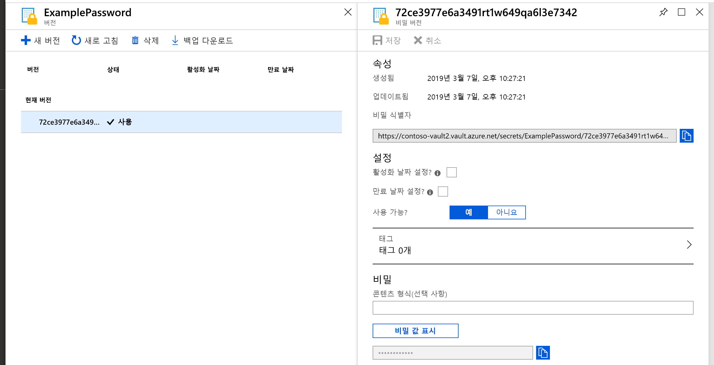
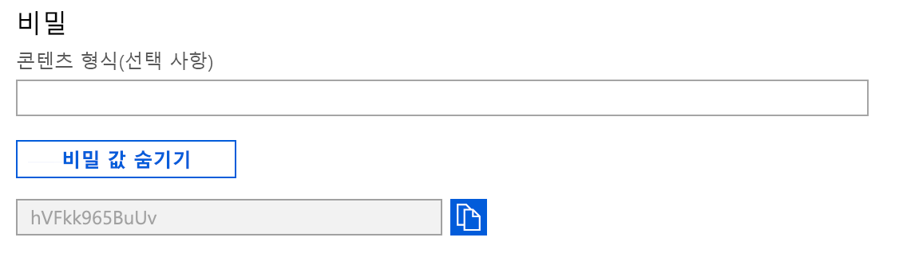

# 빠른 시작: Azure Portal을 사용하여 Azure Key Vault에서 비밀을 설정하고 검색

Azure Key Vault는 보안 비밀 저장소를 제공하는 클라우드 서비스입니다. 키, 암호, 인증서 및 기타 비밀을 안전하게 저장할 수 있습니다. Azure Portal을 통해 Azure Key Vault를 만들고 관리할 수 있습니다. 이 빠른 시작에서는 Key Vault를 만든 다음, 비밀을 저장하는 데 사용합니다. 

자세한 내용은 
- [Key Vault 개요](../general/overview.md)
- [비밀 개요](about-secrets.md)를 참조하세요.

## 사전 요구 사항

Azure Key Vault에 액세스하려면 Azure 구독이 필요합니다. 구독이 아직 없는 경우 시작하기 전에 [체험 계정](https://azure.microsoft.com/free/?WT.mc_id=A261C142F)을 만듭니다.

비밀에 대한 모든 액세스는 Azure Key Vault를 통해 수행됩니다. 이 빠른 시작에서는 [Azure Portal](../general/quick-create-portal.md), [Azure CLI](../general/quick-create-cli.md) 또는 [Azure PowerShell](../general/quick-create-powershell.md)을 사용하여 키 자격 증명 모음을 만듭니다.

## Azure에 로그인

https://portal.azure.com 에서 Azure Portal에 로그인합니다.

## Key Vault에 비밀 추가

자격 증명 모음에 비밀을 추가하려면 다음 단계를 수행합니다.

1. Azure Portal에서 새 키 자격 증명 모음으로 이동합니다.
1. Key Vault 설정 페이지에서 **비밀** 을 선택합니다.
1. **생성/가져오기** 를 클릭합니다.
1. **비밀 만들기** 화면에서 다음 값을 선택합니다.
    - **업로드 옵션**: 수동.
    - **이름**: 비밀의 이름을 입력합니다. 비밀 이름은 Key Vault 내에서 고유해야 합니다. 이름은 문자로 시작하고 0~9, a~z, A~Z 및 -만 포함된 1-127자 길이의 문자열이어야 합니다. 이름 지정에 대한 자세한 내용은 [Key Vault 개체, 식별자 및 버전 관리](../general/about-keys-secrets-certificates.md#objects-identifiers-and-versioning)를 참조하세요.
    - **값**: 비밀에 대한 값을 입력합니다. Key Vault API는 비밀 값을 문자열로 수락 및 반환합니다. 
    - 다른 값은 기본값으로 그대로 둡니다. **만들기** 를 클릭합니다.

비밀이 성공적으로 생성되었다는 메시지가 표시되면 목록에서 클릭할 수 있습니다. 

비밀 특성에 대한 자세한 내용은 [Azure Key Vault 비밀 정보](./about-secrets.md)를 참조하세요.

## Key Vault에서 비밀 검색

현재 버전을 클릭하면 이전 단계에서 지정한 값을 볼 수 있습니다.

오른쪽 창에서 "비밀 값 표시" 단추를 클릭하면 숨겨진 값을 볼 수 있습니다. 

[Azure CLI]() 또는 [Azure PowerShell]()을 사용하여 이전에 만든 비밀을 검색할 수도 있습니다.

## 리소스 정리

다른 Key Vault 빠른 시작과 자습서는 이 빠른 시작을 기반으로 빌드됩니다. 이후의 빠른 시작 및 자습서를 계속 진행하려는 경우 이러한 리소스를 유지하는 것이 좋습니다.
더 이상 필요 없으면 리소스 그룹을 삭제하고 Key Vault 및 관련 리소스를 삭제합니다. 포털을 통해 리소스 그룹을 삭제하려면:

1. 포털 맨 위에 있는 검색 상자에 리소스 그룹의 이름을 입력합니다. 검색 결과에 이 빠른 시작에서 사용된 리소스 그룹이 표시되면 선택합니다.
2. **리소스 그룹 삭제** 를 선택합니다.
3. **리소스 그룹 이름 입력** 상자에 리소스 그룹 이름을 입력하고 **삭제** 를 선택합니다.

> [!NOTE]
> 비밀, 키, 인증서 또는 키 자격 증명 모음이 삭제되면 7~90일의 구성 가능 기간 동안 복구 가능한 상태로 유지됩니다. 구성을 지정하지 않으면 기본 복구 기간이 90일로 설정됩니다. 이를 통해 사용자는 실수로 인한 비밀 삭제를 확인하고 대응할 수 있는 충분한 시간을 확보할 수 있습니다. 키 자격 증명 모음 및 키 자격 증명 모음 개체 삭제 및 복구에 대한 자세한 내용은 [Azure Key Vault 일시 삭제 개요](../general/soft-delete-overview.md)를 참조하세요.

## 다음 단계

이 빠른 시작에서는 Key Vault를 만들어 비밀을 저장했습니다. Key Vault 및 이를 애플리케이션과 통합하는 방법에 대해 자세히 알아보려면 아래 문서로 계속 진행하세요.

- [Azure Key Vault 개요](../general/overview.md) 참조
- [Key Vault에 대한 액세스 보안](../general/secure-your-key-vault.md) 읽기
- [App Service 웹앱에서 Key Vault 사용](../general/tutorial-net-create-vault-azure-web-app.md) 참조
- [VM에 배포된 애플리케이션과 함께 Key Vault 사용](../general/tutorial-net-virtual-machine.md) 참조
- [Azure Key Vault 개발자 가이드](../general/developers-guide.md) 참조
- [Azure Key Vault 보안 개요](../general/security-overview.md)를 검토하세요.