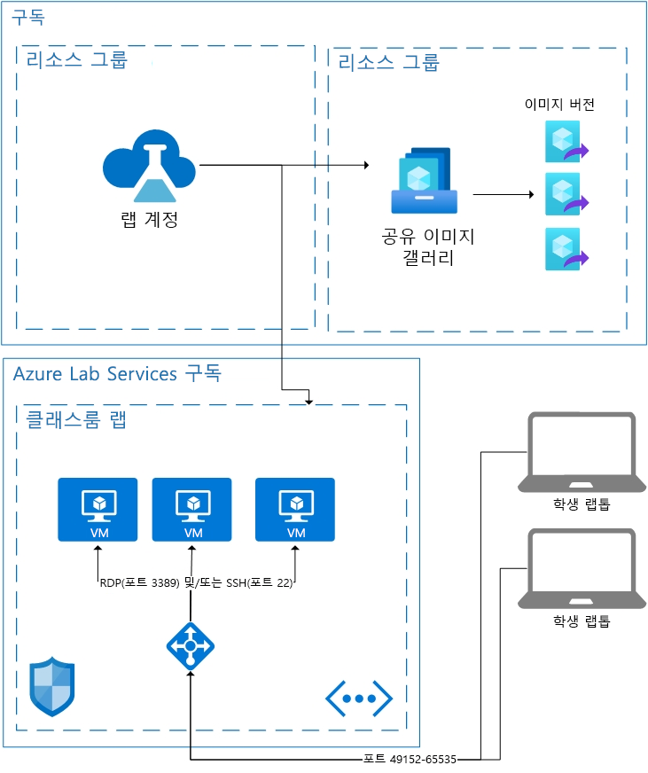

# Azure Lab Services의 아키텍처 기본 사항

Azure Lab Services는 Lab Services에 필요한 리소스가 자동으로 처리되는 SaaS(software as a service) 솔루션입니다. 이 문서에서는 Lab Services에서 사용하는 기본 리소스와 랩의 기본 아키텍처에 대해 설명합니다.  

Azure Lab Services는 사용자 고유의 리소스를 Lab Services와 함께 사용할 수 있는 몇 가지 영역을 제공합니다.  사용자 고유의 네트워크에서 VM을 사용하는 방법에 대한 자세한 내용은 [가상 네트워크 피어링](how-to-connect-peer-virtual-network.md) 방법을 참조하세요.  Shared Image Gallery의 이미지를 다시 사용하려면 [Shared Image Gallery 연결](how-to-attach-detach-shared-image-gallery.md) 방법을 참조하세요.

다음은 교실 랩의 기본 아키텍처입니다.  랩 계정은 구독에 호스팅됩니다. 학생 VM은 VM을 지원하는 데 필요한 리소스와 함께 Lab Services 소유의 구독에 호스팅됩니다. Lab Service 구독에 무엇이 있는지 자세히 알아보겠습니다.

## 호스트되는 리소스

교실 랩을 실행하는 데 필요한 리소스는 Microsoft에서 관리하는 Azure 구독 중 하나에 호스트됩니다.  리소스에는 강사가 사용할 템플릿 가상 머신, 각 학생이 사용할 가상 머신, 네트워크 관련 항목(부하 분산 장치, 가상 네트워크, 네트워크 보안 그룹 등)이 포함됩니다.  이러한 구독을 모니터링하여 의심스러운 활동을 감시합니다.  이 모니터링은 VM 확장 또는 네트워크 패턴 모니터링을 통해 가상 머신 외부에서 수행됩니다.  [연결 해제 시 자동 종료](how-to-enable-shutdown-disconnect.md)를 사용하면 가상 머신에서 진단 확장이 사용됩니다. 이 확장을 사용하면 RDP(원격 데스크톱 프로토콜) 세션 연결 해제 이벤트를 Lab Services에 알릴 수 있습니다.

## Virtual Network

각 랩은 자체 가상 네트워크를 사용하여 격리됩니다.  랩에 [피어링 가상 네트워크](how-to-connect-peer-virtual-network.md)가 있으면 각 랩은 자체 서브넷을 사용하여 격리됩니다.  학생들은 부하 분산 장치를 통해 가상 머신에 연결합니다.  그 어떤 학생 가상 머신도 공용 IP 주소를 사용하지 않습니다. 학생 가상 머신은 무조건 개인 IP 주소를 사용합니다.  학생의 연결 문자열은 부하 분산 장치의 공용 IP 주소와 49152~65535 사이의 임의의 포트입니다.  부하 분산 장치의 인바운드 규칙은 운영 체제에 따라 적절한 가상 머신의 포트 22(SSH) 또는 포트 3389(RDP)에 연결을 전달합니다. NSG는 다른 포트의 외부 트래픽을 차단합니다.

## 가상 머신 액세스 제어

Lab Services는 학생들이 가상 머신을 시작하고 종료하는 등의 기능을 처리합니다.  VM 연결 정보에 대한 액세스도 제어합니다.

뿐만 아니라 학생을 서비스에 등록하는 작업을 처리합니다. 현재 제한 및 무제한의 두 가지 액세스 설정이 있습니다. 자세한 내용은 [랩 사용자 관리](how-to-configure-student-usage.md#send-invitations-to-users) 문서를 참조하세요. 제한 액세스를 사용하면 Lab Services는 액세스를 허용하기 전에 학생이 사용자로 추가되었는지 확인합니다. 무제한 액세스를 사용하면 랩에 용량이 있는 한 등록 링크가 있는 모든 사용자가 등록할 수 있습니다. 무제한은 해커톤 이벤트에 유용하게 사용할 수 있습니다.

교실 랩에 호스트되는 학생 VM은 랩의 작성자가 설정한 사용자 이름과 암호를 사용합니다.  또는 랩의 작성자는 등록된 학생이 처음으로 로그인할 때 암호를 선택하게 할 수 있습니다.  

## 다음 단계

Lab Services에서 사용할 수 있는 기능에 대한 자세한 내용은 [Azure Lab Services 개념](classroom-labs-concepts.md) 및 [Azure Lab Services 개요](classroom-labs-overview.md)를 참조하세요.
