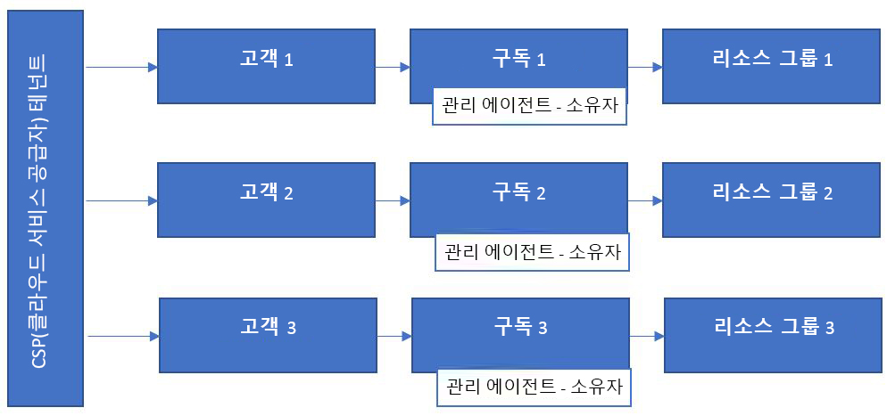
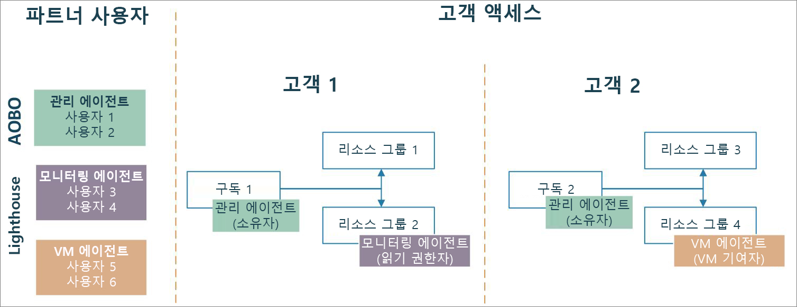

# Azure Lighthouse 및 클라우드 솔루션 공급자 프로그램

[CSP(클라우드 솔루션 공급 기업)](https://docs.microsoft.com/partner-center/csp-overview) 파트너인 경우 [AOBO(관리 위임자)](https://channel9.msdn.com/Series/cspdev/Module-11-Admin-On-Behalf-Of-AOBO) 기능을 사용하여 CSP 프로그램을 통해 고객용으로 생성된 Azure 구독에 액세스할 수 있습니다. 이 액세스를 통해 고객의 구독을 직접 지원, 구성 및 관리할 수 있습니다.

[Azure Lighthouse](../overview.md)를 사용 하 여 azure 위임 된 리소스 관리를 AOBO와 함께 사용할 수 있습니다. 이렇게 하면 사용자에게 더 세분화된 권한을 부여하여 보안을 개선하고 불필요한 액세스를 줄일 수 있습니다. 또한 사용자가 테넌트에서 단일 로그인을 사용하여 여러 고객 구독에서 작업할 수 있으므로 효율성 및 확장성이 향상됩니다.

> [!TIP]
> 고객 리소스를 보호하려면 [파트너 보안 요구 사항 보안 요구 사항](https://docs.microsoft.com/partner-center/partner-security-requirements)과 함께 [권장 보안 사례](recommended-security-practices.md)를 검토하고 준수해야 합니다.

## AOBO(관리 위임자)

AOBO를 사용하는 경우 테넌트에서 [관리 에이전트](https://docs.microsoft.com/partner-center/permissions-overview#manage-commercial-transactions-in-partner-center-azure-ad-and-csp-roles) 역할이 있는 사용자는 CSP 프로그램을 통해 만든 Azure 구독에 대해 AOBO 액세스 권한이 있습니다. 고객의 구독에 액세스해야 하는 모든 사용자는 이 그룹의 멤버여야 합니다. AOBO는 다른 고객에게 작용하는 고유한 그룹을 만들거나 그룹이나 사용자에 대해 다른 역할을 사용하도록 설정하는 유연성을 허용하지 않습니다.

## Azure 위임 리소스 관리

Azure 위임 리소스 관리를 사용하여 다음 다이어그램에 표시된 것처럼 다른 고객 또는 역할에 다른 그룹을 할당할 수 있습니다. 사용자는 Azure 위임된 리소스 관리를 통해 적절한 수준의 액세스 권한을 갖게 되므로 관리 에이전트 역할이 있는(따라서 전체 AOBO 액세스 권한을 갖는) 사용자 수를 줄일 수 있습니다. 이를 통해 고객의 리소스에 대한 불필요한 액세스가 제한되므로 보안이 강화됩니다. 또한 유연성이 향상되어 여러 고객을 대규모로 관리할 수 있습니다.

CSP 프로그램을 통해 만든 구독을 온보딩할 때는 [Azure 위임 리소스 관리에 구독 온보딩](../how-to/onboard-customer.md)에 설명된 단계를 수행하게 됩니다. 테넌트에서 관리 에이전트 역할이 있는 사용자는 이 온보딩을 수행할 수 있습니다.

> [!NOTE]
> 이제 [Azure Portal의 **내 고객** 페이지](../how-to/view-manage-customers.md) 에는 [Microsoft MCA (고객 계약)에 서명](https://docs.microsoft.com/partner-center/confirm-customer-agreement) 하 고 [Azure 요금제](https://docs.microsoft.com/partner-center/azure-plan-get-started)에 있는 CSP 고객에 대 한 청구 정보 및 리소스를 표시 하는 **클라우드 솔루션 공급자 (미리 보기)** 섹션이 포함 되어 있습니다. 자세한 내용은 [Microsoft 파트너 계약 청구 계정 시작](../../billing/mpa-overview.md)을 참조하세요.
>
> CSP 고객은 Azure 위임 된 리소스 관리에 대해 등록 었는 지 여부에 관계 없이이 섹션에 표시 될 수 있습니다. 보유 하 고 있는 경우 [고객 및 위임 된 리소스 보기 및 관리](../how-to/view-manage-customers.md)에 설명 된 대로 **고객** 섹션에도 표시 됩니다. 마찬가지로, CSP 고객은 Azure 위임 된 리소스 관리를 위해 등록 하기 위해 **고객** 의 **클라우드 솔루션 공급자 (미리 보기)** 섹션에 표시 하지 않아도 됩니다.

## 다음 단계

- [테넌트 간 관리 환경](cross-tenant-management-experience.md)에 대해 알아봅니다.
- [Azure 위임 리소스 관리에 구독을 등록](../how-to/onboard-customer.md)하는 방법을 알아봅니다.
- [클라우드 솔루션 공급자 프로그램](https://docs.microsoft.com/partner-center/csp-overview)에 대해 알아봅니다.
