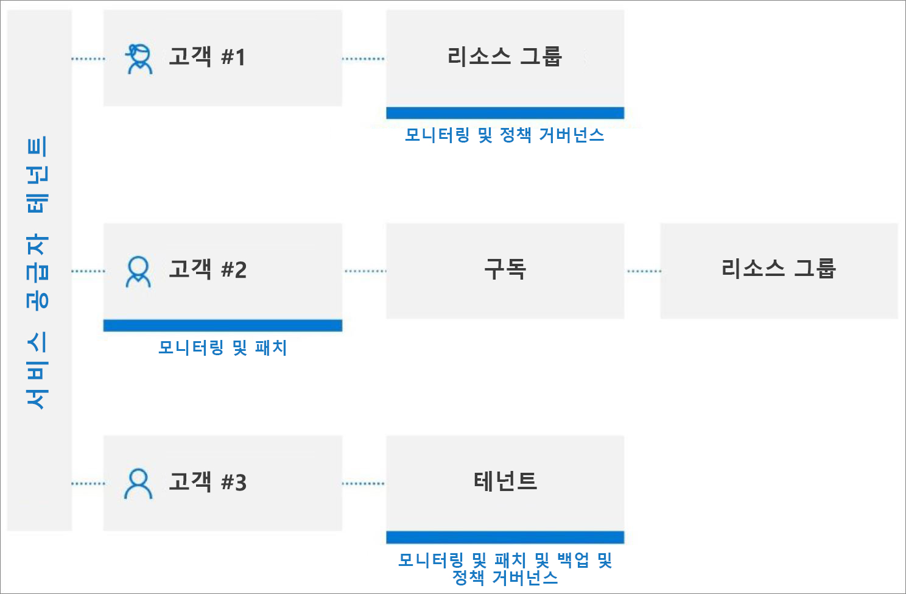

# 테넌트 간 관리 환경

서비스 공급자는 [Azure Lighthouse](../overview.md) 를 사용 하 여 자체 Azure Active Directory (azure AD) 테 넌 트 내에서 여러 고객에 대 한 리소스를 관리할 수 있습니다. [Azure 위임 된 리소스 관리](../concepts/azure-delegated-resource-management.md)를 사용 하 여 여러 작업 및 서비스를 관리 되는 테 넌 트에서 수행할 수 있습니다.

> [!TIP]
> 테넌트 간 관리를 간소화하기 위해 [자체 Azure AD 테넌트가 여러 개 있는 엔터프라이즈 내에서](enterprise.md) Azure 위임 리소스 관리를 사용할 수도 있습니다.

## 테 넌 트 및 위임 이해

Azure AD 테 넌 트는 조직의 표현입니다. Azure, Microsoft 365 또는 기타 서비스에 가입하여 Microsoft와의 관계를 만들 때 조직이 받는 Azure AD의 전용 인스턴스입니다. 각 Azure AD 테넌트는 서로 전혀 다르고 다른 Azure AD 테넌트와 별개이며 고유한 테넌트 ID(GUID)가 있습니다. 자세한 내용은 [Azure Active Directory란?](../../active-directory/fundamentals/active-directory-whatis.md)을 참조하세요.

일반적으로 고객의 Azure 리소스를 관리하기 위해 서비스 공급자는 고객의 테넌트와 연결된 계정을 사용하여 Azure Portal에 로그인해야 하며, 서비스 공급자의 사용자 계정을 만들고 관리하기 위해 고객 테넌트에 관리자가 필요합니다.

Azure Lighthouse를 사용 하 여 온 보 딩 프로세스는 고객 테 넌 트의 위임 된 구독 및 리소스 그룹에 대 한 작업을 수행할 수 있는 서비스 공급자의 테 넌 트 내에서 사용자를 지정 합니다. 그러면 이러한 사용자는 자신의 자격 증명을 사용하여 Azure Portal에 로그인할 수 있습니다. Azure Portal 내에서 액세스 권한이 있는 모든 고객에게 속한 리소스를 관리할 수 있습니다. 이 작업은 Azure Portal에서 [내 고객](../how-to/view-manage-customers.md) 페이지에서 수행하거나 Azure Portal 또는 API를 통해 해당 고객의 구독 컨텍스트 내에서 직접 수행할 수 있습니다.

Azure Lighthouse를 사용 하면 다른 테 넌 트의 다른 계정에 로그인 하지 않고도 여러 고객에 대 한 리소스를 더욱 유연 하 게 관리할 수 있습니다. 예를 들어, 서비스 공급자는 책임 및 액세스 수준이 서로 다른 두 명의 고객을 보유할 수 있습니다. 권한 있는 사용자는 Azure Lighthouse를 사용 하 여 서비스 공급자의 테 넌 트에 로그인 하 여 이러한 리소스에 액세스할 수 있습니다.

## API 및 관리 도구 지원

포털에서 직접 또는 API 및 관리 도구(예: Azure CLI 및 Azure PowerShell)를 사용하여 위임된 리소스에서 관리 작업을 수행할 수 있습니다. 이 기능이 테넌트 간 관리에 대해 지원되고 사용자에게 적절 한 권한이 있는 한, 위임된 리소스를 사용할 때 기존의 모든 API를 사용할 수 있습니다.

Azure PowerShell [AzSubscription cmdlet](/powershell/module/Az.Accounts/Get-AzSubscription) 은 `HomeTenantId` `ManagedByTenantIds` 각 구독에 대 한 및 특성을 보여 주므로 반환 된 구독이 관리 되는 테 넌 트 또는 관리 테 넌 트에 속하는지 여부를 식별할 수 있습니다.

마찬가지로 [az account list](/cli/azure/account#az-account-list) 와 같은 Azure CLI 명령은 `homeTenantId` 및 특성을 표시 `managedByTenants` 합니다. Azure CLI를 사용하는 경우 이러한 값이 표시되지 않으면 `az account clear`를 실행하고 `az login --identity`를 실행하여 캐시를 지워봅니다.

Azure REST API의 [구독-Get](/rest/api/resources/subscriptions/get) 및 [subscription 목록](/rest/api/resources/subscriptions/list) 명령에는가 포함 `ManagedByTenant` 됩니다.

> [!NOTE]
> Azure Lighthouse 관련 된 테 넌 트 정보 외에도 이러한 Api에 의해 표시 되는 테 넌 트는 Azure Databricks 또는 Azure 관리 되는 응용 프로그램의 파트너 테 넌 트를 반영할 수 있습니다.

또한 Azure Lighthouse 작업을 수행 하는 데 관련 된 Api를 제공 합니다. 자세한 내용은 **참조** 섹션을 참조하세요.

## 고급 서비스 및 시나리오

대부분의 작업 및 서비스는 관리형 테넌트의 위임된 리소스에서 수행할 수 있습니다. 다음은 교차 테 넌 트 관리가 특히 효과적일 수 있는 몇 가지 주요 시나리오입니다.

[Azure Arc](../../azure-arc/index.yml):

- 규모에 맞게 하이브리드 서버 관리- [Azure Arc 사용 서버](../../azure-arc/servers/overview.md):
  - Azure에서 위임 된 구독 및/또는 리소스 그룹에 [연결 된 azure 외부의 Windows Server 또는 Linux 컴퓨터를 관리 합니다](../../azure-arc/servers/onboard-portal.md) .
  - Azure Policy 및 태그 지정과 같은 Azure 구문을 사용하여 연결된 컴퓨터 관리
  - 동일한 정책 집합이 고객의 하이브리드 환경에서 적용 되는지 확인 합니다.
  - Azure Security Center를 사용 하 여 고객의 하이브리드 환경에서 호환성 모니터링
- 대규모로 하이브리드 Kubernetes 클러스터 관리- [Azure Arc Enabled Kubernetes (미리 보기)](../../azure-arc/kubernetes/overview.md):
  - Azure에서 위임 된 구독 및/또는 리소스 그룹에 [연결 된 Kubernetes 클러스터 관리](../../azure-arc/kubernetes/connect-cluster.md)
  - 연결 된 클러스터에 [GitOps 사용](../../azure-arc/kubernetes/use-gitops-connected-cluster.md)
  - 연결 된 클러스터에서 정책 적용

[Azure Automation](../../automation/index.yml):

- Automation 계정을 사용 하 여 위임 된 리소스에 액세스 및 작업

[Azure Backup](../../backup/index.yml):

- [온-프레미스 워크 로드, Azure vm, azure 파일 공유 등에서](../..//backup/backup-overview.md#what-can-i-back-up) 고객 데이터 백업 및 복원
- [Backup 탐색기](../../backup/monitor-azure-backup-with-backup-explorer.md)를 사용하여 백업 항목의 작동 정보(백업에 대해 아직 구성되지 않은 Azure 리소스 포함) 및 위임된 구독에 대한 모니터링 정보(작업 및 경고)를 볼 수 있도록 지원합니다. Backup 탐색기는 현재 Azure VM 데이터에만 사용할 수 있습니다.
- 위임된 구독에서 [Backup 보고서](../../backup/configure-reports.md)를 사용하여 기록 추세를 추적하고, 백업 스토리지 사용량을 분석하고, 백업 및 복원을 감사합니다.

[Azure 청사진](../../governance/blueprints/index.yml):

- Azure 청사진을 사용 하 여 리소스 템플릿 및 기타 아티팩트의 배포 오케스트레이션 (고객 구독을 준비 하려면 [추가 액세스](https://www.wesleyhaakman.org/preparing-azure-lighthouse-customer-subscriptions-for-azure-blueprints/) 필요)

[Azure Cost Management + 청구](../../cost-management-billing/index.yml):

- 관리 테 넌 트에서 CSP 파트너는 Azure 요금제를 사용 하는 고객에 대 한 사전 세금 소비 비용 (구매를 포함 하지 않음)을 보고, 관리 하 고, 분석할 수 있습니다. 비용은 고객의 구독에 대 한 파트너의 azure RBAC (역할 기반 액세스 제어) 액세스 및 소매 요금에 따라 결정 됩니다.

[AKS(Azure Kubernetes Service)](../../aks/index.yml):

- 호스트된 Kubernetes 환경 관리 및 고객 테넌트 내 컨테이너화된 애플리케이션을 배포 및 관리합니다.

[Azure Monitor](../../azure-monitor/index.yml):

- 모든 구독에서 경고를 볼 수 있는 기능을 사용하여 위임된 구독에 대한 경고를 봅니다.
- 위임된 구독의 활동 로그 세부 정보를 봅니다.
- Log analytics: 여러 테 넌 트의 원격 작업 영역에서 데이터 쿼리
- 웹 후크를 통해 테 넌 트 관리에서 Azure Automation runbook 또는 Azure Functions와 같이 자동화를 트리거하는 고객 테 넌 트에 경고를 만듭니다.
- 고객 테 넌 트에서 진단 설정을 만들어 리소스 로그를 관리 테 넌 트의 작업 영역으로 보냅니다.
- SAP 워크 로드의 경우 [고객 테 넌 트 전체에서 집계 된 뷰로 Sap 솔루션 메트릭 모니터링](https://techcommunity.microsoft.com/t5/running-sap-applications-on-the/using-azure-lighthouse-and-azure-monitor-for-sap-solutions-to/ba-p/1537293)

[Azure 네트워킹](../../networking/networking-overview.md):

- 관리 되는 테 넌 트 내에서 [Azure Virtual Network](../../virtual-network/index.yml) 및 가상 네트워크 인터페이스 카드 (vnics)를 배포 하 고 관리 합니다.
- [Azure Firewall](../../firewall/overview.md)을 배포하고 구성하여 고객의 Virtual Network 리소스를 보호합니다.
- [Azure 가상 WAN](../../virtual-wan/virtual-wan-about.md), [Express](../../expressroute/expressroute-introduction.md)경로 및 [VPN 게이트웨이와](../../vpn-gateway/vpn-gateway-about-vpngateways.md) 같은 연결 서비스 관리
- Azure Lighthouse를 사용하여 [Azure 네트워킹 MSP 프로그램](../../networking/networking-partners-msp.md)에 대한 주요 시나리오를 지원합니다.

[Azure Policy](../../governance/policy/index.yml):

- 규정 준수 스냅샷에 위임된 구독 내에 할당된 정책에 대한 세부 정보를 표시합니다.
- 위임 된 구독 내에서 정책 정의 만들기 및 편집
- 위임 된 구독 내에서 고객 정의 정책 정의 할당
- 고객은 자신이 직접 작성한 정책과 함께 서비스 공급자가 작성한 정책을 볼 수 있습니다.
- [DeployIfNotExists를 재구성 하거나 관리 되는 테 넌 트 내에서 할당을 수정할](../how-to/deploy-policy-remediation.md) 수 있습니다.

[Azure Resource Graph](../../governance/resource-graph/index.yml):

- 이제는 반환 된 쿼리 결과에 테 넌 트 ID를 포함 하므로 구독이 관리 되는 테 넌 트에 속하는지 여부를 식별할 수 있습니다.

[Azure Security Center](../../security-center/index.yml):

- 테넌트 간 표시 유형
  - 보안 정책에 대한 규정 준수를 모니터링하고 모든 테넌트의 리소스에서 보안 검사를 보장합니다.
  - 단일 보기에서 여러 테 넌 트에 걸쳐 지속적인 규정 준수 모니터링
  - 보안 점수 계산을 통해 실행 가능한 보안 권장 사항을 모니터링하고, 심사하고, 우선 순위를 지정합니다.
- 테넌트 간 보안 상태 관리
  - 보안 정책 관리
  - 실행 가능한 보안 권장 사항을 준수하지 않는 리소스에 대해 조치를 취합니다.
  - 보안 관련 데이터를 수집 및 저장합니다.
- 테넌트 간 위협 검색 및 보호
  - 테넌트의 리소스에서 위협을 탐지합니다.
  - JIT(Just-In-Time) VM 액세스와 같은 지능형 위협 방지 제어를 적용합니다.
  - 적응형 네트워크 강화로 네트워크 보안 그룹 구성을 강화합니다.
  - 적응형 애플리케이션 제어를 사용하여 서버가 필요한 애플리케이션 및 프로세스만 실행하는지 확인합니다.
  - FIM(파일 무결성 모니터링)을 사용하여 중요한 파일 및 레지스트리 항목의 변경 내용을 모니터링합니다.
- 전체 구독을 관리 되는 테 넌 트에 위임 해야 합니다. Azure Security Center 시나리오는 위임 된 리소스 그룹에서 지원 되지 않습니다.

[Azure Sentinel](../../sentinel/multiple-tenants-service-providers.md):

- [고객 테넌트에서](../../sentinel/multiple-tenants-service-providers.md) Azure Sentinel 리소스를 관리합니다.
- [여러 테 넌 트 간의 공격을 추적 하 고 보안 경고 확인](https://techcommunity.microsoft.com/t5/azure-sentinel/using-azure-lighthouse-and-azure-sentinel-to-monitor-across/ba-p/1043899)
- 여러 개의 센티널 작업 영역에서 여러 개의 테 넌 트에 걸쳐 [인시던트 보기](../../sentinel/multiple-workspace-view.md)

[Azure Service Health](../../service-health/index.yml):

- Azure Resource Health를 사용하여 고객 리소스 상태를 모니터링합니다.
- 고객이 사용하는 Azure 서비스의 상태를 추적합니다.

[Azure Site Recovery](../../site-recovery/index.yml):

- 고객 테 넌 트의 Azure 가상 머신에 대 한 재해 복구 옵션 관리 (계정을 사용 `RunAs` 하 여 VM 확장을 복사할 수 없음)

[Azure Virtual Machines](../../virtual-machines/index.yml):

- Virtual machine 확장을 사용 하 여 Azure Vm에 배포 후 구성 및 자동화 작업 제공
- 부팅 진단을 사용 하 여 Azure Vm 문제 해결
- 직렬 콘솔을 사용 하 여 Vm 액세스
- [정책을 통해 관리 되는 id](https://github.com/Azure/Azure-Lighthouse-samples/tree/master/templates/create-keyvault-secret)를 사용 하 여 디스크 암호화를 위한 암호, 비밀 또는 암호화 키에 대 한 Azure Key Vault와 vm을 통합 하 여 비밀이 관리 되는 테 넌 트의 Key Vault에 저장 되도록 합니다.
- Vm에 대 한 원격 로그인에 Azure Active Directory를 사용할 수 없습니다.

지원 요청:

- 위임 된 리소스에 대 한 Azure Portal의 [ **도움말 + 지원** 에서 지원 요청을 엽니다](../../azure-portal/supportability/how-to-create-azure-support-request.md#getting-started) (위임 된 범위에서 사용할 수 있는 지원 플랜 선택).

## 현재 제한 사항

모든 시나리오에서 다음과 같은 현재 제한 사항을 알고 있어야 합니다.

- Azure Resource Manager에서 처리 되는 요청은 Azure Lighthouse를 사용 하 여 수행할 수 있습니다. 이러한 요청에 대한 작업 URI는 `https://management.azure.com`으로 시작합니다. 그러나 리소스 유형 (예: Key Vault 비밀 액세스 또는 저장소 데이터 액세스)의 인스턴스에서 처리 되는 요청은 Azure Lighthouse에서 지원 되지 않습니다. 이러한 요청에 대한 작업 URI는 일반적으로 `https://myaccount.blob.core.windows.net` 또는 `https://mykeyvault.vault.azure.net/`과 같이 사용자 인스턴스에 고유한 주소로 시작합니다. 후자는 일반적으로 관리 작업이 아니라 데이터 작업입니다.
- 역할 할당은 [Azure 기본 제공 역할](../../role-based-access-control/built-in-roles.md)을 사용 해야 합니다. 모든 기본 제공 역할은 현재 소유자 또는 권한이 있는 기본 제공 역할을 제외 하 고 Azure 위임 된 리소스 관리에서 지원 됩니다 [`DataActions`](../../role-based-access-control/role-definitions.md#dataactions) . 사용자 액세스 관리자 역할은 [관리 ID에 역할 할당](../how-to/deploy-policy-remediation.md#create-a-user-who-can-assign-roles-to-a-managed-identity-in-the-customer-tenant)에서 제한된 용도로만 지원됩니다.  사용자 지정 역할 및 [클래식 구독 관리자 역할](../../role-based-access-control/classic-administrators.md)은 지원되지 않습니다.
- Azure Databricks를 사용하는 구독을 온보딩할 수 있지만 관리 테넌트의 사용자는 현재 위임된 구독에서 Azure Databricks 작업 영역을 시작할 수 없습니다.
- 리소스 잠금을 포함 하는 구독 및 리소스 그룹을 등록할 수 있지만 이러한 잠금은 관리 테 넌 트의 사용자가 작업을 수행 하는 것을 방지 하지 않습니다. Azure 관리 애플리케이션 또는 Azure Blueprints(시스템이 할당한 거부 할당)에서 만든 것과 같이 시스템 관리 리소스를 보호하는 [거부 할당](../../role-based-access-control/deny-assignments.md)은 관리 테넌트의 사용자가 해당 리소스에 대해 작업을 수행하지 못하도록 합니다. 그러나 현재 고객 테넌트의 사용자는 자신의 거부 할당(사용자가 할당한 거부 할당)을 만들 수 없습니다.

## 다음 단계

- [Azure Resource Manager 템플릿을 사용](../how-to/onboard-customer.md) 하거나 [개인 또는 공용 관리 서비스 제품을 Azure Marketplace에 게시](../how-to/publish-managed-services-offers.md)하 여 Azure Lighthouse에 고객을 등록 합니다.
- Azure Portal의 **내 고객**으로 이동하여 [고객을 보고 관리](../how-to/view-manage-customers.md)합니다.
