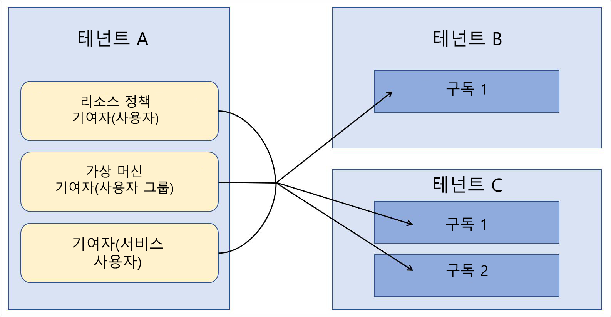

# 엔터프라이즈 시나리오의 Azure Lighthouse

[Azure Lighthouse](../overview.md)의 가장 일반적인 시나리오는 고객의 Azure AD(Azure Active Directory) 테넌트에서 리소스를 관리하는 서비스 공급자입니다. 그러나 Azure Lighthouse의 기능은 여러 Azure AD 테넌트를 사용하는 엔터프라이즈 내에서 테넌트 간 관리를 간소화하는 데 사용할 수도 있습니다.

## 단일 및 다중 테넌트 비교

대부분의 조직에서는 단일 Azure AD 테넌트를 사용하여 더 쉽게 관리할 수 있습니다. 모든 리소스가 한 테넌트 내에 있으면 해당 테넌트 내의 지정된 사용자, 사용자 그룹 또는 서비스 주체가 관리 작업을 중앙 집중식으로 수행할 수 있습니다. 가능한 경우에는 언제든지 하나의 테넌트만 조직에 사용하는 것이 좋습니다.

이와 동시에 조직에서 여러 Azure AD 테넌트를 유지 관리해야 하는 상황이 있을 수 있습니다. 경우에 따라 획득이 이루어지고 장기 테넌트 통합 전략을 정의하는 데 시간이 걸리는 경우와 같이 일시적인 상황일 수 있습니다. 또한 조직에서는 완전히 독립적인 자회사, 지리적 또는 법적 요구 사항 등으로 인해 여러 테넌트를 지속적으로 유지 관리해야 할 수도 있습니다. 다중 테넌트 아키텍처가 필요한 경우 Azure 위임 리소스 관리를 사용하여 관리 작업을 중앙 집중화하고 간소화할 수 있습니다. [Azure 위임 리소스 관리](azure-delegated-resource-management.md)를 위해 여러 테넌트의 구독을 온보딩할 수 있으므로 관리 테넌트의 지정된 사용자는 [테넌트 간 관리 기능](cross-tenant-management-experience.md)을 중앙 집중식 확장 가능한 방식으로 수행할 수 있습니다.

## 테넌트 관리 아키텍처

여러 테넌트에 걸쳐 관리 작업을 중앙 집중화하는 경우 다른 테넌트에 대한 관리 작업을 수행하는 사용자가 포함될 테넌트를 결정해야 합니다. 즉, 다른 테넌트에 대한 관리 테넌트가 될 테넌트를 결정해야 합니다.

예를 들어 조직에 *테 넌 트 a*를 호출 하는 단일 테 넌 트가 있다고 가정 합니다. 그런 다음 조직에서 두 개의 추가 테 *넌 트 B* 및 테 *넌 트 C*를 획득 하 고 별도의 테 넌 트로 유지 관리 해야 하는 비즈니스 이유가 있습니다.

조직에서는 모든 테넌트에서 동일한 정책 정의, 백업 사례 및 보안 프로세스를 사용하려고 합니다. 테넌트 A 내에서 이러한 작업을 수행해야 하는 사용자(사용자 그룹 및 서비스 주체 포함)가 이미 있으므로 테넌트 B 및 테넌트 C 내의 모든 구독을 온보딩하여 테넌트 A의 동일한 사용자가 해당 작업을 수행할 수 있습니다.

## 보안 및 액세스 고려 사항

대부분의 엔터프라이즈 시나리오에서는 구독 내의 특정 리소스 그룹만 위임할 수도 있지만 Azure 위임 리소스 관리에 대한 전체 구독을 위임하는 것이 좋습니다.

어떤 방식이든 [리소스에 액세스할 수 있는 사용자를 정의할 때는 최소 권한의 원칙을 따라야 합니다](recommended-security-practices.md#assign-permissions-to-groups-using-the-principle-of-least-privilege). 이렇게 하면 필요한 작업을 수행하는 데 필요한 권한만 사용자에게 부여하고 실수로 인한 오류가 발생할 가능성을 줄일 수 있습니다.

Azure Lighthouse 및 Azure 위임 리소스 관리는 물리적으로 데이터 또는 리소스를 이동하는 것이 아니라 관리 테넌트와 관리형 테넌트 간의 논리적 연결만 제공합니다. 또한 액세스는 항상 관리 테넌트에서 관리형 테넌트로의 한 방향으로만 진행됩니다.  관리 테넌트의 사용자와 그룹은 관리형 테넌트 리소스에 대한 관리 작업을 수행할 때 다단계 인증을 계속 사용해야 합니다.

내부 또는 외부 거버넌스 및 규정 준수 가드 레일을 사용하는 엔터프라이즈는 투명성 요구 사항을 충족하기 위해 [Azure 활동 로그](../../azure-monitor/platform/activity-logs-overview.md)를 사용할 수 있습니다. 엔터프라이즈 테넌트에서 관리 및 관리형 테넌트 관계를 설정한 경우 각 테넌트의 사용자는 기록된 활동을 확인하여 다른 테넌트의 사용자가 수행한 작업을 모니터링하고 볼 수 있습니다.

## 온보딩 프로세스 고려 사항

구독(또는 구독 내의 리소스 그룹)은 Azure Resource Manager 템플릿을 배포하거나 Azure Marketplace에 게시된 공개 및 비공개 관리 서비스 제안을 통해 Azure 위임 리소스 관리에 온보딩할 수 있습니다.

엔터프라이즈 사용자는 일반적으로 엔터프라이즈 테넌트에 직접 액세스할 수 있으며 관리 제안을 마케팅하거나 홍보할 필요가 없으므로 일반적으로 Azure Resource Manager 템플릿을 사용하여 직접 배포하는 것이 더 빠르고 간단합니다. [온보딩 지침](../how-to/onboard-customer.md)에서 서비스 공급자 및 고객을 참조하지만, 엔터프라이즈도 동일한 프로세스를 사용할 수 있습니다.

원하는 경우 [Azure Marketplace에 관리 서비스 제안을 게시](../how-to/publish-managed-services-offers.md)하여 엔터프라이즈 내의 테넌트를 온보딩할 수 있습니다. 제안을 적절한 테넌트에서만 사용할 수 있도록 하려면 계획이 비공개로 표시되어야 합니다. 프라이빗 플랜을 사용하면 온보딩하려는 각 테넌트에 구독 ID를 제공할 수 있으며, 다른 사용자는 해당 제안을 받을 수 없습니다.

## 용어 정보

엔터프라이즈 내 테넌트 간 관리의 경우 Azure Lighthouse 설명서의 서비스 공급자에 대한 참조는 엔터프라이즈 내 관리 테넌트, 즉 Azure 위임 리소스 관리를 통해 다른 테넌트의 리소스를 관리할 사용자가 포함된 테넌트에 적용되는 것으로 이해할 수 있습니다. 마찬가지로 고객에 대한 참조는 관리 테넌트의 사용자를 통해 관리할 리소스를 위임하는 테넌트에 적용되는 것으로 이해할 수 있습니다.

예를 들어 위에서 설명한 예에서 테넌트 A는 서비스 공급자 테넌트(관리 테넌트)로 간주하고, 테넌트 B와 테넌트 C는 고객 테넌트로 간주할 수 있습니다.

이 예에서 적절한 권한이 있는 테넌트 A 사용자는 Azure Portal의 **내 고객** 페이지에서 [위임된 리소스를 보고 관리](../how-to/view-manage-customers.md)할 수 있습니다. 마찬가지로 적절한 권한이 있는 테넌트 B 및 테넌트 C 사용자는 Azure Portal의 **서비스 공급자** 페이지에서 테넌트 A에 [위임된 리소스를 보고 관리](../how-to/view-manage-service-providers.md)할 수 있습니다.

## 다음 단계

- [테넌트 간 관리 환경](cross-tenant-management-experience.md)에 대해 알아봅니다.
- [Azure 위임 리소스 관리](azure-delegated-resource-management.md)에 대해 알아봅니다.