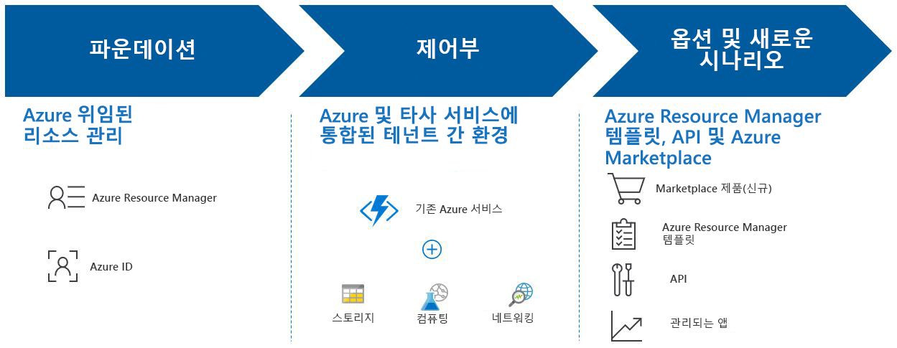

# Azure Lighthouse란?

Azure Lighthouse는 서비스 공급자에게 고도의 자동화, 비율 크기 조정, 향상된 거버넌스로 모든 고객의 Azure를 보고 관리할 수 있는 단일 컨트롤 플레인을 제공합니다. Azure Lighthouse를 통해 서비스 공급자는 Azure 플랫폼에 기본 제공되는 포괄적이고 강력한 관리 도구를 사용하여 관리형 서비스를 제공할 수 있습니다. 이 제품은 여러 테넌트 간에 리소스를 관리하는 엔터프라이즈 IT 조직에도 유용할 수 있습니다.

## 이점

Azure Lighthouse를 사용하면 고객을 위한 관리형 서비스를 효과적이면서 효율적으로 빌드하고 제공할 수 있습니다. 이점은 다음과 같습니다.

- **대규모 관리**: 고객 참여 및 수명 주기 작업을 통해 고객 리소스를 보다 쉽게 관리하고 확장할 수 있습니다.
- **고객을 위한 더 높은 가시성 및 정밀도**: 사용자의 IP가 유지되면서, 관리하는 리소스의 고객은 사용자 작업을 보다 잘 볼 수 있고, 관리를 위임하는 범위를 보다 정밀하게 제어할 수 있습니다.
- **포괄적이고 통합된 플랫폼 도구**: Microsoft의 도구 환경은 EA, CSP 및 종량제 등의 여러 라이선스 모델을 포함하는 주요 서비스 공급자 시나리오를 다룹니다. 새로운 기능은 기존 도구와 API, 라이선스 모델 및 CSP([클라우드 솔루션 공급자 프로그램](https://docs.microsoft.com/partner-center/csp-overview))와 같은 파트너 프로그램에서 작동합니다. 선택하는 Azure Lighthouse 옵션은 기존 워크플로 및 애플리케이션에 연결될 수 있으며, [파트너 ID를 연결](https://docs.microsoft.com/azure/billing/billing-partner-admin-link-started)하여 고객의 계약에 대한 영향을 추적할 수 있습니다.

Azure Lighthouse를 사용하여 고객의 Azure 리소스를 관리하는 것과 관련된 추가 비용은 없습니다.

## 기능

Azure Lighthouse에는 고객 참여 및 관리를 간소화하는 데 도움이 되는 여러 방법이 포함되어 있습니다.

- **Azure 위임 리소스 관리**: 컨텍스트 및 제어 평면을 전환할 필요 없이, 고유한 테넌트 내에서 고객의 Azure 리소스를 안전하게 관리할 수 있습니다. 자세한 내용은 [Azure 위임 리소스 관리](./concepts/azure-delegated-resource-management.md)를 참조하세요.
- **새로운 Azure Portal 환경**: [Azure Portal](https://portal.azure.com)에서 새로운 **내 고객** 페이지에서 테넌트 간 정보를 확인합니다. 고객은 해당 **서비스 공급자** 블레이드에서 서비스 공급자 액세스 권한을 보고 관리할 수 있습니다. 자세한 내용은 [고객 보기 및 관리](./how-to/view-manage-customers.md) 및 [서비스 공급자 보기 및 관리](./how-to/view-manage-service-providers.md)를 참조하세요.
- **Azure Resource Manager 템플릿**: Azure 위임 리소스 관리를 위한 고객 온보딩을 포함하는 관리 작업을 보다 쉽게 수행합니다. 자세한 내용은 [샘플 리포지토리](https://github.com/Azure/Azure-Lighthouse-samples/tree/master/Azure-Delegated-Resource-Management/templates) 및 [Azure 위임 리소스 관리에 고객 온보딩](how-to/onboard-customer.md)을 참조하세요.
- **Azure Marketplace의 관리형 서비스 솔루션**: 프라이빗 또는 퍼블릭 제품을 통해 고객에게 서비스를 제공하고, Azure Resource Manager 템플릿을 사용한 온보딩에 대한 대안으로, Azure 위임 리소스 관리에 자동으로 온보딩되도록 합니다. 자세한 내용은 [Azure Marketplace의 관리형 서비스 솔루션](./concepts/managed-services-offers.md)을 참조하세요.
- **Azure 관리형 애플리케이션**: 고객이 각자의 구독에서 쉽게 배포하고 사용할 수 있는 애플리케이션을 패키지 하고 제공합니다. 애플리케이션은 테넌트에서 액세스하는 리소스 그룹에 배포되므로 전체 Azure Lighthouse 환경의 일부로 서비스를 관리할 수 있습니다. 자세한 내용은 [Azure Managed Applications 개요](https://docs.microsoft.com/azure/managed-applications/overview)를 참조하세요.

## 다음 단계

- [Azure 위임 리소스 관리](concepts/azure-delegated-resource-management.md)에 대해 알아봅니다.
- [테넌트 간 관리 환경](concepts/cross-tenant-management-experience.md)에 대해 알아봅니다.
