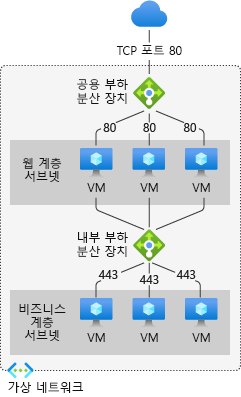
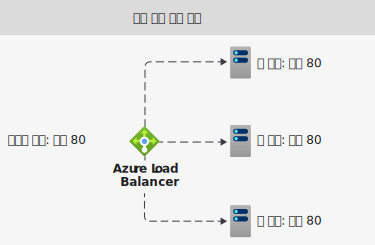
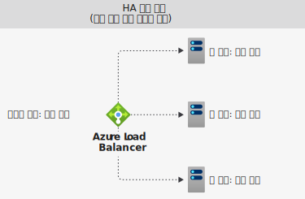
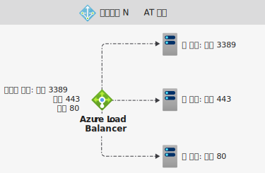

# Azure Load Balancer 구성 요소

Azure Load Balancer에는 몇 가지 주요 구성 요소가 포함되어 있습니다. 이러한 구성 요소는 다음을 통해 구독에서 구성할 수 있습니다.

* Azure portal
* Azure CLI
* Azure PowerShell
* Resource Manager 템플릿

## 프런트 엔드 IP 구성 

Azure Load Balancer의 IP 주소입니다. 클라이언트의 연락 지점입니다. 이러한 IP 주소는 다음 중 하나일 수 있습니다.

- **공용 IP 주소**
- **개인 IP 주소**

IP 주소의 특성에 따라 생성된 부하 분산 장치의 **형식** 이 결정됩니다. 개인 IP 주소를 선택하면 내부 부하 분산 장치를 만듭니다. 공용 IP 주소를 선택하면 공용 부하 분산 장치를 만듭니다.

|  | 공용 Load Balancer  | 내부 부하 분산 장치 |
| ---------- | ---------- | ---------- |
| **프런트 엔드 IP 구성**| 공용 IP 주소 | 개인 IP 주소|
| **설명** | 공용 부하 분산 장치는 들어오는 트래픽의 공용 IP와 포트를 VM의 개인 IP 및 포트에 매핑합니다. 부하 분산 장치는 VM의 응답 트래픽에 대해 다른 방식으로 트래픽을 매핑합니다. 부하 분산 규칙을 적용하여 특정 유형의 트래픽을 여러 VM 또는 서비스에 분산할 수 있습니다. 예를 들어 웹 요청 트래픽의 부하를 여러 웹 서버에 분산할 수 있습니다.| 내부 부하 분산 장치는 가상 네트워크 내에 있는 리소스에 트래픽을 분산합니다. Azure는 부하가 분산된 가상 네트워크의 프런트 엔드 IP 주소에 대한 액세스를 제한합니다. 프런트 엔드 IP 주소와 가상 네트워크는 인터넷 엔드포인트에 직접 노출되지 않습니다. 내부 LOB(기간 업무) 애플리케이션은 Azure에서 실행되며 Azure 내에서 또는 온-프레미스 리소스에서 액세스할 수 있습니다. |
| **지원되는 SKU** | 기본, 표준 | 기본, 표준 |

Load Balancer에는 여러 프런트 엔드 IP가 있을 수 있습니다. [여러 프런트 엔드](load-balancer-multivip-overview.md)에 대해 자세히 알아보세요.

## 백 엔드 풀

들어오는 요청을 처리하는 가상 머신 또는 가상 머신 확장 집합 인스턴스의 그룹입니다. 대량의 들어오는 트래픽을 충족하도록 비용 효율적으로 크기를 조정하기 위해 컴퓨팅 지침에서는 일반적으로 백 엔드 풀에 더 많은 인스턴스를 추가하는 것을 권장합니다.

부하 분산 장치는 인스턴스의 크기를 확장하거나 축소하는 경우 자동 재구성을 통해 자체적으로 즉시 재구성됩니다. 백 엔드 풀에서 VM을 추가 또는 제거하면 추가 작업 없이 부하 분산 장치가 다시 구성됩니다. 백 엔드 풀의 범위는 가상 네트워크의 모든 가상 머신입니다.

백 엔드 풀을 디자인하는 방법을 고려할 때는 가장 적은 수의 개별 백 엔드 풀 리소스에 맞게 디자인하고, 관리 작업의 길이를 최적화합니다. 데이터 평면 성능 또는 크기 조정에는 차이가 없습니다.

## 상태 프로브

상태 프로브는 백 엔드 풀의 인스턴스 상태를 확인하는 데 사용됩니다. 부하 분산 장치를 만드는 동안 사용할 부하 분산 장치에 대한 상태 프로브를 구성합니다.  이 상태 프로브는 인스턴스가 정상 상태이고 트래픽을 수신할 수 있는지 여부를 확인합니다.

상태 프로브에 대한 비정상 임계값을 정의할 수 있습니다. 프로브가 응답하지 않으면 Load Balancer에서 비정상 인스턴스에 대한 새 연결 전송을 중지합니다. 프로브 오류는 기존 연결에 영향을 주지 않습니다. 애플리케이션에서 다음을 수행할 때까지 연결이 유지됩니다.

- 흐름을 종료
- 유휴 제한 시간 발생
- VM이 종료

Load Balancer는 다음에 대한 다양한 상태 프로브 유형을 제공합니다. TCP, HTTP 및 HTTPS [Azure Load Balancer 상태 프로브에 대해 자세히 알아보세요](load-balancer-custom-probe-overview.md).

기본 Load Balancer는 HTTPS 프로브를 지원하지 않습니다. 기본 Load Balancer는 설정된 연결을 포함하여 모든 TCP 연결을 종료합니다.

## 부하 분산 규칙

Load Balancer 규칙은 백 엔드 풀 내의 **모든** 인스턴스에 들어오는 트래픽이 배포되는 방법을 정의하는 데 사용됩니다. 부하 분산 규칙은 지정된 프런트 엔드 IP 구성 및 포트를 여러 백 엔드 IP 주소 및 포트에 매핑합니다.

예를 들어 포트 80에 대한 부하 분산 규칙을 사용하여 프런트 엔드 IP에서 백 엔드 인스턴스의 포트 80으로 트래픽을 라우팅합니다.

  

*그림: 부하 분산 규칙*

## 고가용성 포트

**'protocol - all and port - 0'** 으로 구성된 부하 분산 장치 규칙입니다. 

이 규칙을 사용하면 내부 표준 Load Balancer의 모든 포트에 도달하는 모든 TCP 및 UDP 흐름을 단일 규칙으로 부하 분산할 수 있습니다. 

부하 분산 의사 결정은 흐름 단위로 이루어집니다. 이 작업은 다음과 같은 5개의 튜플 연결을 기반으로 합니다. 

1. 원본 IP 주소
2. 원본 포트
3. 대상 IP 주소
4. 대상 포트
5. protocol

HA 포트 부하 분산 규칙은 가상 네트워크 내 NVA(네트워크 가상 어플라이언스)의 고가용성 및 확장과 같은 중요한 시나리오를 지원합니다. 이 기능은 많은 수의 포트에서 부하를 분산시켜야 할 때 도움이 될 수 있습니다.

  

*그림: HA 포트 규칙*

[HA 포트](load-balancer-ha-ports-overview.md)에 대해 자세히 알아봅니다.

## 인바운드 NAT 규칙

인바운드 NAT 규칙은 프런트 엔드 IP 주소 및 포트 조합으로 전송되어 들어오는 트래픽을 전달합니다. 트래픽은 백 엔드 풀의 **특정** 가상 머신 또는 인스턴스로 전송됩니다. 포트 전달은 부하 분산과 동일한 해시 기반 배포를 통해 수행됩니다.

예를 들어 RDP(원격 데스크톱 프로토콜) 또는 SSH(Secure Shell) 세션에서 백 엔드 풀의 VM 인스턴스를 분리하려고 하는 경우입니다. 여러 개의 내부 엔드포인트를 동일한 프런트 엔드 IP 주소의 포트에 매핑할 수 있습니다. 프런트 엔드 IP 주소를 사용하여 추가 점프 상자 없이 VM을 원격으로 관리할 수 있습니다.

  

*그림: 인바운드 NAT 규칙*

Virtual Machine Scale Sets 컨텍스트의 인바운드 NAT 규칙은 인바운드 NAT 풀입니다. [Load Balancer 구성 요소 및 가상 머신 확장 집합](../virtual-machine-scale-sets/virtual-machine-scale-sets-networking.md#azure-virtual-machine-scale-sets-with-azure-load-balancer)에 대해 자세히 알아봅니다.

## 아웃바운드 규칙

아웃바운드 규칙은 백 엔드 풀에서 식별된 모든 가상 머신 또는 인스턴스에 대한 아웃바운드 NAT(Network Address Translation)를 구성합니다. 이 규칙을 사용하면 백 엔드의 인스턴스가 인터넷 또는 다른 엔드포인트로 통신(아웃바운드)할 수 있습니다.

[아웃바운드 연결 및 규칙](load-balancer-outbound-connections.md)에 대해 자세히 알아봅니다.

기본 부하 분산 장치는 아웃바운드 규칙을 지원하지 않습니다.

## 제한 사항

- Load Balancer [제한](../azure-resource-manager/management/azure-subscription-service-limits.md)에 대해 알아보기 
- 부하 분산 장치는 특정 TCP 또는 UDP 프로토콜에 대한 부하 분산 및 포트 전달을 제공합니다. 부하 분산 규칙 및 인바운드 NAT 규칙은 TCP 및 UDP를 지원하지만 ICMP를 비롯한 다른 IP 프로토콜은 지원하지 않습니다.
- 백 엔드 VM에서 내부 Load Balancer의 프런트 엔드로의 아웃바운드 흐름이 실패합니다.
- 부하 분산 장치 규칙은 두 개의 가상 네트워크에 걸쳐 있을 수 없습니다.  프런트 엔드 및 해당 백 엔드 인스턴스는 동일한 가상 네트워크에 있어야 합니다.  
- 부하 분산 규칙에서는 IP 조각 전달이 지원되지 않습니다. UDP 및 TCP 패킷의 IP 조각화는 부하 분산 규칙에서 지원되지 않습니다. HA 포트 부하 분산 규칙을 사용하여 기존 IP 조각을 전달할 수 있습니다. 자세한 내용은 [고가용성 포트 개요](load-balancer-ha-ports-overview.md)를 참조하세요.

## 다음 단계

- Load Balancer를 사용하여 시작하려면 [공용 표준 Load Balancer 만들기](quickstart-load-balancer-standard-public-portal.md)를 참조하세요.
- [Azure Load Balancer에 대해 자세히 알아보세요](load-balancer-overview.md).
- [공용 IP 주소](../virtual-network/virtual-network-public-ip-address.md)에 대한 자세한 정보
- [개인 IP 주소](../virtual-network/private-ip-addresses.md)에 대한 자세한 정보
- [표준 Load Balancer 및 가용성 영역](load-balancer-standard-availability-zones.md) 사용에 대해 자세히 알아보세요.
- [표준 Load Balancer 진단](load-balancer-standard-diagnostics.md)에 대해 자세히 알아보세요.
- [유휴 상태의 TCP 재설정](load-balancer-tcp-reset.md)에 대해 알아보세요.
- [HA 포트 부하 분산 규칙을 사용하는 표준 Load Balancer](load-balancer-ha-ports-overview.md)에 대해 자세히 알아보세요.
- [네트워크 보안 그룹](../virtual-network/network-security-groups-overview.md)에 대해 자세히 알아보세요.
- [부사 분산 장치 제한](../azure-resource-manager/management/azure-subscription-service-limits.md#load-balancer)에 대해 자세히 알아봅니다.
- [포트 전달](./tutorial-load-balancer-port-forwarding-portal.md) 사용에 대해 알아봅니다.