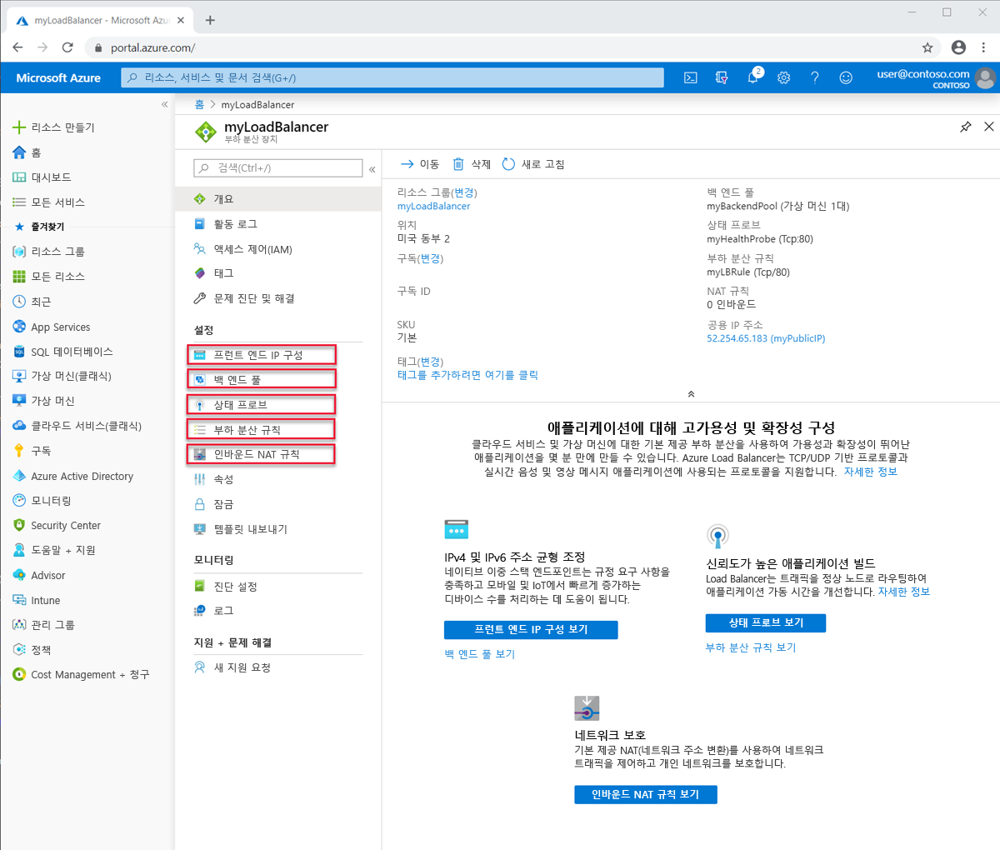
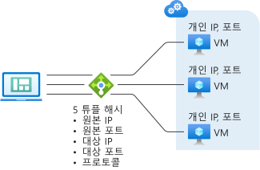
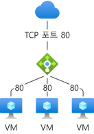

# Load Balancer 구성 요소 및 제한 사항
Azure Load Balancer에는 해당 작업을 위한 몇 가지 주요 구성 요소가 포함되어 있습니다.  이러한 구성 요소는 Azure Portal, Azure CLI 또는 Azure PowerShell을 통해 구독에서 구성할 수 있습니다.  

## Load Balancer 구성 요소

* **프런트 엔드 ip 구성**: 부하 분산 장치의 ip 주소입니다. 클라이언트의 연락 지점입니다. 이러한 주소는 다음 중 하나일 수 있습니다. 

    - **[공용 IP 주소](https://docs.microsoft.com/azure/virtual-network/virtual-network-public-ip-address)**
    - **[개인 IP 주소](https://docs.microsoft.com/azure/virtual-network/virtual-network-ip-addresses-overview-arm#private-ip-addresses)**

* **백 엔드 풀**: 들어오는 요청을 처리할 가상 머신 확장 집합의 가상 머신 또는 인스턴스 그룹입니다. 대량의 들어오는 트래픽을 충족하도록 비용 효율적으로 크기를 조정하기 위해 컴퓨팅 지침에서는 일반적으로 백 엔드 풀에 더 많은 인스턴스를 추가하는 것을 권장합니다. Load Balancer는 인스턴스의 크기를 확장하거나 축소하는 경우 자동 재구성을 통해 자체적으로 즉시 재구성됩니다. 백 엔드 풀에서 VM을 추가 또는 제거하면 추가 작업 없이 Load Balancer가 다시 구성됩니다. 백 엔드 풀의 범위는 가상 네트워크의 모든 가상 머신입니다. 백 엔드 풀의 최대 백 엔드 인스턴스 또는 IP 구성은 1000개입니다.
기본 Load Balancer의 범위 한도(가용성 집합)는 IP 구성 300개로 제한됩니다. 한도에 대한 자세한 내용은 [Load Balancer 한도](https://docs.microsoft.com/azure/azure-resource-manager/management/azure-subscription-service-limits#load-balancer)를 참조하세요. 백 엔드 풀을 디자인하는 방법을 고려할 때는 가장 적은 수의 개별 백 엔드 풀 리소스에 맞게 디자인하고, 관리 작업 기간을 추가로 최적화할 수 있습니다. 데이터 평면 성능 또는 크기 조정에는 차이가 없습니다.
* **상태 프로브**: **[상태 프로브](https://docs.microsoft.com/azure/load-balancer/load-balancer-custom-probe-overview)** 는 백 엔드 풀에 있는 인스턴스의 상태를 확인 하는 데 사용 됩니다. 상태 프로브에 대한 비정상 임계값을 정의할 수 있습니다. 프로브가 응답하지 않으면 Load Balancer는 비정상 인스턴스에 새 연결의 전송을 중지합니다. 프로브 오류는 기존 연결에 영향을 주지 않습니다. 
    
    애플리케이션에서 다음을 수행할 때까지 연결이 유지됩니다. 
    - 흐름을 종료
    - 유휴 제한 시간 발생
    - VM이 종료

    Load Balancer는 다음에 대한 다양한 상태 프로브 유형을 제공합니다.
    - TCP
    - HTTP
    - HTTPS(TLS(전송 계층 보안) 래퍼를 사용하는 HTTP 프로브)
     
     기본 Load Balancer는 HTTPS 프로브를 지원하지 않습니다. 또한 기본 Load Balancer는 설정된 연결을 포함하여 모든 TCP 연결을 종료합니다. 
    자세한 내용은 [프로브 유형](load-balancer-custom-probe-overview.md#types)을 참조하세요.

* **부하 분산 규칙**: 부하 분산 규칙은에서 수행 해야 하는 작업을 Load Balancer에 게 알려 주는 규칙입니다. 
* **인바운드 nat 규칙**: 인바운드 nat 규칙은 특정 프런트 엔드 IP 주소의 특정 포트에서 가상 네트워크 내의 특정 백 엔드 인스턴스의 특정 포트로 트래픽을 전달 합니다. **[포트 전달](https://docs.microsoft.com/azure/load-balancer/tutorial-load-balancer-port-forwarding-portal)** 은 부하 분산과 동일한 해시 기반 배포를 통해 수행됩니다. 이 기능에 대한 일반적인 시나리오는 Azure Virtual Network 내의 개별 VM 인스턴스에 대한 RDP(원격 데스크톱 프로토콜) 또는 SSH(보안 셸) 세션입니다. 여러 개의 내부 엔드포인트를 동일한 프런트 엔드 IP 주소의 포트에 매핑할 수 있습니다. 프런트 엔드 IP 주소를 사용하여 추가 점프 상자 없이 VM을 원격으로 관리할 수 있습니다.
* **아웃 바운드 규칙**: **[아웃 바운드 규칙](https://docs.microsoft.com/azure/load-balancer/load-balancer-outbound-rules-overview)** 은 프런트 엔드에 변환 될 표준 Load Balancer 백 엔드 풀로 식별 되는 모든 가상 컴퓨터 또는 인스턴스에 대해 아웃 바운드 NAT (네트워크 주소 변환)를 구성 합니다.
기본 Load Balancer는 아웃바운드 규칙을 지원하지 않습니다.

## Load Balancer 개념

Load Balancer는 TCP 및 UDP 애플리케이션에 대해 다음과 같은 기본적인 기능을 제공합니다.

* **부하 분산 알고리즘**: Azure Load Balancer을 사용 하면 프런트 엔드에 도착 하는 트래픽을 백 엔드 풀 인스턴스에 분산 하는 부하 분산 규칙을 만들 수 있습니다. Load Balancer는 인바운드 흐름(바이트 아님) 배포에 해싱 알고리즘을 사용하고 흐름의 헤더를 백 엔드 풀 인스턴스에 다시 작성합니다. 상태 프로브가 정상 백 엔드 엔드포인트을 나타내면 서버에서 새 흐름을 받을 수 있습니다.
기본적으로 Load Balancer는 5 튜플 해시를 사용합니다. 

   해시에는 다음이 포함됩니다. 

   - **원본 IP 주소**
   - **원본 포트**
   - **대상 IP 주소**
   - **대상 포트**
   - **사용 가능한 서버에 흐름을 매핑하기 위한 IP 프로토콜 번호** 

제공된 규칙에 대해 2 또는 3튜플 해시를 사용하여 원본 IP 주소에 대한 선호도를 만들 수 있습니다. 같은 패킷 흐름의 모든 패킷이 부하 분산된 프런트 엔드 뒤에 있는 동일한 인스턴스에 도착합니다. 클라이언트가 동일한 원본 IP에서 새 흐름을 시작하면 원본 포트가 변경됩니다. 결과적으로 5개 튜플 해시로 인해 트래픽이 다른 백 엔드 엔드포인트로 이동할 수 있습니다.
자세한 내용은 [Azure Load Balancer의 배포 모드 구성](./load-balancer-distribution-mode.md)을 참조하세요. 

다음 이미지는 해시 기반 배포를 표시합니다.

  

  *그림: 해시 기반 배포*

* **응용 프로그램 독립성 및 투명성**: LOAD BALANCER는 TCP 또는 UDP 또는 응용 프로그램 계층과 직접적으로 상호 작용 하지 않습니다. 모든 TCP 또는 UDP 애플리케이션 시나리오를 지원할 수 있습니다. Load Balancer는 흐름을 종료하거나 시작하지 않으며, 흐름의 페이로드와 상호 작용하지 않고, 애플리케이션 계층 게이트웨이 함수를 제공하지 않습니다. 프로토콜 핸드셰이크는 항상 클라이언트와 백 엔드 풀 인스턴스 사이에서 직접 발생합니다. 인바운드 흐름에 대한 응답은 항상 가상 머신의 응답입니다. 흐름이 가상 머신에 도착하면 원래 원본 IP 주소도 유지됩니다.
  * 모든 엔드포인트는 VM에서만 응답합니다. 예를 들어, TCP 핸드셰이크는 항상 클라이언트와 선택한 백 엔드 VM 사이에서 발행합니다. 프런트 엔드에 요청에 대한 응답은 백 엔드 VM에서 생성한 응답입니다. 프런트 엔드에 대한 연결의 유효성을 성공적으로 확인하는 경우 최소 하나 이상의 백 엔드 가상 머신에 통합형 연결의 유효성을 검사하는 것입니다.
  * 애플리케이션 페이로드는 Load Balancer에 투명합니다. 모든 UDP 또는 TCP 애플리케이션을 지원할 수 있습니다.
  * Load Balancer는 TCP 페이로드와 상호 작용하거나 TLS 오프로드를 제공하지 않기 때문에 엔드투엔드 암호화 시나리오를 구축할 수 있습니다. Load Balancer를 사용하면 VM 자체에서 TLS 연결을 종료하여 TLS 애플리케이션에 대한 대규모 스케일 아웃이 구현됩니다. 예를 들어 TLS 세션 키 용량은 백 엔드 풀에 추가하는 VM의 수와 유형으로만 제한됩니다.

* **아웃 바운드 연결**: 가상 네트워크 내의 개인 IP 주소에서 인터넷의 공용 ip 주소에 대 한 모든 아웃 바운드 흐름을 Load Balancer의 프런트 엔드 ip 주소로 변환할 수 있습니다. 퍼블릭 프런트 엔드가 부하 분산 규칙을 통해 백 엔드 VM에 연결되면 Azure는 아웃바운드 연결을 퍼블릭 프런트 엔드 IP 주소로 변환합니다. 이 구성의 장점은 다음과 같습니다.
  * 프런트 엔드를 서비스의 다른 인스턴스에 동적으로 매핑할 수 있으므로 서비스의 업그레이드 및 재해 복구가 용이합니다.
  * ACL(액세스 제어 목록)을 보다 쉽게 관리할 수 있습니다. 프런트 엔드 IP로 표현되는 ACL은 서비스를 확장 또는 축소하거나 다시 배포해도 변경되지 않습니다. 아웃바운드 연결을 컴퓨터보다 더 적은 수의 IP 주소로 변환하면 수신 허용 - 받는 사람 목록을 구현해야 한다느 부담을 줄일 수 있습니다.

  표준 Load Balancer는 [강력하고 확장 가능하며 예측 가능한 SNAT 알고리즘](load-balancer-outbound-connections.md#snat)을 활용합니다. 표준 Load Balancer를 사용할 때 이러한 점을 기억해야 합니다.

    - 부하 분산 규칙은 SNAT가 프로그래밍되는 방식을 유추합니다. 부하 분산 규칙은 프로토콜에 따라 다릅니다. SNAT는 프로토콜에 따라 다르므로, 파생 결과가 나타나지 않도록 구성에 프로토콜이 반영되어야 합니다.

    - **여러 프런트 엔드** 여러 프런트 엔드를 사용할 수 있는 경우, 모든 프런트 엔드가 사용되므로 사용 가능한 SNAT 포트 수가 크게 증가합니다. 아웃바운드 연결에 대한 수요가 높아질 것으로 예상되거나 이미 높아져서 더 많은 SNAT 포트를 원할 경우, 동일한 가상 머신 리소스에 대해 추가 프런트 엔드, 규칙 및 백 엔드 풀을 구성하여 증분 SNAT 포트 인벤토리를 추가할 수도 있습니다.

    - **아웃바운드에 사용되는 프런트 엔드 제어** 특정 프런트 엔드를 아웃바운드 연결에 사용할지를 선택하고 제어할 수 있습니다. 특정 프런트 엔드 IP 주소에서만 시작되도록 아웃바운드 연결을 제한하려는 경우, 필요에 따라 아웃바운드 매핑을 나타내는 규칙에서 아웃바운드 SNAT를 사용하지 않도록 설정할 수 있습니다.

    - **아웃바운드 연결 제어** 아웃바운드 시나리오는 명시적이며 아웃바운드 연결은 지정될 때까지 존재하지 않습니다. 표준 Load Balancer는 가상 네트워크의 컨텍스트 내에 존재합니다.  가상 네트워크는 격리된 프라이빗 네트워크입니다.  공용 IP 주소와의 연결이 없으면 공용 연결이 허용되지 않습니다.  [VNet 서비스 엔드포인트](../virtual-network/virtual-network-service-endpoints-overview.md)는 가상 네트워크의 내부 및 로컬에 있으므로 연결 가능합니다.  가상 네트워크 외부의 대상에 대해 아웃바운드 연결을 설정하려는 경우 다음 두 가지 옵션을 사용할 수 있습니다.
        - 표준 SKU 공용 IP 주소를 가상 머신 리소스에 대한 인스턴스 수준 공용 IP 주소로 할당 또는
        - 가상 머신 리소스를 공용 표준 Load Balancer의 백 엔드 풀에 배치

        두 방법 모두 가상 네트워크에서 가상 네트워크 외부로의 아웃바운드 연결을 허용합니다. 

        가상 머신 리소스가 있는 백 엔드 풀에 내부 표준 Load Balancer_만_ 연결되어 있는 경우 가상 머신은 가상 네트워크 리소스 및 [VNet 서비스 엔드포인트](../virtual-network/virtual-network-service-endpoints-overview.md)에만 연결될 수 있습니다.  아웃바운드 연결을 만들려면 이전 단락에 설명된 단계를 따르면 됩니다.

        표준 SKU와 연결되지 않은 가상 머신 리소스의 아웃바운드 연결은 이전과 동일하게 유지됩니다.

        [아웃바운드 연결에 대한 자세한 논의](load-balancer-outbound-connections.md)를 검토하세요.

* **가용성 영역**: 표준 Load Balancer 가용성 영역을 사용할 수 있는 지역에서 추가 기능을 지원 합니다. 이러한 기능은 모든 표준 Load Balancer 제공 기능에 추가됩니다.  가용성 영역 구성은 공용 및 내부 표준 Load Balancer 둘 다에 사용할 수 있습니다.
 영역 중복 프런트 엔드는 영역 실패 후에도 유지되며, 모든 영역의 전용 인프라를 통해 제공됩니다. 
또한 특정 영역에 대한 프런트 엔드도 보장할 수 있습니다. 영역 프론트 엔드는 해당 영역과 결과를 공유하며, 단일 영역의 전용 인프라를 통해서만 제공됩니다.
영역 간 부하 분산은 백 엔드 풀에 사용할 수 있으며, 가상 네트워크의 모든 가상 머신을 백 엔드 풀에 포함할 수 있습니다.
기본 Load Balancer는 영역을 지원하지 않습니다.
자세한 내용은 [가용성 영역 관련 기능에 대한 자세한 설명](load-balancer-standard-availability-zones.md) 및 [가용성 영역 개요](../availability-zones/az-overview.md)를 참조하세요.

* **HA 포트**: 부하 분산 규칙을 구성 하 여 응용 프로그램을 확장 하 고 안정성을 높일 수 있습니다. HA 포트 부하 분산 규칙을 사용할 경우, 표준 Load Balancer는 내부 표준 Load Balancer 프런트 엔드 IP 주소의 모든 삭제 포트에서 흐름별 부하 분산을 제공합니다.  이 기능은 개별 포트 지정이 불가능하거나 바람직하지 않은 다른 시나리오에 유용합니다. HA 포트 부하 분산 규칙을 사용하여 네트워크 가상 어플라이언스 및 광범위한 인바운드 포트가 모든 애플리케이션을 위한 활성-수동 또는 활성-활성 n+1 시나리오를 만들 수 있습니다.  상태 프로브를 사용하여 새 흐름을 수신할 백 엔드를 확인할 수 있습니다.  네트워크 보안 그룹을 사용하여 포트 범위 시나리오를 에뮬레이트할 수 있습니다. 기본 Load Balancer는 HA 포트를 지원하지 않습니다.
[HA 포트에 대한 자세한 논의](load-balancer-ha-ports-overview.md)를 검토하세요.
>[!IMPORTANT]
> 네트워크 가상 어플라이언스를 사용하려는 경우, 제품을 HA 포트로 테스트했는지에 따른 지침을 공급업체에 문의하고 구체적인 지침에 따라 구현합니다. 

* 여러 **프런트 엔드**: Load Balancer는 여러 프런트 엔드를 사용 하는 여러 규칙을 지원 합니다.  표준 Load Balancer는 이 규칙을 아웃바운드 시나리오로 확장합니다.  아웃바운드 시나리오는 기본적으로 인바운드 부하 분산 규칙을 뒤집은 것입니다.  인바운드 부하 분산 규칙에서도 아웃바운드 연결을 위한 연결을 만듭니다. 표준 Load Balancer는 부하 분산 규칙을 통해 가상 머신 리소스와 연결된 모든 프런트 엔드를 사용합니다.  또한 부하 분산 규칙에 대한 매개 변수를 사용하여 아웃바운드 연결을 위한 부하 분산 규칙을 표시하지 않을 수 있으며, 없음을 비롯한 특정 프런트 엔드 선택 옵션도 사용할 수 있습니다.

비교하자면, 기본 Load Balancer는 임의로 단일 프런트 엔드를 선택하며, 선택되는 프런트 엔드를 제어하는 기능도 없습니다.
## Load Balancer 유형

### 공용 Load Balancer

퍼블릭 Load Balancer는 들어오는 트래픽의 퍼블릭 IP 주소와 포트를 VM의 프라이빗 IP 주소 및 포트에 매핑합니다. Load Balancer는 VM의 응답 트래픽에 대해 다른 방식으로 트래픽을 매핑합니다. 부하 분산 규칙을 적용하여 특정 유형의 트래픽을 여러 VM 또는 서비스에 분산할 수 있습니다. 예를 들어 웹 요청 트래픽의 부하를 여러 웹 서버에 분산할 수 있습니다.

>[!NOTE]
>가용성 집합당 하나의 퍼블릭 Load Balancer와 하나의 내부 Load Balancer만 구현할 수 있습니다.

다음 그림에서는 TCP 포트 80에 대해 3개의 퍼블릭 VM 간에 공유되는 웹 트래픽의 부하가 분산된 엔드포인트를 보여 줍니다. 이 세 대의 VM은 부하 분산 집합에 속합니다.

  

*그림: 공용 부하 분산 장치를 사용 하 여 웹 트래픽 분산*

인터넷 클라이언트가 TCP 포트 80에서 웹앱의 퍼블릭 IP 주소에 웹 페이지 요청을 보냅니다. Azure Load Balancer는 부하 분산된 세트에 있는 3개 VM에 요청을 분산합니다. Load Balancer 알고리즘에 대한 자세한 내용은 [Load Balancer 개념](concepts-limitations.md#load-balancer-concepts)을 참조하세요.

기본적으로 Azure Load Balancer는 네트워크 트래픽을 여러 VM 인스턴스에 고르게 분산시킵니다. 세션 선호도를 구성할 수도 있습니다. 자세한 내용은 [Azure Load Balancer의 배포 모드 구성](load-balancer-distribution-mode.md)을 참조하세요.

###  내부 Load Balancer

내부 부하 분산 장치는 공용 부하 분산 장치와 달리, 가상 네트워크 내부에 있는 리소스 또는 VPN을 사용하여 Azure 인프라에 액세스하는 리소스로만 트래픽을 보냅니다. Azure 인프라는 가상 네트워크의 부하가 분산된 프런트 엔드 IP 주소에 대한 액세스를 제한합니다. 프런트 엔드 IP 주소와 가상 네트워크는 인터넷 엔드포인트에 직접 노출되지 않습니다. 내부 LOB(기간 업무) 애플리케이션은 Azure에서 실행되며 Azure 내에서 또는 온-프레미스 리소스에서 액세스할 수 있습니다.

내부 Load Balancer를 통해 다음과 같은 유형의 부하 분산을 사용할 수 있습니다.

* **가상 네트워크 내**에서: 가상 네트워크의 vm을 동일한 가상 네트워크에 있는 vm 집합으로 부하 분산 합니다.
* **크로스-프레미스 가상 네트워크의 경우**: 온-프레미스 컴퓨터에서 동일한 가상 네트워크에 있는 vm 집합으로 부하 분산
* **다중 계층 응용 프로그램의 경우**: 백 엔드 계층이 인터넷에 연결 되지 않는 인터넷 연결 다중 계층 응용 프로그램에 대 한 부하 분산입니다. 백 엔드 계층에는 인터넷 연결 계층의 트래픽 부하 분산이 필요합니다. 다음 그림을 참조하세요.
* **LOB(기간 업무) 애플리케이션의 경우**: 추가적인 부하 분산 장치 하드웨어 또는 소프트웨어 없이 Azure에서 호스트되는 LOB(기간 업무) 애플리케이션의 부하 분산. 이 시나리오는 트래픽 부하가 분산되는 컴퓨터 세트에 있는 온-프레미스 서버를 포함합니다.

  

*그림: 공용 및 내부 Load Balancer를 사용 하 여 다중 계층 응용 프로그램 분산*

##  Load Balancer SKU 비교

부하 분산 장치는 기본 및 표준 SKU를 모두 지원합니다. 이러한 SKU는 시나리오 규모, 기능 및 가격 책정에서 차이가 있습니다. 기본 Load Balancer로 가능한 시나리오를 표준 Load Balancer로 만들 수 있습니다. 두 SKU에 대한 API는 유사하고 SKU를 지정해서 호출됩니다. 부하 분산 장치 및 공용 IP에 대한 지원 SKU의 API는 `2017-08-01` API부터 사용할 수 있습니다. 두 SKU는 동일한 일반 API 및 구조를 갖습니다.

전체 시나리오 구성은 SKU에 따라 약간 다를 수 있습니다. 부하 분산 장치 설명서는 특정 SKU에만 문서가 적용될 때 제공됩니다. 차이점을 비교하고 파악하려면 아래 표를 참조하요. 자세한 내용은 [Azure 표준 Load Balancer 개요](load-balancer-standard-overview.md)를 참조하세요.

>[!NOTE]
> Microsoft는 표준 Load Balancer를 권장합니다.
독립 실행형 VM, 가용성 집합 및 가상 머신 확장 집합은 하나의 SKU에만 연결될 수 있습니다. 퍼블릭 IP 주소와 함께 사용할 때는 Load Balancer 및 퍼블릭 IP 주소 SKU가 일치해야 합니다. Load Balancer 및 공용 IP SKU는 변경할 수 없습니다.

[!INCLUDE [comparison table](../../includes/load-balancer-comparison-table.md)]

자세한 내용은 [Load Balancer 제한](https://docs.microsoft.com/azure/azure-resource-manager/management/azure-subscription-service-limits#load-balancer)을 참조하세요. 표준 Load Balancer 세부 내용은 [개요](load-balancer-standard-overview.md), [가격](https://aka.ms/lbpricing) 및 [SLA](https://aka.ms/lbsla)를 참조하세요.

## 제한 사항

- SKU는 변경할 수 없습니다. 기존 리소스의 SKU는 변경할 수 없습니다.
- 독립 실행형 가상 머신 리소스, 가용성 집합 리소스 또는 가상 머신 확장 집합 리소스는 하나의 SKU만 참조할 수 있습니다.
- Load Balancer 규칙은 두 가상 네트워크에 걸쳐 있을 수 없습니다.  프런트엔드 및 해당 관련 백 엔드 인스턴스는 동일한 가상 네트워크에 있어야 합니다.  
- [구독 이동 작업](../azure-resource-manager/management/move-resource-group-and-subscription.md)은 표준 LB 및 공용 IP 리소스에 대해 지원되지 않습니다.
- VNet 및 기타 Microsoft 플랫폼 서비스를 사용하지 않는 웹 작업자 역할은 내부 표준 Load Balancer 뒤에 있는 인스턴스에서만 액세스할 수 있습니다. 해당 서비스 자체 또는 기본 플랫폼이 예고 업이 변경될 수 있기 때문에 여기에 의존하지 말아야 합니다. 내부 표준 Load Balancer만 사용하는 경우 원하면 명시적으로 [아웃 바운드 연결](load-balancer-outbound-connections.md)을 만들어야 한다고 항상 가정해야 합니다.

- Load Balancer는 특정 TCP 또는 UDP 프로토콜에 대한 부하 분산 및 포트 전달을 제공합니다. 부하 분산 규칙 및 인바운드 NAT 규칙은 TCP 및 UDP를 지원하지만 ICMP를 비롯한 다른 IP 프로토콜은 지원하지 않습니다.

  Load Balancer가 종료 및 응답하지 않거나 UDP 또는 TCP 흐름의 페이로드와 상호 작용하지 않습니다. 프록시가 아닙니다. 부하 분산 또는 인바운드 NAT 규칙에서 사용되는 것과 동일한 프로토콜을 사용하여 대역 내에서 프런트 엔드 연결에 대한 유효성 검사가 성공해야 합니다. 클라이언트가 프런트 엔드의 응답을 확인하려면 하나 이상의 가상 머신이 응답을 생성해야 합니다.

  Load Balancer 프런트 엔드에서 대역 내 응답을 수신하지 못하면 어떤 가상 머신도 응답할 수 없음을 나타냅니다. 응답할 수 있는 가상 머신이 없으면 Load Balancer 프런트 엔드와 상호 작용이 불가능합니다. 이는 SNAT 모조 포트가 TCP 및 UDP에 대해서만 지원되는 경우에 아웃바운드 연결에도 적용됩니다. ICMP를 비롯한 다른 모든 IP 프로토콜은 실패합니다. 이 문제를 완화하려면 인스턴스 수준 퍼블릭 IP 주소를 할당합니다. 자세한 내용은 [SNAT 및 PAT 이해](load-balancer-outbound-connections.md#snat)를 참조하세요.

- 내부 Load Balancer는 아웃바운드에서 시작된 연결을 내부 Load Balancer의 프런트 엔드로 변환하지 않습니다. 둘 다 프라이빗 IP 주소 공간에 있기 때문입니다. 퍼블릭 Load Balancer는 가상 네트워크 내부의 프라이빗 IP 주소에서 퍼블릭 IP 주소로의 [아웃바운드 연결](load-balancer-outbound-connections.md)을 제공합니다. 내부 Load Balancer의 경우, 이렇게 하면 변환이 필요하지 않으면 고유한 내부 IP 주소 공간 내에서 SNAT 포트가 고갈될 가능성이 방지됩니다.

  부작용은 백 엔드 풀에 있는 VM에서의 아웃바운드 흐름이 해당 풀에 있는 내부 Load Balancer의 프런트 엔드로 흐름을 유도하_고_ 자체로 매핑되는 경우, 흐름의 두 레그가 일치하지 않는다는 것입니다. 두 레그가 일치하지 않기 때문에 흐름이 실패합니다. 흐름은 프런트 엔드로의 흐름을 생성한 백 엔드 풀의 동일한 VM에 다시 매핑되지 않으면 성공하게 됩니다.

  흐름이 스스로에게 다시 매핑되는 경우 아웃바운드 흐름은 VM에서 시작된 후 프런트 엔드에 나타나며 해당 인바운드 흐름은 VM에서 시작된 후 자신에게 나타납니다. 게스트 운영 체제의 관점에서 동일한 흐름의 인바운드 및 아웃바운드 부분은 가상 머신 내에서 일치하지 않습니다. TCP 스택은 동일한 흐름의 이러한 절반을 동일한 흐름의 일부로서 인식하지 않습니다. 소스와 대상은 일치하지 않습니다. 흐름이 백 엔드 풀에서 다른 모든 VM에 매핑되는 경우 흐름의 절반은 일치하며 VM은 흐름에 응답할 수 있습니다.

  이 시나리오에 대한 증상은 흐름이 흐름을 처음 시작한 동일한 백 엔드로 돌아갈 때 일시적인 연결 시간 제한입니다. 일반적인 해결 방법은 내부 Load Balancer 뒤에 프록시 계층을 삽입하고 DSR(Direct Server Return) 스타일 규칙을 사용하는 것입니다. 자세한 내용은 [Azure Load Balancer의 여러 프런트 엔드](load-balancer-multivip-overview.md)를 참조하세요.

  타사 프록시에 내부 Load Balancer를 결합하거나 HTTP/HTTPS가 있는 프록시 시나리오에 대해 내부 [Application Gateway](../application-gateway/application-gateway-introduction.md)를 사용할 수 있습니다. 퍼블릭 Load Balancer를 사용하여 이 문제를 완화할 수는 있지만 결과 시나리오에서는 [SNAT 고갈](load-balancer-outbound-connections.md#snat)이 발생할 가능성이 높습니다. 신중하게 관리하지 못할 경우에는 이 두 번째 방법을 사용하지 마세요.

- 일반적으로 부하 분산 규칙에서는 IP 조각 전달이 지원되지 않습니다. UDP 및 TCP 패킷의 IP 조각화는 부하 분산 규칙에서 지원되지 않습니다. 고가용성 포트 부하 분산 규칙을 사용하여 기존 IP 조각을 전달할 수 있습니다. 자세한 내용은 [고가용성 포트 개요](load-balancer-ha-ports-overview.md)를 참조하세요.

## 다음 단계

- Load Balancer를 사용하여 시작하려면 [공용 표준 Load Balancer 만들기](quickstart-load-balancer-standard-public-portal.md)를 참조하세요. 하나의 부하 분산 장치를 만들고, 사용자 지정 IIS 확장이 설치된 VM을 만들고, VM 간에 웹앱의 부하를 분산시킵니다.
- [Azure Load Balancer에 대해 자세히 알아보세요](load-balancer-overview.md).
- [표준 Load Balancer 및 가용성 영역](load-balancer-standard-availability-zones.md) 사용에 대해 자세히 알아보세요.
- [상태 프로브](load-balancer-custom-probe-overview.md)에 대해 자세히 알아보세요.
- [표준 Load Balancer 진단](load-balancer-standard-diagnostics.md)에 대해 자세히 알아보세요.
- [아웃바운드 연결에 Load Balancer](load-balancer-outbound-connections.md) 사용에 대해 자세히 알아보세요.
- [아웃바운드 규칙](load-balancer-outbound-rules-overview.md)에 대해 알아보세요.
- [유휴 상태의 TCP 재설정](load-balancer-tcp-reset.md)에 대해 알아보세요.
- [HA 포트 부하 분산 규칙을 사용하는 표준 Load Balancer](load-balancer-ha-ports-overview.md)에 대해 자세히 알아보세요.
- [다중 프런트 엔드를 사용하는 Load Balancer](load-balancer-multivip-overview.md)에 대해 자세히 알아보세요.
- [네트워크 보안 그룹](../virtual-network/security-overview.md)에 대해 자세히 알아보세요.
