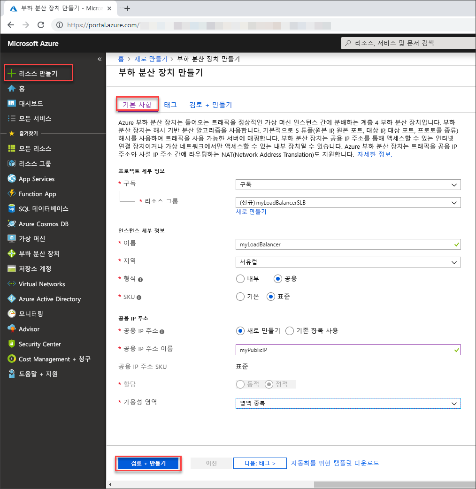

# Azure Portal를 사용 하 여 표준 Load Balancer에서 부하 분산 및 아웃 바운드 규칙 구성

이 문서에서는 Azure Portal를 사용 하 여 표준 Load Balancer에서 아웃 바운드 규칙을 구성 하는 방법을 보여 줍니다.  

부하 분산 장치 리소스에는 프런트 엔드 두 개와 연결 된 규칙이 포함 되어 있습니다. 인바운드 트래픽에 대해 프런트 엔드가 하나 있고 아웃 바운드 트래픽에 대 한 다른 프런트 엔드가 있습니다.  

각 프런트 엔드는 공용 IP 주소를 참조 합니다. 이 시나리오에서 인바운드 트래픽에 대 한 공용 IP 주소는 아웃 바운드 트래픽의 주소와 다릅니다.   부하 분산 규칙은 인바운드 부하 분산만 제공 합니다. 아웃 바운드 규칙은 VM에 대 한 아웃 바운드 NAT (네트워크 주소 변환)를 제어 합니다.  

이 시나리오에서는 두 개의 백 엔드 풀을 사용 합니다. 하나는 인바운드 트래픽과 아웃 바운드 트래픽용으로 하나입니다. 이러한 풀은 기능을 설명 하 고 시나리오에 대 한 유연성을 제공 합니다.

Azure 구독이 아직 없는 경우 시작하기 전에 [체험 계정](https://azure.microsoft.com/free/?WT.mc_id=A261C142F)을 만듭니다. 

## Azure에 로그인

[https://portal.azure.com](https://portal.azure.com)에서 Azure Portal에 로그인합니다.

## 부하 분산 장치 만들기

이 섹션에서는 가상 컴퓨터의 부하를 분산 하는 부하 분산 장치를 만듭니다. 공용 부하 분산 장치 또는 내부 부하 분산 장치를 만들 수 있습니다. 공용 부하 분산 장치를 만들 때 부하 분산 장치에 대 한 프런트 엔드로 구성 된 새 공용 IP 주소를 만듭니다. 프런트 엔드는 기본적으로 **LoadBalancerFrontEnd** 로 이름이 지정 됩니다.

1. 화면 왼쪽 상단에서 **리소스 만들기** > **네트워킹** > **Load Balancer**를 선택합니다.
2. **부하 분산 장치 만들기** 페이지의 **기본 사항** 탭에서 다음 정보를 입력 하거나 선택 합니다.

    | 설정                 | 값                                              |
    | ---                     | ---                                                |
    | Subscription               | 구독을 선택합니다.    |    
    | Resource group         | **새로 만들기**를 선택하고 텍스트 상자에 **myResourceGroupSLB**를 입력합니다.|
    | Name                   | **myLoadBalancer**                                   |
    | 지역         | **서유럽**를 선택합니다.                                        |
    | Type          | **공용**을 선택합니다.                                        |
    | SKU           | **표준**을 선택합니다. |
    | 공용 IP 주소 | **새로 만들기**를 선택합니다. 기존 공용 IP를 사용 하려는 경우 **기존 사용**을 선택 합니다.  기존 공용 IP는 **표준** SKU 여야 합니다.  기본 공용 Ip는 **표준** SKU 부하 분산 장치와 호환 되지 않습니다.  |
    | 공용 IP 주소 이름              | 텍스트 상자에 **myPublicIP**를 입력합니다.|
    | 가용성 영역 | 복원 력 Load Balancer을 만들려면 **영역 중복** 을 선택 합니다. 영역 Load Balancer를 만들려면 1, 2 또는 3에서 특정 영역을 선택합니다. |

3. 구성의 나머지 부분에 대 한 기본값을 적용 합니다.
4. **검토 + 만들기** 선택

    > [!IMPORTANT]
    > 이 빠른 시작의 나머지 부분에서는 위의 SKU 선택 프로세스 중에 **표준** SKU가 선택되었다고 가정합니다.

5. **검토 + 만들기** 탭에서 **만들기**를 선택합니다.   

    

## 부하 분산 장치 리소스 만들기

이 섹션에서는 백 엔드 주소 풀 및 상태 프로브에 대한 부하 분산 장치 설정을 구성하고, 분산 장치 규칙을 지정합니다.

### 백 엔드 풀 만들기

백 엔드 주소 풀에는 백 엔드 풀에 있는 가상 Nic의 IP 주소가 포함 됩니다. 인터넷 트래픽의 부하를 분산하기 위한 가상 머신을 포함할 백 엔드 주소 풀 **myBackendPool**을 만듭니다.

1. 왼쪽 메뉴에서 **모든 서비스**를 선택하고 **모든 리소스**를 선택한 다음, 리소스 목록에서 **myLoadBalancer**를 선택합니다.
2. **설정**에서 **백 엔드 풀**을 선택한 다음, **추가**를 선택합니다.
3. **백 엔드 풀 추가** 페이지에서 이름에 백 엔드 풀의 이름인 **myBackEndPool**을 입력한 후 **추가**를 선택합니다.

### 상태 프로브 만들기

상태 프로브는 앱의 상태를 모니터링 하는 데 사용 됩니다. 상태 프로브는 상태 검사에 대 한 응답에 따라 부하 분산 장치에서 Vm을 추가 하거나 제거 합니다. VM 상태를 모니터링할 상태 프로브 **myHealthProbe**를 만듭니다.

1. 왼쪽 메뉴에서 **모든 서비스**를 선택하고 **모든 리소스**를 선택한 다음, 리소스 목록에서 **myLoadBalancer**를 선택합니다.
2. **설정**에서 **상태 프로브**를 선택한 다음, **추가**를 선택합니다.
    
    | 설정 | 값 |
    | ------- | ----- |
    | 이름 | **myHealthProbe**를 입력합니다. |
    | 프로토콜 | **HTTP**를 선택합니다. |
    | 포트 | **80**을 입력합니다.|
    | 간격 | 프로브 시도 **간격**(초)으로 **15**를 입력합니다. |
    | 비정상 임계값 | **비정상 임계값** 또는 VM이 비정상 상태로 간주되는 데 필요한 연속 프로브 오류 횟수로 **2**를 선택합니다.|
    | | |
4. **확인**을 선택합니다.

### 부하 분산 장치 규칙 만들기
부하 분산 장치 규칙은 VM으로 트래픽이 분산되는 방법을 정의하는 데 사용됩니다. 

다음을 정의 합니다.
 - 들어오는 트래픽에 대 한 프런트 엔드 IP 구성입니다.
 - 트래픽을 수신할 백 엔드 IP 풀입니다.
 - 필요한 원본 및 대상 포트입니다. 

다음 섹션에서는을 만듭니다.
 - 80 포트를 수신 대기 하기 위한 부하 분산 장치 규칙 **myHTTPRule** .
 - 프런트 엔드 **LoadBalancerFrontEnd**.
 - 백 엔드 주소 풀 **myBackEndPool** 포트 80도 사용 합니다. 

1. 왼쪽 메뉴에서 **모든 서비스**를 선택하고 **모든 리소스**를 선택한 다음, 리소스 목록에서 **myLoadBalancer**를 선택합니다.
2. **설정** 아래에서 **부하 분산 규칙**을 선택한 다음, **추가**를 선택합니다.
3. 다음 값을 사용하여 부하 분산 규칙을 구성합니다.
    
    | 설정 | 값 |
    | ------- | ----- |
    | Name | **myHTTPRule**을 입력합니다. |
    | 프로토콜 | **TCP**를 선택합니다. |
    | 포트 | **80**을 입력합니다.|
    | 백 엔드 포트 | **80**을 입력합니다. |
    | 백 엔드 풀 | **myBackendPool**을 선택합니다.|
    | 상태 프로브 | **myHealthProbe**를 선택합니다. |
    | 암시적 아웃 바운드 규칙 만들기 | **아니요**를 선택합니다. 이후 섹션에서 전용 공용 IP를 사용 하 여 아웃 바운드 규칙을 만듭니다. |
4. 나머지는 기본값으로 둔 다음, **확인**을 선택합니다.

## 아웃 바운드 규칙 구성 만들기
부하 분산 장치 아웃 바운드 규칙은 백 엔드 풀의 Vm에 대 한 아웃 바운드 SNAT를 구성 합니다. 

### 아웃 바운드 공용 IP 주소 및 프런트 엔드 만들기

1. 왼쪽 메뉴에서 **모든 서비스**를 선택하고 **모든 리소스**를 선택한 다음, 리소스 목록에서 **myLoadBalancer**를 선택합니다.

2. **설정**에서 **프런트 엔드 IP 구성**을 선택한 다음 **추가**를 선택 합니다.

3. 다음 값을 사용 하 여 아웃 바운드에 대 한 프런트 엔드 IP 구성을 구성 합니다.

    | 설정 | 값 |
    | ------- | ----- |
    | Name | **LoadBalancerFrontEndOutbound**를 입력 합니다. |
    | IP 버전 | **IPv4**를 선택합니다. |
    | IP 유형 | **Ip 주소** 또는 **ip 접두사**를 선택 합니다.|
    | 공용 IP 주소 | **새로 만들기**를 선택합니다.   **공용 IP 주소 추가**에 **myPublicIPOutbound**를 입력 합니다.   IP 접두사를 사용 하 **는 경우 공용 ip 접두사 추가**에서 **myPublicIPPrefixOutbound**을 입력 합니다. 공용 IP 접두사의 **접두사 크기** 를 선택 합니다.   **확인**을 선택합니다.  |

4. **추가**를 선택합니다.

### 아웃 바운드 백 엔드 풀 만들기

1. 왼쪽 메뉴에서 **모든 서비스**를 선택하고 **모든 리소스**를 선택한 다음, 리소스 목록에서 **myLoadBalancer**를 선택합니다.

2. **설정**에서 **백 엔드 풀**을 선택한 다음, **추가**를 선택합니다.

3. **백 엔드 풀 추가** 페이지에서 이름에 **myBackendPoolOutbound**을 백 엔드 풀의 이름으로 입력 한 다음 **추가**를 선택 합니다.

### 아웃바운드 규칙 만들기

1. 왼쪽 메뉴에서 **모든 서비스**를 선택하고 **모든 리소스**를 선택한 다음, 리소스 목록에서 **myLoadBalancer**를 선택합니다.

2. **설정**에서 **아웃 바운드 규칙**을 선택한 다음 **추가**를 선택 합니다.

3. 다음 값을 사용 하 여 아웃 바운드 규칙을 구성 합니다.

    | 설정 | 값 |
    | ------- | ----- |
    | Name | **MyOutboundRule**를 입력 합니다. |
    | 프런트 엔드 IP 주소 | **LoadBalancerFrontEndOutbound**를 선택 합니다. |
    | 유휴 제한 시간(분) | 슬라이더를 **15 분**으로 이동 합니다.|
    | TCP 다시 설정 | **사용**을 선택합니다.|
    | 백 엔드 풀 | **MyBackendPoolOutbound** 선택 |
    | 포트 할당-> 포트 할당 | **아웃 바운드 포트 수 수동 선택을** 선택 합니다. |
    | 아웃 바운드 포트-> 선택 기준 | **인스턴스당 포트** 선택 |
    | 아웃 바운드 포트-인스턴스당 > 포트 | **1만**을 입력 합니다. |

4. **추가**를 선택합니다.

## 리소스 정리

더 이상 필요하지 않으면 리소스 그룹, 부하 분산 장치 및 모든 관련 리소스를 삭제합니다. 부하 분산 장치를 포함 하는 **Myresourcegroupslb** 리소스 그룹을 선택한 다음 **삭제**를 선택 합니다.

## 다음 단계

이 문서의 내용
 - 표준 부하 분산 장치를 만들었습니다.
 - 인바운드 및 아웃 바운드 부하 분산 장치 트래픽 규칙을 모두 구성 했습니다.
 - 백 엔드 풀의 Vm에 대 한 상태 프로브를 구성 했습니다. 

자세히 알아보려면 [Azure Load Balancer의 자습서](tutorial-load-balancer-standard-public-zone-redundant-portal.md)를 계속 진행 하세요.
