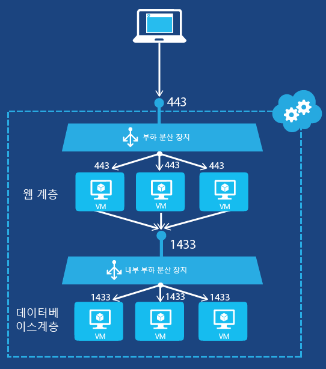

# <a name="get-started-creating-an-internal-load-balancer-classic-using-powershell"></a>PowerShell을 사용하여 내부 부하 분산 장치(클래식) 만들기 시작

> [!div class="op_single_selector"]
> * [PowerShell](../load-balancer/load-balancer-get-started-ilb-classic-ps.md)
> * [Azure CLI](../load-balancer/load-balancer-get-started-ilb-classic-cli.md)
> * [Cloud services](../load-balancer/load-balancer-get-started-ilb-classic-cloud.md)

[!INCLUDE [load-balancer-get-started-ilb-intro-include.md](../../includes/load-balancer-get-started-ilb-intro-include.md)]

> [!IMPORTANT]
> Azure에는 리소스를 만들고 사용하기 위한  [Resource Manager 및 클래식](../azure-resource-manager/resource-manager-deployment-model.md)이라는 두 가지 배포 모델이 있습니다.  이 문서에서는 클래식 배포 모델 사용에 대해 설명합니다. 새로운 배포는 대부분 리소스 관리자 모델을 사용하는 것이 좋습니다. [Resource Manager 모델을 사용하여 이러한 단계를 수행하는](load-balancer-get-started-ilb-arm-ps.md) 방법을 알아봅니다.

[!INCLUDE [load-balancer-get-started-ilb-scenario-include.md](../../includes/load-balancer-get-started-ilb-scenario-include.md)]

[!INCLUDE [azure-ps-prerequisites-include.md](../../includes/azure-ps-prerequisites-include.md)]

## <a name="create-an-internal-load-balancer-set-for-virtual-machines"></a>가상 머신에 대한 내부 부하 분산 장치 집합 만들기

내부 부하 분산 장치 집합과 이 집합으로 해당 트래픽을 전송할 서버를 만들려면 다음을 수행해야 합니다.

1. 부하 분산 집합의 서버 간에 부하가 분산될 들어오는 트래픽의 엔드포인트가 되는 내부 부하 분산의 인스턴스를 만듭니다.
2. 들어오는 트래픽을 수신할 가상 머신에 해당하는 엔드포인트를 추가합니다.
3. 부하가 분산될 트래픽을 전송하는 서버가 해당 트래픽을 내부 부하 분산 인스턴스의 VIP(가상 IP) 주소로 전송하도록 구성합니다.

### <a name="step-1-create-an-internal-load-balancing-instance"></a>1단계: 내부 부하 분산 인스턴스 만들기

기존 클라우드 서비스 또는 지역 가상 네트워크에 배포된 클라우드 서비스의 경우 다음 Windows PowerShell 명령을 사용하여 내부 부하 분산 인스턴스를 만들 수 있습니다.

```powershell
$svc="<Cloud Service Name>"
$ilb="<Name of your ILB instance>"
$subnet="<Name of the subnet within your virtual network>"
$IP="<The IPv4 address to use on the subnet-optional>"

Add-AzureInternalLoadBalancer -ServiceName $svc -InternalLoadBalancerName $ilb –SubnetName $subnet –StaticVNetIPAddress $IP
```

이 [Add-AzureEndpoint](https://msdn.microsoft.com/library/dn495300.aspx) Windows PowerShell cmdlet 사용에서는 DefaultProbe 매개 변수 집합이 사용됩니다. 추가 매개 변수 집합에 대한 자세한 내용은 [Add-AzureEndpoint](https://msdn.microsoft.com/library/dn495300.aspx)를 참조하세요.

### <a name="step-2-add-endpoints-to-the-internal-load-balancing-instance"></a>2단계: 내부 부하 분산 인스턴스에 엔드포인트 추가

다음은 예제입니다.

```powershell
$svc="mytestcloud"
$vmname="DB1"
$epname="TCP-1433-1433"
$lbsetname="lbset"
$prot="tcp"
$locport=1433
$pubport=1433
$ilb="ilbset"
Get-AzureVM –ServiceName $svc –Name $vmname | Add-AzureEndpoint -Name $epname -Lbset $lbsetname -Protocol $prot -LocalPort $locport -PublicPort $pubport –DefaultProbe -InternalLoadBalancerName $ilb | Update-AzureVM
```

### <a name="step-3-configure-your-servers-to-send-their-traffic-to-the-new-internal-load-balancing-endpoint"></a>3단계: 새 내부 부하 분산 엔드포인트로 트래픽을 전송하도록 서버 구성

해당 트래픽의 부하가 분산될 서버에서 내부 부하 분산 인스턴스의 새 IP 주소(VIP)를 사용하도록 구성해야 합니다. 이 주소는 내부 부하 분산 인스턴스가 수신 대기하는 주소입니다. 대부분의 경우 내부 부하 분산 인스턴스의 VIP에 대한 DNS 레코드를 추가하거나 수정하기만 하면 됩니다.

내부 부하 분산 인스턴스를 만드는 동안 IP 주소를 지정한 경우 이미 VIP가 있습니다. 그렇지 않으면 다음 명령을 통해 VIP를 확인할 수 있습니다.

```powershell
$svc="<Cloud Service Name>"
Get-AzureService -ServiceName $svc | Get-AzureInternalLoadBalancer
```

이러한 명령을 사용하려면 값을 입력하고 < 및 >를 제거합니다. 다음은 예제입니다.

```powershell
$svc="mytestcloud"
Get-AzureService -ServiceName $svc | Get-AzureInternalLoadBalancer
```

Get-AzureInternalLoadBalancer 명령 표시에서 IP 주소를 확인하고 필요한 경우 서버 또는 DNS 레코드를 변경하여 트래픽이 VIP로 전송되게 합니다.

> [!NOTE]
> Microsoft Azure 플랫폼에서는 다양한 관리 시나리오에 공개적으로 라우팅할 수 있는 고정 IPv4 주소를 사용합니다. IP 주소는 168.63.129.16입니다. 이 IP 주소를 방화벽으로 차단하면 안 됩니다. 예기치 않은 동작이 발생할 수 있습니다.
> Azure 내부 부하 분산과 관련하여 이 IP 주소는 부하 분산된 집합에서 가상 머신의 상태를 확인하기 위해 부하 분산 장치에서 프로브를 모니터링하는 데 사용됩니다. 내부적으로 부하 분산된 집합의 Azure 가상 머신으로 트래픽을 제한하는 네트워크 보안 그룹이 사용된 경우 168.63.129.16의 트래픽을 허용하도록 네트워크 보안 규칙을 추가해야 합니다.

## <a name="example-of-internal-load-balancing"></a>내부 부하 분산의 예제

두 예제 구성에 대한 부하 분산 집합을 만드는 완전한 프로세스의 단계별 지침은 다음 섹션을 참조하세요.

### <a name="an-internet-facing-multi-tier-application"></a>인터넷 연결 다중 계층 애플리케이션

인터넷 연결 웹 서버 집합에 부하 분산 데이터베이스 서비스를 제공하려고 합니다. 두 서버 집합은 단일 Azure 클라우드 서비스에서 호스트됩니다. TCP 포트 1433에 대한 웹 서버 트래픽을 데이터베이스 계층의 2개 가상 머신에 배포해야 합니다. 그림 1은 구성을 보여 줍니다.



구성은 다음과 같이 이루어져 있습니다.

* 가상 머신을 호스트하는 기존 클라우드 서비스의 이름은 mytestcloud입니다.
* 두 기존 데이터베이스 서버 이름은 DB1, DB2입니다.
* 웹 계층의 웹 서버는 개인 IP 주소를 사용하여 데이터베이스 계층의 데이터베이스 서버에 연결합니다. 다른 옵션은 가상 네트워크에 자체 DNS를 사용하고 내부 부하 분산 장치 집합에 A 레코드를 수동으로 등록하는 것입니다.

다음 명령은 **ILBset** 라는 새 내부 부하 분산 인스턴스를 구성하고 2개의 데이터베이스 서버에 해당하는 가상 머신에 엔드포인트를 추가합니다.

```powershell
$svc="mytestcloud"
$ilb="ilbset"
Add-AzureInternalLoadBalancer -ServiceName $svc -InternalLoadBalancerName $ilb
$prot="tcp"
$locport=1433
$pubport=1433
$epname="TCP-1433-1433"
$lbsetname="lbset"
$vmname="DB1"
Get-AzureVM –ServiceName $svc –Name $vmname | Add-AzureEndpoint -Name $epname -LbSetName $lbsetname -Protocol $prot -LocalPort $locport -PublicPort $pubport –DefaultProbe -InternalLoadBalancerName $ilb | Update-AzureVM

$epname="TCP-1433-1433-2"
$vmname="DB2"
Get-AzureVM –ServiceName $svc –Name $vmname | Add-AzureEndpoint -Name $epname -LbSetName $lbsetname -Protocol $prot -LocalPort $locport -PublicPort $pubport –DefaultProbe -InternalLoadBalancerName $ilb | Update-AzureVM
```

## <a name="remove-an-internal-load-balancing-configuration"></a>내부 부하 분산 구성 제거

내부 부하 분산 장치 인스턴스에서 엔드포인트인 가상 컴퓨터를 제거하려면 다음 명령을 사용합니다.

```powershell
$svc="<Cloud service name>"
$vmname="<Name of the VM>"
$epname="<Name of the endpoint>"
Get-AzureVM -ServiceName $svc -Name $vmname | Remove-AzureEndpoint -Name $epname | Update-AzureVM
```

이러한 명령을 사용하려면 값을 입력하고 < 및 >를 제거합니다.

다음은 예제입니다.

```powershell
$svc="mytestcloud"
$vmname="DB1"
$epname="TCP-1433-1433"
Get-AzureVM -ServiceName $svc -Name $vmname | Remove-AzureEndpoint -Name $epname | Update-AzureVM
```

클라우드 서비스에서 내부 부하 분산 장치 인스턴스를 제거하려면 다음 명령을 사용합니다.

```powershell
$svc="<Cloud service name>"
Remove-AzureInternalLoadBalancer -ServiceName $svc
```

이러한 명령을 사용하려면 값을 입력하고 < 및 >를 제거합니다.

다음은 예제입니다.

```powershell
$svc="mytestcloud"
Remove-AzureInternalLoadBalancer -ServiceName $svc
```

## <a name="additional-information-about-internal-load-balancer-cmdlets"></a>내부 부하 분산 장치 cmdlet에 대한 추가 정보

내부 부하 분산 cmdlet에 대한 추가 정보를 얻으려면 Windows PowerShell 프롬프트에서 다음 명령을 실행합니다.

```powershell
Get-Help New-AzureInternalLoadBalancerConfig -full
Get-Help Add-AzureInternalLoadBalancer -full
Get-Help Get-AzureInternalLoadbalancer -full
Get-Help Remove-AzureInternalLoadBalancer -full
```

## <a name="next-steps"></a>다음 단계

[원본 IP 선호도를 사용하여 부하 분산 장치 배포 모드 구성](load-balancer-distribution-mode.md)

[부하 분산 장치에 대한 유휴 TCP 시간 제한 설정 구성](load-balancer-tcp-idle-timeout.md)

