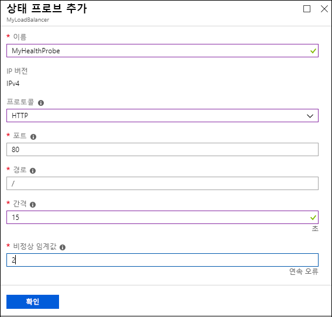
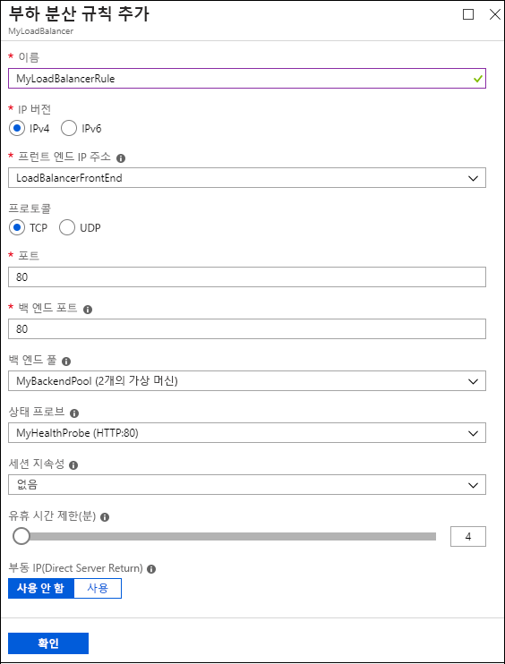

<properties
   pageTitle="Azure 포털을 사용하여 Resource Manager에서 인터넷 연결 부하 분산 장치 만들기 | Microsoft Azure"
   description="Azure 포털을 사용하여 Resource Manager에서 인터넷 연결 부하 분산 장치를 만드는 방법에 대해 알아봅니다."
   services="load-balancer"
   documentationCenter="na"
   authors="anavinahar"
   manager="narayan"
   editor=""
   tags="azure-resource-manager"
/>
<tags
   ms.service="load-balancer"
   ms.devlang="na"
   ms.topic="article"
   ms.tgt_pltfrm="na"
   ms.workload="infrastructure-services"
   ms.date="09/14/2016"
   ms.author="annahar" />

# Azure 포털을 사용하여 인터넷 연결 부하 분산 장치 만들기 시작

[AZURE.INCLUDE [load-balancer-get-started-internet-arm-selectors-include.md](../../includes/load-balancer-get-started-internet-arm-selectors-include.md)]

[AZURE.INCLUDE [load-balancer-get-started-internet-intro-include.md](../../includes/load-balancer-get-started-internet-intro-include.md)]

[AZURE.INCLUDE [azure-arm-classic-important-include](../../includes/azure-arm-classic-important-include.md)] 이 문서에서는 Resource Manager 배포 모델에 대해 설명합니다. 또한 [클래식 배포를 사용하여 인터넷 연결 부하 분산 장치를 만드는 방법을 배울 수 있습니다](load-balancer-get-started-internet-classic-portal.md).

[AZURE.INCLUDE [load-balancer-get-started-internet-scenario-include.md](../../includes/load-balancer-get-started-internet-scenario-include.md)]

부하 분산 장치를 만들기 위해 수행되는 개별 작업의 순서를 알아보고 부하 분산 장치를 만들기 위해 수행해야 하는 작업을 자세히 설명합니다.

## 인터넷 연결 부하 분산 장치를 만드는 데 필요한 항목은 무엇입니까?

부하 분산 장치를 배포하려면 다음 개체를 만들고 구성해야 합니다.

- 프런트 엔드 IP 구성 - 들어오는 네트워크 트래픽에 대한 공용 IP 주소를 포함합니다.

- 백 엔드 주소 풀 - 부하 분산 장치의 네트워크 트래픽을 받는 가상 컴퓨터에 대한 NIC(네트워크 인터페이스)를 포함합니다.

- 부하 분산 규칙 - 백 엔드 주소 풀에 있는 포트에 부하 분산 장치의 공용 포트를 매핑하는 규칙을 포함합니다.

- 인바운드 NAT 규칙 - 백 엔드 주소 풀에 있는 특정 가상 컴퓨터에 대한 포트에 부하 분산 장치의 공용 포트를 매핑하는 규칙을 포함합니다.

- 프로브 - 백 엔드 주소 풀의 가상 컴퓨터 인스턴스의 가용성을 확인하는 데 사용하는 상태 프로브를 포함합니다.

Azure 리소스 관리자의 분산 장치 구성 요소에 대한 자세한 내용은 [부하 분산 장치에 대한 Azure 리소스 관리자 지원](load-balancer-arm.md)에서 확인할 수 있습니다.

## Azure 포털에서 부하 분산 장치 설정

> [AZURE.IMPORTANT] 이 예제에서는 **myVNet**이라는 가상 네트워크가 있다고 가정합니다. 이렇게 하려면 [가상 네트워크 만들기](../virtual-network/virtual-networks-create-vnet-arm-pportal.md)를 참조하세요. 또한 **myVNet** 내에 **LB-Subnet-BE**라는 서브넷이 있고 **web1** 및 **web2**라는 2개의 VM이 **myVNet**의 **myAvailSet**이라는 동일한 가용성 집합 내에 각각 포함되어 있다고 가정합니다. VM을 만들려면 [이 링크](../virtual-machines/virtual-machines-windows-hero-tutorial.md)를 참조하세요.

1. 브라우저에서 Azure 포털 [http://portal.azure.com](http://portal.azure.com)으로 이동하고 Azure 계정으로 로그인합니다.

2. 화면 왼쪽 상단에서 **새로 만들기** > **네트워킹** > **부하 분산 장치**를 선택합니다.

3. **부하 분산 장치 만들기** 블레이드에서 부하 분산 장치의 이름을 입력합니다. 여기서는 **myLoadBalancer**라고 지칭합니다.

4. **형식**에서 **Public**을 선택합니다.

5. **공용 IP 주소** 아래에서 **myPublicIP**이라는 새 공용 IP를 만듭니다.

6. 리소스 그룹에서 **myRG**를 선택합니다. 그런 다음 해당 **위치**를 선택하고 **확인**을 클릭합니다. 부하 분산 장치는 배포를 시작하며 배포를 성공적으로 완료하는 데 몇 분 정도 걸립니다.

## 백 엔드 주소 풀 만들기

1. 부하 분산 장치가 성공적으로 배포되면 리소스 내에서 선택합니다. 설정에서 백 엔드 풀을 선택합니다. 백 엔드 풀의 이름을 입력합니다. 표시되는 블레이드 위쪽의 **추가** 단추를 클릭합니다.

2. **백 엔드 풀 추가** 블레이드에서 **가상 컴퓨터 추가**를 클릭합니다. **가용성 집합** 아래에서 **가용성 집합**을 선택하고 **myAvailSet**을 선택합니다. 다음으로, 블레이드의 가상 컴퓨터 섹션에서 **가상 컴퓨터 선택**을 선택하고 부하 분산을 위해 만들어진 두 개의 VM인 **web 1** 및 **web2**를 클릭합니다. 아래 이미지에 표시된 대로 있는 왼쪽의 파란색 확인 표시를 선택해야 합니다. **가상 컴퓨터 선택** 블레이드에서 확인을 클릭한 후 **선택**을 클릭한 다음 **백 엔드 풀 추가** 블레이드에서 **확인**을 클릭합니다.

    

3. 알림 드롭다운 목록에 **web1** 및 **web2** 둘 다에 대한 네트워크 인터페이스 업데이트 외에 부하 분산 장치 백 엔드 풀 저장과 관련된 업데이트가 있는지 확인합니다.

## 프로브, LB 규칙 및 NAT 규칙 만들기

1. 상태 프로브를 만듭니다.

    부하 분산 장치의 설정에서 프로브를 선택합니다. 그런 후 블레이드 위쪽에서 **추가**를 클릭합니다.

    프로브를 구성하는 방법에는 HTTP 또는 TCP의 두 가지가 있습니다. 이 예제에서는 HTTP가 표시되지만 TCP도 비슷한 방식으로 구성할 수 있습니다. 필요한 정보를 업데이트합니다. 설명대로 **myLoadBalancer**가 포트 80에서 트래픽 로드를 분산합니다. 선택한 경로는 HealthProbe.aspx이고, 간격은 15초이고, 비정상 임계값은 2입니다. 완료되면 **확인**을 클릭하여 프로브를 만듭니다.

    'I' 아이콘 위에 포인터를 가져가 이러한 개별 구성 및 요구 사항에 맞게 변경하는 방법을 자세히 알아봅니다.

    

2. 부하 분산 장치를 만듭니다.

    부하 분산 장치의 설정 섹션에서 부하 분산 규칙을 클릭합니다. 새 블레이드에서 **추가**를 클릭합니다. 규칙 이름을 지정합니다. 여기서는 HTTP입니다. 프런트 엔드 포트 및 백 엔드 포트를 선택합니다. 여기서는 둘 다에 대해 80이 선택됩니다. 백 엔드 풀로 **LB-backend**를 선택하고 프로브로는 이전에 만든 **HealthProbe**를 선택합니다. 요구 사항에 따라 다른 구성을 설정할 수 있습니다. 그런 후 확인을 클릭하여 부하 분산 규칙을 저장합니다.

    

3. 인바운드 NAT 규칙 만들기

    부하 분산 장치의 설정 섹션에서 인바운드 NAT 규칙을 클릭합니다. 새 블레이드에서 **추가**를 클릭합니다. 인바운드 NAT 규칙의 이름을 지정합니다. 여기서는 **inboundNATrule1**입니다. 대상은 이전에 만든 공용 IP여야 합니다. 서비스에서 사용자 지정을 선택하고 사용하려는 프로토콜을 선택합니다. 여기서는 TCP가 선택됩니다. 이 경우 포트 3441 및 대상 포트 3389를 입력합니다. 그런 후 확인을 클릭하여 이 규칙을 저장합니다.

    첫 번째 규칙이 생성된 후 포트 3442에서 대상 포트 3389로의 inboundNATrule2라는 두 번째 인바운드 NAT 규칙에 대해 이 단계를 반복합니다.

    

## 부하 분산 장치 제거하기

부하 분산 장치를 삭제하려면 제거하려는 부하 분산 장치를 선택합니다. *부하 분산 장치* 블레이드에서 블레이드의 끝 부분에 있는 **삭제**를 클릭합니다. 그런 후 확인할지 묻는 메시지가 표시되면 **예**를 선택합니다.

## 다음 단계

[내부 부하 분산 장치 구성 시작](load-balancer-get-started-ilb-arm-cli.md)

[부하 분산 장치 배포 모드 구성](load-balancer-distribution-mode.md)

[부하 분산 장치에 대한 유휴 TCP 시간 제한 설정 구성](load-balancer-tcp-idle-timeout.md)

<!---HONumber=AcomDC_0921_2016-->