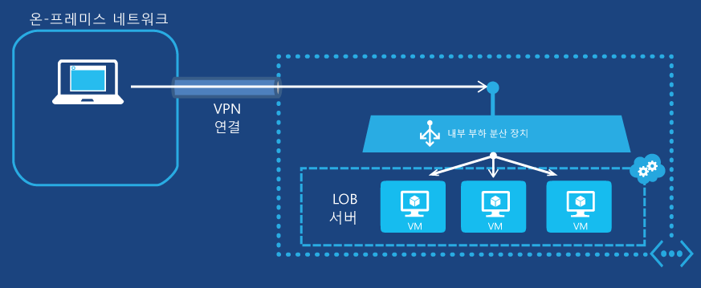

<properties
   pageTitle="내부 부하 분산 장치 시작 | Microsoft Azure"
   description="내부 부하 분산 장치를 구성하며, 가상 컴퓨터 및 클라우드 배포에 대해 내부 부하 분산 장치를 구현하는 방법입니다."
   services="load-balancer"
   documentationCenter="na"
   authors="joaoma"
   manager="adinah"
   editor="tysonn" />
<tags
   ms.service="load-balancer"
   ms.devlang="na"
   ms.topic="get-started-article"
   ms.tgt_pltfrm="na"
   ms.workload="infrastructure-services"
   ms.date="07/22/2015"
   ms.author="joaoma" />

# 내부 부하 분산 장치 구성 시작

> [AZURE.SELECTOR]
- [Azure Classic steps](load-balancer-internal-getstarted.md)
- [Resource Manager Powershell steps](load-balancer-internal-arm-powershell.md)

Azure ILB(내부 부하 분산)는 클라우드 서비스 또는 지역 범위의 가상 네트워크 내부에 있는 가상 컴퓨터 간의 부하 분산을 제공합니다. 지역 범위의 가상 네트워크 사용 및 구성에 대한 자세한 내용은 Azure 블로그의 [지역 가상 네트워크](../regional-virtual-networks.md)를 참조하세요. 선호도 그룹에 대해 구성된 기존 가상 네트워크는 ILB를 사용할 수 없습니다.

## 가상 컴퓨터에 대한 내부 부하 분산 장치 집합 만들기

Azure 내부 부하 분산 집합 및 이 집합으로 해당 트래픽을 전송할 서버를 만들려면 다음을 수행해야 합니다.

1. 부하 분산 집합의 서버 간에 부하가 분산될 들어오는 트래픽의 끝점이 되는 ILB 인스턴스를 만듭니다.

1. 들어오는 트래픽을 수신할 가상 컴퓨터에 해당하는 끝점을 추가합니다.

1. 부하가 분산될 트래픽을 전송하는 서버가 해당 트래픽을 ILB 인스턴스의 VIP(가상 IP 주소)로 전송하도록 구성합니다.

### 1단계: ILB 인스턴스 만들기

기존 클라우드 서비스 또는 지역 가상 네트워크에 배포된 클라우드 서비스의 경우 다음 Windows PowerShell 명령을 사용하여 ILB 인스턴스를 만들 수 있습니다.

	$svc="<Cloud Service Name>"
	$ilb="<Name of your ILB instance>"
	$subnet="<Name of the subnet within your virtual network>"
	$IP="<The IPv4 address to use on the subnet-optional>"

	Add-AzureInternalLoadBalancer -ServiceName $svc -InternalLoadBalancerName $ilb –SubnetName $subnet –StaticVNetIPAddress $IP

이러한 명령을 사용하려면 값을 입력하고 < and >를 제거합니다. 다음은 예제입니다.

	$svc="WebCloud-NY"
	$ilb="SQL-BE"
	$subnet="Farm1"
	$IP="192.168.98.10"
	Add-AzureInternalLoadBalancer -ServiceName $svc -InternalLoadBalancerName $ilb –SubnetName $subnet –StaticVNetIPAddress $IP

### 2단계: ILB 인스턴스에 끝점 추가

기존 가상 컴퓨터의 경우 다음 명령을 사용하여 ILB 인스턴스에 끝점을 추가할 수 있습니다.

	$svc="<Cloud service name>"
	$vmname="<Name of the VM>"
	$epname="<Name of the endpoint>"
	$lbsetname="<Name of the load balancer set>"
	$prot="tcp" or "udp"
	$locport=<local port number>
	$pubport=<public port number>
	$ilb="<Name of your ILB instance>"
	Get-AzureVM –ServiceName $svc –Name $vmname | Add-AzureEndpoint -Name $epname -LbsetName $lbsetname -Protocol $prot -LocalPort $locport -PublicPort $pubport –DefaultProbe -InternalLoadBalancerName $ilb | Update-AzureVM

이러한 명령을 사용하려면 값을 입력하고 < and >를 제거합니다.

이 [Add-AzureEndpoint](https://msdn.microsoft.com/library/dn495300.aspx) Windows PowerShell cmdlet 사용에서는 DefaultProbe 매개 변수 집합이 사용됩니다. 추가 매개 변수 집합에 대한 자세한 내용은 [Add-AzureEndpoint](https://msdn.microsoft.com/library/dn495300.aspx)를 참조하세요.

다음은 예제입니다.

	$svc="AZ-LOB1"
	$vmname="SQL-LOBAZ1"
	$epname="SQL1"
	$lbsetname="SQL-LB"
	$prot="tcp"
	$locport=1433
	$pubport=1433
	$ilb="SQL ILB"
	Get-AzureVM –ServiceName $svc –Name $vmname | Add-AzureEndpoint -Name $epname -Lbset $lbsetname -Protocol $prot -LocalPort $locport -PublicPort $pubport –DefaultProbe -InternalLoadBalancerName $ilb | Update-AzureVM

### 3단계: 새 ILB 끝점으로 트래픽을 전송하도록 서버 구성

해당 트래픽의 부하가 분산될 서버에서 ILB 인스턴스의 새 IP 주소(VIP)를 사용하도록 구성해야 합니다. 이 주소는 ILB 인스턴스가 수신 대기하는 주소입니다. 대부분의 경우 ILB 인스턴스의 VIP에 대한 DNS 레코드를 추가하거나 수정하기만 하면 됩니다.

ILB 인스턴스를 만드는 동안 IP 주소를 지정한 경우 이미 VIP가 있습니다. 그렇지 않으면 다음 명령을 통해 VIP를 확인할 수 있습니다.

	$svc="<Cloud Service Name>"
	Get-AzureService -ServiceName $svc | Get-AzureInternalLoadBalancer

이러한 명령을 사용하려면 값을 입력하고 < and >를 제거합니다. 다음은 예제입니다.

	$svc="WebCloud-NY"
	Get-AzureService -ServiceName $svc | Get-AzureInternalLoadBalancer

Get-AzureInternalLoadBalancer 명령 표시에서 IP 주소를 확인하고 필요한 경우 서버 또는 DNS 레코드를 변경하여 트래픽이 VIP로 전송되게 합니다.

>[AZURE.NOTE]Microsoft Azure 플랫폼에서는 다양한 관리 시나리오에 공개적으로 라우팅할 수 있는 고정 IPv4 주소를 사용합니다. IP 주소는 168.63.129.16입니다. 이 IP 주소를 방화벽으로 차단하면 안 됩니다. 예기치 않은 동작이 발생할 수 있습니다. Azure ILB와 관련하여 이 IP 주소는 부하 분산된 집합에서 VM의 상태를 확인하기 위해 부하 분산 장치에서 프로브를 모니터링하는 데 사용됩니다. 내부적으로 부하 분산된 집합의 Azure 가상 컴퓨터로 트래픽을 제한하는 네트워크 보안 그룹이 사용된 경우 168.63.129.16의 트래픽을 허용하도록 네트워크 보안 규칙을 추가해야 합니다.

## 내부 부하 분산의 완전한 예제

두 예제 구성에 대한 부하 분산 집합을 만드는 완전한 프로세스의 단계별 지침은 다음 섹션을 참조하세요.

### 인터넷 연결 다중 계층 응용 프로그램

Contoso Corporation은 인터넷 연결 웹 서버 집합과 데이터베이스 서버 집합 간에 부하 분산을 제공하려고 합니다. 두 서버 집합은 단일 Azure 클라우드 서비스에서 호스트됩니다. TCP 포트 1433에 대한 웹 서버 트래픽을 데이터베이스 계층의 3개 가상 컴퓨터에 배포해야 합니다. 그림 1은 구성을 보여 줍니다.

그림 1: 인터넷 연결 다중 계층 응용 프로그램의 예

구성은 다음과 같이 이루어져 있습니다.

- 가상 컴퓨터를 호스트하는 기존 클라우드 서비스의 이름은 Contoso-PartnerSite입니다.

- 기존 데이터베이스 서버 3개의 이름은 PARTNER-SQL-1, PARTNER-SQL-2, 및 PARTNER-SQL-3입니다.

- 웹 계층의 웹 서버는 DNS 이름 partner-sql.external.contoso.com을 사용하여 데이터베이스 계층의 데이터베이스 서버에 연결합니다.

다음 명령은 PARTNER-DBTIER라는 새 ILB 인스턴스를 구성하고 3개의 데이터베이스 서버에 해당하는 가상 컴퓨터에 끝점을 추가합니다.

	$svc="Contoso-PartnerSite"
	$ilb="PARTNER-DBTIER"
	Add-AzureInternalLoadBalancer -ServiceName $svc -InternalLoadBalancerName $ilb

	$prot="tcp"
	$locport=1433
	$pubport=1433
	$epname="DBTIER1"
	$lbsetname="SQL-LB"
	$vmname="PARTNER-SQL-1"
	Get-AzureVM –ServiceName $svc –Name $vmname | Add-AzureEndpoint -Name $epname -LbSetName $lbsetname -Protocol $prot -LocalPort $locport -PublicPort $pubport –DefaultProbe -InternalLoadBalancerName $ilb | Update-AzureVM

	$epname="DBTIER2"
	$vmname="PARTNER-SQL-2"
	Get-AzureVM –ServiceName $svc –Name $vmname | Add-AzureEndpoint -Name $epname -LbSetName $lbsetname -Protocol $prot -LocalPort $locport -PublicPort $pubport –DefaultProbe -InternalLoadBalancerName $ilb | Update-AzureVM

	$epname="DBTIER3"
	$vmname="PARTNER-SQL-3"
	Get-AzureVM –ServiceName $svc –Name $vmname | Add-AzureEndpoint -Name $epname -LbSetName $lbsetname -Protocol $prot -LocalPort $locport -PublicPort $pubport –DefaultProbe -InternalLoadBalancerName $ilb | Update-AzureVM

그런 후에 Contoso는 다음 명령을 사용하여 PARTNER-DBTIER ILB 인스턴스의 VIP를 확인했습니다.

	Get-AzureService -ServiceName $svc | Get-AzureInternalLoadBalancer

이 명령의 표시에서 Contoso는 VIP 주소인 100.64.65.211을 확인하고 이 새로운 주소를 사용하도록 이름 partner-sql.external.contoso.com에 대한 DNS 주소(A) 레코드를 구성했습니다.

### Azure에 호스트된 LOB 응용 프로그램

Contoso Corporation은 Azure의 웹 서버 집합에서 LOB(기간 업무) 응용 프로그램을 호스트하려고 합니다. TCP 포트 80으로 전송된 클라이언트 트래픽을 크로스-프레미스 가상 네트워크에서 실행되는 3개의 가상 컴퓨터에 부하 분산해야 합니다. 그림 2는 구성을 보여 줍니다.

그림 2: Azure에 호스트된 LOB 응용 프로그램의 예

구성은 다음과 같이 이루어져 있습니다.

- 가상 컴퓨터를 호스트하는 기존 클라우드 서비스의 이름은 Contoso-legal입니다.

- LOB 서버가 있는 서브넷의 이름은 LOB-LEGAL이고, Contoso는 주소 198.168.99.145를 내부 부하 분산 장치의 VIP 주소로 선택했습니다.

- 기존 LOB 서버 3개의 이름은 LEGAL-1, LEGAL-2 및 LEGAL-3입니다.

- 인트라넷 웹 클라이언트는 DNS 이름 legalnet.corp.contoso.com을 사용하여 서버에 연결합니다.

다음 명령은 LEGAL-ILB라는 ILB 인스턴스를 만들고 3개의 LOB 서버에 해당하는 가상 컴퓨터에 끝점을 추가합니다.

	$svc="Contoso-Legal"
	$ilb="LEGAL-ILB"
	$subnet="LOB-LEGAL"
	$IP="198.168.99.145"
	Add-AzureInternalLoadBalancer –ServiceName $svc -InternalLoadBalancerName $ilb –SubnetName $subnet –StaticVNetIPAddress $IP

	$prot="tcp"
	$locport=80
	$pubport=80
	$epname="LOB1"
	$lbsetname="LOB-LB"
	$vmname="LEGAL-1"
	Get-AzureVM –ServiceName $svc –Name $vmname | Add-AzureEndpoint -Name $epname-LbSetName $lbsetname -Protocol $prot -LocalPort $locport -PublicPort $pubport –DefaultProbe -InternalLoadBalancerName $ilb | Update-AzureVM

	$epname="LOB2"
	$vmname="LEGAL2"
	Get-AzureVM –ServiceName $svc –Name $vmname | Add-AzureEndpoint -Name $epname -LbSetName $lbsetname -Protocol $prot -LocalPort $locport -PublicPort $pubport –DefaultProbe -InternalLoadBalancerName $ilb | Update-AzureVM

	$epname="LOB3"
	$vmname="LEGAL3"
	Get-AzureVM –ServiceName $svc –Name $vmname | Add-AzureEndpoint -Name $epname -LbSetName $lbsetname -Protocol $prot -LocalPort $locport -PublicPort $pubport –DefaultProbe -InternalLoadBalancerName $ilb | Update-AzureVM

그런 후에 Contoso는 198.168.99.145를 사용하도록 legalnet.corp.contoso.com 이름에 대한 DNS A 레코드를 구성했습니다.

## ILB에 가상 컴퓨터 추가

가상 컴퓨터를 만들 때 ILB 인스턴스에 추가하려면 New-AzureInternalLoadBalancerConfig 및 New-AzureVMConfig cmdlet을 사용할 수 있습니다.

다음은 예제입니다.

	$svc="AZ-LOB1"
	$ilb="LOB-ILB"
	$vnet="LOBNet_Azure"
	$subnet="LOBServers"
	$vmname="LOB-WEB1"
	$adminuser="Lando"
	$adminpw="Platform327"
	$regionname="North Central US"

	$myilbconfig=New-AzureInternalLoadBalancerConfig -InternalLoadBalancerName $ilb -SubnetName $subnet
	$images = Get-AzureVMImage
	New-AzureVMConfig -Name $vmname -InstanceSize Small -ImageName $images[50].ImageName | Add-AzureProvisioningConfig -Windows -AdminUsername $adminuser -Password $adminpw | New-AzureVM -ServiceName $svc -InternalLoadBalancerConfig $myilbconfig -Location $regionname –VNetName $vnet

## 클라우드 서비스에 대해 ILB 구성

ILB는 가상 컴퓨터와 클라우드 서비스 둘 다에 대해 지원됩니다. 지역 가상 네트워크 외부에 있는 클라우드 서비스에 생성된 ILB 끝점은 해당 클라우드 서비스 내에서만 액세스할 수 있습니다.

아래 샘플에 나와 있는 것처럼 클라우드 서비스에서 첫 번째 배포를 만드는 동안 ILB 구성을 설정해야 합니다.

>[AZURE.IMPORTANT]아래 단계를 실행하려면 클라우드 배포를 위해 가상 네트워크를 반드시 미리 만들어 두어야 합니다. ILB를 만들려면 가상 네트워크 이름 및 서브넷 이름이 필요합니다.

### 1단계

Visual Studio에서 클라우드 배포용 서비스 구성 파일(.cscfg)을 열고 다음 섹션을 추가하여 네트워크 구성을 위해 마지막 "`</Role>`" 항목 아래에 ILB를 만듭니다.

	<NetworkConfiguration>
	  <LoadBalancers>
	    <LoadBalancer name="name of the load balancer">
	      <FrontendIPConfiguration type="private" subnet="subnet-name" staticVirtualNetworkIPAddress="static-IP-address"/>
	    </LoadBalancer>
	  </LoadBalancers>
	</NetworkConfiguration>
 

어떻게 표시되는지 나타내기 위해 네트워크 구성 파일에 대한 값을 추가하겠습니다. 예제에서는 test\_subnet이라는 서브넷 10.0.0.0/24와 고정 IP 10.0.0.4를 사용하는 "test\_vnet"이라는 서브넷을 만들었다고 가정합니다. 부하 분산 장치의 이름은 testLB입니다.

	<NetworkConfiguration>
	  <LoadBalancers>
	    <LoadBalancer name="testLB">
	      <FrontendIPConfiguration type="private" subnet="test_subnet" staticVirtualNetworkIPAddress="10.0.0.4"/>
	    </LoadBalancer>
	  </LoadBalancers>
	</NetworkConfiguration>

부하 분산 장치 스키마에 대한 자세한 내용은 [부하 분산 장치 추가](https://msdn.microsoft.com/library/azure/dn722411.aspx)를 참조하세요.

### 2단계

ILB에 끝점을 추가하려면 서비스 정의(.csdef) 파일을 변경합니다. 역할 인스턴스가 만들어지는 순간 서비스 정의 파일이 ILB에 역할 인스턴스를 추가합니다.

	<WorkerRole name="worker-role-name" vmsize="worker-role-size" enableNativeCodeExecution="[true|false]">
	  <Endpoints>
	    <InputEndpoint name="input-endpoint-name" protocol="[http|https|tcp|udp]" localPort="local-port-number" port="port-number" certificate="certificate-name" loadBalancerProbe="load-balancer-probe-name" loadBalancer="load-balancer-name" />
	  </Endpoints>
	</WorkerRole>

위의 예제에서 나온 동일한 값을 따라 서비스 정의 파일에 값을 추가하겠습니다.

	<WorkerRole name=WorkerRole1" vmsize="A7" enableNativeCodeExecution="[true|false]">
	  <Endpoints>
	    <InputEndpoint name="endpoint1" protocol="http" localPort="80" port="80" loadBalancer="testLB" />
	  </Endpoints>
	</WorkerRole>

들어오는 요청의 경우 포트 80을 사용하는 testLB 부하 분산 장치를 통해 네트워크 트래픽 부하가 분산되며 포트 80의 작업자 역할 인스턴스에도 보냅니다.

## ILB 구성 제거

ILB 인스턴스에서 끝점인 가상 컴퓨터를 제거하려면 다음 명령을 사용합니다.

	$svc="<Cloud service name>"
	$vmname="<Name of the VM>"
	$epname="<Name of the endpoint>"
	Get-AzureVM -ServiceName $svc -Name $vmname | Remove-AzureEndpoint -Name $epname | Update-AzureVM

이러한 명령을 사용하려면 값을 입력하고 < and >를 제거합니다.

다음은 예제입니다.

	$svc="AZ-LOB1"
	$vmname="SQL-LOBAZ1"
	$epname="SQL1"
	Get-AzureVM -ServiceName $svc -Name $vmname | Remove-AzureEndpoint -Name $epname | Update-AzureVM

클라우드 서비스에서 ILB 인스턴스를 제거하려면 다음 명령을 사용합니다.

	$svc="<Cloud service name>"
	Remove-AzureInternalLoadBalancer -ServiceName $svc

이러한 명령을 사용하려면 값을 입력하고 < and >를 제거합니다.

다음은 예제입니다.

	$svc="AZ-LOB1"
	Remove-AzureInternalLoadBalancer -ServiceName $svc

## ILB cmdlet에 대한 추가 정보

ILB cmdlet에 대한 추가 정보를 얻으려면 Azure Windows PowerShell 프롬프트에서 다음 명령을 실행합니다.

- Get-help New-AzureInternalLoadBalancerConfig -full

- Get-help Add-AzureInternalLoadBalancer -full

- Get-help Get-AzureInternalLoadbalancer -full

- Get-help Remove-AzureInternalLoadBalancer -full

## 참고 항목

[부하 분산 장치 배포 모드 구성](load-balancer-distribution-mode.md)

[부하 분산 장치에 대한 유휴 TCP 시간 제한 설정 구성](load-balancer-tcp-idle-timeout.md)
 

<!---HONumber=August15_HO6-->