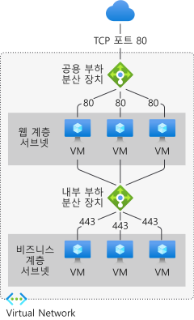

# Azure Load Balancer란?

*부하 분산*은 백 엔드 리소스 또는 서버의 그룹에서 로드(들어오는 네트워크 트래픽)를 효율적으로 분산하는 것을 의미합니다. 

Azure Load Balancer는 OSI(Open Systems Interconnect) 모델의 계층 4에서 작동합니다. 클라이언트의 단일 연락 지점입니다. Load Balancer는 부하 분산 장치의 프런트 엔드에 도착하는 인바운드 흐름을 백 엔드 풀 인스턴스에 분산합니다. 이러한 흐름은 구성된 부하 분산 규칙 및 상태 프로브에 따라 진행됩니다. 백 엔드 풀 인스턴스는 Azure Virtual Machines 또는 가상 머신 확장 집합의 인스턴스일 수 있습니다.

**[공용 부하 분산 장치](./components.md#frontend-ip-configurations)** 를 사용하여 가상 네트워크 내의 VM(가상 머신)에 대해 아웃바운드 연결을 제공합니다. 이러한 연결은 개인 IP 주소를 공용 IP 주소로 변환하여 수행됩니다. 공용 Load Balancer는 인터넷 트래픽 부하를 VM에 분산하는 데 사용됩니다.

**[내부(또는 개인) 부하 분산 장치](./components.md#frontend-ip-configurations)** 는 사설 IP가 프런트 엔드에서만 필요한 경우에 사용됩니다. 내부 부하 분산 장치는 트래픽 부하를 가상 네트워크 내에 분산하는 데 사용됩니다. 하이브리드 시나리오의 온-프레미스 네트워크에서 부하 분산 장치 프런트 엔드에 액세스할 수 있습니다.

  

*그림: 퍼블릭 및 내부 Load Balancer를 둘 다 사용하여 다중 계층 애플리케이션 부하 분산*

개별 부하 분산 장치 구성 요소에 대한 자세한 내용은 [Azure Load Balancer 구성 요소](./components.md)를 참조하세요.

## Azure Load Balancer를 사용하는 이유
표준 Load Balancer를 사용하면 애플리케이션 크기를 조정하고 고가용성 서비스를 만들 수 있습니다. 부하 분산 장치는 인바운드 및 아웃바운드 시나리오를 모두 지원합니다. 부하 분산 장치는 짧은 대기 시간과 높은 처리량을 제공하고, 모든 TCP 및 UDP 애플리케이션에 대해 최대 수백만 개의 흐름으로 확장합니다.

표준 Load Balancer를 사용하여 수행할 수 있는 주요 시나리오는 다음과 같습니다.

- **[내부](https://docs.microsoft.com/azure/load-balancer/tutorial-load-balancer-standard-internal-portal)** 및 **[외부](https://docs.microsoft.com/azure/load-balancer/tutorial-load-balancer-standard-manage-portal)** 트래픽을 Azure 가상 머신으로 부하를 분산합니다.

- 영역 **[내](https://docs.microsoft.com/azure/load-balancer/tutorial-load-balancer-standard-public-zonal-portal)** 및 **[전반에서](https://docs.microsoft.com/azure/load-balancer/tutorial-load-balancer-standard-public-zone-redundant-portal)** 리소스를 배포하여 가용성을 높입니다.

- Azure 가상 머신에 대한 **[아웃바운드 연결](https://docs.microsoft.com/azure/load-balancer/load-balancer-outbound-connections)** 을 구성합니다.

- **[상태 프로브](https://docs.microsoft.com/azure/load-balancer/load-balancer-custom-probe-overview)** 를 사용하여 부하가 분산된 리소스를 모니터링합니다.

- **[포트 전달](https://docs.microsoft.com/azure/load-balancer/tutorial-load-balancer-port-forwarding-portal)** 을 사용하여 공용 IP 주소 및 포트로 가상 네트워크의 가상 머신에 액세스합니다.

- **[IPv6](https://docs.microsoft.com/azure/virtual-network/ipv6-overview)** 의 **[부하 분산](https://docs.microsoft.com/azure/virtual-network/virtual-network-ipv4-ipv6-dual-stack-standard-load-balancer-powershell)** 을 위한 지원을 사용하도록 설정합니다.

- 표준 Load Balancer는 [Azure Monitor](https://docs.microsoft.com/azure/azure-monitor/overview)를 통해 다차원 메트릭을 제공합니다.  이러한 메트릭은 지정된 차원에 대해 필터링, 그룹화 및 나눌 수 있습니다.  이러한 메트릭은 서비스의 성능과 상태에 대한 현재 및 이전 정보를 제공합니다.  리소스 상태도 지원됩니다. 자세한 내용은 **[표준 Load Balancer 진단](load-balancer-standard-diagnostics.md)** 을 검토하세요.

- 부하 분산 장치를 **[여러 포트, 여러 IP 주소 또는 둘 다](https://docs.microsoft.com/azure/load-balancer/load-balancer-multivip-overview)** 에서 사용합니다.

- **[내부](https://docs.microsoft.com/azure/load-balancer/move-across-regions-internal-load-balancer-portal)** 및 **[외부](https://docs.microsoft.com/azure/load-balancer/move-across-regions-external-load-balancer-portal)** 부하 분산 장치 리소스를 Azure 지역에 걸쳐 이동합니다.

- **[HA 포트](https://docs.microsoft.com/azure/load-balancer/load-balancer-ha-ports-overview)** 를 사용하여 모든 포트에서 TCP 및 UDP 흐름의 부하를 동시에 분산합니다.

### 기본적으로 보안 적용

표준 Load Balancer는 해당 코어의 제로 신뢰 네트워크 보안 모델을 기반으로 합니다. 기본적으로 보호되는 표준 Load Balancer는 가상 네트워크의 일부입니다. 가상 네트워크는 격리된 프라이빗 네트워크입니다.  즉, 네트워크 보안 그룹에서 열지 않는 한 표준 Load Balancers 및 표준 공용 IP 주소는 인바운드 흐름으로 닫힙니다. NSG는 허용된 트래픽을 명시적으로 허용하는 데 사용됩니다.  서브넷에 NSG가 없거나 가상 머신 리소스의 NIC가 없으면 트래픽이 이 리소스에 도달하도록 허용되지 않습니다. NSG에 대한 개요와 NSG를 시나리오에 적용하는 방법을 자세히 알아보려면 [네트워크 보안 그룹](../virtual-network/security-overview.md)을 참조하세요.
기본 Load Balancer는 기본적으로 인터넷에 열려 있습니다. 또한 Load Balancer에는 고객 데이터가 저장되지 않습니다.

## 가격 및 SLA

표준 Load Balancer 가격 정보에 대해서는 [Load Balancer 가격](https://azure.microsoft.com/pricing/details/load-balancer/)을 참조하세요.
기본 Load Balancer는 무료로 제공됩니다.
[Load Balancer용 SLA](https://aka.ms/lbsla)를 참조하세요. 기본 Load Balancer에는 SLA가 없습니다.

## 다음 단계
기본 Load Balancer를 표준 Load Balancer로 업그레이드하려면 [기본 Load Balancer 업그레이드](upgrade-basic-standard.md)를 참조하세요.

Load Balancer를 사용하여 시작하려면 [공용 표준 Load Balancer 만들기](quickstart-load-balancer-standard-public-portal.md)를 참조하세요.

Azure Load Balancer 제한 사항 및 구성 요소에 대한 자세한 내용은 [Azure Load Balancer 구성 요소](./components.md) 및 [Azure Load Balancer 개념](./concepts.md)을 참조하세요.

Azure 부하 분산 옵션 비교는 [Azure의 부하 분산 옵션 개요](https://docs.microsoft.com/azure/architecture/guide/technology-choices/load-balancing-overview)를 참조하세요.
