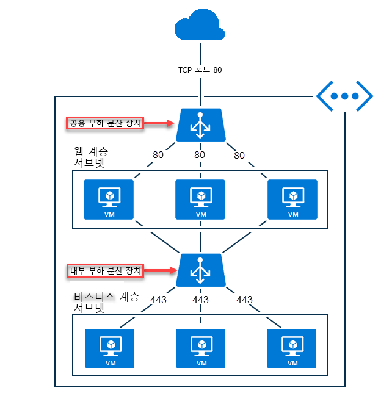

# Azure Load Balancer 개요

Azure Load Balancer를 사용하여 응용 프로그램 크기를 조정하고 서비스에 대한 고가용성을 구현할 수 있습니다. Load Balancer는 인바운드 및 아웃바운드 시나리오를 지원하며, 짧은 대기 시간과 높은 처리량을 제공하고, 모든 TCP 및 UDP 응용 프로그램에 대해 수백만 개의 흐름으로 확장됩니다.   

Load Balancer는 규칙 및 상태 프로브에 따라, Load Balancer의 프런트 엔드에 도착하는 새 인바운드 흐름을 백 엔드 풀 인스턴스에 분산합니다.  

또한 공용 Load Balancer는 개인 IP 주소를 공용 IP 주소로 변환하여 가상 네트워크 내에서 가상 머신에 대한 아웃바운드 연결을 제공할 수 있습니다.

Azure Load Balancer는 기본 및 표준이라는 두 가지 다른 SKU에서 사용할 수 있습니다.  크기 조정, 기능 및 가격 측면에서 차이가 있습니다.  접근 방식은 약간 다를 수 있지만 기본 Load Balancer로 가능한 모든 시나리오를 표준 Load Balancer로도 만들 수 있습니다.  Load Balancer에 대해 배울 때는 기본 사항 및 SKU 관련 차이점을 이해하는 것이 중요합니다.

## Load Balancer를 사용하는 이유 

Azure Load Balancer는 다음 작업에 사용할 수 있습니다.

* 들어오는 인터넷 트래픽을 가상 머신에 부하 분산합니다. 이 구성을 [공용 Load Balancer](#publicloadbalancer)라고 합니다.
* 가상 네트워크 내의 가상 머신 간에 트래픽 부하를 분산합니다. 하이브리드 시나리오의 온-프레미스 네트워크에서 Load Balancer 프런트 엔드에 연결할 수도 있습니다. 이러한 두 시나리오 모두 [내부 Load Balancer](#internalloadbalancer)라고 하는 구성을 사용합니다.
* 인바운드 NAT 규칙을 사용하여 특정 가상 머신의 특정 포트에 트래픽을 전달합니다.
* 공용 Load Balancer를 사용하여 가상 네트워크 내의 가상 머신에 대해 [아웃바운드 연결](load-balancer-outbound-connections.md)을 제공합니다.

>[!NOTE]
> Azure는 사용자 시나리오를 위한 완전히 관리되는 부하 분산 솔루션 모음을 제공합니다.  TLS 종료("SSL 오프로드") 또는 HTTP/HTTPS 요청별 응용 프로그램 계층 처리를 확인하려는 경우 [Application Gateway](../application-gateway/application-gateway-introduction.md)를 검토하세요.  전역 DNS 부하 분산을 확인하려는 경우 [Traffic Manager](../traffic-manager/traffic-manager-overview.md)를 검토하세요.  필요에 따라 종단 간 시나리오에서 이러한 솔루션을 조합하여 이점을 얻을 수 있습니다.

## 부하 분산 장치란?

Load Balancer 리소스는 공용 Load Balancer 또는 내부 Load Balancer로 존재할 수 있습니다. Load Balancer 리소스의 함수는 프런트 엔드, 규칙, 상태 프로브 및 백 엔드 풀 정의로 표현됩니다.  가상 머신에서 백 엔드 풀을 지정하여 가상 머신을 백 엔드 풀에 배치합니다.

Load Balancer 리소스는 만들려는 시나리오를 달성하기 위해 Azure에서 다중 테넌트 인프라를 프로그래밍해야 하는 방법을 표현할 수 있는 개체입니다.  Load Balancer 리소스와 실제 인프라 사이에는 직접적인 관계가 없습니다. 따라서 Load Balancer를 만들어도 인스턴스가 만들어지지 않으며 용량은 항상 사용 가능합니다. 

## 기본적인 Load Balancer 기능

Load Balancer는 TCP 및 UDP 응용 프로그램에 대해 다음과 같은 기본적인 기능을 제공합니다.

* **부하 분산**.

    Azure Load Balancer를 사용하여 프런트 엔드에 도착하는 트래픽을 백 엔드 풀 인스턴스로 분산하는 부하 분산 규칙을 만들 수 있습니다.  이 기능은 인바운드 흐름 배포에 대해 해시 기반 알고리즘을 사용하고, 그에 따라 흐름의 헤더를 백 엔드 풀 인스턴스에 다시 씁니다. 상태 프로브가 정상 백 엔드 끝점을 나타내면 서버에서 새 흐름을 받을 수 있습니다.
    
    기본적으로 원본 IP, 원본 포트, 대상 IP 주소, 대상 포트 및 IP 프로토콜 번호로 구성되는 5개 튜플 해시를 사용하여 흐름을 사용 가능한 서버에 매핑합니다.  제공된 규칙에 대해 2 또는 3튜플 해시를 옵트인(opt in)하여 특정 원본 IP 주소에 대한 선호도를 만들도록 선택할 수 있습니다.  같은 패킷 흐름의 모든 패킷이 부하 분산된 프런트 엔드 뒤에 있는 동일한 인스턴스에 도착합니다.  클라이언트가 동일한 원본 IP에서 새 흐름을 시작하면 원본 포트가 변경됩니다. 결과 5튜플은 결과적으로 트래픽이 다른 백 엔드 끝점으로 이동되도록 할 수 있습니다.

    자세한 내용은 [Load Balancer 배포 모드](load-balancer-distribution-mode.md)를 참조하세요. 다음 그림은 해시 기반 배포를 보여 줍니다.

    

    *그림 - 해시 기반 배포*

* **포트 전달**

    Azure Load Balancer를 사용하여 특정 프런트 엔드 IP 주소의 특정 포트에서 가상 네트워크 내에 있는 특정 백 엔드 인스턴스의 특정 포트로 트래픽을 전달하기 위한 인바운드 NAT 규칙을 만들 수 있습니다. 또한 이러한 작업은 부하 분산과 동일한 해시 기반 배포에 의해서도 수행됩니다.  이 기능에 대한 일반적인 시나리오는 가상 네트워크 내의 개별 가상 머신 인스턴스에 대한 RDP(원격 데스크톱 프로토콜) 또는 SSH(보안 셸) 세션입니다.  여러 개의 내부 끝점을 동일한 프런트 엔드 IP 주소의 서로 다른 포트에 매핑할 수 있습니다. 이러한 기능을 사용하여 추가 프로그램 없이도 인터넷을 통해 가상 머신을 원격으로 관리를 사용할 수 있습니다.

* **응용 프로그램 모호성 및 투명성**

    Load Balancer는 TCP/UDP 또는 응용 프로그램 계층과 직접 상호 작용하지 않으며, 모든 TCP 또는 UDP 기반 응용 프로그램이 지원될 수 있습니다.  예를 들어, Load Balancer는 자체적으로 TLS를 종료하지 않지만, Load Balancer를 사용하여 TLS 응용 프로그램을 빌드 및 스케일 아웃하고, 가상 머신 자체에서 TLS 연결을 종료할 수 있습니다. Load Balancer는 흐름을 종료하지 않으며, 항상 클라이언트와 해시 선택 백 엔드 풀 인스턴스 사이에 직접적으로 프로토콜 핸드셰이크가 존재합니다. 예를 들어, TCP 핸드셰이크는 항상 클라이언트와 선택한 백 엔드 가상 머신 사이에 있습니다.  또한 프렌트 엔드 요청에 대한 응답은 백 엔드 가상 머신에서 생성된 응답입니다.  Load Balancer의 아웃바운드 네트워크 성능은 선택한 가상 머신 SKU에 의해서만 제한되고, 유휴 시간 제한에 도달하지 않으면 오랫 동안 흐름이 활성 상태를 유지합니다.

* **자동 재구성**

    Azure Load Balancer는 인스턴스를 확장 또는 축소하는 경우 즉시 재구성됩니다. 백 엔드 풀에서 가상 머신을 추가 또는 제거하면 Load Balancer 리소스에 대한 추가 작업 없이도 Load Balancer가 다시 구성됩니다.

* **상태 프로브**

    Azure Load Balancer는 사용자가 정의한 상태 프로브를 사용해서 백 엔드 풀에 있는 인스턴스의 상태를 확인합니다. 프로브가 응답하지 않으면 부하 분산 장치는 비정상 인스턴스에 새 연결의 전송을 중지합니다. 기존 연결은 영향을 받지 않으며, 응용 프로그램이 흐름을 종료하거나, 유휴 시간 제한이 발생하거나, 가상 머신이 종료될 때까지 계속됩니다.

    지원되는 세 가지 형식의 프로브는 다음과 같습니다.

    - **HTTP 사용자 지정 프로브:** 이 프로브를 사용하여 백 엔드 풀 인스턴스의 상태를 확인하는 자체 사용자 지정 논리를 만들 수 있습니다. 부하 분산 장치는 정기적으로 끝점을 검색합니다(기본적으로 15초 마다). 시간 제한 기간(기본값 31초) 내에 HTTP 200으로 응답하는 인스턴스는 정상 상태로 간주됩니다. HTTP 200 이외의 모든 상태에서 이 프로브는 실패합니다.  이 기능은 부하 분산 장치의 순환에서 인스턴스를 제거하는 자체 논리를 구현하려는 경우에 유용합니다. 예를 들어, 인스턴스가 90% CPU를 초과하는 경우 200 이외의 상태를 반환하도록 인스턴스를 구성할 수 있습니다.   이 프로브는 기본 게스트 에이전트 프로브를 재정의합니다.

    - **TCP 사용자 지정 프로브:** 이 프로브는 정의된 프로브 포트에 대한 성공적인 TCP 세션 설정에 따라 달라집니다.  가상 머신에 지정된 수신기가 있기만 하면 이 프로브는 성공합니다. 연결이 거부되면 프로브는 실패합니다. 이 프로브는 기본 게스트 에이전트 프로브를 재정의합니다.

    - **게스트 에이전트 프로브(PaaS(Platform as a Service) Virtual Machines에서만)**: 부하 분산 장치는 가상 머신 내에서 게스트 에이전트를 사용할 수도 있습니다. 게스트 에이전트는 수신 대기하고 인스턴스가 준비 상태인 경우에만 HTTP 200 정상으로 응답합니다. 에이전트가 HTTP 200 OK로 응답하지 않으면, 부하 분산 장치에서 인스턴스를 응답하지 않는 것으로 표시하고 해당 인스턴스로의 트래픽 전송을 중지합니다. 이때 부하 분산 장치는 계속해서 인스턴스에 연결하려고 시도합니다. 게스트 에이전트가 HTTP 200 응답을 반환하면, 부하 분산 장치는 해당 인스턴스로 트래픽 전송을 다시 시작합니다.  게스트 에이전트 프로브는 최후의 수단으로, HTTP 또는 TCP 사용자 지정 프로브 구성이 가능한 경우에는 사용하지 않아야 합니다. 
    
* **아웃바운드 연결(원본 NAT)**

    Virtual Network 내의 개인 IP 주소에서 인터넷의 공용 IP 주소로 전달되는 모든 아웃바운드 흐름은 Load Balancer의 프런트 엔드 IP 주소로 변환될 수 있습니다. 공용 프런트 엔드가 부하 분산 규칙을 통해 백 엔드 가상 컴퓨터에 연결되면 Azure는 공용 프런트 엔드 IP 주소로 자동으로 변환되도록 아웃바운드 연결을 프로그래밍합니다. 이것을 SNAT(원본 NAT)라고도 합니다. SNAT에는 다음과 같은 중요한 이점이 있습니다.

    + 프런트 엔드를 서비스의 다른 인스턴스에 동적으로 매핑할 수 있으므로 서비스의 업그레이드 및 재해 복구가 용이합니다.
    + ACL(액세스 제어 목록)을 보다 쉽게 관리할 수 있습니다. 프런트 엔드 IP로 표현되는 ACL은 서비스를 확장, 축소하거나 다시 배포해도 변경되지 않습니다.

    이 기능을 자세히 알아보려면 [아웃바운드 연결](load-balancer-outbound-connections.md) 문서를 참조하세요.

표준 Load Balancer에는 이러한 기본 기능 외에 추가적인 SKU 관련 기능이 있습니다.  자세한 내용은 이 문서의 나머지 부분을 검토합니다.

##  Load Balancer SKU 비교

Azure Load Balancer는 기본 및 표준이라는 두 가지 다른 SKU를 지원합니다.  시나리오 규모, 기능 및 가격 측면에서 차이가 있습니다.  또한 기본 Load Balancer로 가능한 시나리오를 표준 Load Balancer로 만들 수 있습니다.  사실 두 SKU에 대한 API는 유사하고 SKU를 지정해서 호출됩니다.  Load Balancer 및 공용 IP에 대한 지원 SKU의 API는 2017-08-01 API부터 사용할 수 있습니다.  두 SKU는 동일한 일반 API 및 구조를 갖습니다.

그러나 선택한 SKU에 따라, 전체 시나리오 구성 세부 정보는 약간 다를 수 있습니다. Load Balancer 설명서는 특정 SKU에만 적용되는 문서가 있을 때 제공됩니다. 아래 표를 검토하고 차이점을 비교 및 이해하세요.  자세한 내용은 [표준 Load Balancer 개요](load-balancer-standard-overview.md)를 검토하세요.

>[!NOTE]
> 새 디자인에서는 표준 Load Balancer 사용을 고려해야 합니다. 

독립 실행형 가상 머신, 가용성 집합 및 가상 머신 확장 집합은 하나의 SKU에만 연결될 수 있습니다. 공용 IP 주소를 사용할 때는 Load Balancer 및 공용 IP 주소 SKU가 모두 일치해야 합니다. Load Balancer 및 공용 IP SKU는 변경할 수 없습니다.

_아직 필수적인 것은 아니지만 SKU를 명시적으로 지정하는 것이 가장 좋습니다._  이때 필요한 변경은 최소로만 유지됩니다. SKU를 지정하지 않으면 2017-08-01 API 버전의 기본 SKU를 사용하려는 의도로 해석됩니다.

>[!IMPORTANT]
>표준 Load Balancer는 새로운 Load Balancer 제품으로, 기본 Load Balancer의 상위 기능입니다.  두 제품 간에는 중요하고 의도적인 차이가 있습니다.  또한 기본 Load Balancer로 가능한 종단 간 시나리오를 표준 Load Balancer로도 만들 수 있습니다.  기본 Load Balancer를 이미 사용하고 있는 경우, 표준 Load Balancer를 숙지하여 표준 및 기본 간의 동작 차이와 미치는 영향을 이해하는 것이 중요합니다. 이 섹션을 주의 깊게 검토하세요.

| | [표준 SKU](load-balancer-standard-overview.md) | 기본 SKU |
| --- | --- | --- |
| 백 엔드 풀 크기 | 최대 1,000개 인스턴스 | 최대 100개 인스턴스 |
| 백 엔드 풀 끝점 | 단일 가상 네트워크의 가상 머신(가상 머신, 가용성 집합, 가상 머신 확장 집합 혼합 포함) | 단일 가용성 집합 또는 가상 머신 확장 집합의 가상 머신 |
| 가용성 영역 | 인바운드 및 아웃바운드, 아웃바운드 흐름 매핑 생존 영역 장애, 영역 간 부하 분산을 위한 영역 중복 및 영역 프런트 엔드 | / |
| 진단 | Azure Monitor, 바이트 및 패킷 카운터, 상태 프로브 상태, 연결 시도(TCP SYN), 아웃바운드 연결 상태(SNAT 성공 및 실패 흐름), 활성 데이터 평면 측정을 포함하는 다차원 메트릭 | 공용 Load Balancer 전용, SNAT 소모 경고, 백 엔드 풀 상태 수에 대한 Azure Log Analytics |
| HA 포트 | 내부 Load Balancer | / |
| 기본적으로 보안 적용 | 공용 IP 및 Load Balancer 끝점에 대해 기본적으로 닫혀 있으며, 네트워크 보안 그룹을 사용하여 트래픽이 흐르도록 명시적으로 허용해야 합니다. | 기본적으로 열려 있는 선택적 네트워크 보안 그룹 |
| 아웃바운드 연결 | 규칙별 옵트아웃이 적용되는 여러 프런트 엔드. 가상 머신이 아웃바운드 연결을 사용할 수 있도록 하려면 _반드시_ 아웃바운드 시나리오를 만들어야 합니다.  [VNet 서비스 끝점](../virtual-network/virtual-network-service-endpoints-overview.md)에 아웃바운드 연결 없이 연결할 수 있으며,처리된 데이터 수는 고려되지 않습니다.  VNet 서비스 끝점으로 사용할 수 없는 Azure PaaS 서비스를 포함하는 모든 공용 IP 주소는 아웃바운드 연결을 통해 연결해야 하며, 처리된 데이터 수도 고려되어야 합니다. 내부 Load Balancer만 가상 머신에 작동할 경우 기본 SNAT를 통한 아웃바운드 연결은 사용할 수 없습니다. 아웃바운드 SNAT 프로그래밍은 인바운드 부하 분산 규칙의 프로토콜을 기준으로 하는 전송 프로토콜 기준 방식입니다. | 여러 프런트 엔드가 있을 때 임의로 선택되는 단일 프런트 엔드입니다.  내부 Load Balancer만 가상 머신에 작동할 경우 기본 SNAT가 사용됩니다. |
| 여러 프런트 엔드 | 인바운드 및 아웃바운드 | 인바운드 전용 |
| 관리 작업 | 대부분 작업을 30초 이내에 수행 | 일반적으로 60-90+초 |
| SLA | 2개의 정상 가상 머신이 있는 데이터 경로에 대해 99.99% | VM SLA에서 암시적 | 
| 가격 | 규칙의 수, 리소스와 연결해서 인바운드 또는 아웃바운드로 처리된 데이터에 따라 요금이 부과됩니다.  | 무료 |

[Load Balancer에 대한 서비스 제한](https://aka.ms/lblimits)을 검토하세요.  표준 Load Balancer의 경우 좀 더 자세한 [개요](load-balancer-standard-overview.md), [가격](https://aka.ms/lbpricing), 및 [SLA](https://aka.ms/lbsla)도 검토하세요.

## 개념

### 공용 Load Balancer

공용 Load Balancer는 들어오는 트래픽의 공용 IP 주소 및 포트 번호를 가상 머신의 개인 IP 주소 및 포트 번호로 매핑하고 가상 머신에서 오는 응답 트래픽의 경우 반대 방향으로 매핑합니다. 부하 분산 규칙을 사용하면 여러 가상 머신이나 서비스 간에 특정 유형의 트래픽을 분산시킬 수 있습니다. 예를 들어 웹 요청 트래픽의 부하를 여러 웹 서버에 분산할 수 있습니다.

다음 그림에서는 공용 및 개인 TCP 포트 80에 대해 3개의 가상 머신 간에 공유되는 웹 트래픽의 부하가 분산된 끝점을 보여줍니다. 이 세 대의 가상 머신은 부하 분산 집합에 속합니다.

**그림 1: 공용 Load Balancer를 사용하여 웹 트래픽 부하 분산**

인터넷 클라이언트가 TCP 포트 80에서 웹앱의 공용 IP 주소에 웹 페이지 요청을 보내면 Azure Load Balancer가 부하 분산 집합에 있는 3개의 가상 머신에 요청을 분산합니다. 부하 분산 알고리즘에 대한 자세한 내용은 [부하 분산 장치 개요 페이지](load-balancer-overview.md#load-balancer-features)를 참조하세요.

기본적으로 Azure Load Balancer는 네트워크 트래픽을 여러 가상 머신 인스턴스에 고르게 분산시킵니다. 세션 선호도를 구성할 수도 있습니다. 자세한 내용은 [Load Balancer 배포 모드](load-balancer-distribution-mode.md)를 참조하세요.

###  내부 Load Balancer

내부 Load Balancer는 가상 네트워크 내부에 있는 리소스 또는 VPN을 사용하여 Azure 인프라에 액세스하는 리소스로만 트래픽을 보냅니다. 이런 측면에서 내부 Load Balancer는 공용 Load Balancer와 다릅니다. Azure 인프라는 가상 네트워크의 부하가 분산된 프런트 엔드 IP 주소에 대한 액세스를 제한합니다. 프런트 엔드 IP 주소와 가상 네트워크는 인터넷 끝점에 직접 노출되지 않습니다. 내부 LOB(기간 업무) 응용 프로그램은 Azure에서 실행되며 Azure 내에서 또는 온-프레미스 리소스에서 액세스 할 수 있습니다.

내부 Load Balancer를 통해 다음과 같은 유형의 부하 분산을 사용할 수 있습니다.

* 가상 네트워크 내에서: 가상 네트워크의 VM에서 동일한 가상 네트워크 내에 있는 VM 집합으로 부하 분산.
* 크로스-프레미스 가상 네트워크의 경우: 온-프레미스 컴퓨터에서 동일한 가상 네트워크 내에 있는 VM 집합으로 부하 분산. 
* 다중 계층 응용 프로그램의 경우: 백 엔드 계층이 인터넷에 연결되어 있지 않은 인터넷 연결 다중 계층 응용 프로그램의 부하 분산. 백 엔드 계층에는 인터넷 연결 계층의 트래픽 부하 분산이 필요합니다(그림 2 참조).
* LOB(기간 업무) 응용 프로그램의 경우: 추가적인 부하 분산 장치 하드웨어 또는 소프트웨어 없이 Azure에서 호스트되는 LOB(기간 업무) 응용 프로그램의 부하 분산. 이 시나리오는 트래픽 부하가 분산되는 컴퓨터 집합에 있는 온-프레미스 서버를 포함합니다.

**그림 2 - 공용 및 내부 부하 분산 장치를 둘 다 사용하여 다중 계층 응용 프로그램 부하 분산**

## 가격
표준 Load Balancer는 구성된 부하 분산 규칙 수와 처리되는 모든 인바운드 및 아웃바운드 데이터를 기준으로 요금이 청구되는 제품입니다. 표준 Load Balancer 가격 정보에 대해서는 [Load Balancer 가격](https://azure.microsoft.com/pricing/details/load-balancer/) 페이지를 참조하세요.

기본 Load Balancer는 무료로 제공됩니다.

## SLA

표준 Load Balancer SLA에 대한 내용은 [Load Balancer SLA](https://aka.ms/lbsla) 페이지를 참조하세요. 

## 다음 단계

- [표준 Load Balancer를 좀 더 자세히](load-balancer-standard-overview.md) 검토하세요.
- [표준 Load Balancer 및 가용성 영역](load-balancer-standard-availability-zones.md) 사용에 대해 자세히 알아보세요.
- [아웃바운드 연결에 Load Balancer](load-balancer-outbound-connections.md) 사용에 대해 자세히 알아보세요.
- [Load Balancer HA 포트](load-balancer-ha-ports-overview.md)에 대해 자세히 알아보세요.
- [다중 프런트 엔드를 사용하는 Load Balancer](load-balancer-multivip-overview.md)에 대해 자세히 알아보세요.
- [VNet 서비스 끝점](../virtual-network/virtual-network-service-endpoints-overview.md)에 대해 자세히 알아보세요.
- [기본 공용 Load Balancer](load-balancer-get-started-internet-portal.md)를 만드는 방법을 알아보세요.

