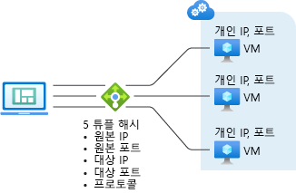

# Azure 부하 분산 장치 개요

Azure 부하 분산 장치는 응용 프로그램에 고가용성 및 네트워크 성능을 제공합니다. 이 장치는 부하 분산 장치 집합에 정의된 서비스의 정상 인스턴스 간에 들어오는 트래픽을 분산하는 계층 4(TCP, UDP) 부하 분산 장치입니다.

Azure Load Balancer를 다음과 같이 구성할 수 있습니다.

* 들어오는 인터넷 트래픽을 가상 컴퓨터에 부하 분산합니다. 이 구성을 [인터넷 연결 부하 분산](load-balancer-internet-overview.md)이라고 합니다.
* 가상 네트워크의 가상 컴퓨터 간, 클라우드 서비스의 가상 컴퓨터 간 또는 크로스-프레미스 가상 네트워크의 온-프레미스 컴퓨터와 가상 컴퓨터 간에 트래픽을 부하 분산합니다. 이 구성을 [내부 부하 분산](load-balancer-internal-overview.md)이라고 합.
* 외부 트래픽을 특정 가상 컴퓨터에 전달합니다.

클라우드의 모든 리소스에는 인터넷에서 연결할 수 있는 공용 IP 주소가 필요합니다. Azure의 클라우드 인프라는 리소스에 대해 라우팅할 수 없는 IP 주소를 사용합니다. 공용 IP 주소를 통한 NAT(Network Address Translation)를 사용하여 인터넷과 통신합니다.

## Azure 배포 모델

Azure 클래식 및 Resource Manager [배포 모델](../azure-resource-manager/resource-manager-deployment-model.md)간의 차이점을 이해해야 합니다. Azure Load Balancer는 각 모델에서 서로 다르게 구성됩니다.

### Azure 클래식 배포 모델

클라우드 서비스 경계 내에 배포된 가상 컴퓨터를 그룹화하여 부하 분산 장치를 사용할 수 있습니다. 이 모델에서 공용 IP 주소 및 FQDN(정규화된 도메인 이름)은 클라우드 서비스에 할당됩니다. 부하 분산 장치는 포트 변환을 수행하며 클라우드 서비스에 공용 IP 주소를 사용하여 네트워크 트래픽의 부하를 분산합니다.

부하 분산되는 트래픽은 끝점에 의해 정의됩니다. 포트 변환 끝점에서 특정 가상 컴퓨터의 서비스에 할당된 로컬 포트와 공용 IP 주소의 공용 할당 포트 간에는 일대일 관계가 설정됩니다. 그리고 부하 분산 끝점에서 클라우드 서비스의 가상 컴퓨터 서비스에 할당된 로컬 포트와 공용 IP 주소 간에는 일대다 관계가 설정됩니다.

그림 1 - 클래식 배포 모델의 Azure Load Balancer

부하 분산 장치가 이 배포 모델에 대해 사용하는 공용 IP 주소의 도메인 레이블은 \<클라우드 서비스 이름\>.cloudapp.net입니다. 아래 그림에는 이 모델의 Azure Load Balancer가 나와 있습니다.

### Azure Resource Manager 배포 모델

Resource Manager 배포 모델에서는 클라우드 서비스를 만들 필요가 없습니다. 여러 가상 컴퓨터 간에 트래픽을 명시적으로 라우팅하도록 부하 분산 장치가 만들어집니다.

공용 IP 주소는 도메인 레이블(DNS 이름)이 있는 개별 리소스입니다. 이 공용 IP 주소는 부하 분산 장치 리소스와 연결됩니다. 부하 분산 장치 규칙 및 인바운드 NAT 규칙은 부하 분산된 네트워크 트래픽을 수신하는 리소스의 인터넷 끝점으로 공용 IP 주소를 사용합니다.

개인 또는 공용 IP 주소는 가상 컴퓨터에 연결된 네트워크 인터페이스 리소스에 할당됩니다. 네트워크 인터페이스가 부하 분산 장치 백 엔드 IP 주소 풀에 추가되면 부하 분산 장치는 작성되는 부하 분산된 규칙에 따라 부하 분산된 네트워크 트래픽을 보낼 수 있습니다.

아래 그림에는 이 모델의 Azure Load Balancer가 나와 있습니다.

그림 2 - Resource Manager의 Azure Load Balancer

Resource Manager 기반 템플릿, API 및 도구를 통해 부하 분산 장치를 관리할 수 있습니다. Resource Manager에 대한 자세한 내용은 [Resource Manager 개요](../azure-resource-manager/resource-group-overview.md)를 참조하세요.

## 부하 분산 장치 기능

* 해시 기반 배포

    Azure 부하 분산 장치는 해시 기반 배포 알고리즘을 사용합니다. 기본적으로 5개 튜플 해시(원본 IP, 원본 포트, 대상 IP, 대상 포트 및 프로토콜 형식으로 구성됨)를 사용하여 트래픽을 사용 가능한 서버에 매핑합니다. 전송 세션 *내에서만* 연결이 유지됩니다. 동일한 TCP 또는 UDP 세션의 패킷은 부하 분산된 끝점을 통해 동일한 인스턴스로 전송됩니다. 클라이언트가 연결을 닫았다가 다시 열거나 동일한 원본 IP에서 새 세션을 시작하는 경우 원본 포트가 변경되어 트래픽이 다른 데이터 센터의 다른 끝점으로 전송될 수 있습니다.

    자세한 내용은 [부하 분산 장치 배포 모드](load-balancer-distribution-mode.md)를 참조하세요. 다음 그림에는 해시 기반 배포가 나와 있습니다.

    

    그림 3 - 해시 기반 배포

* 포트 전달

    Azure 부하 분산 장치는 어떻게 인바운드 통신이 관리되는 방법을 제어할 수 있습니다. 이 통신은 인터넷 호스트, 다른 클라우드 서비스의 가상 컴퓨터 또는 가상 네트워크에서 시작된 트래픽을 포함합니다. 이 제어는 끝점(입력 끝점이라고도 함)으로 표시됩니다.

    입력 끝점은 공용 포트를 수신 대기하고 트래픽을 내부 포트로 전달합니다. 내부 또는 외부 끝점에 대해 동일한 포트를 매핑하거나 다른 포트를 사용할 수 있습니다. 예를 들어 공용 끝점 매핑은 포트 80이지만 포트 81에서 수신 대기하도록 웹 서버를 구성할 수 있습니다. 공용 끝점을 만들면 부하 분산 장치 인스턴스를 만들도록 트리거합니다.

    Azure 포털을 사용하여 인스턴스를 만들 때는 포털이 RDP(원격 데스크톱 프로토콜) 및 원격 Windows PowerShell 세션 트래픽용으로 가상 컴퓨터에 대한 끝점을 자동으로 만듭니다. 이 끝점을 사용하여 가상 컴퓨터를 인터넷으로 원격 관리할 수 있습니다.

* 자동 재구성

    Azure 부하 분산 장치는 인스턴스를 확장 또는 축소하는 경우 즉시 재구성됩니다. 예를 들어 클라우드 서비스에서 웹/작업자 역할에 대한 인스턴스 수를 늘리거나 동일한 부하 분산된 집합에 가상 컴퓨터를 더 추가하면 이러한 재구성이 수행됩니다.

* 서비스 모니터링

    Azure Load Balancer는 다양한 서버 인스턴스의 상태를 프로브할 수 있습니다. 프로브가 응답하지 않으면 부하 분산 장치에서 비정상 인스턴스에 대한 새 연결 전송을 중지합니다. 기존 연결은 영향을 받지 않습니다.

    지원되는 세 가지 형식의 프로브가 있습니다.

    + **게스트 에이전트 프로브(PaaS(Platform as a Service) 가상 컴퓨터에서만)**: 부하 분산 장치는 가상 컴퓨터 내의 게스트 에이전트를 사용합니다. 게스트 에이전트는 인스턴스가 준비 상태에 있는 경우, 즉 인스턴스가 사용 중, 재순환 중, 중지 중 등의 상태가 아닌 경우에만 수신 대기하며 HTTP 200 OK로 응답합니다. 에이전트가 HTTP 200 OK로 응답하지 않으면 부하 분산 장치에서 인스턴스를 응답하지 않는 것으로 표시하고 해당 인스턴스로의 트래픽 전송을 중지합니다. 이때 해당 인스턴스에 대한 ping은 계속 수행합니다. 게스트 에이전트가 HTTP 200으로 응답하면 부하 분산 장치는 다시 트래픽을 해당 인스턴스에 전송합니다. 웹 역할을 사용하는 경우 웹 사이트 코드는 일반적으로 w3wp.exe에서 실행되며 이는 Azure 패브릭 또는 게스트 에이전트에서 모니터링하지 않습니다. 즉, w3wp.exe에서 오류(예: HTTP 500 응답)가 게스트 에이전트에 보고되지 않고 부하 분산 장치가 해당 인스턴스를 순환에서 제거하는 방법을 알지 못합니다.
    + **HTTP 사용자 지정 프로브:** 이 프로브는 기본(게스트 에이전트) 프로브를 재정의합니다. 역할 인스턴스의 상태를 확인하는 사용자 지정 논리를 만드는 데 사용할 수 있습니다. 부하 분산 장치는 정기적으로 끝점을 검색합니다(기본적으로 15초 마다). 시간 제한 기간(기본값 31초) 내에 TCP ACK 또는 HTTP 200으로 응답하는 인스턴스는 순환 중인 것으로 간주됩니다. 부하 분산 장치 순환에서 인스턴스를 제거하는 자체 논리를 구현하려는 경우 이 정보가 유용합니다. 예를 들어 인스턴스가 90 % CPU 이상인 경우 200이 아닌 상태를 반환하는 인스턴스를 구성할 수 있습니다. w3wp.exe를 사용하는 웹 역할의 경우 웹 사이트 코드에 오류가 있으면 프로브에 200이 아닌 상태가 반환되므로 웹 사이트 자동 모니터링도 동시에 수행할 수 있습니다.
    + **TCP 사용자 지정 프로브:** 이 프로브는 정의된 프로브 포트에 대한 성공적인 TCP 세션 설정에 의존합니다.

    자세한 내용은 [LoadBalancerProbe 스키마](https://msdn.microsoft.com/library/azure/jj151530.aspx)를 참조하세요.

* 원본 NAT

    서비스에서 생성되어 인터넷으로 전송되는 모든 아웃바운드 트래픽은 들어오는 트래픽과 동일한 VIP 주소를 사용하여 SNAT(원본 NAT)를 통과합니다. SNAT에는 다음과 같은 중요한 이점이 있습니다.

    + VIP를 서비스의 다른 인스턴스에 동적으로 매핑할 수 있으므로 서비스의 업그레이드 및 재해 복구가 용이합니다.
    + ACL(액세스 제어 목록)을 보다 쉽게 관리할 수 있습니다. VIP로 표현되는 ACL은 서비스를 강화하거나 규모를 축소하거나 다시 배포해도 변경되지 않습니다.

    부하 분산 장치 구성은 UDP에 대해 완전한 원뿔형 NAT를 지원합니다. 전체 원뿔형 NAT는 포트에서 아웃바운드 요청에 대한 응답으로 외부 호스트에서 수행된 인바운드 연결을 허용하는 NAT의 한 유형입니다.

    부하 분산 장치는 가상 컴퓨터가 시작되는 새로운 아웃바운드 연결마다 아웃바운드 포트도 할당합니다. 외부 호스트는 VIP(가상 IP)가 할당된 포트를 통해 트래픽을 확인합니다. 아웃바운드 연결이 많이 필요한 시나리오에서는 VM이 SNAT 전용 아웃바운드 IP 주소를 사용할 수 있도록 [인스턴스 수준 공용 IP](../virtual-network/virtual-networks-instance-level-public-ip.md) 주소를 사용하는 것이 좋습니다. 이렇게 하면 포트 소모 위험이 줄어듭니다.

    이 항목에 대한 자세한 내용은 [아웃바운드 연결](load-balancer-outbound-connections.md) 문서를 참조하세요.

### 가상 컴퓨터에 대해 여러 개의 부하 분산 IP 주소 지원
가상 컴퓨터 집합에 두 개 이상의 부하 분산된 공용 IP 주소를 할당할 수 있습니다. 이 기능을 사용하면 동일한 가상 컴퓨터 집합에서 여러 개의 SSL 웹 사이트 및/또는 여러 개의 SQL Server AlwaysOn 가용성 그룹 수신기를 호스트할 수 있습니다. 자세한 내용은 [클라우드 서비스당 여러 VIP](load-balancer-multivip.md)를 참조하세요.

[!INCLUDE [load-balancer-compare-tm-ag-lb-include.md](../../includes/load-balancer-compare-tm-ag-lb-include.md)]

## 다음 단계

[인터넷 연결 부하 분산 장치 개요](load-balancer-internet-overview.md)

[내부 부하 분산 장치 개요](load-balancer-internal-overview.md)

[인터넷 연결 부하 분산 장치 만들기 시작](load-balancer-get-started-internet-arm-ps.md)

