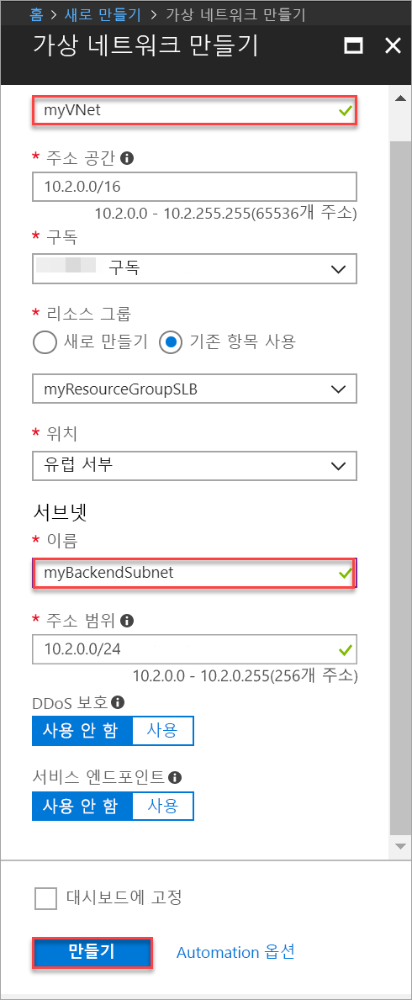
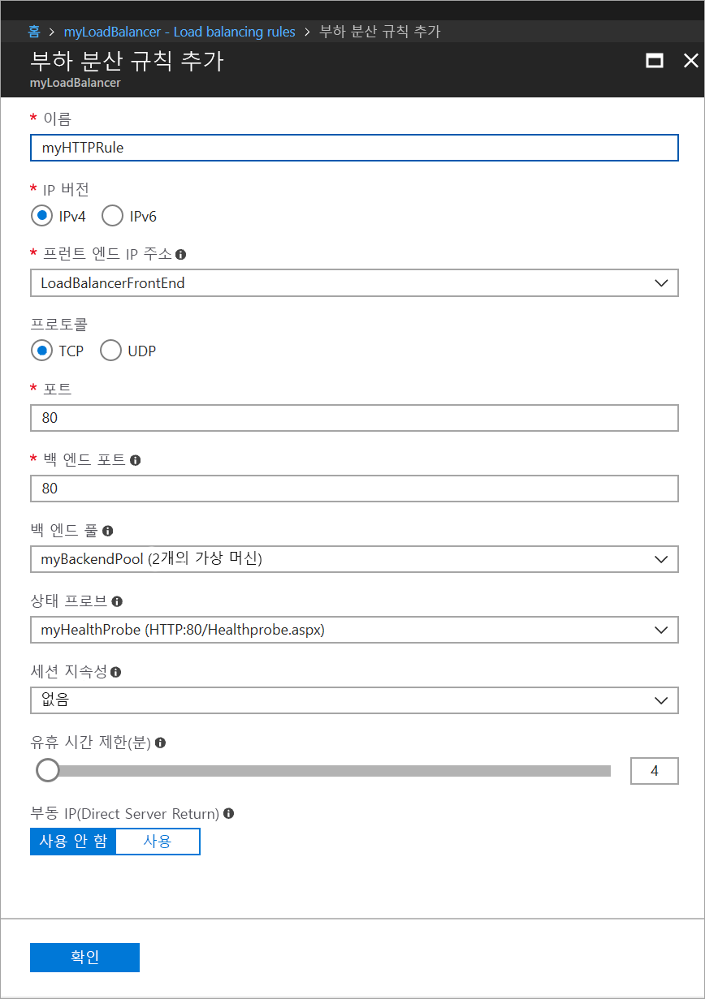
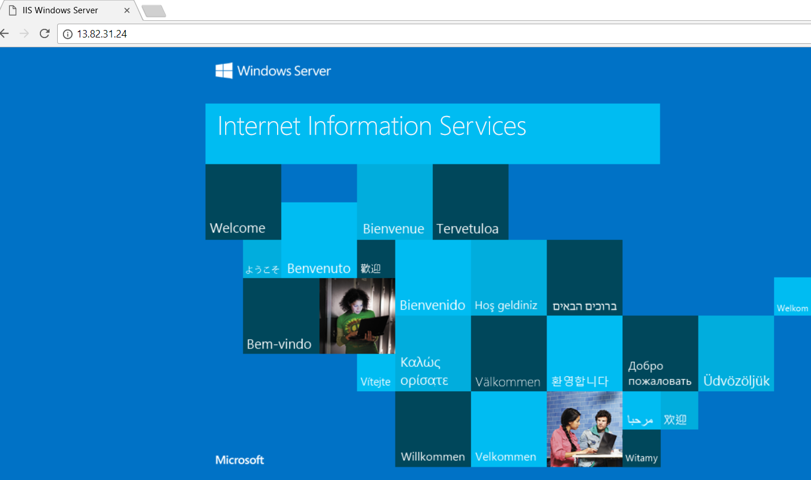

# 빠른 시작: Azure Portal을 사용하여 VM 부하를 분산하는 표준 부하 분산 장치 만들기

부하를 분산하면 들어오는 요청이 여러 가상 머신에 분산되어 가용성 및 확장성이 향상됩니다. Azure Portal을 사용하여 VM(가상 머신)의 부하를 분산하는 부하 분산 장치를 만들 수 있습니다. 이 빠른 시작에서는 표준 부하 분산 장치를 사용하여 VM의 부하를 분산하는 방법을 보여줍니다.

Azure 구독이 아직 없는 경우 시작하기 전에 [체험 계정](https://azure.microsoft.com/free/?WT.mc_id=A261C142F)을 만듭니다. 

## Azure에 로그인

[http://portal.azure.com](http://portal.azure.com)에서 Azure Portal에 로그인합니다.

## 공용 부하 분산 장치 만들기

이 섹션에서는 가상 머신의 부하를 분산하는 데 도움이 되는 공용 부하 분산 장치를 만듭니다. 표준 부하 분산 장치는 표준 공용 IP 주소만 지원합니다. 표준 부하 분산 장치를 만들 때 표준 부하 분산 장치의 프런트 엔드(기본 이름은 *LoadBalancerFrontend*)로 구성된 새 표준 공용 IP 주소도 만들어야 합니다. 

1. 화면의 왼쪽 상단에서 **리소스 만들기** > **네트워킹** > **부하 분산 장치**를 클릭합니다.
2. **부하 분산 장치 만들기**에서 다음 정보를 입력하거나 선택하고, 나머지 설정은 기본값을 그대로 적용한 다음, **만들기**를 선택합니다.

    | 설정                 | 값                                              |
    | ---                     | ---                                                |
    | Name                   | *myLoadBalancer*                                   |
    | type          | 공용                                        |
    | SKU           | Standard                          |
    | 공용 IP 주소 | **새로 만들기**를 선택하고, 텍스트 상자에 *myPublicIP*를 입력합니다. 공용 IP 주소에 대한 표준 SKU는 기본적으로 선택됩니다. **가용성 영역**에 **Zone-redundant**를 선택합니다. |
    | 구독               | 구독을 선택합니다.    |
    |리소스 그룹 | **새로 만들기**를 선택한 다음, *myResourceGroupSLB*를 입력합니다.    |
    | 위치           | **유럽 서부**를 선택합니다.                          |
    

## 백 엔드 서버 만들기

이 섹션에서는 가상 네트워크를 만들고, 부하 분산 장치의 백 엔드 풀에 사용되는 가상 머신 2개를 만든 다음, 부하 분산 장치를 테스트하기 위한 IIS를 가상 머신에 설치합니다.

### 가상 네트워크 만들기
1. 화면의 왼쪽 상단에서 **새로 만들기** > **네트워킹** > **가상 네트워크**를 클릭하고 가상 네트워크에 대한 다음 값을 입력합니다.
    - *myVNet* - 가상 네트워크의 이름입니다.
    - *myResourceGroupSLB* - 기존 리소스 그룹의 이름입니다.
    - *myBackendSubnet* - 서브넷 이름입니다.
2. **만들기**를 클릭하여 가상 네트워크를 만듭니다.

    

### 가상 머신 만들기

1. 화면의 왼쪽 상단에서 **새로 만들기** > **계산** > **Windows Server 2016 데이터 센터**를 클릭하고 가상 머신에 대한 다음 값을 입력합니다.
    - *myVM1* - 가상 머신의 이름        
    - *myResourceGroupSLB* - **리소스 그룹**에서 **기존 항목 사용**을 선택한 다음, *myResourceGroupSLB*를 선택합니다.
2. **확인**을 클릭합니다.
3. 가상 머신의 크기에 대해 **DS1_V2**를 선택하고 **선택**을 클릭합니다.
4. VM 설정에 다음 값을 입력합니다.
    1. 가상 네트워크로 *myVNet*이 선택되어 있고, 서브넷으로 *myBackendSubnet*이 선택되었는지 확인합니다.
    2. **공용 IP 주소**의 경우 **공용 IP 주소 만들기** 창에서 **표준**를 선택한 다음, **확인**을 선택합니다.
    3. **네트워크 보안 그룹**의 경우 **고급**을 선택한 다음, 다음을 수행합니다.
        1. *네트워크 보안 그룹(방화벽)을 선택하고, **네트워크 보안 그룹 선택** 페이지에서 **새로 만들기**를 선택합니다. 
        2. **네트워크 보안 그룹 만들기** 페이지에서 **이름**으로 *myNetworkSecurityGroup*을 입력한 다음, **확인**을 선택합니다.
5. **사용 안 함**을 클릭하여 부팅 진단을 사용하지 않도록 설정합니다.
6. **확인**을 클릭하고 요약 페이지에서 설정을 검토한 다음, **만들기**를 클릭합니다.
7. 1-6단계를 사용하여 가용성 집합은 *myAvailibilityset*이고, 가상 네트워크는 *myVnet*이고, 서브넷은 *myBackendSubnet*이고, 네트워크 보안 그룹은 *myNetworkSecurityGroup*인 *VM2*라고 하는 두 번째 VM을 만듭니다. 

### NSG 규칙 만들기

이 섹션에서는 HTTP를 사용하는 인바운드 연결을 허용하는 NSG 규칙을 만듭니다.

1. 왼쪽 메뉴에서 **모든 리소스**를 클릭한 다음, 리소스 목록에서 **myResourceGroupSLB** 리소스 그룹에 있는 **myNetworkSecurityGroup**을 클릭합니다.
2. **설정**에서 **인바운드 보안 규칙**을 클릭한 다음, **추가**를 클릭합니다.
3. 포트 80을 사용하는 인바운드 HTTP 연결을 허용하도록 *myHTTPRule*이라고 하는 인바운드 보안 규칙에 다음 값을 입력합니다.
    - *서비스 태그* - **소스**로 입력합니다.
    - *인터넷* - **원본 서비스 태그**로 입력합니다.
    - *80* - **대상 포트 범위**로 입력합니다.
    - *TCP* - **프로토콜**로 입력합니다.
    - *허용* - **작업**에 대해 선택합니다.
    - *100* - **우선 순위**로 입력합니다.
    - *myHTTPRule* - 이름으로 입력합니다.
    - *HTTP 허용* - 설명으로 입력합니다.
4. **확인**을 클릭합니다.
 
### IIS 설치

1. 왼쪽 메뉴에서 **모든 리소스**를 클릭한 다음, 리소스 목록에서 *myResourceGroupLB* 리소스 그룹에 있는 **myVM1**을 클릭합니다.
2. **개요** 페이지에서 **연결**을 클릭하여 VM에 RDP로 연결합니다.
3. 사용자 이름으로 *azureuser*를 사용하여 VM에 로그인합니다.
4. 서버 바탕 화면에서 **Windows 관리 도구**>**서버 관리자**로 이동합니다.
5. 서버 관리자에서 **역할 및 기능 추가**를 클릭합니다.
6. **역할 및 기능 추가** 마법사에서 다음 값을 사용합니다.
    - **설치 유형 선택** 섹션에서 **역할 기반 또는 기능 기반 설치**를 클릭합니다.
    - **대상 서버 선택** 페이지에서 **myVM1**을 클릭합니다.
    - **서버 역할 선택** 페이지 **웹 서버(IIS)** 를 클릭합니다.
    - 지침에 따라 마법사의 나머지 과정을 완료합니다. 
7. 가상 머신 *myVM2*에 대해 1-6 단계를 반복합니다.

## 부하 분산 장치 리소스 만들기

이 섹션에서는 백 엔드 주소 풀 및 상태 프로브에 대한 부하 분산 장치 설정을 구성하고, 부하 분산 장치 규칙을 지정합니다.

### 백 엔드 주소 풀 만들기

VM으로 트래픽을 분산하기 위해 백 엔드 주소 풀에 부하 분산 장치에 연결된 가상(NIC)의 IP 주소가 포함됩니다. *VM1* 및 *VM2*를 포함하도록 백 엔드 주소 풀 *myBackendPool*을 만듭니다.

1. 왼쪽 메뉴에서 **모든 리소스**를 클릭한 다음, 리소스 목록에서 **myLoadBalancer**를 클릭합니다.
2. **설정**에서 **백 엔드 풀**을 클릭한 다음, **추가**를 클릭합니다.
3. **백 엔드 풀 추가** 페이지에서 다음을 수행합니다.
   - 이름에서 백 엔드 풀의 이름으로 *myBackendPool*을 입력합니다.
   - **가상 네트워크**에서 *myVNet*을 선택합니다.
   - 해당 IP 주소와 함께 **가상 머신** 아래에서 *myVM1* 및 *my VM2*를 추가한 다음, **추가**를 선택합니다.
    - **확인**을 클릭합니다.

3. 부하 분산 장치 백 엔드 풀 설정에 **VM1** 및 **VM2**가 모두 표시되는지 확인합니다.

### 상태 프로브 만들기

부하 분산 장치가 앱의 상태를 모니터링하도록 하려면 상태 프로브를 사용합니다. 상태 프로브는 상태 검사에 따라 부하 분산 장치 순환에서 VM을 동적으로 추가하거나 제거합니다. VM 상태를 모니터링할 상태 프로브 *myHealthProbe*를 만듭니다.

1. 왼쪽 메뉴에서 **모든 리소스**를 클릭한 다음, 리소스 목록에서 **myLoadBalancer**를 클릭합니다.
2. **설정**에서 **상태 프로브**를 클릭한 다음, **추가**를 클릭합니다.
3. 다음 값을 사용하여 상태 프로브를 만듭니다.
    - *myHealthProbe* - 상태 프로브의 이름으로 입력합니다.
    - **HTTP** - 프로토콜 유형으로 입력합니다.
    - *80* - 포트 번호로 입력합니다.
    - *15* - 프로브 시도 **간격**(초)으로 입력합니다.
    - *2* - **비정상 임계값** 또는 연속 프로브 오류 횟수가 이 숫자에 도달하면 VM을 비정상 상태로 간주합니다.
4. **확인**을 클릭합니다.

   

### 부하 분산 장치 규칙 만들기

부하 분산 장치 규칙은 VM으로 트래픽이 분산되는 방법을 정의하는 데 사용됩니다. 들어오는 트래픽에 대한 프런트 엔드 IP 구성 및 트래픽을 수신할 백 엔드 IP 풀과 필요한 원본 및 대상 포트를 함께 정의합니다. 프런트 엔드 *FrontendLoadBalancer*의 포트 80에서 수신 대기하고 역시 포트 80을 사용하여 백 엔드 주소 풀 *myBackEndPool*에 부하 분산된 네트워크 트래픽을 보내는 *myLoadBalancerRuleWeb*이라는 부하 분산 장치 규칙을 만듭니다. 

1. 왼쪽 메뉴에서 **모든 리소스**를 클릭한 다음, 리소스 목록에서 **myLoadBalancer**를 클릭합니다.
2. **설정**에서 **부하 분산 규칙**을 클릭한 다음, **추가**를 클릭합니다.
3. 다음 값을 사용하여 부하 분산 규칙을 구성합니다.
    - *myHTTPRule* - 부하 분산 규칙의 이름으로 입력합니다.
    - **TCP** - 프로토콜 유형으로 입력합니다.
    - *80* - 포트 번호로 입력합니다.
    - *80* - 백 엔드 포트로 입력합니다.
    - *myBackendPool* - 백 엔드 풀의 이름으로 입력합니다.
    - *myHealthProbe* - 상태 프로브의 이름으로 입력합니다.
4. **확인**을 클릭합니다.
    
    

## 부하 분산 장치 테스트
1. **개요** 화면에서 부하 분산 장치의 공용 IP 주소를 찾습니다. **모든 리소스**를 클릭한 다음, **myPublicIP**를 클릭합니다.

2. 공용 IP 주소를 복사하여 브라우저의 주소 표시줄에 붙여넣습니다. IIS 웹 서버의 기본 페이지가 브라우저에 표시됩니다.

      

## 리소스 정리

더 이상 필요하지 않으면 리소스 그룹, 부하 분산 장치 및 모든 관련 리소스를 삭제합니다. 이렇게 하려면 부하 분산 장치가 포함된 리소스 그룹을 선택하고 **삭제**를 클릭합니다.

## 다음 단계

이 빠른 시작에서는 표준 부하 분산 장치를 만들고, 거기에 VM을 연결하고, 부하 분산 장치 트래픽 규칙 및 상태 프로브를 구성한 다음, 부하 분산 장치를 테스트합니다. Azure Load Balancer에 대해 자세히 알아보려면 Azure Load Balancer에 대한 자습서를 계속 진행합니다.

> [!div class="nextstepaction"]
> [Azure Load Balancer 자습서](tutorial-load-balancer-standard-public-zone-redundant-portal.md)
