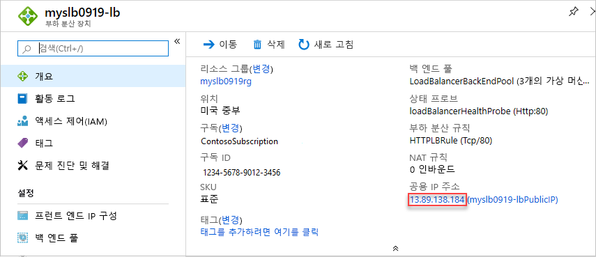

# <a name="quickstart-create-a-load-balancer-to-load-balance-vms-by-using-an-arm-template"></a>빠른 시작: ARM 템플릿을 사용하여 VM 부하를 분산하는 Load Balancer 만들기

부하를 분산하면 들어오는 요청이 여러 VM(가상 머신)에 분산되어 가용성 및 확장성이 향상됩니다. 이 빠른 시작에서는 VM 부하를 분산하는 표준 부하 분산 장치를 만드는 ARM 템플릿(Azure Resource Manager 템플릿)을 배포하는 방법을 보여 줍니다. ARM 템플릿을 사용하면 다른 배포 방법과 비교하여 단계가 줄어듭니다.

[!INCLUDE [About Azure Resource Manager](../../includes/resource-manager-quickstart-introduction.md)]

환경이 필수 구성 요소를 충족하고 ARM 템플릿 사용에 익숙한 경우 **Azure에 배포** 단추를 선택합니다. 그러면 Azure Portal에서 템플릿이 열립니다.

[](https://portal.azure.com/#create/Microsoft.Template/uri/https%3A%2F%2Fraw.githubusercontent.com%2FAzure%2Fazure-quickstart-templates%2Fmaster%2F101-load-balancer-standard-create%2Fazuredeploy.json)

## <a name="prerequisites"></a>필수 구성 요소

Azure 구독이 아직 없는 경우 시작하기 전에 [체험 계정](https://azure.microsoft.com/free/?WT.mc_id=A261C142F)을 만듭니다.

## <a name="review-the-template"></a>템플릿 검토

이 빠른 시작에서 사용되는 템플릿은 [Azure 빠른 시작 템플릿](https://azure.microsoft.com/resources/templates/101-load-balancer-standard-create/)에서 나온 것입니다.

Load Balancer와 공용 IP SKU는 일치해야 합니다. 표준 Load Balancer를 만들 때 표준 부하 분산 장치의 프런트 엔드로 구성된 새 표준 공용 IP 주소도 만들어야 합니다. 기본 Load Balancer를 만들려는 경우 [이 템플릿](https://azure.microsoft.com/resources/templates/201-2-vms-loadbalancer-natrules/)을 사용합니다. Microsoft는 프로덕션 워크로드용 표준 SKU를 사용할 것을 권장합니다.

:::code language="json" source="~/quickstart-templates/101-load-balancer-standard-create/azuredeploy.json" range="1-324" highlight="57-122":::

템플릿에 여러 Azure 리소스가 정의되어 있습니다.

- [**Microsoft.Network/loadBalancers**](/azure/templates/microsoft.network/loadbalancers)
- [**Microsoft.Network/publicIPAddresses**](/azure/templates/microsoft.network/publicipaddresses)(부하 분산 장치 및 세 개의 가상 머신 각각에 대해)
- [**Microsoft.Network/networkSecurityGroups**](/azure/templates/microsoft.network/networksecuritygroups)
- [**Microsoft.Network/virtualNetworks**](/azure/templates/microsoft.network/virtualnetworks)
- [**Microsoft.Compute/virutalMachines**](/azure/templates/microsoft.compute/virtualmachines)(이러한 요소 중 3개에 대해).
- [**Microsoft.Network/networkInterfaces**](/azure/templates/microsoft.network/networkinterfaces)(이러한 요소 중 3개에 대해).
- [**Microsoft.Compute/virtualMachine/extensions**](/azure/templates/microsoft.compute/virtualmachines/extensions)(이러한 요소 중 3개에 대해): IIS 및 웹 페이지를 구성하는 데 사용합니다.

Azure Load Balancer에 관련된 더 많은 템플릿을 찾으려면 [Azure 빠른 시작 템플릿](https://azure.microsoft.com/resources/templates/?resourceType=Microsoft.Network&pageNumber=1&sort=Popular)을 참조하세요.

## <a name="deploy-the-template"></a>템플릿 배포

1. 다음 코드 블록에서 **사용해 보기**를 선택하여 Azure Cloud Shell을 열고 지침에 따라 Azure에 로그인합니다.

   ```azurepowershell-interactive
   $projectName = Read-Host -Prompt "Enter a project name with 12 or less letters or numbers that is used to generate Azure resource names"
   $location = Read-Host -Prompt "Enter the location (i.e. centralus)"
   $adminUserName = Read-Host -Prompt "Enter the virtual machine administrator account name"
   $adminPassword = Read-Host -Prompt "Enter the virtual machine administrator password" -AsSecureString

   $resourceGroupName = "${projectName}rg"
   $templateUri = "https://raw.githubusercontent.com/Azure/azure-quickstart-templates/master/101-load-balancer-standard-create/azuredeploy.json"

   New-AzResourceGroup -Name $resourceGroupName -Location $location
   New-AzResourceGroupDeployment -ResourceGroupName $resourceGroupName -TemplateUri $templateUri -projectName $projectName -location $location -adminUsername $adminUsername -adminPassword $adminPassword

   Write-Host "Press [ENTER] to continue."
   ```

   콘솔에서 프롬프트가 표시될 때까지 기다립니다.

1. 이전 코드 블록에서 **복사**를 선택하여 PowerShell 스크립트를 복사합니다.

1. 셸 콘솔 창을 마우스 오른쪽 단추로 클릭한 후 **붙여넣기**를 선택합니다.

1. 값을 입력합니다.

   템플릿을 배포하면 세 가지 가용성 영역이 생성됩니다. 가용성 영역은 [특정 지역](../availability-zones/az-overview.md)에서만 지원됩니다. 지원되는 영역 중 하나를 사용합니다. 확실하지 않은 경우 **centralus**를 입력합니다.

   리소스 그룹 이름은 **rg**가 추가된 프로젝트 이름입니다. 다음 섹션에서 리소스 그룹 이름이 필요합니다.

템플릿을 배포하는 데 10분 정도 걸립니다. 완료되면 다음과 유사하게 출력됩니다.


Azure PowerShell은 템플릿을 배포하는 데 사용됩니다. Azure PowerShell 외에도 Azure Portal, Azure CLI 및 REST API를 사용할 수 있습니다. 다른 배포 방법을 알아보려면 [템플릿 배포](../azure-resource-manager/templates/deploy-portal.md)를 참조하세요.

## <a name="review-deployed-resources"></a>배포된 리소스 검토

1. [Azure Portal](https://portal.azure.com)에 로그인합니다.

1. 왼쪽 패널에서 **리소스 그룹** 을 선택합니다.

1. 이전 섹션에서 만든 리소스 그룹을 선택합니다. 기본 리소스 그룹 이름은 **rg**가 추가된 프로젝트 이름입니다.

1. 부하 분산 장치를 선택합니다. 기본 이름은 **-lb**가 추가된 프로젝트 이름입니다.

1. 공용 IP 주소의 IP 주소 부분만 복사한 후 브라우저의 주소 표시줄에 붙여넣습니다.

   

    브라우저에는 IIS(인터넷 정보 서비스) 웹 서버의 기본 페이지가 표시됩니다.

   

부하 분산 장치가 3개 VM 모두의 트래픽을 분산하는 것을 보려면 클라이언트 머신에서 웹 브라우저를 강제로 새로 고칩니다.

## <a name="clean-up-resources"></a>리소스 정리

더 이상 필요하지 않으면 리소스 그룹, 부하 분산 장치 및 모든 관련 리소스를 삭제합니다. 이렇게 하려면 Azure Portal로 이동하고, 부하 분산 장치가 포함된 리소스 그룹을 선택한 다음, **리소스 그룹 삭제**를 선택합니다.

## <a name="next-steps"></a>다음 단계

이 빠른 시작에서는 표준 Load Balancer를 만들고, 거기에 VM을 연결하고, 부하 분산 장치 트래픽 규칙 및 상태 프로브를 구성한 다음, 부하 분산 장치를 테스트합니다.

자세히 알아보려면 Load Balancer에 대한 자습서로 계속 진행하세요.

> [!div class="nextstepaction"]
> [Azure Load Balancer 자습서](tutorial-load-balancer-standard-public-zone-redundant-portal.md)
