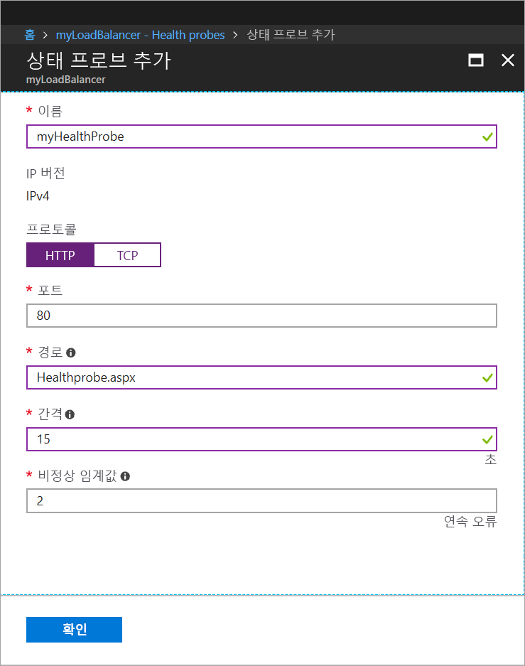

# <a name="tutorial-load-balance-internet-traffic-to-vms-using-the-azure-portal"></a>자습서: Azure Portal을 사용하여 인터넷 트래픽 부하를 VM에 분산

부하를 분산하면 들어오는 요청이 여러 가상 머신에 분산되어 가용성 및 확장성이 향상됩니다. 이 자습서에서는 인터넷 트래픽을 여러 VM에 분산하여 고가용성을 제공하는 Azure 표준 Load Balancer의 여러 가지 구성 요소에 대해 알아봅니다. 다음 방법에 대해 알아봅니다.


> [!div class="checklist"]
> * Azure Load Balancer 만들기
> * 가상 머신을 만들고 IIS 서버 설치
> * 부하 분산 장치 리소스 만들기
> * 부하 분산 장치의 실제 동작 보기
> * 부하 분산 장치에서 VM 추가 및 제거

Azure 구독이 아직 없는 경우 시작하기 전에 [체험 계정](https://azure.microsoft.com/free/?WT.mc_id=A261C142F)을 만듭니다. 

## <a name="sign-in-to-the-azure-portal"></a>Azure Portal에 로그인

[http://portal.azure.com](http://portal.azure.com)에서 Azure Portal에 로그인합니다.

## <a name="create-a-standard-load-balancer"></a>표준 Load Balancer 만들기

이 섹션에서는 가상 머신의 부하를 분산하는 데 도움이 되는 공용 부하 분산 장치를 만듭니다. 표준 부하 분산 장치는 표준 공용 IP 주소만 지원합니다. 표준 부하 분산 장치를 만들 때 표준 부하 분산 장치의 프런트 엔드(기본 이름은 *LoadBalancerFrontend*)로 구성된 새 표준 공용 IP 주소도 만들어야 합니다. 

1. 화면의 왼쪽 상단에서 **리소스 만들기** > **네트워킹** > **부하 분산 장치**를 클릭합니다.
2. **부하 분산 장치 만들기**에서 다음 정보를 입력하거나 선택하고, 나머지 설정은 기본값을 그대로 적용한 다음, **만들기**를 선택합니다.
    
    | 설정                 | 값                                              |
    | ---                     | ---                                                |
    | 이름                   | *myLoadBalancer*                                   |
    | type          | 공용                                        |
    | SKU           | Standard                          |
    | 공용 IP 주소 | **새로 만들기**를 선택하고, 텍스트 상자에 *myPublicIP*를 입력합니다. 공용 IP 주소에 대한 표준 SKU는 기본적으로 선택됩니다. **가용성 영역**에 **영역 중복**을 선택합니다. |
    | 구독               | 구독을 선택합니다.    |
    |리소스 그룹 | **새로 만들기**를 선택한 다음, *myResourceGroupSLB*를 입력합니다.    |
    | 위치           | **유럽 서부**를 선택합니다.                          |
    


   
## <a name="create-backend-servers"></a>백 엔드 서버 만들기

이 섹션에서는 가상 네트워크를 만들고, 부하 분산 장치의 백 엔드 풀에 사용되는 가상 머신 3개를 만든 다음, 부하 분산 장치를 테스트하기 위한 IIS를 가상 머신에 설치합니다.

### <a name="create-a-virtual-network"></a>가상 네트워크 만들기
1. Azure Portal의 왼쪽 상단에서 **리소스 만들기** > **네트워킹** > **가상 네트워크**를 클릭한 다음, 가상 네트워크에 대해 다음 값을 입력합니다.
    |설정|값|
    |---|---|
    |이름|*myVNet*을 입력합니다.|
    |구독| 구독을 선택합니다.|
    |리소스 그룹| **기존 항목 사용**을 선택한 다음, *myResourceGroupSLB*를 선택합니다.|
    |서브넷 이름| *myBackendSubnet*을 입력합니다.|
    
2. **만들기**를 클릭하여 가상 네트워크를 만듭니다.

### <a name="create-virtual-machines"></a>가상 머신 만들기

1. Azure Portal의 왼쪽 상단에서 **리소스 만들기** > **Compute** > **Windows Server 2016 Datacenter**를 클릭하고, 가상 머신에 대해 다음 값을 입력합니다.
    1. 가상 머신의 이름에 *myVM1*을 입력합니다.        
    2. **리소스 그룹**에 **기존 항목 사용**을 선택한 다음, *myResourceGroupSLB*를 선택합니다.
2. **확인**을 클릭합니다.
3. 가상 머신의 크기에 대해 **DS1_V2**를 선택하고 **선택**을 클릭합니다.
4. VM 설정에 다음 값을 입력합니다.
    1. 가상 네트워크로 *myVNet*이 선택되어 있고, 서브넷으로 *myBackendSubnet*이 선택되었는지 확인합니다.
    2. **공용 IP 주소**의 경우 **공용 IP 주소 만들기** 창에서 **표준**를 선택한 다음, **확인**을 선택합니다.
    3. **네트워크 보안 그룹**의 경우 **고급**을 선택한 다음, 다음을 수행합니다.
        1. *네트워크 보안 그룹(방화벽)을 선택하고, **네트워크 보안 그룹 선택** 페이지에서 **새로 만들기**를 선택합니다. 
        2. **네트워크 보안 그룹 선택** 페이지에서 **이름**의 경우 *myNetworkSecurityGroup*을 새 네트워크 보안 그룹의 이름으로 선택한 다음, **확인**을 선택합니다.
5. **사용 안 함**을 클릭하여 부팅 진단을 사용하지 않도록 설정합니다.
6. **확인**을 클릭하고 요약 페이지에서 설정을 검토한 다음, **만들기**를 클릭합니다.
7. 1-6단계를 사용하여 가상 네트워크가 *myVnet*이고, 서브넷이 *myBackendSubnet*이고, 네트워크 보안 그룹이 **myNetworkSecurityGroup*인 *VM2* 및 *VM3*이라는 두 개의 VM을 더 만듭니다. 

### <a name="create-network-security-group-rule"></a>네트워크 보안 그룹 규칙 만들기

이 섹션에서는 HTTP를 사용하는 인바운드 연결을 허용하는 NSG 규칙을 만듭니다.

1. 왼쪽 메뉴에서 **모든 리소스**를 클릭한 다음, 리소스 목록에서 **myResourceGroupSLB** 리소스 그룹에 있는 **myNetworkSecurityGroup**을 클릭합니다.
2. **설정**에서 **인바운드 보안 규칙**을 클릭한 다음, **추가**를 클릭합니다.
3. 포트 80을 사용하는 인바운드 HTTP 연결을 허용하도록 *myHTTPRule*이라고 하는 인바운드 보안 규칙에 다음 값을 입력합니다.
    - *서비스 태그* - **소스**로 입력합니다.
    - *인터넷* - **원본 서비스 태그**로 입력합니다.
    - *80* - **대상 포트 범위**로 입력합니다.
    - *TCP* - **프로토콜**로 입력합니다.
    - *허용* - **작업**에 대해 선택합니다.
    - *100* - **우선 순위**로 입력합니다.
    - *myHTTPRule* - 이름으로 입력합니다.
    - *HTTP 허용* - 설명으로 입력합니다.
4. **추가**를 선택합니다.

### <a name="install-iis-on-vms"></a>VM에 IIS 설치

1. 왼쪽 메뉴에서 **모든 리소스**를 클릭한 다음, 리소스 목록에서 *myResourceGroupSLB* 리소스 그룹에 있는 **myVM1**을 클릭합니다.
2. **개요** 페이지에서 **연결**을 클릭하여 VM에 RDP로 연결합니다.
3. **가상 머신에 연결** 팝업 창에서 **RDP 파일 다운로드**를 선택한 다음, 다운로드한 RDP 파일을 엽니다.
4. **원격 데스크톱 연결** 창에서 **연결**을 클릭합니다.
5. 이 VM을 만드는 동안 입력한 자격 증명을 사용하여 VM에 로그인합니다. 그러면 가상 머신 *myVM1*을 사용하여 원격 데스크톱 세션을 시작합니다.
6. 서버 바탕 화면에서 **Windows 관리 도구**>**Windows PowerShell**로 이동합니다.
7. PowerShell 창에서 다음 명령을 실행하여 IIS 서버를 설치하고, 기본 iisstart.htm 파일을 제거한 다음, VM 이름을 표시하는 새 iisstart.htm 파일을 추가합니다.

   ```azurepowershell-interactive
    
    # install IIS server role
    Install-WindowsFeature -name Web-Server -IncludeManagementTools
    
    # remove default htm file
     remove-item  C:\inetpub\wwwroot\iisstart.htm
    
    # Add a new htm file that displays server name
     Add-Content -Path "C:\inetpub\wwwroot\iisstart.htm" -Value $("Hello World from " + $env:computername)
   ```
6. *myVM1*이 포함된 RDP 세션을 닫습니다.
7. 1~6단계를 반복하여 *myVM2* 및 *myVM3*에 IIS 및 업데이트된 iisstart.htm 파일을 설치합니다.

## <a name="create-load-balancer-resources"></a>부하 분산 장치 리소스 만들기

이 섹션에서는 백 엔드 주소 풀 및 상태 프로브에 대한 부하 분산 장치 설정을 구성하고, 분산 장치 규칙을 지정합니다.

### <a name="create-a-backend-address-pool"></a>백 엔드 주소 풀 만들기

VM으로 트래픽을 분산하기 위해 백 엔드 주소 풀에 부하 분산 장치에 연결된 가상(NIC)의 IP 주소가 포함됩니다. *VM1* 및 *VM2*를 포함하도록 백 엔드 주소 풀 *myBackendPool*을 만듭니다.

1. 왼쪽 메뉴에서 **모든 리소스**를 클릭한 다음, 리소스 목록에서 **myLoadBalancer**를 클릭합니다.
2. **설정**에서 **백 엔드 풀**을 클릭한 다음, **추가**를 클릭합니다.
3. **백 엔드 풀 추가** 페이지에서 다음을 수행합니다.
   - 이름에서 백 엔드 풀의 이름으로 *myBackendPool*을 입력합니다.
   - **가상 네트워크**에서 *myVNet*을 선택합니다.
   - 해당 IP 주소와 함께 **가상 머신** 아래에서 *myVM1*, *myVM2* 및 *my VM3*을 추가한 다음, **추가**를 선택합니다.
4. 부하 분산 장치 백 엔드 풀 설정에 *myVM1*, *myVM2* 및 *myVM3* 등의 VM이 모두 표시되는지 확인한 다음, **확인**을 클릭합니다.

### <a name="create-a-health-probe"></a>상태 프로브 만들기

부하 분산 장치가 앱의 상태를 모니터링하도록 하려면 상태 프로브를 사용합니다. 상태 프로브는 상태 검사에 따라 부하 분산 장치 순환에서 VM을 동적으로 추가하거나 제거합니다. VM 상태를 모니터링할 상태 프로브 *myHealthProbe*를 만듭니다.

1. 왼쪽 메뉴에서 **모든 리소스**를 클릭한 다음, 리소스 목록에서 **myLoadBalancer**를 클릭합니다.
2. **설정**에서 **상태 프로브**를 클릭한 다음, **추가**를 클릭합니다.
3. 다음 값을 사용하여 상태 프로브를 만듭니다.
    - *myHealthProbe* - 상태 프로브의 이름으로 입력합니다.
    - **HTTP** - 프로토콜 유형으로 입력합니다.
    - *80* - 포트 번호로 입력합니다.
    - *15* - 프로브 시도 **간격**(초)으로 입력합니다.
    - *2* - **비정상 임계값** 또는 연속 프로브 오류 횟수가 이 숫자에 도달하면 VM을 비정상 상태로 간주합니다.
4. **확인**을 클릭합니다.

   

### <a name="create-a-load-balancer-rule"></a>부하 분산 장치 규칙 만들기

부하 분산 장치 규칙은 VM으로 트래픽이 분산되는 방법을 정의하는 데 사용됩니다. 들어오는 트래픽에 대한 프런트 엔드 IP 구성 및 트래픽을 수신할 백 엔드 IP 풀과 필요한 원본 및 대상 포트를 함께 정의합니다. 프런트 엔드 *FrontendLoadBalancer*의 포트 80에서 수신 대기하고 역시 포트 80을 사용하여 백 엔드 주소 풀 *myBackEndPool*에 부하 분산된 네트워크 트래픽을 보내는 *myLoadBalancerRuleWeb*이라는 부하 분산 장치 규칙을 만듭니다. 

1. 왼쪽 메뉴에서 **모든 리소스**를 클릭한 다음, 리소스 목록에서 **myLoadBalancer**를 클릭합니다.
2. **설정**에서 **부하 분산 규칙**을 클릭한 다음, **추가**를 클릭합니다.
3. 다음 값을 사용하여 부하 분산 규칙을 구성합니다.
    - *myHTTPRule* - 부하 분산 규칙의 이름으로 입력합니다.
    - **TCP** - 프로토콜 유형으로 입력합니다.
    - *80* - 포트 번호로 입력합니다.
    - *80* - 백 엔드 포트로 입력합니다.
    - *myBackendPool* - 백 엔드 풀의 이름으로 입력합니다.
    - *myHealthProbe* - 상태 프로브의 이름으로 입력합니다.
4. **확인**을 클릭합니다.

## <a name="test-the-load-balancer"></a>부하 분산 장치 테스트
1. **개요** 화면에서 부하 분산 장치의 공용 IP 주소를 찾습니다. **모든 리소스**를 클릭한 다음, **myPublicIP**를 클릭합니다.

2. 공용 IP 주소를 복사하여 브라우저의 주소 표시줄에 붙여넣습니다. IIS 웹 서버의 기본 페이지가 브라우저에 표시됩니다.

      

앱이 실행되는 3개의 VM에서 부하 분산 장치가 트래픽을 분산하는 것을 확인하기 위해 웹 브라우저를 강제로 새로 고칠 수 있습니다.

## <a name="remove-or-add-vms-from-the-backend-pool"></a>백 엔드 풀에서 VM 제거 또는 추가
앱이 실행되는 동안 OS 업데이트와 같은 유지 관리 작업을 VM에서 수행해야 할 수 있습니다. 앱에 대해 증가된 트래픽을 처리하기 위해 VM을 더 추가해야 할 수 있습니다. 이 섹션에서는 부하 분산 장치에서 VM을 추가 또는 제거하는 방법을 보여 줍니다.

1. 왼쪽 메뉴에서 **모든 리소스**를 클릭한 다음, 리소스 목록에서 **myLoadBalancer**를 클릭합니다.
2. **설정**에서 백 엔드 풀 목록에 있는 **백 엔드 풀**을 클릭하고 **myBackendPool**을 클릭합니다.
3. **myBackendPool** 페이지의 **대상 네트워크 IP 구성**에서 *VM1*을 백 엔드에서 제거하려면 **가상 머신: myVM1** 옆에 있는 삭제 아이콘을 클릭합니다.

*myVM1*이 백 엔드 주소 풀에 더 이상 없으면 *myVM1*에 소프트웨어 업데이트 설치와 같은 유지 관리 작업을 수행할 수 있습니다. *VM1**이 없으면 부하는 *myVM2* 및 *myVM3*에 분산됩니다. 

백 엔드 풀에 *myVM1*을 다시 추가하려면 이 문서의 *백 엔드 풀에 VM 추가* 섹션에 나와 있는 절차를 따릅니다.

## <a name="clean-up-resources"></a>리소스 정리

더 이상 필요하지 않으면 리소스 그룹, 부하 분산 장치 및 모든 관련 리소스를 삭제합니다. 이렇게 하려면 부하 분산 장치가 포함된 리소스 그룹을 선택하고 **삭제**를 클릭합니다.

## <a name="next-steps"></a>다음 단계

이 자습서에서는 표준 Load Balancer를 만들고, 거기에 VM을 연결하고, 부하 분산 장치 트래픽 규칙 및 상태 프로브를 구성한 다음, 부하 분산 장치를 테스트했습니다. 또한 부하가 분산된 집합에서 VM을 제거하고 백 엔드 주소 풀에 VM을 다시 추가했습니다. Azure Load Balancer에 대해 자세히 알아보려면 Azure Load Balancer에 대한 자습서를 계속 진행합니다.

> [!div class="nextstepaction"]
> [Azure Load Balancer 자습서](tutorial-load-balancer-standard-public-zone-redundant-portal.md)
