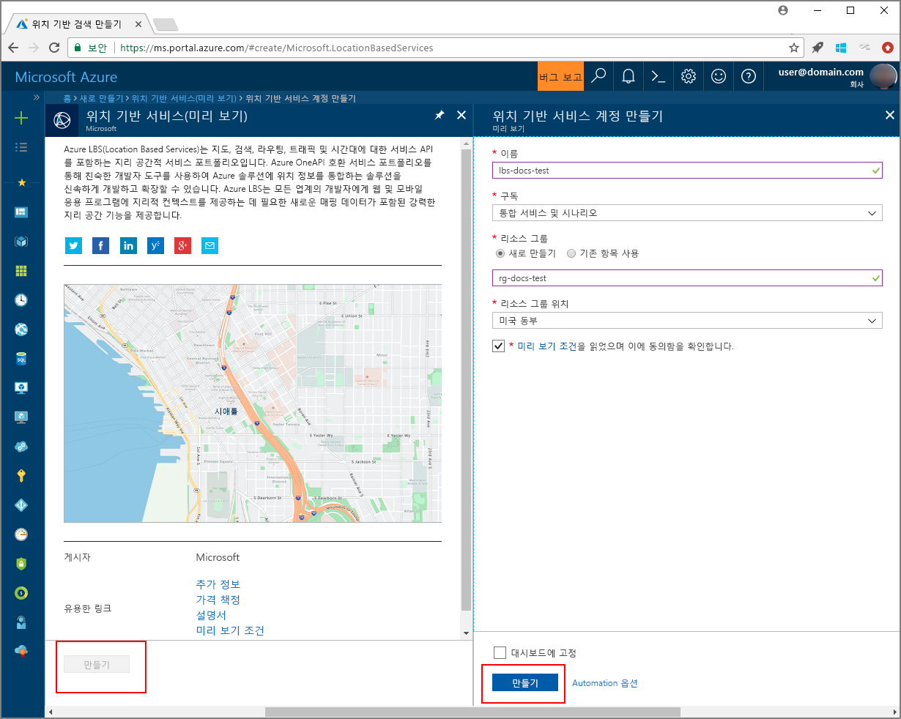
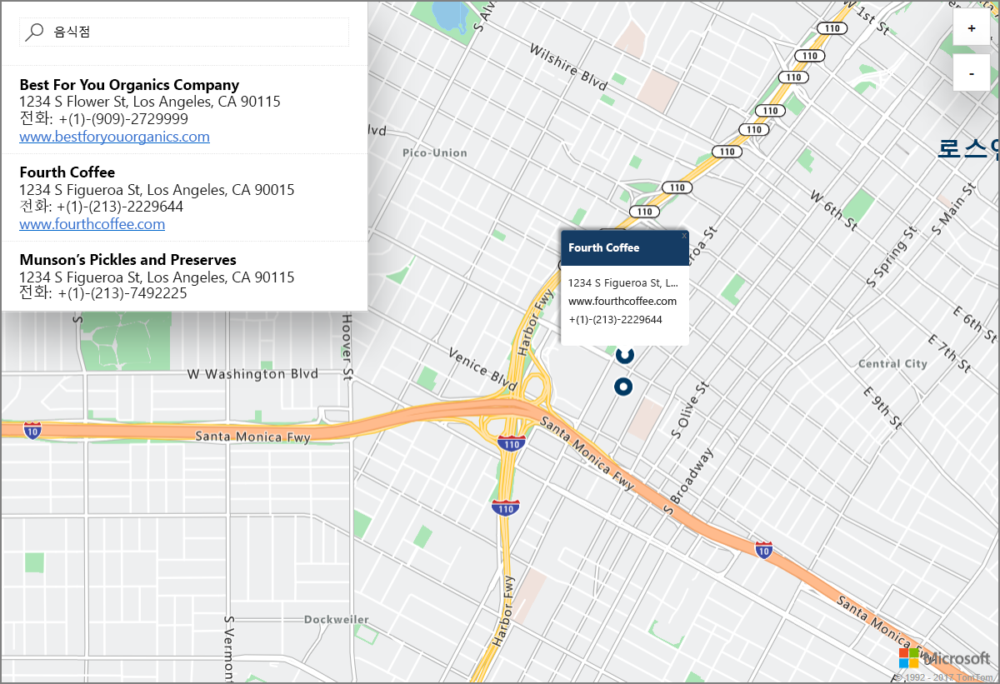

# Azure Location Based Services(미리 보기)를 사용하여 데모 대화형 맵 검색 시작

이 아티클에서는 대화형 검색을 수행하는 Azure LBS(Location Based Services)의 기능을 보여줍니다. 또한 자체 LBS 계정을 만들고 데모 웹 응용 프로그램에 사용할 계정 키를 가져오는 방법도 안내합니다. 

Azure 구독이 아직 없는 경우 시작하기 전에 [체험 계정](https://azure.microsoft.com/free/?WT.mc_id=A261C142F)을 만듭니다.

## Azure Portal에 로그인

[Azure Portal](https://portal.azure.com/)에 로그인합니다.

## Location Based Services 계정 만들기 및 계정 키 가져오기

1. [Azure Portal](https://portal.azure.com)의 왼쪽 위 모서리에서 **리소스 만들기**를 클릭합니다.
2. *Marketplace 검색* 상자에 **Location Based Services**를 입력합니다.
3. *결과*에서 **Location Based Services(미리 보기)**를 클릭합니다. 맵 아래에 나타나는 **만들기** 단추를 클릭합니다. 
4. **Location Based Services 계정 만들기** 페이지에서 새 계정에 대한 *이름*을 입력하고, 사용할 *구독*을 선택한 다음, 새 또는 기존 *리소스 그룹*의 이름을 입력합니다. 리소스 그룹의 위치를 선택하고 *미리 보기 약관*에 동의한 다음 **만들기**를 클릭합니다.

    

5. 계정을 만든 후에는 해당 계정을 열고 계정의 **설정**으로 이동합니다. **키**를 클릭하여 Azure Location Based Services 계정의 기본 및 보조 키를 가져옵니다. **기본 키** 값은 로컬 클립보드에 복사하여 다음 섹션에서 사용합니다. 

## 데모 응용 프로그램 다운로드

1. [interactiveSearch.html](https://github.com/Azure-Samples/location-based-services-samples/blob/master/src/interactiveSearch.html) 파일의 콘텐츠를 다운로드하거나 복사합니다.
2. 이 파일의 콘텐츠를 **AzureMapDemo.html**에 로컬로 저장하고 텍스트 편집기에서 엽니다.
3. `<insert-key>` 문자열을 검색하여 이전 섹션에서 구한 **기본 키** 값으로 바꿉니다. 

## 데모 응용 프로그램 시작 위치

1. 원하는 브라우저에서 **AzureMapDemo.html** 파일을 엽니다.
2. 로스앤젤레스의 지도를 관찰합니다. 도시는 *AzureMapDemo.html*에서 **center**라는 JavaScript 변수에 지정된 `[longitude, latitude]` 값 쌍으로 결정됩니다. 이 좌표를 원하는 도시로 변경할 수 있습니다. 예를 들어 뉴욕의 좌표는 *[-74.0060, 40.7128]*입니다.
3. 데모 웹 응용 프로그램의 왼쪽 위 모서리에 있는 검색 상자에 검색할 위치 유형이나 주소를 입력합니다. 
4. 검색 상자 아래 표시되는 주소/위치 목록 위에 마우스를 가져가 지도 위의 해당 핀에 해당 위치에 관한 정보가 어떻게 팝업 표시되는지 확인합니다. 예를 들어, 이 웹 응용 프로그램의 샘플 시작과 *restaurants* 검색 결과는 다음과 같습니다. 개인 회사의 정보 보호를 위해 가상의 이름과 주소가 표시됩니다. 

    

## 리소스 정리

이 자습서에서는 계정에 Azure Location Based Services를 사용하고 구성하는 방법을 자세히 살펴봅니다. 자습서를 계속 사용하려면 이 빠른 시작에서 만든 리소스를 정리하지 마세요. 계속하지 않으려는 경우 다음 단계를 사용하여 이 빠른 시작에서 만든 모든 리소스를 삭제합니다.

1. **AzureMapDemo.html** 웹 응용 프로그램을 실행 중인 브라우저를 닫습니다.
2. Azure Portal의 왼쪽 메뉴에서 **모든 리소스**를 클릭한 다음 해당 LBS 계정을 선택합니다. **모든 리소스** 블레이드 위쪽에서 **삭제**를 클릭합니다.

## 다음 단계

이 빠른 시작에서는 Azure LBS 계정을 만들고 이 계정을 사용하여 데모 앱을 시작했습니다. Azure Location Based Services API를 사용하여 자체 응용 프로그램을 만드는 방법은 다음 자습서에서 알아보세요.

> [!div class="nextstepaction"]
> [Azure Map 및 Search 사용 자습서](./tutorial-search-location.md)
