# Log Analytics 시작
Microsoft OMS(Operations Management Suite)에서 몇 분 이내에 Log Analytics를 가동하고 실행할 수 있습니다. OMS 작업 영역을 만드는 방법을 선택할 때 두 가지 옵션이 있으며, 이는 계정과 유사합니다.

* Microsoft Operations Management Suite 웹 사이트
* Microsoft Azure 구독

OMS 웹 사이트를 사용하여 무료 OMS 작업 영역을 만들 수 있습니다. 또는 Microsoft Azure 구독을 사용하여 무료 Log Analytics 작업 영역을 만들 수 있습니다. 작업 영역이 어느 방법으로 만들어지든 기능적으로 동일합니다. 무료 작업 영역은 매일 OMS 서비스로 데이터 500MB만을 보낼 수 있습니다. 모든 작업 영역은 Azure 구독을 필요로 하며, 또한 해당 구독을 사용하여 다른 Azure 서비스에 액세스할 수도 있습니다. 영역을 만드는 데 사용하는 방법과 상관없이 Microsoft 계정 또는 조직 계정을 사용하여 작업 영역을 만듭니다.

여기에서 프로세스를 살펴보세요.

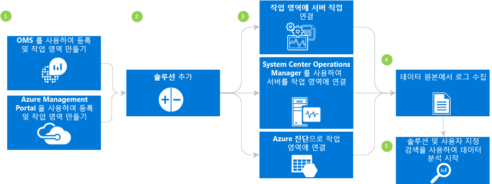

## Log Analytics 필수 구성 요소 및 배포 고려 사항
* Log Analytics을 완전하게 사용하려면 유료 Microsoft Azure 구독이 필요합니다. Azure 구독이 없는 경우 모든 Azure 서비스에 액세스할 수 있는 30일간 유효한 [무료 계정](https://azure.microsoft.com/free/) 을 만듭니다. 또는 [Operations Management Suite](http://microsoft.com/oms) 웹 사이트에서 무료 OMS 계정을 만듭니다.
* 작업 영역을 만들어야 합니다.
* 데이터를 수집할 각 Windows 컴퓨터에서 Windows Server 2008 SP1 이상을 실행해야 합니다.
* [방화벽](log-analytics-proxy-firewall.md) 액세스
* 컴퓨터에 직접 인터넷 액세스 권한이 있는지 결정합니다. 없는 경우 게이트웨이 서버에서 OMS 웹 서비스 사이트에 액세스해야 합니다. 모든 액세스는 HTTPS를 통해 이루어집니다. 컴퓨터에서 인터넷 액세스를 사용할 수 없는 경우 서버에서 OMS로 트래픽을 전달하는 [OMS Gateway](log-analytics-oms-gateway.md) 서버를 설정할 수 있습니다.
* Operations Manager를 사용하는 경우 Log Analytics는 Operations Manager 2012 SP1 UR6 이상 및 Operations Manager 2012 R2 UR2 이상을 지원합니다. 프록시 지원은 Operations Manager 2012 SP1 UR7 및 Operations Manager 2012 R2 UR3에 추가되었습니다. OMS와 통합할 방법을 결정합니다.
* OMS에 데이터를 보내는 기술 및 서버를 결정합니다. 예를 들어 도메인 컨트롤러, SQL Server 등.
* OMS와 Azure의 사용자에게 권한을 부여합니다.
* 데이터 사용량이 염려되는 경우 각 솔루션을 개별적으로 배포하고 추가 솔루션을 추가하기 전에 성능 영향을 테스트합니다.
* Log Analytics에 솔루션 및 기능을 추가할 때 데이터 사용량 및 성능을 검토합니다. 이는 이벤트 수집, 로그 수집, 성능 데이터 수집 등을 포함합니다. 데이터 사용량 또는 성능 영향을 확인할 때까지 최소한의 수집으로 시작하는 것이 좋습니다.
* Windows 에이전트가 Operations Manager를 사용해서도 관리되지 않는지 확인합니다. 데이터가 중복될 수 있습니다. 이는 Azure 진단이 사용하도록 설정된 Azure 기반 에이전트에도 적용됩니다.
* 에이전트를 설치한 후 에이전트가 올바르게 작동하는지 확인합니다. 올바르게 작동하지 않으면 그룹 정책을 사용하여 CNG(Cryptography API: Next Generation) 키 격리가 비활성화되지 않았는지 확인합니다.
* 일부 Log Analytics 솔루션에는 추가 요구 사항이 있습니다.

## OMS를 사용하여 3단계에서 로그인
1. [Operations Management Suite 웹 사이트](http://microsoft.com/oms)로 이동합니다. Outlook.com 등과 같은 Microsoft 계정 또는 회사 또는 교육 기관이 Office 365 또는 다른 Microsoft 서비스와 함께 사용하도록 제공한 조직 계정을 사용하여 로그인합니다.
2. 고유한 작업 영역 이름을 제공합니다. 작업 영역은 관리 데이터가 저장되는 논리적 컨테이너입니다. 데이터는 작업 영역에 독점적으로 사용되므로 작업 영역은 조직의 서로 다른 팀 간에 데이터를 분할하는 방법을 제공합니다. 전자 메일 주소 및 데이터를 저장할 지역을 지정합니다.  
    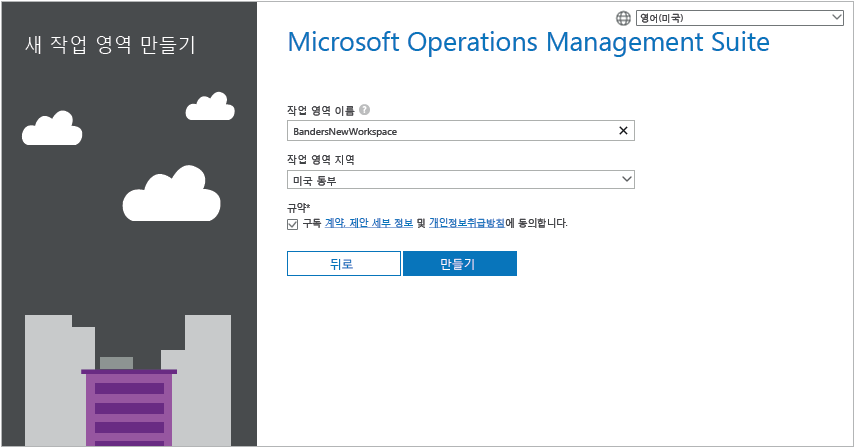
3. 다음으로 새 무료 Azure 구독 또는 기존 Azure 구독에 대한 링크를 만듭니다.  
   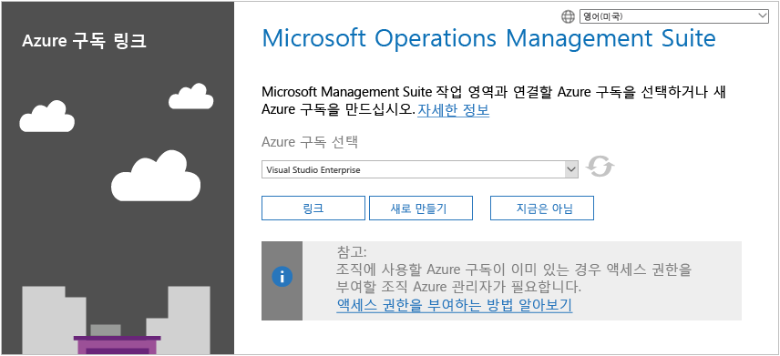

작업 관리 도구 모음 포털을 시작할 준비가 되었습니다.

[작업 영역 관리](log-analytics-manage-access.md)에서 작업 영역을 설정하고 Operations Management Suite를 사용하여 만든 작업 영역에 기존 Azure 계정을 연결하는 방법을 알아볼 수 있습니다.

## Microsoft Azure를 사용하여 신속하게 등록
1. [Azure Portal](https://portal.azure.com) 로 이동하여 로그인하고 서비스 목록을 찾아본 후 **Log Analytics**를 선택합니다.  
    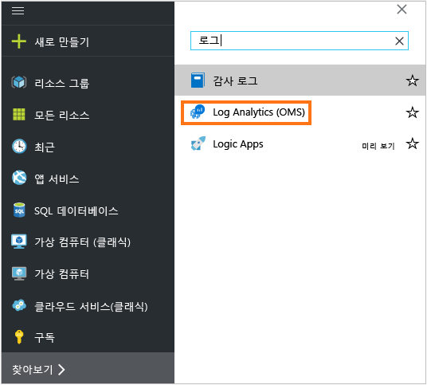
2. **추가**를 클릭하고 다음 항목에 대한 선택 항목을 선택합니다.
   * **OMS 작업 영역** 이름
   * **구독** - 여러 구독이 있는 경우 새 작업 영역에 연결할 구독을 선택합니다.
   * **리소스 그룹**
   * **위치**:
   * **가격 책정 계층**  
       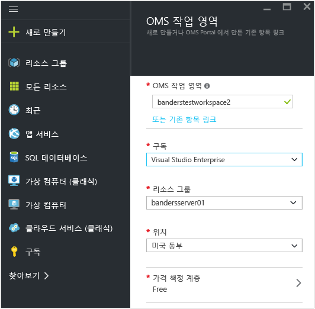
3. **확인**을 클릭하면 해당 작업 영역의 목록이 표시됩니다.
4. Azure Portal에서 세부 정보를 보려면 작업 영역을 선택합니다.       
    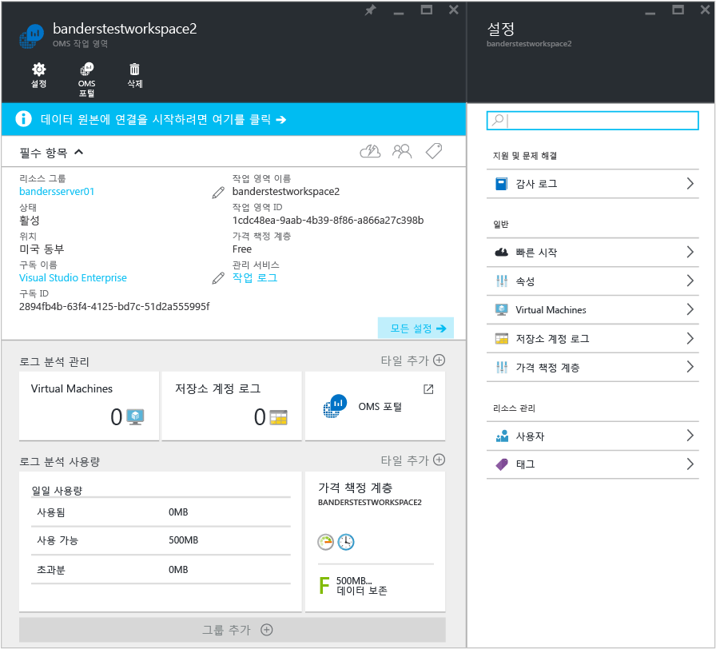         
5. **OMS 포털** 링크를 클릭하여 새 작업 영역으로 Operations Management Suite 웹 사이트를 엽니다.

Operations Management Suite 포털 사용을 시작할 준비가 되었습니다.

[Log Analytics에 대한 액세스 관리](log-analytics-manage-access.md)에서 작업 영역을 설정하고 Operations Management Suite를 사용하여 만든 기존 작업 영역을 Azure 구독에 연결하는 방법을 알아볼 수 있습니다.

## Operations Management Suite 포털 시작
솔루션을 선택하고 관리할 서버를 선택하려면 **설정** 타일을 클릭하고 이 섹션의 단계를 수행합니다.  

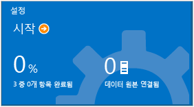  

1. **솔루션 추가** - 설치된 솔루션을 확인합니다.  
    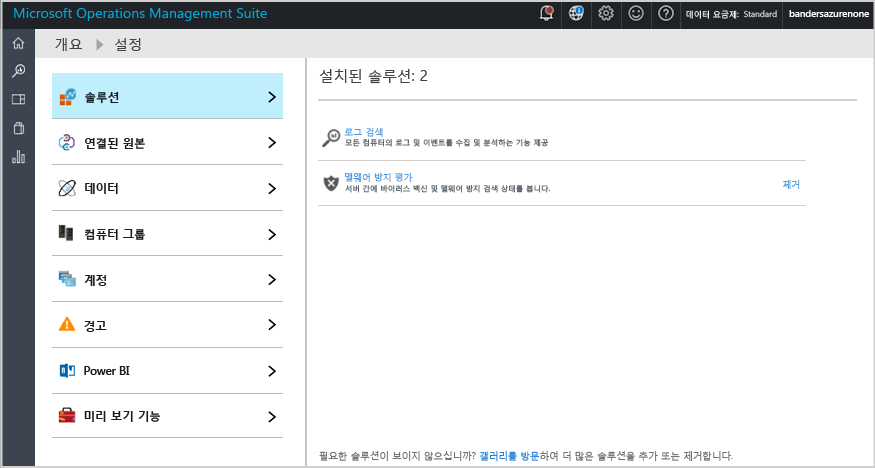  
    **갤러리 방문**을 클릭하여 더 많은 솔루션을 추가합니다.  
    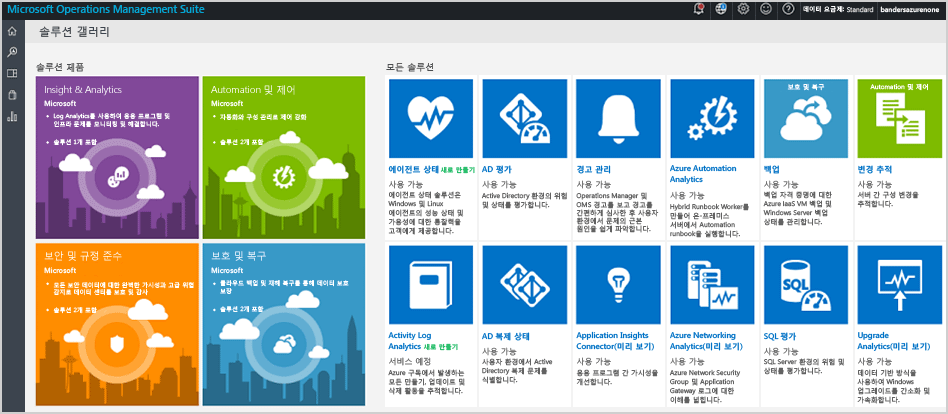  
    솔루션을 선택한 다음 **추가**를 클릭합니다.
2. **원본 연결** - 데이터를 수집하도록 서버 환경을 연결하는 방법을 선택합니다.

   * 에이전트를 설치하여 모든 Windows 서버 또는 클라이언트를 직접 연결합니다.
   * Linux용 OMS 에이전트와 Linux 서버를 연결합니다.
   * Windows 또는 Linux Azure 진단 VM 확장을 사용하여 구성된 Azure 저장소 계정을 사용합니다.
   * System Center Operations Manager를 사용하여 관리 그룹 또는 전체 Operations Manager 배포를 연결합니다.
   * Windows 원격 분석을 사용하도록 설정하여 업그레이드 분석을 사용합니다.
       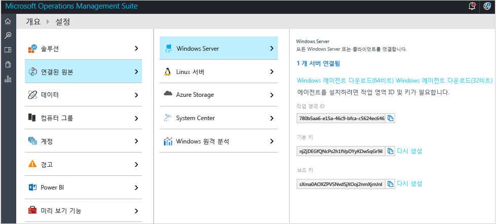    
3. **데이터 수집** 하나 이상의 데이터 원본을 구성하여 작업 영역으로 데이터를 채웁니다. 완료하면 **저장**을 클릭합니다.    

    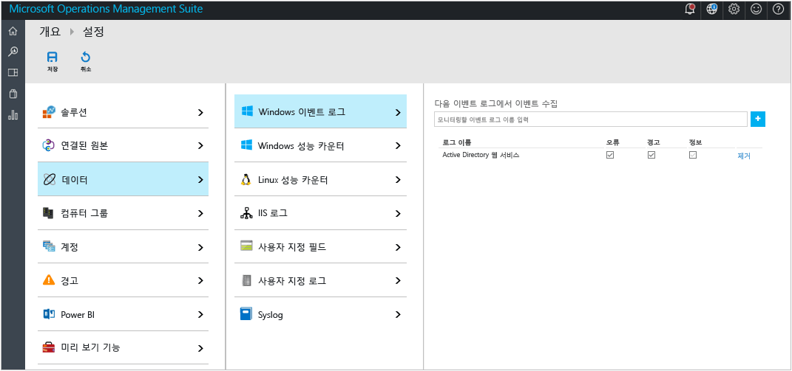    

## 경우에 따라 에이전트를 설치하여 Windows 컴퓨터를 연결합니다.
다음 예제에서는 Windows 에이전트를 설치하는 방법을 보여 줍니다.

1. **설정** 타일을 클릭하고 **연결된 원본** 탭을 클릭한 다음 추가하려는 원본 유형의 탭을 클릭하여 에이전트를 다운로드하거나 에이전트를 사용하는 방법에 대해 알아봅니다. 예를 들어 **Windows 에이전트 다운로드(64비트)**를 클릭합니다. Windows 에이전트의 경우 Windows Server 2008 SP 1 이후 또는 Windows 7 SP1 이후에만 에이전트를 설치할 수 있습니다.
2. 하나 이상의 서버에 에이전트를 설치합니다. 에이전트를 하나씩 설치하거나 [사용자 지정 스크립트](log-analytics-windows-agents.md)를 통해 좀 더 자동화된 방법으로 설치할 수 있으며, 기존 소프트웨어 배포 솔루션을 사용할 수도 있습니다.
3. 사용권 계약에 동의하고 설치 폴더를 선택한 후 **Azure Log Analytics(OMS)에 에이전트 연결**을 선택합니다.   
    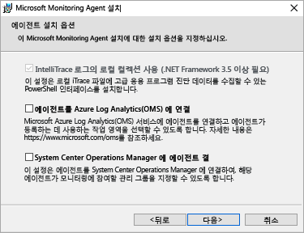
4. 다음 페이지에서 작업 영역 ID와 작업 영역 키를 묻는 메시지가 표시됩니다. 작업 영역 ID 및 키는 에이전트 파일을 다운로드한 화면에 표시됩니다.  
    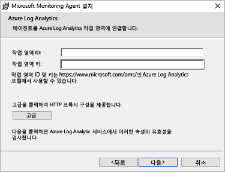  

    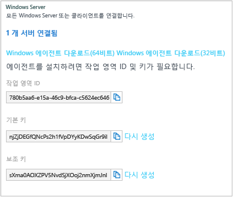
5. 설치하는 동안 **고급** 을 클릭하여 선택적으로 프록시 서버를 설정하고 인증 정보를 제공할 수 있습니다. **다음** 단추를 클릭하여 작업 영역 정보 화면으로 돌아갑니다.
6. **다음** 을 클릭하여 작업 영역 ID 및 키의 유효성을 검사합니다. 오류가 발견되면 **뒤로** 를 클릭하여 수정할 수 있습니다. 작업 영역 ID 및 키의 유효성이 확인되면 **설치** 를 클릭하여 에이전트 설치를 완료합니다.
7. 설정 패널에서 [Microsoft 모니터링 에이전트 > Azure Log Analytics(OMS)] 탭을 클릭합니다. 에이전트가 작업 관리 도구 모음 서비스와 통신할 때 녹색 확인 표시 아이콘이 나타납니다. 처음에 이 과정에 약 5-10분이 걸립니다.

> [!NOTE]
> 용량 관리 및 구성 평가 솔루션은 현재 작업 관리 도구 모음에 직접 연결된 서버에서 지원되지 않습니다.

또한 System Center Operations Manager 2012 SP1 이상에 에이전트를 연결할 수 있습니다. 이렇게 하려면 **System Center Operations Manager에 에이전트 연결**을 선택합니다. 이 옵션을 선택하면 추가 하드웨어가 필요 없이 데이터를 서비스에 보내거나 관리 그룹에 로드할 수 있습니다.

Operations Management Suite에 에이전트를 연결하는 방법에 대한 자세한 내용은 [Log Analytics에 Windows 컴퓨터 연결](log-analytics-windows-agents.md)에서 확인할 수 있습니다.

## 필요에 따라 System Center Operations Manager를 사용하여 서버에 연결합니다.
1. Operations Manager 콘솔에서 **관리**를 선택합니다.
2. **Operational Insights** 노드를 확장하고 **Operational Insights 연결**을 선택합니다.

   > [!NOTE]
   > 사용 중인 SCOM의 업데이트 롤업에 따라 *System Center Advisor*, *Operational Insights* 또는 *Operations Management Suite*에 대한 노드가 표시될 수 있습니다.
   >
   >
3. 오른쪽 위의 **Operational Insight에 등록** 링크를 클릭하고 지침을 따릅니다.
4. 등록 마법사를 완료한 후 **컴퓨터/그룹 추가** 링크를 클릭합니다.
5. **컴퓨터 검색** 대화 상자에서, Operations Manager에서 모니터링하는 그룹 또는 컴퓨터를 검색할 수 있습니다. Log Analytics에 등록할 컴퓨터 또는 그룹을 선택하고 **추가**를 클릭한 다음 **확인**을 클릭합니다. Operations Management Suite 포털의 **사용량** 타일로 이동하여 OMS 서비스가 데이터를 수신하고 있는지 확인할 수 있습니다. 데이터는 약 5-10 분 후에 나타날 것입니다.

Operations Management Suite에 Operations Manager를 연결하는 방법에 대한 자세한 내용은 [Log Analytics에 Operations Manager 연결](log-analytics-om-agents.md)에서 확인할 수 있습니다.

## 필요에 따라 Microsoft Azure의 클라우드 서비스에서 데이터를 분석합니다.
작업 관리 도구 모음을 사용하면 Azure 클라우드 서비스에 대해 진단을 사용하도록 설정하여 클라우드 서비스 및 가상 컴퓨터에 대해 이벤트 및 IIS 로그를 빠르게 검색할 수 있습니다. 또한 Microsoft 모니터링 에이전트를 설치하여 Azure 가상 컴퓨터에 대해 더 세부적인 내용을 받을 수 있습니다. [Log Analytics에 Azure 저장소 연결](log-analytics-azure-storage.md)에서 Operations Management Suite를 사용하도록 Azure 환경을 구성하는 방법에 대해 더 자세히 읽을 수 있습니다.

## 다음 단계
* [솔루션 갤러리에서 Log Analytics 솔루션을 추가](log-analytics-add-solutions.md) 하여 기능을 추가하고 데이터를 수집합니다.
* [로그 검색](log-analytics-log-searches.md) 을 숙지하여 솔루션에서 수집한 자세한 정보를 확인합니다.
* [대시보드](log-analytics-dashboards.md) 를 사용하여 자신만의 사용자 지정 검색을 저장하고 표시합니다.

<!--HONumber=Dec16_HO2-->

