# Log Analytics 작업 영역 시작
Azure Log Analytics를 신속하게 시작하고 실행할 수 있으며 IT 인프라에서 수집된 운영 인텔리전스를 평가하는 데 도움이 됩니다. 이 문서를 사용하면 *무료로* 수집한 데이터에 대한 탐색 및 분석을 손쉽게 시작하고 조치를 취할 수 있습니다.

이 문서는 서비스 사용을 시작할 수 있도록 간략한 자습서를 사용하여 Azure의 최소 배포 단계를 안내하는 Log Analytics에 대한 소개 자료입니다. Azure에서 관리 데이터가 저장되는 논리 컨테이너를 작업 영역이라고 합니다. 이 정보를 검토하고 자체 평가를 완료한 후에는 평가 작업 영역을 제거할 수 있습니다. 이 문서는 자습서이기 때문에 비즈니스 요구 사항, 계획 또는 아키텍처 지침이 언급되지 않습니다.

>[!NOTE]
>Microsoft Azure Government 클라우드를 사용하는 경우 [Azure Government 모니터링 및 관리 설명서](https://review.docs.microsoft.com/azure/azure-government/documentation-government-services-monitoringandmanagement#log-analytics)를 대신 사용하세요.

시작에 사용되는 프로세스에 대한 간략한 정보는 다음과 같습니다.

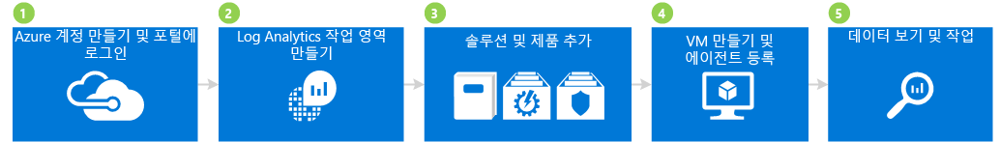

## 1 Azure 계정 만들기 및 로그인

Azure 계정이 아직 없다면 Log Analytics를 사용하기 위해 계정을 만들어야 합니다. 모든 Azure 서비스에 액세스할 수 있는 30일간 유효한 [무료 계정](https://azure.microsoft.com/free/)을 만들 수 있습니다.

### 무료 계정을 만들고 로그인하려면
1. [무료 Azure 계정 만들기](https://azure.microsoft.com/free/)의 지침을 따릅니다.
2. [Azure Portal](https://portal.azure.com)로 이동하고 로그인합니다.

## 2 작업 영역 만들기

다음은 작업 영역을 만드는 단계입니다.

1. Azure Portal에서 Marketplace의 서비스 목록에서 *Log Analytics*를 검색한 다음 **Log Analytics**를 선택합니다.  
    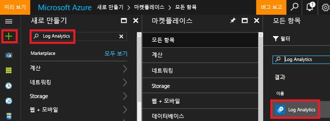
2. **만들기**를 클릭하고 다음 항목에 대한 옵션을 선택합니다.
   * **OMS 작업 영역** - 작업 영역의 이름을 입력합니다.
   * **구독** - 여러 구독이 있는 경우 새 작업 영역에 연결할 구독을 선택합니다.
   * **리소스 그룹**
   * **위치**:
   * **가격 책정 계층**  
       
3. **확인**을 클릭하면 작업 영역 목록이 표시됩니다.
4. 작업 영역의 세부 정보를 보려면 Azure Portal에서 작업 영역을 선택합니다.       
             

## 3 솔루션 및 솔루션 제품 추가

다음으로 관리 솔루션 및 솔루션 제품을 추가합니다. 관리 솔루션은 특정 문제 영역을 중심으로 피벗된 메트릭을 제공하는 논리, 시각화 및 데이터 취득 규칙의 컬렉션입니다. 솔루션 제품은 관리 솔루션의 모음입니다.

작업 영역에 솔루션을 추가하면 Log Analytics는 에이전트를 사용하여 작업 영역에 연결되어 있는 컴퓨터로부터 다양한 종류의 데이터를 수집할 수 있습니다. 등록할 에이전트는 나중에 설명하겠습니다.

### 솔루션 및 솔루션 제품을 추가하려면

1. Azure Portal에서 **새로 만들기**를 클릭한 다음 **Marketplace 검색** 상자에 **Activity Log Analytics**(활동 로그 분석)를 입력한 다음 ENTER를 누릅니다.
2. 모두 블레이드에서 **Activity Log Analytics**(활동 로그 분석)를 선택한 다음 **만들기**를 클릭합니다.  
    (활동 로그 분석)  
3. *관리 솔루션 이름* 블레이드에서 관리 솔루션과 연결할 작업 영역을 선택합니다.
4. **만들기**를 클릭합니다.  
    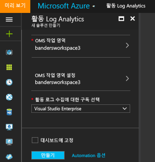  
5. 1-4단계를 반복하여 다음을 추가합니다.
    - **보안 및 규정 준수** 서비스 제품 - 맬웨어 방지 평가 및 보안 및 감사 솔루션 포함.
    - **Automation 및 제어** 서비스 제품 - Automation Hybrid Worker, 변경 내용 추적 및 시스템 업데이트 평가(업데이트 관리라고도 함) 솔루션 포함. 솔루션 제품을 추가할 때 Automation 계정을 만들어야 합니다.  
        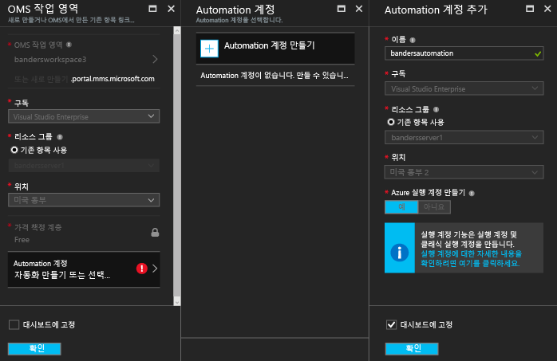  
6. 작업 영역에 추가한 관리 솔루션 사용을 보려면 **Log Analytics** > **구독** > ***작업 영역 이름*** > **개요**로 이동합니다. 추가한 관리 솔루션의 타일이 표시됩니다.  
    >[!NOTE]
    >에이전트가 작업 영역에 아직 연결되지 않았기 때문에 추가한 솔루션에 데이터가 표시되지 않습니다.  

    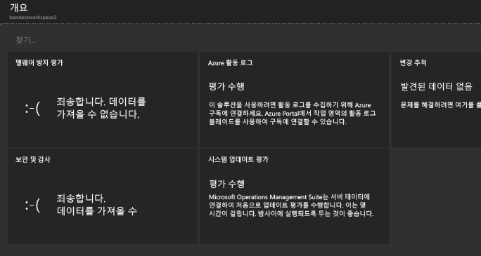

## 4 VM 만들기 및 에이전트 등록

다음으로 Azure에서 간단한 가상 컴퓨터를 만듭니다. VM을 만든 후 OMS 에이전트를 등록하여 사용하도록 설정합니다. 에이전트를 사용하도록 설정하면 VM에서 데이터가 수집되고 Log Analytics에 데이터를 보내는 작업이 시작됩니다.

### 가상 컴퓨터를 만드는 방법

- [Azure Portal에서 첫 번째 Windows 가상 컴퓨터 만들기](../virtual-machines/virtual-machines-windows-hero-tutorial.md)의 지침에 따라 새 가상 컴퓨터를 시작합니다.

### 가상 컴퓨터를 Log Analytics에 연결

- [Azure 가상 컴퓨터를 Log Analytics에 연결](log-analytics-azure-vm-extension.md)의 지침에 따라 Azure Portal을 사용하여 VM을 Log Analytics에 연결합니다.

## 5 데이터 보기 및 작업

앞에서 Activity Log Analytics(활동 로그 분석)와 보안 및 규정 준수 및 Automation 및 제어 서비스 제품을 사용하도록 설정했습니다. 다음으로 솔루션에 의해 수집된 데이터와 로그 검색의 결과를 살펴보겠습니다.

우선 솔루션 내에 표시되는 데이터를 살펴봅니다. 그런 다음 로그 검색을 통해 액세스한 로그 검색을 살펴봅니다. 로그 검색을 사용하면 사용자 환경 내에서 여러 소스의 컴퓨터 데이터를 서로 연결하고 결합할 수 있습니다. 자세한 내용은 [Log Analytics의 로그 검색](log-analytics-log-searches.md)을 참조하세요. 마지막으로 Azure Portal 외부에 있는 OMS 포털을 사용하여 찾은 데이터에 조치를 취합니다.

### 맬웨어 방지 데이터를 보려면

1. Azure Portal에서 **Log Analytics** > ***작업 영역***으로 이동합니다.
2. 작업 영역 블레이드의 **일반**에서 **개요**를 클릭합니다.  
    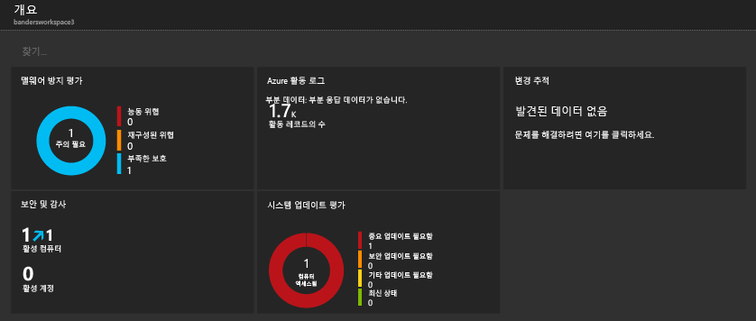
3. **맬웨어 방지 평가** 타일을 클릭합니다. 이 예제의 경우 Windows Defender가 컴퓨터에 설치되어 있지만 서명이 만료된 것을 볼 수 있습니다.  
    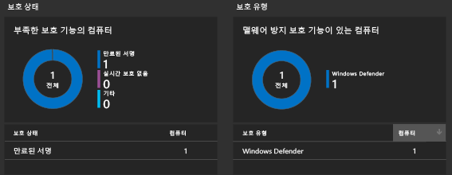
4. 이 예제의 경우 **보호 상태**에서 **Signature out of date**(서명 만료됨)을 클릭하여 로그 검색을 열고 만료된 서명이 있는 컴퓨터에 대한 세부 정보를 봅니다. 이 예제의 경우 컴퓨터 이름은 *getstarted*입니다. 서명이 만료된 컴퓨터가 둘 이상인 경우 로그 검색 결과에 모두 표시됩니다.  
    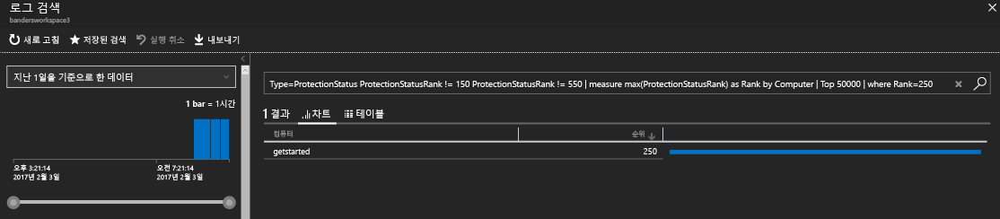

### 보안 및 감사 데이터를 보려면

1. 작업 영역 블레이드의 **일반**에서 **개요**를 클릭합니다.  
2. **보안 및 감사** 타일을 클릭합니다. 이 예제에서 두 가지 주목할만한 문제를 볼 수 있습니다. 중요 업데이트가 누락된 컴퓨터가 하나 있고 보호가 충분하지 않은 컴퓨터가 하나 있습니다.  
    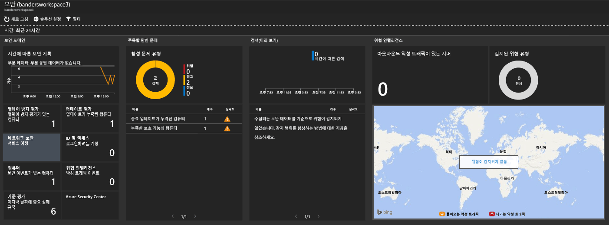
3. 이 예제의 **Notable Issues**(주목할 만한 문제)에서 **Computers missing critical updates**(중요 업데이트가 누락된 컴퓨터)를 클릭하여 로그 검색을 열고 중요 업데이트가 누락된 컴퓨터에 대한 세부 정보를 봅니다. 이 예제의 경우 누락된 중요 업데이트가 하나 있고 누락된 다른 업데이트가 63개 있습니다.  
    

### 시스템 업데이트 데이터를 보고 작업하려면

1. 작업 영역 블레이드의 **일반**에서 **개요**를 클릭합니다.  
2. **시스템 업데이트 평가** 타일을 클릭합니다. 이 예제의 경우 중요 업데이트가 필요한 *getstarted*라는 Windows 컴퓨터 하나와 정의 파일 업데이트가 필요한 컴퓨터가 하나 있는 것을 볼 수 있습니다.  
    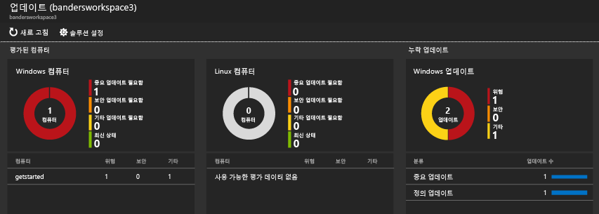
3. 이 예제의 **업데이트 누락**에서 **중요 업데이트**를 클릭하여 로그 검색을 열고 중요 업데이트가 누락된 컴퓨터에 대한 세부 정보를 봅니다. 이 예제의 경우 누락된 업데이트가 하나 있고 필수 업데이트가 하나 있습니다.  
    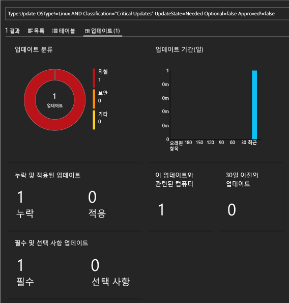
4. [Operations Management Suite](http://microsoft.com/oms) 웹 사이트로 이동하여 Azure 계정으로 로그인합니다. 로그인하면 솔루션 정보가 Azure Portal에서 봤던 것과 유사한 것을 볼 수 있습니다.  
    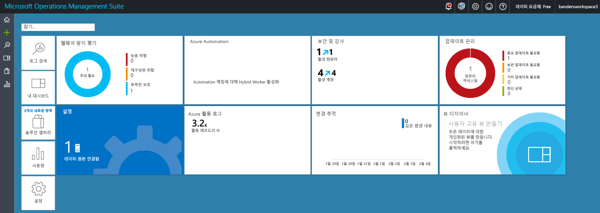
5. **업데이트 관리** 타일을 클릭합니다.
6. 업데이트 관리 대시보드의 시스템 업데이트 정보가 Azure Portal에서 봤던 시스템 업데이트 정보와 유사한 것을 볼 수 있습니다. 하지만 **Manage Update Deployments**(업데이트 배포 관리) 타일은 새 타일입니다. **Manage Update Deployments**(업데이트 배포 관리) 타일을 클릭합니다.  
    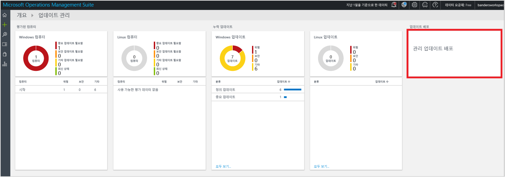
7. **Update Deployments**(업데이트 배포) 페이지에서 **추가**를 클릭하여 *update run*(업데이트 실행)을 만듭니다.  
    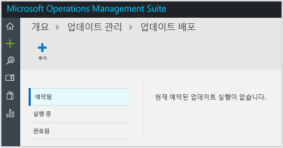
8.  **New Update Deployment**(새 업데이트 배포) 페이지에서 업데이트 배포의 이름을 입력하고, 업데이트할 컴퓨터(이 예제의 경우 *getstarted*)를 선택하고, 일정을 선택한 다음 **저장**을 클릭합니다.  
    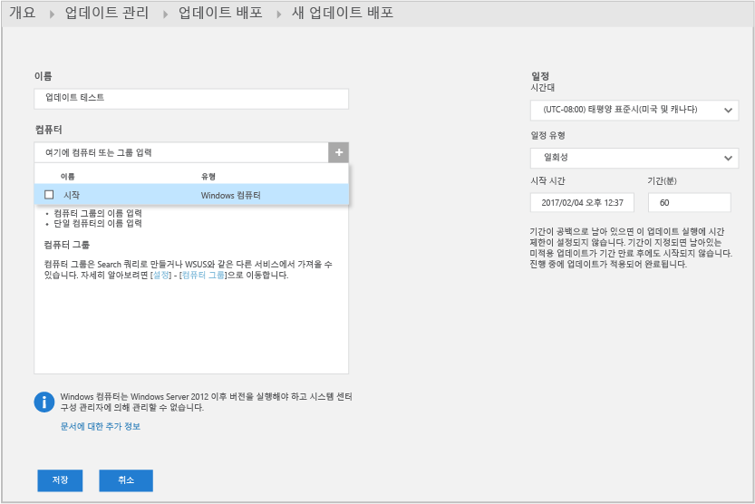  
    업데이트 배포를 저장한 후 예약된 업데이트가 표시됩니다.  
    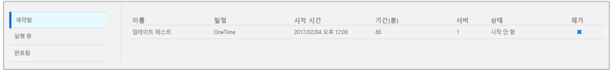  
    업데이트 실행이 완료된 후 상태가 **완료**로 표시됩니다.
    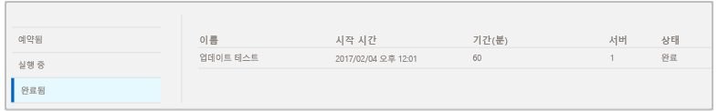
9. 업데이트 실행이 완료된 후 실행의 성공 여부를 볼 수 있고 어떤 업데이트가 어디에 적용되었는지에 대한 세부 정보를 볼 수 있습니다.

## 평가를 마친 후

이 자습서에서 가상 컴퓨터에 에이전트를 설치하고 신속하게 시작했습니다. 수행한 단계는 빠르고 간단했습니다. 하지만 대부분의 대규모 조직 및 엔터프라이즈는 온-프레미스 IT 인프라가 복잡합니다. 따라서 복잡한 환경에서 데이터를 수집하려면 자습서보다 계획과 노력이 더 필요합니다. 아래에 있는 다음 단계 섹션의 정보를 검토하고 유용한 문서의 링크를 참조하세요.

필요에 따라 이 자습서를 통해 만든 작업 영역을 제거할 수 있습니다.

## 다음 단계
* [Windows 에이전트](log-analytics-windows-agents.md)를 Log Analytics에 연결하는 방법을 알아봅니다.
* [Operations Manager 에이전트](log-analytics-om-agents.md)를 Log Analytics에 연결하는 방법을 알아봅니다.
* [솔루션 갤러리에서 Log Analytics 솔루션을 추가](log-analytics-add-solutions.md) 하여 기능을 추가하고 데이터를 수집합니다.
* [로그 검색](log-analytics-log-searches.md) 을 통해 솔루션에서 수집한 자세한 정보를 확인하는 방법을 알아봅니다.

<!--HONumber=Feb17_HO2-->

