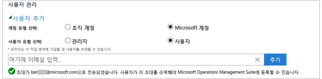
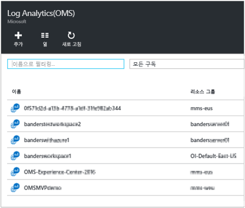
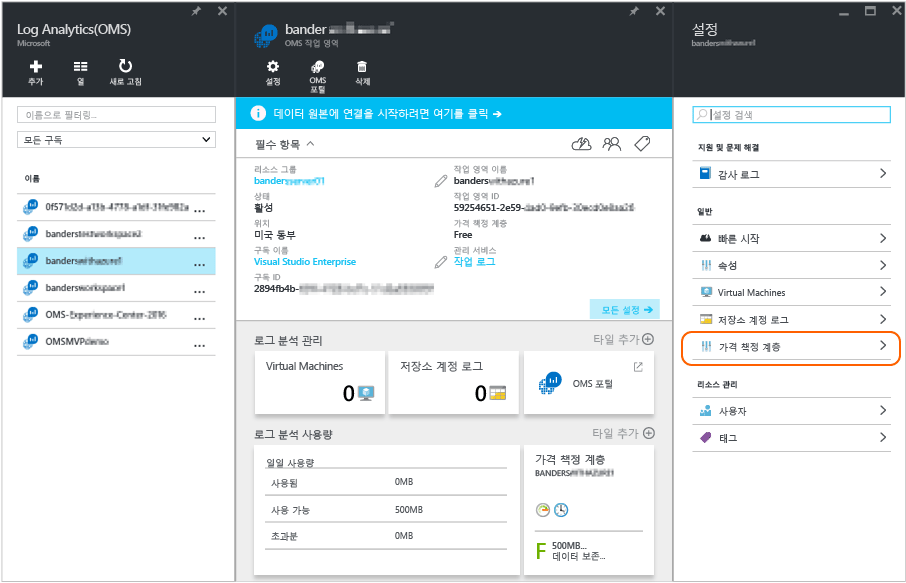

<properties
	pageTitle="Log Analytics에 대한 액세스 관리 | Microsoft Azure"
	description="사용자, 계정, OMS 작업 영역 및 Azure 계정에 대한 다양한 관리 작업을 사용하여 Log Analytics에 대한 액세스를 관리합니다."
	services="log-analytics"
	documentationCenter=""
	authors="bandersmsft"
	manager="jwhit"
	editor=""/>

<tags
	ms.service="log-analytics"
	ms.workload="na"
	ms.tgt_pltfrm="na"
	ms.devlang="na"
	ms.topic="article"
	ms.date="04/28/2016"
	ms.author="banders"/>

# Log Analytics에 대한 액세스 관리

Log Analytics에 대한 액세스를 관리하려면, 사용자, 계정, OMS 작업 영역 및 Azure 계정에 대한 다양한 관리 작업을 사용합니다. Operations Management Suite(OMS)에서 새로운 작업 영역을 만들려면 작업 영역 이름을 선택하고 계정에 연결한 다음 지리적 위치를 선택합니다. 작업 영역은 기본적으로 계정에 대한 간단한 구성 정보와 계정 정보를 포함하는 컨테이너입니다. 사용자나 조직의 다른 구성원이 여러 개의 OMS 작업 영역을 사용하여 IT 인프라 전체 또는 일부에서 수집되는 각 데이터 집합을 관리할 수 있습니다.

[Log Analytics 시작](log-analytics-get-started.md) 문서는 신속하게 시작 및 실행하는 방법을 보여주며, 나머지 부분에서는 OMS에 대한 액세스를 관리하는 데 필요한 작업을 자세히 설명합니다.

처음부터 모든 관리 작업을 수행할 필요는 없지만, 다음 섹션에서 사용할만한 자주 사용되는 작업을 모두 설명하겠습니다.

- 계정 및 사용자 관리
- 기존 작업 영역에 그룹 추가
- 필요한 작업 영역의 수 결정
- Azure 구독에 기존 작업 영역 연결
- 작업 영역을 유료 데이터 요금제로 업그레이드
- 데이터 요금제 유형 변경
- 기존 작업 영역에 Azure Active Directory 조직 추가
- OMS Log Analytics 리소스에 대한 액세스 제어
- OMS 작업 영역 닫기

## 계정 및 사용자 관리
계정 및 사용자는 설정 페이지의 **계정** 탭에서 관리할 수 있습니다. 여기서, 다음 섹션에 나오는 작업을 수행할 수 있습니다.

### 기존 작업 영역에 사용자 추가

OMS 작업 영역에 사용자 또는 그룹을 추가하려면 다음 단계를 따르세요. 사용자 또는 그룹은 이 작업 영역과 연결된 모든 경고를 보고 작업할 수 있습니다.

>[AZURE.NOTE] Azure Active Directory 조직 계정에서 사용자 또는 그룹을 추가하려는 경우 먼저 OMS 계정을 Active Directory 도메인에 연결했는지 확인해야 합니다. [기존 작업 영역에 Azure Active Directory 조직 추가](#add-an-azure-active-directory-organization-to-an-existing-workspace)를 참조하세요.

#### 기존 작업 영역에 사용자를 추가하려면
1. OMS에서 **설정** 타일을 클릭합니다.
2. **계정** 탭을 클릭합니다.
3. **사용자 관리** 섹션에서 추가할 계정 유형을 선택합니다. **조직 계정** 또는 **Microsoft 계정**.
    - Microsoft 계정을 선택했다면 Microsoft 계정에 연결된 사용자의 메일 주소를 입력합니다.
    - 조직 계정을 선택했다면 사용자 또는 그룹의 이름이나 메일 별칭의 일부를 입력할 수 있으며 사용자 및 그룹의 목록이 표시됩니다. 사용자 또는 그룹을 선택합니다.

    >[AZURE.NOTE] 최상의 성능 결과를 얻으려면 단일 OMS 계정과 연결된 Active Directory 그룹 수를 두 개(관리자용 그룹 및 사용자용 그룹)로 제한합니다. 더 많은 그룹을 사용하면 Log Analytics 성능에 영향을 줄 수 있습니다.

7. 추가할 사용자 또는 그룹의 유형을 선택합니다. **관리자** 또는 **사용자**.
8. **추가**를 클릭합니다.

  Microsoft 계정을 추가하는 경우 작업 영역에 가입하라는 초대가 제공한 메일로 전송됩니다. 사용자가 초대장의 지침에 따라 OMS에 가입하면 이 OMS 계정에 대한 경고와 계정 정보를 볼 수 있으며, **설정** 페이지의 **계정** 탭에서 사용자 정보를 볼 수 있습니다. 조직 계정을 추가하는 경우 사용자가 즉시 Log Analytics에 액세스할 수 있습니다.

### 기존 사용자 유형 편집

OMS 계정과 연결된 사용자의 계정 역할을 변경할 수 있습니다. 다음과 같은 역할 옵션이 있습니다.

 - *관리자*: 사용자를 관리하고, 모든 경고를 보고 작업하며, 서버를 추가 및 제거할 수 있습니다.

 - *사용자*: 모든 경고를 보고 작업하며 서버를 추가 및 제거할 수 있습니다.

#### 계정을 편집하려면
1. OMS의 **계정** 탭에 있는 **설정** 페이지에서 변경하려는 사용자에 대한 역할을 선택합니다.
2. **확인**을 클릭합니다.

## OMS 작업 영역에서 사용자 제거

OMS 작업 영역에서 사용자를 제거하려면 다음 단계를 따르세요. 이 경우 사용자 작업 영역은 닫히지 않습니다. 대신, 사용자와 작업 영역 간의 연결이 제거됩니다. 사용자가 여러 작업 영역과 연결된 경우에는 OMS에 계속 로그인할 수 있습니다.

### 작업 영역에서 사용자를 제거하려면

1. OMS의 **계정** 탭에 있는 **설정** 페이지에서 제거하려는 사용자 옆에 있는 제거를 클릭합니다.
2. **확인**을 클릭하여 사용자를 제거하도록 확인합니다.

## 기존 작업 영역에 그룹 추가

1.	위에 있는 “기존 작업 영역에 사용자를 추가하려면”의 1~4단계를 수행합니다.
2.	**Choose User/Group**(사용자/그룹 선택)에서, **그룹**을 선택합니다. 
3.	추가할 그룹의 표시 이름 또는 전자 메일 주소를 입력합니다.
4.	목록 결과에서 그룹을 선택한 다음 **추가**를 클릭합니다.

## 필요한 작업 영역의 수 결정

작업 영역은 Azure 관리 포털 내에서 Azure 리소스로 표시됩니다.

System Center Operations Manager에서 사용하기 위해 새 작업 영역을 만들 수도 있고, 이전에 열었지만 Azure 구독(대금 청구에 필요)에 아직 연결하지 않은 기존 작업 영역에 연결할 수도 있습니다.

작업 영역은 OMS 포털에서 데이터가 수집, 집계, 분석 및 표시되는 수준을 나타냅니다. 여러 작업 영역을 통해 다양한 환경 및 시스템의 데이터를 구분할 수 있습니다. 각 Operations Manager 관리 그룹(및 모든 에이전트) 또는 개별 VM/에이전트가 하나의 작업 영역에 연결될 수 있습니다.

각 작업 영역에는 여러 사용자 계정이 연결될 수 있으며, 각 사용자 계정(Microsoft 계정 또는 조직 계정)이 여러 개의 OMS 작업 영역에 액세스할 수 있습니다.

기본적으로 작업 영역을 만드는 데 사용된 Microsoft 계정 또는 조직 계정이 작업 영역의 관리자가 됩니다. 관리자는 추가 Microsoft 계정을 초대하거나 자신의 Azure Active Directory에서 사용자를 선택할 수 있습니다.

## Azure 구독에 기존 작업 영역 연결

[microsoft.com/oms](https://microsoft.com/oms) 웹 사이트에서 작업 영역을 만들 수 있습니다. 그러나 이러한 작업 영역에는 특정 제한이 있으며, 가장 주목할 만한 제한은 무료 계정을 사용하는 경우 데이터 업로드가 500MB/일로 제한되는 것입니다. 이 작업 영역을 변경하려면 **기존 작업 영역을 Azure 구독에 연결**해야 합니다.

>[AZURE.IMPORTANT] 작업 영역을 연결하려면 Azure 계정에 연결하려는 작업 영역에 대한 액세스 권한이 이미 있어야 합니다. 즉, Azure 포털 액세스에 사용하는 계정과 OMS 작업 영역 액세스에 사용하는 계정이 **동일**해야 합니다. 그렇지 않은 경우 [기존 작업 영역에 사용자 추가](#add-a-user-to-an-existing-workspace)를 참조하세요.

1.	[Azure 포털](http://portal.azure.com)에 로그인합니다.
2.	**Log Analytics(OMS)**를 찾아서 선택합니다.
3.	기존 작업 영역 목록이 표시됩니다. **추가**를 클릭합니다. 
4.	**OMS 작업 영역**에서 **Or link existing**(또는 기존 항목 링크)을 클릭합니다. 
5.	**필수 설정 구성**을 클릭합니다. 
6.	아직 Azure 계정에 연결되지 않은 작업 영역 목록이 표시됩니다. 작업 영역을 선택합니다. 
7.	필요한 경우, 다음 항목에 대한 값을 변경할 수 있습니다.
    - 구독
    - 리소스 그룹
    - 위치
    - 가격 책정 계층 
8.	**만들기**를 클릭합니다. 작업 영역이 이제 Azure 계정에 연결되었습니다.

>[AZURE.NOTE] 연결할 작업 영역이 표시되지 않으면, Azure 구독이 OMS 웹 사이트를 사용하여 만든 OMS 작업 영역에 대한 액세스가 없는 것입니다. OMS 웹 사이트를 사용하여 OMS 작업 영역 내에서 이 계정에 액세스를 부여해야 합니다. 이 내용은 [기존 작업 영역에 사용자 추가](#add-a-user-to-an-existing-workspace)를 참조하십시오.

## 작업 영역을 유료 데이터 요금제로 업그레이드

OMS에 대한 작업 영역 데이터 요금제 유형에는 **무료**, **표준** 및 **프리미엄**의 세 가지가 있습니다. *무료* 요금제를 사용하는 경우 500MB의 데이터 상한에 적중했을 수 있습니다. 이 제한을 초과하여 데이터를 수집하려면 작업 영역을 '**종량제 요금제**'로 업그레이드해야 합니다. 언제든지 요금제 유형을 변환할 수 있습니다. OMS 가격 책정에 대한 자세한 내용은 [가격 정보](https://www.microsoft.com/ko-KR/server-cloud/operations-management-suite/pricing.aspx)를 참조하세요.

>[AZURE.IMPORTANT] 작업 영역 요금제는 Azure 구독에 *연결된* 경우에만 변경할 수 있습니다. Azure에서 작업 영역을 만든 경우 또는 작업 영역을 *이미* 연결한 경우 이 메시지를 무시할 수 있습니다. [OMS 웹 사이트](http://www.microsoft.com/oms)에서 작업 영역을 만든 경우 [Azure 구독에 기존 작업 영역 연결](#link-an-existing-workspace-to-an-azure-subscription)의 단계를 따라야 합니다.

### System Center용 OMS Add On의 자격 사용

System Center용 OMS Add On은 [OMS 가격 책정](https://www.microsoft.com/ko-KR/server-cloud/operations-management-suite/pricing.aspx)에 설명되어 있는 OMS Log Analytics에 대한 프리미엄 요금제 자격을 제공합니다.

System Center용 OMS add-on을 구매하면 Microsoft 계정 팀 또는 대리점에서 OMS add-on을 Azure 구매를 포함하는 사용자의 엔터프라이즈 규약과 연결합니다. OMS add-on은 규약에 대한 자격을 생성하고, 모든 Azure 구독은 이 자격을 활용할 수 있습니다. 예를 들어, OMS add-on의 자격을 사용하는 OMS 작업 영역을 여러 개 둘 수 있습니다.

OMS 작업 영역 사용량이 OMS add-on의 자격에 적용되도록 하려면, 다음을 수행해야 합니다.

1. OMS 작업 영역을 OMS add-on 구매와 Azure 구독 사용량을 모두 포함하는 엔터프라이즈 규약의 일부인 Azure 구독에 연결합니다.
2. 작업 영역에 프리미엄 요금제 선택

Azure 또는 OMS 포털에서 사용량을 검토하면, OMS add-on 자격을 볼 수 없습니다. 하지만, Enterprise Portal에서는 자격을 볼 수 있습니다.

OMS 작업 영역이 연결되어 있는 Azure 구독을 변경하려면, Azure PowerShell [Move-AzureRMResource](https://msdn.microsoft.com/library/mt652516.aspx) cmdlet을 사용합니다.

### 엔터프라이즈 규약을 통해 Azure 약정 사용

OMS 구성 요소에 대해 독립 실행형 가격을 사용하기로 선택하면, OMS의 각 구성 요소에 대해 개별적으로 비용을 지불하게 되고 사용량이 Azure 청구서에 표시됩니다.

엔터프라이즈 규약의 일부로 일정량의 Azure 사용량을 선불로 지불한 경우에는, OMS 사용량은 선불 사용량을 사용하게 됩니다. OMS Log Analytics용 Azure 약정 가격을 사용하려면, OMS 작업 영역이 연결된 구독이 Azure 엔터프라이즈 규약의 일부가 되어야 합니다.

OMS 작업 영역이 연결된 Azure 구독을 변경해야 하는 경우에는, Azure PowerShell [Move-AzureRMResource](https://msdn.microsoft.com/library/mt652516.aspx) cmdlet을 사용할 수 있습니다.

### 작업 영역을 유료 데이터 요금제로 변경하려면

1.	[Azure 포털](http://portal.azure.com)에 로그인합니다.
2.	**Log Analytics(OMS)**를 찾아서 선택합니다.
3.	기존 작업 영역 목록이 표시됩니다. 작업 영역을 선택합니다. 
4.	**설정에서**에서 **가격 책정 계층**을 클릭합니다. 
5.	**가격 책정 계층**에서 데이터 요금제를 선택한 다음 **선택**을 클릭합니다. 
6.	Azure 포털에서 보기를 새로 고치면, 선택한 가격제에 따라 **가격 책정 계층**이 업데이트된 것을 볼 수 있습니다. 

이제 "무료" 데이터 상한을 초과하는 데이터를 수집할 수 있습니다.

## 기존 작업 영역에 Azure Active Directory 조직 추가

Operational Insights(OMS) 작업 영역을 Azure Active Directory 도메인과 연결할 수 있습니다. 그러면 별도의 Microsoft 계정을 요구하지 않고 OMS 작업 영역에 직접 Active Directory의 사용자를 추가할 수 있습니다.

### 기존 작업 영역에 Azure Active Directory 조직을 추가하려면

1. OMS의 설정 페이지에서 **계정**을 클릭한 다음 **작업 영역 정보**를 클릭합니다.  
2. 조직 계정에 대한 정보를 검토한 다음 **조직 추가**를 클릭합니다. 
3. Azure Active Directory 도메인의 관리자에 대한 ID 정보를 입력합니다. 나중에, 작업 영역이 Azure Active Directory 도메인에 연결되어 있다는 내용의 승인이 표시됩니다. 

## OMS Log Analytics 리소스에 대한 액세스 제어

사람들에게 OMS 작업 영역에 대한 액세스를 부여하는 것은 2곳에서 제어됩니다.

- OMS 포털에 대한 액세스는 OMS 포털 내에서 관리되며, 리소스가 속하는 Azure 구독에 대한 액세스가 있는 지와는 별개입니다.
- PowerShell 및 직접 REST API의 경우, Azure RBAC를 사용하여 Azure 내에서 관리됩니다.

OMS 포털에 대한 액세스를 부여하고 그와 연결된 Azure 구독에 대한 액세스는 부여하지 않으면, 사용자가 OMS 포털에 로그인하면 자동화, 백업, 사이트 복구 솔루션 타일에 사용자에 대한 데이터가 표시되지 않습니다.

모든 사용자에게 이 솔루션의 데이터를 보도록 허용하려면, OMS 작업 영역에 연결된 자동화 계정, 백업 자격 증명 모음 및 사이트 복구 자격 증명 모음에 대해 적어도 **읽기** 권한을 갖도록 해야 합니다.

## OMS 작업 영역 닫기

OMS 작업 영역을 닫으면 작업 영역을 닫은 날부터 30일 내에 작업 영역과 관련된 모든 데이터가 OMS 서비스에서 삭제됩니다.

관리자이고 여러 사용자가 작업 영역과 연결되어 있는 경우 해당 사용자와 작업 영역 간의 연결이 끊어집니다. 사용자가 다른 작업 영역과 연결되어 있으면 다른 작업 영역에서 OMS를 계속 사용할 수 있습니다. 그러나 다른 작업 영역과 연결되어 있지 않으면 OMS를 사용하기 위해 새 작업 영역을 만들어야 합니다.

### OMS 작업 영역을 닫으려면

1. OMS의 **계정** 탭에 있는 **설정** 페이지에서 **작업 영역 닫기**를 클릭합니다.

2. 작업 영역을 닫는 이유 중 하나를 선택하거나 텍스트 상자에 다른 이유를 입력합니다.

3. **작업 영역 닫기**를 클릭합니다.

## 다음 단계

- 에이전트를 추가하고 데이터를 수집하려면 [Log Analytics에 Windows 컴퓨터 연결](log-analytics-windows-agents.md)을 참조하세요.
- [솔루션 갤러리에서 Log Analytics 솔루션을 추가](log-analytics-add-solutions.md)하여 기능을 추가하고 데이터를 수집합니다.
- 조직에서 프록시 서버 또는 방화벽을 사용하는 경우 에이전트가 Log Analytics 서비스와 통신할 수 있도록 [Log Analytics에서 프록시 및 방화벽 설정을 구성](log-analytics-proxy-firewall.md)합니다.

<!---HONumber=AcomDC_0504_2016-->