# 작업 영역 관리

Log Analytics에 대한 액세스를 관리하려면 작업 영역에 관련된 다양한 관리 태스크를 수행합니다. 이 문서에서는 작업 영역을 관리하는 모범 사례 조언 및 절차를 제공합니다. 작업 영역은 기본적으로 계정에 대한 간단한 구성 정보와 계정 정보를 포함하는 컨테이너입니다. 사용자나 조직의 다른 구성원이 여러 개의 작업 영역을 사용하여 IT 인프라 전체 또는 일부에서 수집되는 각 데이터 집합을 관리할 수 있습니다.

작업 영역을 만들려면 다음 항목을 수행해야 합니다.

1. Azure 구독이 있어야 합니다.
2. 작업 영역 이름을 선택합니다.
3. 구독과 작업 영역을 연결합니다.
4. 지리적 위치를 선택합니다.

## 필요한 작업 영역의 수 결정
작업 영역은 Azure 리소스이며 Azure Portal에서 데이터가 수집, 집계, 분석 및 표시되는 컨테이너입니다.

Azure 구독당 여러 작업 영역을 포함할 수 있으며 이들 간의 손쉬운 쿼리 기능을 사용하여 두 개 이상의 작업 영역에 액세스할 수 있습니다. 이 섹션에서는 둘 이상의 작업 영역을 만들 때 유용할 수 있는 시기를 설명합니다.

현재 작업 영역은 다음을 제공합니다.

* 데이터 저장소의 지리적 위치
* 대금 청구에 대한 세분성
* 데이터 격리
* 구성 범위

위의 특성을 기반으로 다음과 같은 경우 여러 작업 영역을 만드는 것이 좋습니다.

* 글로벌 회사이며 데이터 주권 또는 규정 준수 때문에 특정 지역에 저장된 데이터가 필요합니다.
* Azure를 사용하고 있으며 작업 영역을 자신이 관리하는 Azure 리소스와 같은 지역에 두어서 아웃바운드 데이터 전송 요금을 피하려고 합니다.
* 용도를 바탕으로 서로 다른 부서 또는 비즈니스 그룹에 요금을 할당하려고 합니다. 각 부서 또는 비즈니스 그룹에 대한 작업 영역을 만들면 Azure 청구 및 사용량 명세서에 각 작업 영역의 요금이 따로 표시됩니다.
* 관리되는 서비스 공급자이며 자신이 관리하는 각 고객에 대한 Log Analytics 데이터를 다른 고객의 데이터와 격리되게 유지해야 합니다.
* 여러 고객을 관리하며 각 고객/부서/비즈니스 그룹의 고유 데이터를 보지만 다른 고객/부서/비즈니스 그룹에 대한 데이터를 보지 않기를 원합니다.

Windows 에이전트를 사용하여 데이터를 수집하는 경우 [각 에이전트를 구성하여 하나 이상의 작업 영역에 보고](log-analytics-windows-agents.md)할 수 있습니다.

System Center Operations Manager를 사용하는 경우 각 Operations Manager 관리 그룹을 한 작업 영역에만 연결할 수 있습니다. Operations Manager에서 관리하는 컴퓨터에 Microsoft 모니터링 에이전트를 설치하고 에이전트가 Operations Manager와 서로 다른 Log Analytics 작업 영역에 모두 보고하게 할 수 있습니다.

### 작업 영역 정보

Azure Portal에서 작업 영역에 대한 세부 정보를 볼 수 있습니다. OMS 포털에서 세부 정보를 볼 수도 있습니다.

#### Azure Portal에서 작업 영역 정보 보기

1. [Azure Portal](https://portal.azure.com)에 아직 로그인하지 않은 경우 Azure 구독을 사용하여 로그인합니다.
2. **허브** 메뉴에서 **추가 서비스**를 클릭하고 리소스 목록에서 **Log Analytics**를 입력합니다. 입력을 시작하면 입력한 내용을 바탕으로 목록이 필터링됩니다. **Log Analytics**를 클릭합니다.  
    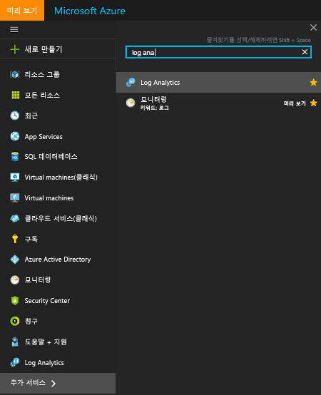  
3. Log Analytics 구독 블레이드에서 작업 영역을 선택합니다.
4. 작업 영역 블레이드는 추가 정보에 대한 작업 영역 및 링크에 대한 세부 정보를 표시합니다.  
    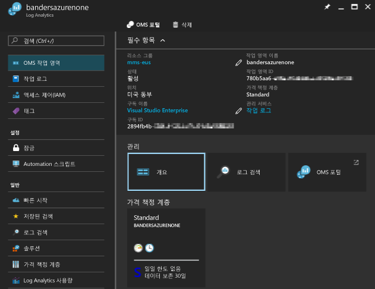  

## 계정 및 사용자 관리
각 작업 영역에는 여러 계정이 연결될 수 있으며, 각 계정(Microsoft 계정 또는 조직 계정)이 여러 개의 작업 영역에 액세스할 수 있습니다.

기본적으로 작업 영역을 만든 Microsoft 계정 또는 조직 계정이 작업 영역의 관리자가 됩니다.

Log Analytics 작업 영역에 대한 액세스를 제어하는 두 가지 사용 권한 모델이 있습니다.

1. 레거시 Log Analytics 사용자 역할
2. [Azure 역할 기반 액세스](../active-directory/role-based-access-control-configure.md)

다음 표에서는 각 사용 권한 모델을 사용하여 설정할 수 있는 액세스를 요약합니다.

|                          | Log Analytics 포털 | Azure portal | API(PowerShell 포함) |
|--------------------------|----------------------|--------------|----------------------------|
| Log Analytics 사용자 역할 | 예                  | 아니오           | 아니오                         |
| Azure 역할 기반 액세스  | 예                  | 예          | 예                        |

> [!NOTE]
> Log Analytics는 사용 권한 모델로 Azure 역할 기반 액세스를 사용하도록 전환 중이며 이는 Log Analytics 사용자 역할을 대체합니다.
>
>

레거시 Log Analytics 사용자 역할은 [Log Analytics 포털](https://mms.microsoft.com)에서 수행한 활동에 대한 액세스만 제어합니다.

다음 활동에도 Azure 권한이 필요합니다.

| 조치                                                          | 필요한 Azure 권한 | 메모 |
|-----------------------------------------------------------------|--------------------------|-------|
| 관리 솔루션 추가 및 제거                        | `Microsoft.Resources/deployments/*`   `Microsoft.OperationalInsights/*`   `Microsoft.OperationsManagement/*`   `Microsoft.Automation/*`   `Microsoft.Resources/deployments/*/write` | |
| 가격 책정 계층 변경                                       | `Microsoft.OperationalInsights/workspaces/*/write` | |
| *Backup* 및 *Site Recovery* 솔루션 타일에서 데이터 보기 | 관리자 / 공동 관리자 | 클래식 배포 모델을 사용하여 배포된 리소스 액세스 |
| Azure Portal에서 작업 영역 만들기                        | `Microsoft.Resources/deployments/*`   `Microsoft.OperationalInsights/workspaces/*` ||

### Azure 권한을 사용하여 Log Analytics에 대한 액세스 관리
Azure 권한을 사용하여 Log Analytics 작업 영역에 대한 액세스 권한을 부여하려면 [역할 할당을 사용하여 Azure 구독 리소스에 대한 액세스 관리](../active-directory/role-based-access-control-configure.md)의 단계를 따릅니다.

Azure의 Log Analytics에는 기본 제공되는 2개의 사용자 역할이 있습니다.
- Log Analytics 독자
- Log Analytics 참가자

*Log Analytics 독자* 역할의 멤버는 다음을 수행할 수 있습니다.
- 모든 모니터링 데이터 검색 및 보기 
- 모든 Azure 리소스에 대한 Azure 진단 구성 보기를 포함해 모니터링 설정 보기

| type    | 사용 권한 | 설명 |
| ------- | ---------- | ----------- |
| 조치 | `*/read`   | 다음을 포함해 모든 리소스 및 리소스 구성을 볼 수 있습니다.   가상 머신 확장 상태   리소스에 대한 Azure 진단 구성   모든 리소스의 모든 속성 및 설정 |
| 조치 | `Microsoft.OperationalInsights/workspaces/analytics/query/action` | 로그 검색 v2 쿼리를 수행할 수 있습니다. |
| 조치 | `Microsoft.OperationalInsights/workspaces/search/action` | 로그 검색 v1 쿼리를 수행할 수 있습니다. |
| 조치 | `Microsoft.Support/*` | 지원 사례를 열 수 있습니다. |
|동작 없음 | `Microsoft.OperationalInsights/workspaces/sharedKeys/read` | 데이터 컬렉션 API를 사용하고 에이전트를 설치하는 데 필요한 작업 영역 키를 읽지 못하게 합니다. |

*Log Analytics 참가자* 역할의 멤버는 다음을 수행할 수 있습니다.
- 모든 모니터링 데이터 읽기 
- Automation 계정 만들기 및 구성
- 관리 솔루션 추가 및 제거
- 저장소 계정 키 읽기 
- Azure Storage에서 로그 수집 구성
- 다음을 포함한 Azure 리소스의 모니터링 설정 편집
  - VM에 VM 확장 추가
  - 모든 Azure 리소스에 대한 Azure 진단 구성

> [!NOTE] 
> 가상 머신을 완전히 제어하기 위해 가상 머신으로 가상 머신 확장을 추가할 수 있는 기능을 사용할 수 있습니다.

| 사용 권한 | 설명 |
| ---------- | ----------- |
| `*/read`     | 다음을 포함해 모든 리소스 및 리소스 구성을 볼 수 있습니다.   가상 머신 확장 상태   리소스에 대한 Azure 진단 구성   모든 리소스의 모든 속성 및 설정 |
| `Microsoft.Automation/automationAccounts/*` | Runbook 추가 및 편집을 포함해 Azure Automation 계정을 만들고 구성할 수 있습니다. |
| `Microsoft.ClassicCompute/virtualMachines/extensions/*`   `Microsoft.Compute/virtualMachines/extensions/*` | Microsoft Monitoring Agent 확장 및 Linux 확장용 OMS Agent를 포함해 가상 머신 확장 추가, 업데이트 및 제거 |
| `Microsoft.ClassicStorage/storageAccounts/listKeys/action`   `Microsoft.Storage/storageAccounts/listKeys/action` | 저장소 계정 키를 봅니다. Azure Storage 계정에서 로그를 읽을 Log Analytics 구성 필요 |
| `Microsoft.Insights/alertRules/*` | 규칙 추가, 업데이트 및 제거 |
| `Microsoft.Insights/diagnosticSettings/*` | Azure 리소스에 대한 진단 설정 추가, 업데이트 및 제거 |
| `Microsoft.OperationalInsights/*` | Log Analytics 작업 영역에 대한 구성 추가, 업데이트 및 제거 |
| `Microsoft.OperationsManagement/*` | 관리 솔루션 추가 및 제거 |
| `Microsoft.Resources/deployments/*` | 디렉터리를 만들고 삭제합니다. 솔루션, 작업 공간 및 자동화 계정 추가 및 제거에 필요 |
| `Microsoft.Resources/subscriptions/resourcegroups/deployments/*` | 디렉터리를 만들고 삭제합니다. 솔루션, 작업 공간 및 자동화 계정 추가 및 제거에 필요 |

사용자 역할에 사용자를 추가 및 제거하려면 `Microsoft.Authorization/*/Delete` 및 `Microsoft.Authorization/*/Write` 권한이 있어야 합니다.

이러한 역할을 사용하여 사용자에게 다양한 범주에서 액세스를 제공합니다.
- 구독 - 구독에서 모든 작업 영역에 대한 액세스
- 리소스 그룹 - 리소스 그룹에서 모든 작업 영역에 대한 액세스
- 리소스 - 지정된 작업 영역에만 액세스

[사용자 지정 역할](../active-directory/role-based-access-control-custom-roles.md)을 사용하여 필요한 특정 권한이 있는 역할을 만듭니다.

### Azure 사용자 역할 및 Log Analytics 포털 사용자 역할
사용자가 Log Analytics 작업 영역에서 Azure 읽기 권한 이상을 보유하는 경우 Log Analytics 작업 영역을 볼 때 **OMS 포털** 태스크를 클릭하여 Log Analytics 포털을 열 수 있습니다.

Log Analytics 포털을 열 때 레거시 Log Analytics 사용자 역할을 사용하도록 전환합니다. Log Analytics 포털에서 역할 할당이 없는 경우 서비스에서 [작업 영역에 대해 보유한 Azure 권한을 확인](https://docs.microsoft.com/rest/api/authorization/permissions#Permissions_ListForResource)합니다.
Log Analytics 포털의 역할 할당은 다음과 같이 사용하여 결정합니다.

| 조건                                                   | 할당된 Log Analytics 사용자 역할 | 메모 |
|--------------------------------------------------------------|----------------------------------|-------|
| 사용자 계정이 레거시 Log Analytics 사용자 역할에 속함     | 지정된 Log Analytics 사용자 역할 | |
| 사용자 계정이 레거시 Log Analytics 사용자 역할에 속하지 않음   작업 영역에 대한 전체 Azure 권한(`*` 권한 1) | 관리자 ||
| 사용자 계정이 레거시 Log Analytics 사용자 역할에 속하지 않음   작업 영역에 대한 전체 Azure 권한(`*` 권한 1)   `Microsoft.Authorization/*/Delete` 및 `Microsoft.Authorization/*/Write`의 *not actions* | 기여자 ||
| 사용자 계정이 레거시 Log Analytics 사용자 역할에 속하지 않음   Azure 읽기 권한 | 읽기 전용 ||
| 사용자 계정이 레거시 Log Analytics 사용자 역할에 속하지 않음   Azure 권한이 인식되지 않음 | 읽기 전용 ||
| CSP(클라우드 솔루션 공급자) 관리 구독용   로그인한 계정이 작업 영역에 연결된 Azure Active Directory 내에 있음 | 관리자 | 일반적으로 CSP의 고객 |
| CSP(클라우드 솔루션 공급자) 관리 구독용   로그인한 계정이 작업 영역에 연결된 Azure Active Directory 내에 있지 않음 | 기여자 | 일반적으로 CSP |

1 역할 정의에 대한 자세한 내용은 [Azure 권한](../active-directory/role-based-access-control-custom-roles.md)을 참조하세요. 역할을 평가할 경우 `*`의 작업이 `Microsoft.OperationalInsights/workspaces/*`와 동일하지 않습니다.

Azure Portal에 대해 주의해야 할 사항:

* http://mms.microsoft.com을 사용하여 OMS 포털에 로그인하면 **작업 영역 선택** 목록이 표시됩니다. 이 목록은 Log Analytics 사용자 역할을 보유하는 작업 영역만 포함합니다. Azure 구독으로 액세스 권한이 있는 작업 영역을 보려면 테넌트를 URL의 일부로 지정해야 합니다. 예제: `mms.microsoft.com/?tenant=contoso.com` 테넌트 식별자는 로그인하는 데 사용하는 전자 메일 주소의 마지막 부분인 경우가 있습니다.
* Azure 사용 권한을 통해 액세스 권한을 가진 포털로 직접 이동하려면 URL의 일부로 리소스를 지정해야 합니다. PowerShell을 사용하여 이 URL을 가져올 수 있습니다.

  예: `(Get-AzureRmOperationalInsightsWorkspace).PortalUrl`

  URL은 다음과 같습니다. `https://eus.mms.microsoft.com/?tenant=contoso.com&resource=%2fsubscriptions%2faaa5159e-dcf6-890a-a702-2d2fee51c102%2fresourcegroups%2fdb-resgroup%2fproviders%2fmicrosoft.operationalinsights%2fworkspaces%2fmydemo12`

### OMS 포털에서 사용자 관리
사용자를 관리하고 설정 페이지의 **계정** 탭에 있는 **사용자 관리** 탭에서 그룹화합니다.   

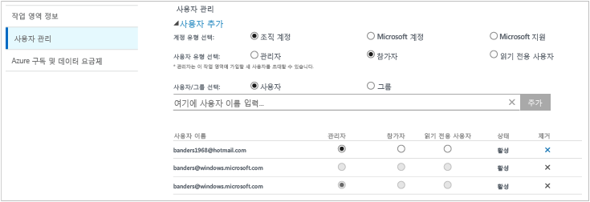

#### 기존 작업 영역에 사용자 추가
작업 영역에 사용자 또는 그룹을 추가하려면 다음 단계를 따르세요.

1. OMS 포털에서 **설정** 타일을 클릭합니다.
2. **계정** 탭을 클릭한 다음 **사용자 관리** 탭을 클릭합니다.
3. **사용자 관리** 섹션에서 추가할 계정 유형: **조직 계정**, **Microsoft 계정**, **Microsoft 지원**을 선택합니다.

   * Microsoft 계정을 선택했다면 Microsoft 계정에 연결된 사용자의 메일 주소를 입력합니다.
   * 조직 계정을 선택했다면 사용자 또는 그룹의 이름이나 메일 별칭의 일부를 입력하며 일치하는 사용자 및 그룹의 목록이 드롭다운 상자에 표시됩니다. 사용자 또는 그룹을 선택합니다.
   * Microsoft 지원을 사용하여 문제 해결을 돕기 위해 Microsoft 지원 엔지니어 또는 다른 Microsoft 직원에게 작업 영역에 대한 임시 액세스 권한을 부여할 수 있습니다.

     > [!NOTE]
     > 최상의 성능을 얻으려면 단일 OMS 계정과 연결된 Active Directory 그룹 수를 세 개(관리자용 그룹 한 개, 참여자용 한 개 및 읽기 전용 사용자용 한 개)로 제한합니다. 더 많은 그룹을 사용하면 Log Analytics 성능에 영향을 줄 수 있습니다.
     >
     >
4. 추가할 사용자 또는 그룹의 유형: **관리자**, **참여자** 또는 **읽기 전용 사용자**를 선택합니다.  
5. **추가**를 클릭합니다.

   Microsoft 계정을 추가하는 경우 작업 영역에 가입하라는 초대가 제공한 메일로 전송됩니다. 사용자는 OMS에 가입하라는 초대의 지침을 따른 후 작업 영역에 액세스할 수 있습니다.
   조직 계정을 추가하는 경우 사용자가 즉시 Log Analytics에 액세스할 수 있습니다.  

#### 기존 사용자 유형 편집
OMS 계정과 연결된 사용자의 계정 역할을 변경할 수 있습니다. 다음과 같은 역할 옵션이 있습니다.

* *관리자*: 사용자를 관리하고, 모든 경고를 보고 작업하며, 서버를 추가 및 제거할 수 있습니다.
* *참여자*: 모든 경고를 보고 작업하며 서버를 추가 및 제거할 수 있습니다.
* *읽기 전용사용자*: 읽기 전용으로 표시된 사용자는 다음을 할 수 없습니다.

  1. 솔루션을 추가/제거합니다. 솔루션 갤러리를 숨깁니다.
  2. **내 대시보드**에서 타일을 추가/수정/제거합니다.
  3. **설정** 페이지를 봅니다. 페이지를 숨깁니다.
  4. Search 뷰에서 PowerBI 구성, 저장된 검색 및 경고 태스크를 숨깁니다.

#### 계정을 편집하려면
1. OMS 포털에서 **설정** 타일을 클릭합니다.
2. **계정** 탭을 클릭한 다음 **사용자 관리** 탭을 클릭합니다.
3. 변경하려는 사용자에 대한 역할을 선택합니다.
4. 확인 대화 상자에서 **예**를 클릭합니다.

### 작업 영역에서 사용자 제거
작업 영역에서 사용자를 제거하려면 다음 단계를 따르세요. 사용자 제거는 작업 영역을 닫지 않습니다. 대신, 사용자와 작업 영역 간의 연결이 제거됩니다. 사용자가 여러 작업 영역과 연결된 경우에는 OMS에 계속 로그인하여 다른 작업 영역을 볼 수 있습니다.

1. OMS 포털에서 **설정** 타일을 클릭합니다.
2. **계정** 탭을 클릭한 다음 **사용자 관리** 탭을 클릭합니다.
3. 제거하려는 사용자 이름 옆에 있는 **제거**를 클릭합니다.
4. 확인 대화 상자에서 **예**를 클릭합니다.

### 기존 작업 영역에 그룹 추가
1. 이전의 "기존 작업 영역에 사용자를 추가하려면" 섹션에서 1~4단계를 수행합니다.
2. **사용자/그룹 선택**에서 **그룹**을 선택합니다.  
   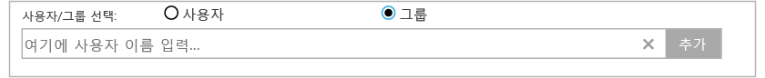
3. 추가할 그룹의 표시 이름 또는 전자 메일 주소를 입력합니다.
4. 목록 결과에서 그룹을 선택한 다음 **추가**를 클릭합니다.

## Azure 구독에 기존 작업 영역 연결
2016년 9월 26일 이후에 만들어진 모든 작업 영역은 만들 때 Azure 구독에 연결되어야 합니다. 이 날짜 이전에 만들어진 작업 영역은 로그인할 때 작업 영역에 연결되어야 합니다. Azure Portal에서 작업 영역을 만들거나 작업 영역을 Azure 구독에 연결하면 Azure Active Directory가 조직 계정으로 연결됩니다.

### 작업 영역을 OMS 포털의 Azure 구독에 연결하려면

- OMS 포털에 로그인할 때 Azure 구독을 선택하라는 메시지가 표시됩니다. 작업 영역에 연결할 구독을 선택한 다음 **링크**를 클릭합니다.  
    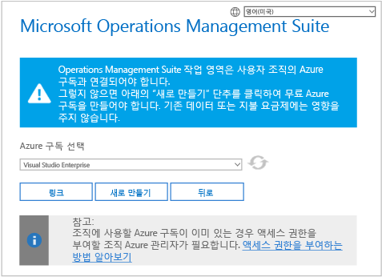

    > [!IMPORTANT]
    > 작업 영역을 연결하려면 Azure 계정에 연결하려는 작업 영역에 대한 액세스 권한이 이미 있어야 합니다.  즉, Azure Portal에 액세스하는 데 사용하는 계정은 작업 영역에 액세스하는 데 사용하는 계정과 **동일**해야 합니다. 그렇지 않은 경우 [기존 작업 영역에 사용자 추가](#add-a-user-to-an-existing-workspace)를 참조하십시오.

### 작업 영역을 Azure Portal의 Azure 구독에 연결하려면
1. [Azure 포털](http://portal.azure.com)에 로그인합니다.
2. **Log Analytics**를 찾아서 선택합니다.
3. 기존 작업 영역 목록이 표시됩니다. **추가**를 클릭합니다.  
   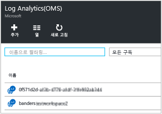
4. **OMS 작업 영역**에서 **또는 기존 항목 연결**을 클릭합니다.  
   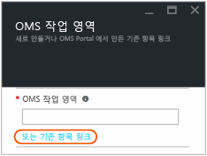
5. **필수 설정 구성**을 클릭합니다.  
   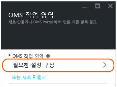
6. 아직 Azure 계정에 연결되지 않은 작업 영역 목록이 표시됩니다. 작업 영역을 선택합니다.  
   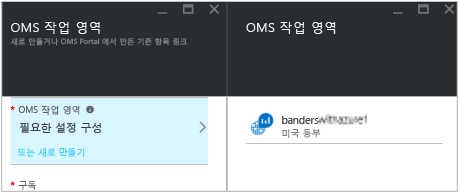
7. 필요한 경우, 다음 항목에 대한 값을 변경할 수 있습니다.
   * 구독
   * 리소스 그룹
   * 위치
   * 가격 책정 계층   
     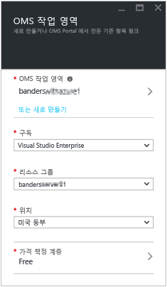
8. **확인**을 클릭합니다. 작업 영역이 이제 Azure 계정에 연결되었습니다.

> [!NOTE]
> 연결할 작업 영역이 표시되지 않으면, Azure 구독이 OMS 포털을 사용하여 만든 작업 영역에 대한 액세스가 없는 것입니다.  OMS 포털에서 이 계정에 대한 액세스 권한을 부여 받으려면 [기존 작업 영역에 사용자 추가](#add-a-user-to-an-existing-workspace)를 참조하세요.
>
>

## 작업 영역을 유료 플랜으로 업그레이드
OMS에 대한 작업 영역 플랜 유형에는 **무료**, **독립 실행형** 및 **OMS**의 세 가지가 있습니다.  *무료* 플랜인 경우 Log Analytics로 전송되는 500MB의 일별 데이터 제한이 있습니다.  이 용량을 초과하는 경우 이 제한을 초과하여 데이터를 수집하지 않으려면 유료 플랜으로 작업 영역을 변경해야 합니다. 언제든지 플랜 유형을 변경할 수 있습니다.  OMS 가격 책정에 대한 자세한 내용은 [가격 정보](https://www.microsoft.com/en-us/cloud-platform/operations-management-suite-pricing)를 참조하세요.

### OMS 구독에서 자격 사용
System Center용 OMS E1, OMS E2 OMS 또는 OMS 추가 기능 구매에서 발생하는 자격을 사용하려면 OMS Log Analytics의 *OMS* 플랜을 선택합니다.

OMS 구독을 구매하면 자격이 기업 규약에 추가됩니다. 이 규약에 따라 생성된 Azure 구독은 권리를 사용할 수 있습니다. 이러한 구독의 모든 작업 영역은 OMS 자격을 사용합니다.

작업 영역의 사용량이 OMS 구독의 자격에 적용되도록 하려면, 다음을 수행해야 합니다.

1. OMS 구독을 포함하는 엔터프라이즈 규약의 일부인 Azure 구독에 작업 영역 만들기
2. 작업 영역에 *OMS* 플랜 선택

> [!NOTE]
> 작업 영역이 2016년 9월 26일 이전에 생성되고 Log Analytics 가격 책정 플랜이 *프리미엄*인 경우 이 작업 영역은 System Center용 OMS 추가 기능에서 자격을 사용합니다. *OMS* 가격 책정 계층으로 변경하여 자격을 사용할 수도 있습니다.
>
>

OMS 구독 자격은 Azure 또는 OMS 포털에서 표시되지 않습니다. 엔터프라이즈 포털에서 자격 및 사용량을 볼 수 있습니다.  

작업 영역이 연결되어 있는 Azure 구독을 변경하려면, Azure PowerShell [Move-AzureRmResource](https://msdn.microsoft.com/library/mt652516.aspx) cmdlet을 사용합니다.

### 엔터프라이즈 규약을 통해 Azure 약정 사용
OMS 구독이 없는 경우 별도로 OMS의 각 구성 요소에 대해 지불하고 사용량이 Azure 청구서에 나타납니다.

Azure 구독이 연결된 기업 등록에 대한 Azure 요금 약정이 있는 경우 Log Analytics를 사용하면 남은 요금 약정을 자동으로 다시 차변에 기입합니다.

작업 영역이 연결되어 있는 Azure 구독을 변경하려면, Azure PowerShell [Move-AzureRmResource](https://msdn.microsoft.com/library/mt652516.aspx) cmdlet을 사용합니다.  

### Azure Portal에서 작업 영역을 유료 가격 책정 계층으로 변경
1. [Azure 포털](http://portal.azure.com)에 로그인합니다.
2. **Log Analytics**를 찾아서 선택합니다.
3. 기존 작업 영역 목록이 표시됩니다. 작업 영역을 선택합니다.  
4. 작업 영역 블레이드의 **일반**에서 **가격 책정 계층**을 클릭합니다.  
5. **가격 책정 계층**에서 가격 책정 계층 선택을 클릭한 다음 **선택**을 클릭합니다.  
    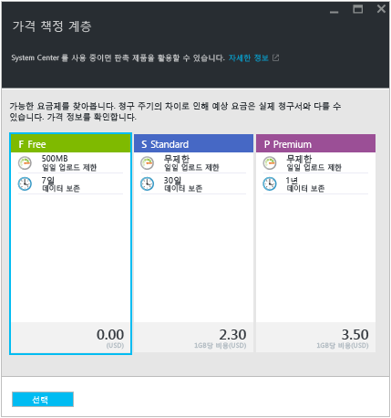
6. Azure Portal에서 보기를 새로 고치면, 선택한 계층에 따라 **가격 책정 계층**이 업데이트된 것을 볼 수 있습니다.  
    

> [!NOTE]
> 작업 영역이 Automation 계정에 연결된 경우 *독립 실행형(GB당)* 가격 책정 계층을 선택하려면 모든 **Automation 및 제어** 솔루션을 삭제하고 Automation 계정에 대한 연결을 해제해야 합니다. 작업 영역 블레이드의 **일반**에서 **솔루션**을 클릭하여 솔루션을 보고 삭제합니다. Automation 계정에 대한 연결을 해제하려면 **가격 책정 계층** 블레이드에서 Automation 계정의 이름을 클릭합니다.
>
>

### OMS 포털에서 작업 영역을 유료 가격 책정 계층으로 변경

OMS 포털을 사용하여 가격 책정 계층을 변경하려면 Azure 구독이 있어야 합니다.

1. OMS 포털에서 **설정** 타일을 클릭합니다.
2. **계정** 탭을 클릭한 다음 **Azure 구독 및 데이터 계획** 탭을 클릭합니다.
3. 사용하려는 가격 책정 계층을 클릭합니다.
4. **저장**을 클릭합니다.  
   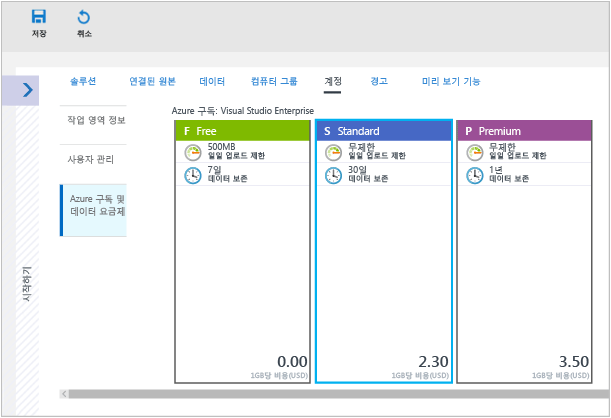

새 데이터 계획은 웹 페이지의 위쪽에 있는 OMS 포털 리본 메뉴에 표시됩니다.

## Log Analytics의 데이터 저장 기간 변경

무료 가격 책정 계층에서 Log Analytics는 데이터를 7일 동안 사용할 수 있도록 합니다.
표준 가격 책정 계층에서 Log Analytics는 데이터를 30일 동안 사용할 수 있도록 합니다.
프리미엄 가격 책정 계층에서 Log Analytics는 데이터를 365일 동안 사용할 수 있도록 합니다.
독립 실행형 및 OMS 가격 책정 계층에서 Log Analytics는 데이터를 31일 동안 사용할 수 있도록 합니다.

독립 실행형 및 OMS 가격 책정 계층을 사용하는 경우 데이터를 최대 2년(730일) 동안 유지할 수 있습니다. 기본값인 31일보다 오래 저장된 데이터는 데이터 보존 요금이 발생합니다. 가격 책정에 대한 자세한 내용은 [초과 요금](https://azure.microsoft.com/pricing/details/log-analytics/)을 참조하세요.

데이터 보존의 길이를 변경하려면 [Log Analytics에서 데이터 볼륨 및 보존을 제어하여 비용 관리](log-analytics-manage-cost-storage.md)를 참조하세요.

## 작업 영역의 Azure Active Directory 조직 변경

작업 영역의 Azure Active Directory 조직을 변경할 수 있습니다. Azure Active Directory 조직을 변경하면 해당 디렉터리의 사용자 및 그룹을 작업 영역에 추가할 수 있습니다.

### 작업 영역의 Azure Active Directory 조직을 변경하려면

1. OMS 포털의 설정 페이지에서 **계정**을 클릭한 다음 **사용자 관리** 탭을 클릭합니다.  
2. 조직 계정에 대한 정보를 검토한 다음 **조직 변경**을 클릭합니다.  
    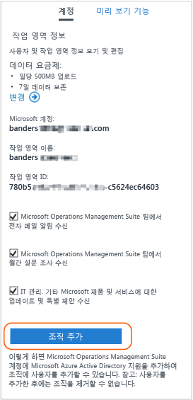
3. Azure Active Directory 도메인의 관리자에 대한 ID 정보를 입력합니다. 나중에, 작업 영역이 Azure Active Directory 도메인에 연결되어 있다는 내용의 승인이 표시됩니다.  
    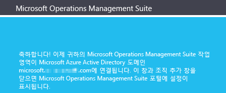

## Log Analytics 작업 영역 삭제
Log Analytics 작업 영역을 삭제하면 30일 내에 작업 영역과 관련된 모든 데이터가 Log Analytics 서비스에서 삭제됩니다.

관리자이고 여러 사용자가 작업 영역과 연결되어 있는 경우 해당 사용자와 작업 영역 간의 연결이 끊어집니다. 사용자가 다른 작업 영역과 연결되어 있으면 다른 작업 영역에서 Log Analytics를 계속 사용할 수 있습니다. 그러나 다른 작업 영역과 연결되어 있지 않으면 서비스를 사용하기 위해 작업 영역을 만들어야 합니다. 작업 영역을 삭제하려면 [Azure Log Analytics 작업 영역 삭제](log-analytics-manage-del-workspace.md)를 참조하세요.

## 다음 단계
* 데이터 센터 또는 다른 클라우드 환경에 있는 컴퓨터에서 데이터를 수집하려면 [Log Analytics를 사용하여 환경의 컴퓨터에서 데이터 수집](log-analytics-concept-hybrid.md)을 참조하세요.
* Azure VM에서 데이터 수집을 구성하려면 [Azure Virtual Machines에 대한 데이터 수집](log-analytics-quick-collect-azurevm.md)을 참조하세요.  
* [솔루션 갤러리에서 Log Analytics 솔루션을 추가](log-analytics-add-solutions.md) 하여 기능을 추가하고 데이터를 수집합니다.

