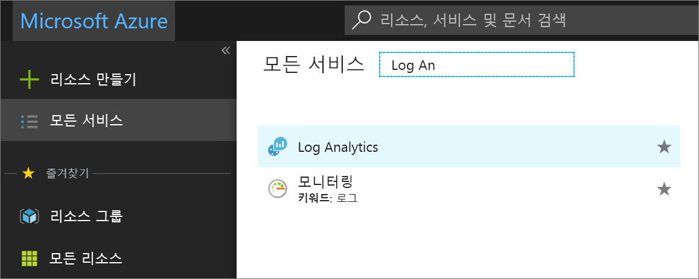

# Log Analytics에서 데이터 볼륨 및 보존을 제어하여 비용 관리

> [!NOTE]
> 이 문서에서는 데이터 보존 기간을 설정하여 Log Analytics에서 비용을 제어하는 방법을 설명합니다.  관련 정보에 대해서는 다음 문서를 참조하세요.
> - [Log Analytics에서 데이터 사용 현황 분석](log-analytics-manage-cost-storage.md)에서는 데이터 사용량을 분석 및 경고하는 방법을 설명합니다.
> - [사용량 및 예상 비용 모니터링](../monitoring-and-diagnostics/monitoring-usage-and-estimated-costs.md)에서는 다른 가격 책정 모델에 대해 여러 Azure 모니터링 기능에서 사용량 및 예상 비용을 보는 방법을 설명합니다. 또한 가격 책정 모델을 변경하는 방법을 설명합니다.

Log Analytics는 Azure에 배포되거나 회사의 모든 원본에서 일당 대량의 데이터를 수집, 인덱싱, 저장하는 것을 크기 조정하고 지원하도록 설계됐습니다.  조직에 대한 주 드라이버인 반면 비용 효율성은 궁극적으로 기본 드라이버입니다. 그 목적을 위해서는 Log Analytics 작업 영역의 비용이 수집된 데이터 볼륨을 기반으로 하지 않고 선택한 계획에 따라 달라지며, 연결된 소스에서 생성된 데이터를 저장하려고 선택한 기간을 이해하는 것이 중요합니다.  

이 문서에서는 데이터 볼륨 및 저장소 증가를 사전에 모니터링하는 방법 및 해당 관련 비용을 제어하려면 제한을 정의하는 방법을 검토합니다. 

데이터 비용은 다음 요인에 따라 상당히 좌우될 수 있습니다. 

- 데이터를 수집하는 원본 시스템, 인프라 구성 요소, 클라우드 리소스 등의 수 
- 메시지 큐, 로그, 이벤트, 보안 관련 데이터 또는 성능 메트릭과 같이 원본에서 생성된 데이터 형식 
- 이러한 원본에서 생성되고 작업 영역에 수집된 데이터 볼륨 
- 데이터가 작업 영역에서 보존되는 기간  
- 사용하도록 설정된 관리 솔루션의 수, 데이터 원본 및 수집 빈도 

> [!NOTE]
> 수집한 데이터의 예상 크기에 대해서는 각 솔루션에 대한 설명서를 참조하세요.   

2018년 7월 1일 이전에 기업계약을 체결했거나, 구독에서 로그 분석 작업 영역을 이미 만든 고객은 여전히 *무료* 요금제에 액세스할 수 있습니다. 구독이 기존 EA 등록에 연결되지 않은 경우에는 2018년 4월 2일 이후 새 구독에서 작업 영역을 만들 때 *무료* 계층을 사용할 수 없습니다.  *무료* 계층의 경우 데이터는 7일 보존으로 제한됩니다.  *독립 실행형* 또는 *유료* 계층의 경우 수집된 데이터를 마지막 31일 동안 사용할 수 있습니다. *무료* 계층은 일일 수집 제한이 500MB입니다. 허용되는 양이 계속 초과될 경우 이 제한을 초과해서 데이터를 수집하도록 작업 영역을 유료 요금제로 변경할 수 있습니다. 

> [!NOTE]
> 유료 계층에 대해 더 긴 보존 기간을 선택한 경우 요금이 부과됩니다. 언제든지 요금제 유형을 변경할 수 있습니다. 가격 책정에 대한 자세한 내용은 [가격 책정 정보](https://azure.microsoft.com/pricing/details/log-analytics/)를 참조하세요. 

데이터 볼륨을 제한하고 해당 비용을 제어할 수 있는 두 가지 방법이 있습니다. 즉, 일일 한도 및 데이터 보존입니다.  

## 예상 비용 검토
Log Analytics를 사용하면 최근 사용 패턴에 따른 가능한 비용을 쉽게 파악할 수 있습니다.  이렇게 하려면 다음 단계를 수행합니다.  

1. [Azure Portal](http://portal.azure.com)에 로그인합니다. 
2. Azure Portal에서 **모든 서비스**를 클릭합니다. 리소스 목록에서 **Log Analytics**를 입력합니다. 입력을 시작하면 입력한 내용을 바탕으로 목록이 필터링됩니다. **Log Analytics**를 선택합니다.       
3. Log Analytics 창에서 작업 영역을 선택한 다음, 왼쪽 창에서 **사용량 및 예상 비용**을 클릭합니다.    

여기에서 해당 월의 데이터 볼륨을 검토할 수 있습니다. 여기에는 Log Analytics 작업 영역에 수신되고 보존된 모든 데이터가 포함됩니다.  원본, 컴퓨터 및 제품에 의해 데이터 볼륨 추세에 관한 정보를 통해 사용 대시보드를 확인하려면 페이지의 상단에서 **사용 정보**를 클릭합니다. 보존 기간을 수정하거나 일일 한도를 설정하고 확인하려면 **데이터 볼륨 관리**를 클릭합니다.
 
Log Analytics 요금은 Azure 청구서에 추가됩니다. Azure 청구서의 자세한 내용은 Azure Portal의 청구 섹션 또는 [Azure 청구 포털](https://account.windowsazure.com/Subscriptions)에서 참고할 수 있습니다.  

## 일일 한도
Azure Portal에서 Log Analytics 작업 영역을 만들고 *무료* 요금제를 선택하는 경우 일당 500MB로 제한 설정됩니다. 다른 가격 책정 요금제에 대한 제한은 없습니다. 작업 영역에 대한 일일 한도를 구성하고 일일 수집량을 제한할 수 있지만 목표치가 일일 한도에 도달하지 않도록 주의하십시오.  그렇지 않으면 남은 기간 동안의 데이터가 손실됩니다. 이는 해당 기능이 작업 영역에서 사용할 수 있는 최신 데이터에 의존할 수도 있는 다른 Azure 서비스 및 솔루션에 영향을 줄 수 있습니다.  결과적으로 리소스의 상태 조건이 IT 서비스를 지원할 때 경고를 관찰하고 수신하는 기능이 영향을 받습니다.  단순히 작업 영역에 대한 계획되지 않은 요금을 제한하려는 경우 또는 관리되는 리소스에서 예기치 않은 데이터 볼륨의 증가를 관리하고 한도 내로 유지하는 방법으로서 일일 한도가 사용될 수 있습니다.  

일일 한도에 도달하면 하루의 나머지 시간 동안 청구 가능한 데이터 형식의 수집을 중지합니다. 선택된 Log Analytics 작업 영역에 대한 페이지의 상단에 경고 배너가 표시되고 작업 이벤트가 **LogManagement** 범주 아래의 *작업* 테이블로 전송됩니다. *일일 한도 아래 정의된 재설정 시간이* 로 설정된 후 데이터 수집이 다시 시작합니다. 일일 데이터 한도에 도달했을 때 알려주도록 구성된 이 작업 이벤트를 기반으로 경고 규칙을 정의하는 것이 좋습니다. 

### 정의할 일일 데이터 한도 식별 
데이터 수집 추세 및 정의할 일일 볼륨 한도를 이해하려면 [Log Analytics 사용량 및 예상 비용](log-analytics-usage.md)을 검토합니다. 한도에 도달한 후에는 리소스를 모니터링할 수 없으므로 신중하게 고려해야 합니다. 

### 최대 일일 데이터 볼륨 관리 
다음 단계에서는 Log Analytics가 하루에 수집하는 데이터의 볼륨 관리 제한을 구성하는 방법을 설명합니다.  

1. 작업 영역의 왼쪽 창에서 **사용량 및 예상 비용**을 선택합니다.
2. 선택한 작업 영역에 대한 **사용량 및 예상 비용** 창의 페이지의 상단에서 **데이터 볼륨 관리**를 클릭합니다. 
5. 일일 한도는 기본으로 **OFF**이며 이를 사용하도록 설정하려면 **ON**을 클릭한 다음, 데이터 볼륨 한도를 GB/일로 설정합니다.   

### 한도에 도달한 경우 경고
데이터 제한 임계값에 도달하는 경우 Azure Portal에 시각적 큐를 표시하는 반면, 이 동작은 즉각적인 주의가 필요한 운영 문제를 관리하는 방법에 맞출 필요는 없습니다.  경고 알림을 수신하려면 Azure Monitor에서 새 경고 규칙을 만들 수 있습니다.  자세한 내용은 [경고 만들고 보고 관리하는 방법](../monitoring-and-diagnostics/monitor-alerts-unified-usage.md)을 참조합니다.      

시작하려면 경고에 대한 권장 설정은 다음과 같습니다.

* 대상: Log Analytics 리소스 선택
* 조건: 
   * 신호 이름: 사용자 지정 로그 검색
   * 검색 쿼리: 작업 | 세부 정보에 'OverQuota'가 있는 경우
   * 기준: 결과 수
   * 조건: 보다 큼
   * 임계값: 0
   * 기간: 5(분)
   * 빈도: 5(분)
* 경고 규칙 이름: 일일 데이터 한계 도달
* 심각도: 경고(심각도 1)

경고가 정의되고 한계에 도달하면 경고가 트리거되고 작업 그룹에서 정의된 응답을 수행합니다. 이메일 및 텍스트 메시지를 통해 팀에 알리거나 웹후크, Automation Runbook 또는 [외부 ITSM 솔루션을 사용해 통합](log-analytics-itsmc-overview.md#create-itsm-work-items-from-azure-alerts)을 사용하여 작업을 자동화할 수 있습니다. 

## 데이터 보존 기간 변경 
다음 단계에서는 로그 데이터가 작업 영역에 보존되는 기간을 구성하는 방법을 설명합니다.
 
1. 작업 영역의 왼쪽 창에서 **사용량 및 예상 비용**을 선택합니다.
2. **사용량 및 예상 비용** 창의 페이지의 상단에서 **데이터 볼륨 관리**를 클릭합니다.
5. 창에서 슬라이더를 이동하여 일 수를 늘리거나 줄인 다음, **확인**을 클릭합니다.  *무료* 계층에서 작업 중인 경우 데이터 보존 기간을 수정할 수 없으며 이 설정을 제어하기 위해 유료 계층으로 업그레이드해야 합니다.   

## 문제 해결
**Q**: Log Analytics에서 더 이상 데이터를 수집하지 않는 경우 어떻게 해결하나요? 
**A**: 무료 가격 책정 계층에 있고 하루에 500MB 초과 데이터를 보낸 경우 당일의 남은 시간 동안 데이터 수집이 중지됩니다. 일일 한도에 도달하는 것은 Log Analytics가 데이터 수집을 중지하고 데이터가 사라진 것처럼 표시되는 일반적인 이유입니다.  
Log Analytics는 데이터 수집을 시작하고 중지할 때 Operation 형식의 이벤트를 만듭니다.  
일일 한도에 도달하고 데이터 누락이 있는지 확인하려면 검색에서 다음 쿼리를 실행합니다. Operation | OperationCategory == '데이터 수집 상태'인 경우   
데이터 수집이 중지되는 경우 OperationStatus가 Warning입니다. 데이터 수집이 시작되는 경우 OperationStatus가 Succeeded입니다.  
다음 표에서 데이터 수집을 중지하는 이유 및 데이터 수집을 다시 시작하는 권장되는 작업을 설명합니다.  

|수집 중지 이유| 해결 방법| 
|-----------------------|---------|
|무료 데이터의 일일 한도 도달1|수집이 다음 날에 자동으로 다시 시작될 때까지 대기 또는 유료 가격 책정 계층으로 변경합니다.|
|데이터 볼륨 관리에서 정의된 일일 한도에 도달|수집이 다음 날에 자동으로 다시 시작될 때까지 대기 또는 [최대 일일 데이터 볼륨 관리](#manage-the-maximum-daily-volume)에 설명된 일일 데이터 볼륨 한도 증가|
|Azure 구독이 다음으로 인해 일시 중단된 상태:  평가판 종료  Azure 암호 만료  월별 지출 한도 도달(예: MSDN 또는 Visual Studio 구독에서)|유료 구독으로 전환  한도 제거 또는 한도가 재설정될 때까지 대기|

1 작업 영역이 무료 가격 책정 계층에 있는 경우 일당 500MB의 데이터를 서비스에 전송하도록 제한됩니다. 일일 한도에 도달하면 데이터 수집이 다음 날까지 중지됩니다. 데이터 수집이 중지되는 동안 전송된 데이터가 인덱싱되지 않으며 검색에 사용할 수 없습니다. 데이터 수집이 다시 시작되면 전송된 새 데이터에 대해서만 프로세스가 발생합니다. 

Log Analytics는 UTC 시간을 사용합니다. 모든 제한된 작업 영역이 동시에 데이터를 수집하기 시작하는 것을 막기 위해 작업 영역 간 재설정 시간이 다릅니다. 작업 영역이 일일 한도에 도달한 경우 **일일 한도에 정의된 재설정 시간이** 로 설정된 후 프로세스가 다시 시작합니다.   

**Q**: 데이터 수집이 중지될 때 알림을 받을 수 있는 방법은 무엇인가요? 
**A**: 데이터 수집이 중지되는 경우 경고를 알리려면 *일일 데이터 한도 만들기*에서 설명된 단계를 사용하여 다음 단계를 수행합니다. 그리고 경고 규칙에 작업 추가에서 설명된 단계를 사용하여 경고 규칙을 위해 이메일, 웹후크, Runbook 작업을 구성합니다. 

## 다음 단계  

수집되는 데이터의 양, 데이터를 전송하는 원본 및 전송되는 여러 데이터 형식을 파악하여 소비 및 비용을 관리하려면 [Log Analytics에서 데이터 사용 현황 분석](log-analytics-usage.md)을 참조하세요.